# 用 Python 进行音乐流派分类

> 原文：<https://towardsdatascience.com/music-genre-classification-with-python-c714d032f0d8?source=collection_archive---------1----------------------->

## Python 中的音频/音乐信号分析指南


Photo by [Jean](https://unsplash.com/@dotgrid?utm_source=medium&utm_medium=referral) on [Unsplash](https://unsplash.com?utm_source=medium&utm_medium=referral)

> 音乐就像一面镜子，它告诉人们你是谁，你关心什么，不管你喜欢与否。我们喜欢说“你就是你流的东西”:Spotify

拥有[260 亿美元](https://www.cnbc.com/2018/04/04/spotify-chiefs-net-worth-tops-2-billion-after-nyse-debut.html)净资产的 Spotify ，如今统治着[音乐流媒体平台](https://en.wikipedia.org/wiki/Comparison_of_on-demand_streaming_music_services)。目前，它的数据库中有数百万首歌曲，并声称拥有适合每个人的音乐配乐。Spotify 的 Discover Weekly 服务在千禧一代中大受欢迎。不用说，Spotify 在研究方面投入了大量资金，以改善用户查找和收听音乐的方式。机器学习是他们研究的核心。从 NLP 到协同过滤再到深度学习，Spotify 都用上了。歌曲基于它们的数字签名被分析一些因素，包括速度、声学、能量、可跳舞性等。来回答第一次约会时那个不可能回答的问题:**你喜欢哪种音乐？**

# 目标

[公司](http://cs229.stanford.edu/proj2016/report/BurlinCremeLenain-MusicGenreClassification-report.pdf)如今使用音乐分类，要么是为了能够向他们的客户进行推荐(如 Spotify、Soundcloud)，要么只是作为一种产品(如 Shazam)。确定音乐流派是朝着这个方向迈出的第一步。机器学习技术已被证明在从大型数据池中提取趋势和模式方面相当成功。同样的原理也适用于音乐分析。

*在本文中，我们将学习如何用 Python 分析音频/音乐信号。然后，我们将利用学到的技能* ***将音乐片段分类成不同的流派。***

# 使用 Python 进行音频处理

声音以一种**音频**信号的形式呈现，该信号具有诸如频率、带宽、分贝等参数。典型的音频信号可以表示为幅度和时间的函数。

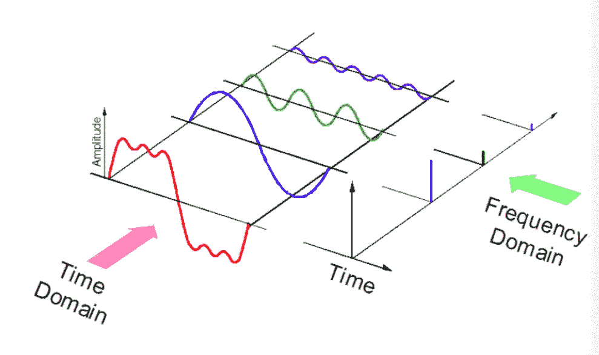

[source](https://docs.google.com/presentation/d/1zzgNu_HbKL2iPkHS8-qhtDV20QfWt9lC3ZwPVZo8Rw0/pub?start=false&loop=false&delayms=3000&slide=id.g5a7a9806e_0_84)

这些声音有多种格式，使得计算机能够读取和分析它们。一些例子是:

*   **mp3 格式**
*   **WMA (Windows Media Audio)格式**
*   **wav(波形音频文件)格式**

# 音频库

Python 有一些很棒的[库](https://wiki.python.org/moin/Audio/)用于音频处理，比如 Librosa 和 PyAudio。还有一些基本音频功能的内置模块。

我们将主要使用两个库进行音频采集和回放:

## 1.利布罗萨

这是一个 Python 模块，用于分析一般的音频信号，但更适合音乐。它包括建立一个 MIR(音乐信息检索)系统的具体细节。它已经被很好地[记录了](https://librosa.github.io/librosa/)，还有很多例子和教程。

*关于描述包装设计原理的更高级介绍，请参考* [*librosa 论文*](http://conference.scipy.org/proceedings/scipy2015/pdfs/brian_mcfee.pdf)*at*[*SciPy 2015*](http://scipy2015.scipy.org/)*。*

**安装**

```
pip install librosa
or
conda install -c conda-forge librosa
```

为了提供更多的音频解码能力，你可以安装许多音频解码器附带的 *FFmpeg、*。

## 2.IPython.display .音频

`[**IPython.display.Audio**](https://ipython.org/ipython-doc/stable/api/generated/IPython.display.html#IPython.display.Audio)`让您直接在 jupyter 笔记本上播放音频。

# 载入音频文件

```
import librosaaudio_path = '../[T08-violin](https://github.com/parulnith/Data-Science-Articles/blob/main/Music-Genre-Classification-with-Python-master/T08-violin.wav).wav'
x , sr = librosa.load(audio_path)print(type(x), type(sr))
<class 'numpy.ndarray'> <class 'int'>print(x.shape, sr)
(396688,) 22050
```

这会以 numpy 数组的形式返回音频时间序列，默认采样速率(sr)为 22KHZ 单声道。我们可以这样改变这种行为:

```
librosa.load(audio_path, sr=44100)
```

以 44.1KHz 的频率重新采样，或者

```
librosa.load(audio_path, sr=None)
```

禁用重采样。

采样率是每秒传送的音频样本数，以赫兹或千赫兹为单位。

# 播放音频

使用，`**IPython.display.Audio**`来播放音频

```
import IPython.display as ipd
ipd.Audio(audio_path)
```

这将在 jupyter 笔记本中返回一个音频小部件，如下所示:


screenshot of the Ipython audio widget

这个小工具在这里不能用，但是可以用在你的笔记本上。我已经把它上传到了 SoundCloud，这样我们就可以听了。

对于音频示例，您甚至可以使用 mp3 或 WMA 格式。

# 可视化音频

## 波形

我们可以使用`[**librosa.display.waveplot**](https://librosa.github.io/librosa/generated/librosa.display.waveplot.html#librosa.display.waveplot)`来绘制音频数组:

```
%matplotlib inline
import matplotlib.pyplot as plt
import librosa.displayplt.figure(figsize=(14, 5))
librosa.display.waveplot(x, sr=sr)
```

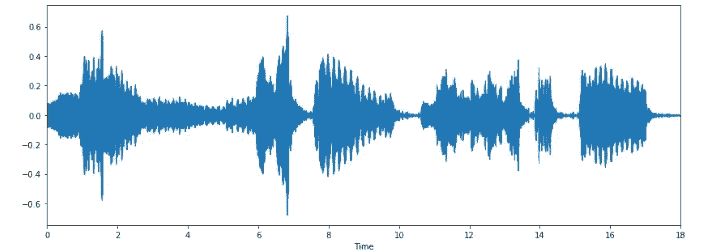

这是波形的幅度包络图。

## 光谱图

[**声谱图**](https://en.wikipedia.org/wiki/Spectrogram) 是[声音](https://en.wikipedia.org/wiki/Sound)或其他信号的[频率](https://en.wikipedia.org/wiki/Frequencies)的[频谱](https://en.wikipedia.org/wiki/Spectral_density)随时间变化的直观表示。声谱图有时被称为**声谱图**、**声纹**或**声谱图**。当数据以 3D 图表示时，它们可以被称为**瀑布**。在二维数组中，第一个轴是频率，而第二个轴是时间。

我们可以用。`[**librosa.display.specshow**](https://librosa.github.io/librosa/generated/librosa.display.specshow.html)**.**`

```
X = librosa.stft(x)
Xdb = librosa.amplitude_to_db(abs(X))
plt.figure(figsize=(14, 5))
librosa.display.specshow(Xdb, sr=sr, x_axis='time', y_axis='hz')
plt.colorbar()
```

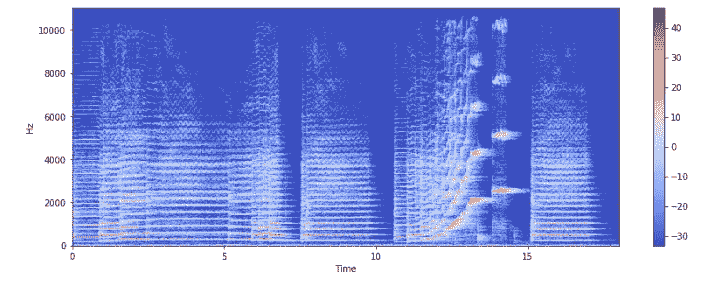

纵轴显示频率(从 0 到 10kHz)，横轴显示剪辑的时间。因为所有的行为都发生在光谱的底部，我们可以把频率轴转换成对数轴。

```
librosa.display.specshow(Xdb, sr=sr, x_axis='time', y_axis='log')
plt.colorbar()
```

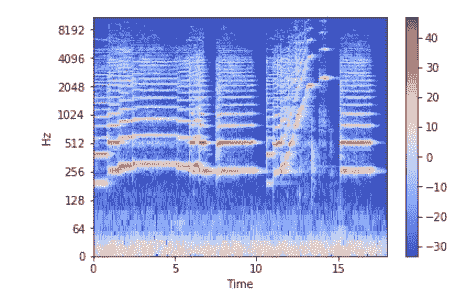

# 编写音频

`[**librosa.output.write_wav**](https://librosa.github.io/librosa/generated/librosa.output.write_wav.html#librosa.output.write_wav)`将 NumPy 数组保存到 WAV 文件。

```
librosa.output.write_wav('example.wav', x, sr)
```

# 创建音频信号

现在让我们创建一个 220 赫兹的音频信号。一个音频信号是一个 numpy 数组，所以我们应该创建一个并把它传递给 audio 函数。

```
import numpy as np
sr = 22050 *# sample rate*
T = 5.0    *# seconds*
t = np.linspace(0, T, int(T*sr), endpoint=**False**) *# time variable*
x = 0.5*np.sin(2*np.pi*220*t)*# pure sine wave at 220 Hz***Playing the audio**
ipd.Audio(x, rate=sr) *# load a NumPy array***Saving the audio**
librosa.output.write_wav('tone_220.wav', x, sr)
```

这是你创造的第一个声音信号。🙌

# 特征抽出

每个音频信号都包含许多特征。然而，我们必须提取与我们试图解决的问题相关的特征。提取特征以用于分析的过程称为特征提取。让我们详细研究几个特征。

*   **过零率**

[过零率](https://en.wikipedia.org/wiki/Zero-crossing_rate)是信号随符号变化的速率，即信号从正变到负或反变的速率。这个功能在[语音识别](https://en.wikipedia.org/wiki/Speech_recognition)和[音乐信息检索](https://en.wikipedia.org/wiki/Music_information_retrieval)中都被大量使用。它通常具有较高的值，适用于像金属和摇滚这样的高敲击声。

让我们计算示例音频剪辑的**过零率**。

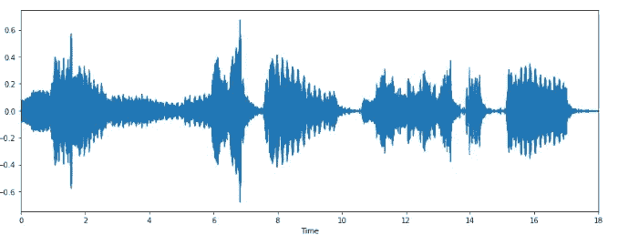

```
# Load the signal
x, sr = librosa.load('../T08-violin.wav')#Plot the signal:
plt.figure(figsize=(14, 5))
librosa.display.waveplot(x, sr=sr)
```

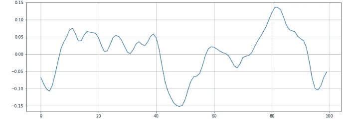

```
# Zooming in
n0 = 9000
n1 = 9100
plt.figure(figsize=(14, 5))
plt.plot(x[n0:n1])
plt.grid()
```

似乎有 6 个过零点。让我们向 librosa 核实一下。

```
zero_crossings = librosa.zero_crossings(x[n0:n1], pad=False)
print(sum(zero_crossings))**6**
```

*   [**光谱质心**](https://en.wikipedia.org/wiki/Spectral_centroid)

它表示声音的“质量中心”所在的位置，计算方法是声音中频率的加权平均值。考虑两首歌曲，一首来自蓝调流派，另一首属于金属。现在，与布鲁斯流派歌曲相比，它的长度是一样的，金属歌曲在结尾有更多的频率。**因此蓝调歌曲的频谱质心将位于其频谱的中间附近，而金属歌曲的频谱质心将接近其末端。**

`[**librosa.feature.spectral_centroid**](https://librosa.github.io/librosa/generated/librosa.feature.spectral_centroid.html#librosa.feature.spectral_centroid)`计算信号中每一帧的频谱质心:

```
spectral_centroids = librosa.feature.spectral_centroid(x, sr=sr)[0]
spectral_centroids.shape
(775,)# Computing the time variable for visualization
frames = range(len(spectral_centroids))
t = librosa.frames_to_time(frames)# Normalising the spectral centroid for visualisation
def normalize(x, axis=0):
    return sklearn.preprocessing.minmax_scale(x, axis=axis)#Plotting the Spectral Centroid along the waveform
librosa.display.waveplot(x, sr=sr, alpha=0.4)
plt.plot(t, normalize(spectral_centroids), color='r')
```

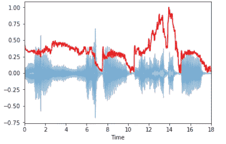

光谱质心在接近末端时上升。

*   **光谱衰减**

它是信号形状的度量。它表示总频谱能量的特定百分比(例如 85%)低于的频率。

`[**librosa.feature.spectral_rolloff**](https://librosa.github.io/librosa/generated/librosa.feature.spectral_rolloff.html#librosa.feature.spectral_rolloff)`计算信号中每一帧的滚降频率:

```
spectral_rolloff = librosa.feature.spectral_rolloff(x+0.01, sr=sr)[0]
librosa.display.waveplot(x, sr=sr, alpha=0.4)
plt.plot(t, normalize(spectral_rolloff), color='r')
```

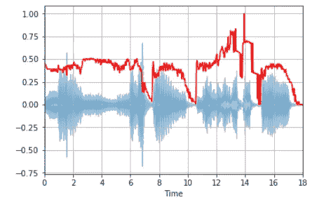

*   [**梅尔倒谱系数**](https://en.wikipedia.org/wiki/Mel-frequency_cepstrum)

信号的 Mel 频率倒谱系数(MFCCs)是一小组特征(通常约为 10–20)，它们简明地描述了频谱包络的整体形状。它模拟了人类声音的特征。

这次让我们用一个[简单循环](https://github.com/parulnith/Data-Science-Articles/blob/main/Music-Genre-Classification-with-Python-master/simple_loop.wav)波来工作。

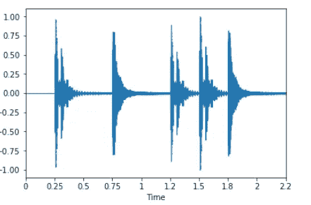

```
x, fs = librosa.load('../simple_loop.wav')
librosa.display.waveplot(x, sr=sr)
```

`[**librosa.feature.mfcc**](https://bmcfee.github.io/librosa/generated/librosa.feature.mfcc.html#librosa.feature.mfcc)`计算音频信号的 MFCCs:

```
mfccs = librosa.feature.mfcc(x, sr=fs)
**print** mfccs.shape
(20, 97)#Displaying  the MFCCs:
librosa.display.specshow(mfccs, sr=sr, x_axis='time')
```

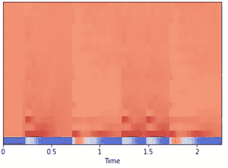

这里 mfcc 计算了 97 帧中的 20 个 MFCC。

我们还可以执行特征缩放，使得每个系数维度具有零均值和单位方差:

```
import sklearn
mfccs = sklearn.preprocessing.scale(mfccs, axis=1)
print(mfccs.mean(axis=1))
print(mfccs.var(axis=1))librosa.display.specshow(mfccs, sr=sr, x_axis='time')
```

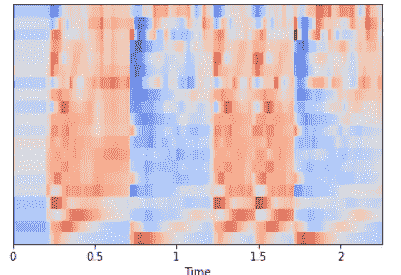

*   [**色度频率**](https://labrosa.ee.columbia.edu/matlab/chroma-ansyn/)

色度特征是音乐音频的一种有趣而强大的表示，其中整个频谱被投影到表示音乐八度音阶的 12 个不同半音(或色度)的 12 个箱上。

`[librosa.feature.chroma_stft](https://librosa.github.io/librosa/generated/librosa.feature.chroma_stft.html#librosa.feature.chroma_stft)` 用于计算

```
# Loadign the file
x, sr = librosa.load('../simple_piano.wav')hop_length = 512
chromagram = librosa.feature.chroma_stft(x, sr=sr, hop_length=hop_length)
plt.figure(figsize=(15, 5))
librosa.display.specshow(chromagram, x_axis='time', y_axis='chroma', hop_length=hop_length, cmap='coolwarm')
```

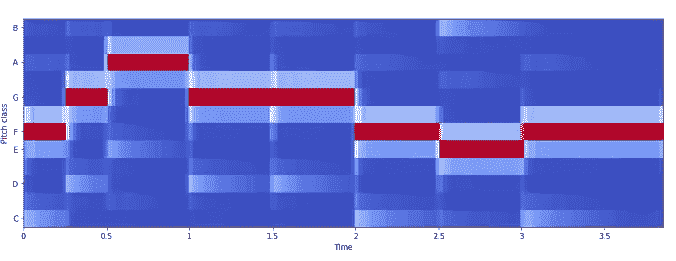

# 案例分析:将歌曲分为不同的类型。

*在概述了声音信号、其特征及其特征提取过程之后，是时候利用我们新开发的技能来解决机器学习问题了。*

## 目标

在他的章节中，我们将尝试建立一个分类器来将歌曲分类成不同的流派。让我们假设一个场景，由于某种原因，我们在硬盘上发现了一堆随机命名的 MP3 文件，这些文件被认为包含音乐。我们的任务是根据音乐类型将它们分类到不同的文件夹中，如爵士、古典、乡村、流行、摇滚和金属。

## 资料组

我们将使用著名的 [GITZAN](http://marsyasweb.appspot.com/download/data_sets/) 数据集进行案例研究。该数据集用于 G. Tzanetakis 和 P. Cook 在 2002 年 IEEE 音频和语音处理汇刊中的著名论文“音频信号的流派分类”[音乐流派分类](https://ieeexplore.ieee.org/document/1021072)。

该数据集由 1000 首音轨组成，每首音轨时长 30 秒。它包含十种风格:布鲁斯、古典、乡村、迪斯科、嘻哈、爵士、雷鬼、摇滚、金属和流行。每种体裁由 100 个声音片段组成。

## 预处理数据

在训练分类模型之前，我们必须将来自音频样本的原始数据转换成更有意义的表示。音频剪辑需要从。au 格式到。wav 格式，使其与 python 的 wave 模块兼容，用于读取音频文件。我使用开源的 SoX 模块进行转换。这里有一个方便的关于 SoX 转换的[备忘单](https://www.stefaanlippens.net/audio_conversion_cheat_sheet/)。

```
sox input.au output.wav
```

## 分类

*   **特征提取**

然后，我们需要从音频文件中提取有意义的特征。我们将选择五个特征来分类我们的音频剪辑，即梅尔频率倒谱系数、频谱质心、过零率、色度频率、频谱滚降。然后将所有特征追加到一个. csv 文件中，以便可以使用分类算法。

*   **分类**

一旦提取了特征，我们可以使用现有的分类算法将歌曲分类成不同的流派。您可以直接使用光谱图图像进行分类，也可以提取特征并对其使用分类模型。

# 后续步骤

音乐流派分类是[音乐信息检索](https://en.wikipedia.org/wiki/Music_information_retrieval)的众多分支之一。从这里，您可以对音乐数据执行其他任务，如节拍跟踪、音乐生成、推荐系统、音轨分离和乐器识别等。音乐分析是一个多样化的领域，也是一个有趣的领域。音乐会话在某种程度上代表了用户的某个时刻。在数据科学领域，找到并描述这些时刻是一个有趣的挑战。