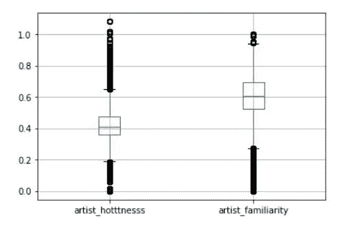
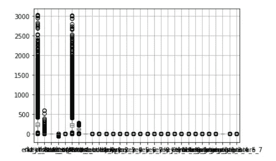
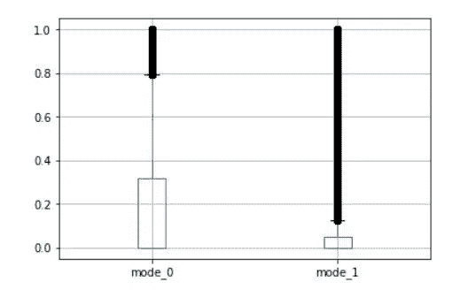
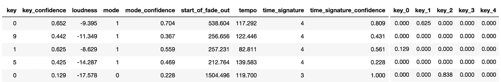
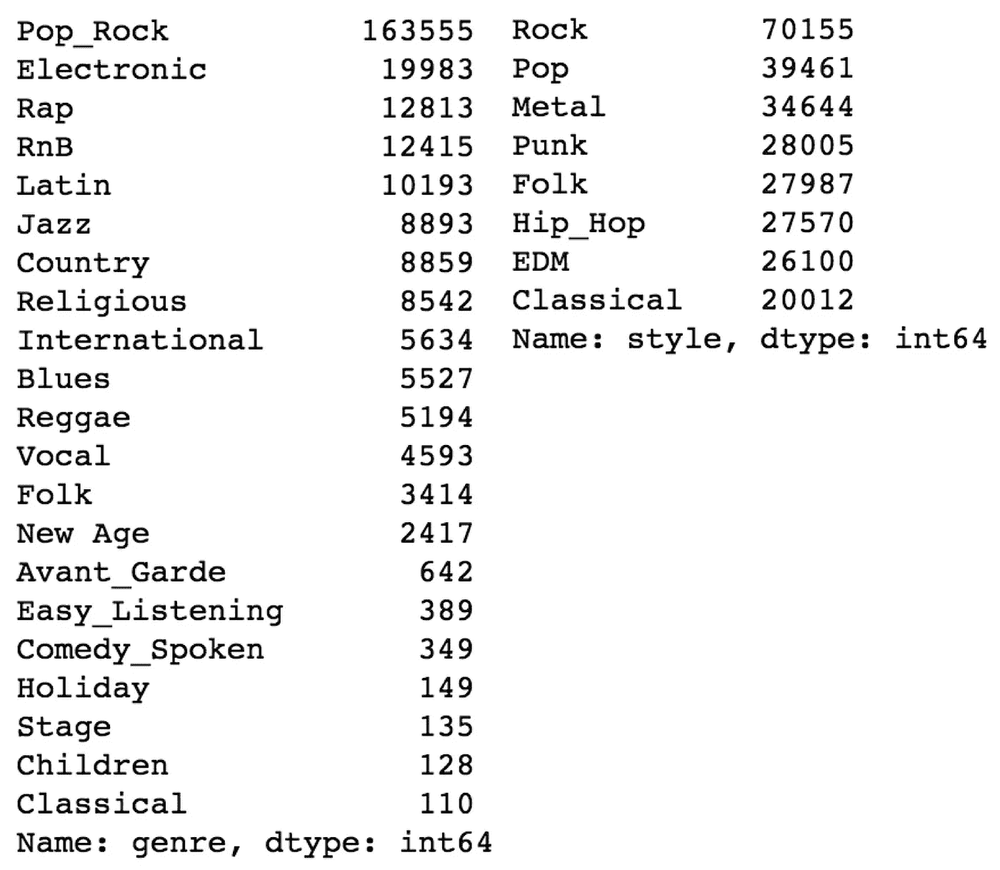
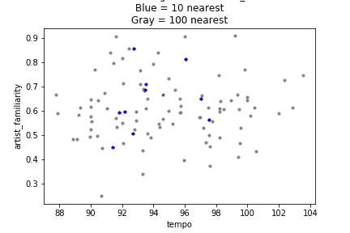
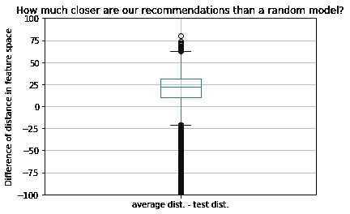
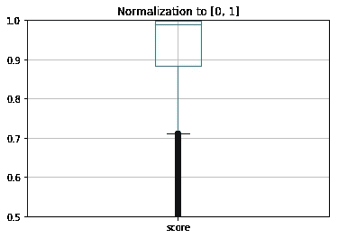
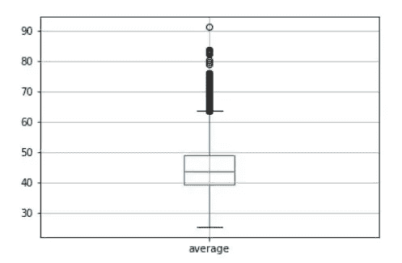
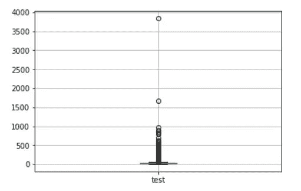

# 音乐到我的耳朵:一种无监督的用户特定歌曲推荐方法

> 原文：<https://towardsdatascience.com/music-to-my-ears-an-unsupervised-approach-to-user-specific-song-recommendation-6c291acc2c12?source=collection_archive---------13----------------------->

作者:Sameer Bibikar，Aimun Khan，Nimay Kumar，Jason Nguyen，Shrey Sachdeva

Photo by [Jefferson Santos](https://unsplash.com/@jefflssantos?utm_source=medium&utm_medium=referral) on [Unsplash](https://unsplash.com?utm_source=medium&utm_medium=referral)

> **摘要**
> 
> 各种音乐流服务所采用的当前音乐推荐算法是完全相关的，并且在向用户推荐新歌时不考虑歌曲本身的音乐特征。我们的团队希望开发一种算法，在推荐新歌时，它会强调用户喜欢听的音乐质量，而不是演唱这首歌的艺术家。这篇博文讨论了我们使用百万首歌曲数据集来构建一个更强大的音乐推荐系统的努力。许多数据收集得很差，无法使用，需要大量的数据预处理和特征工程。一些特征工程方法包括将百万首歌曲数据集与另外两个数据集相结合，以包括用户的收听历史和歌曲流派，并使用结合置信度的一键编码来转换分类变量。
> 
> 流派似乎是确定用户喜欢的歌曲种类的一个很好的指标。为了评估给定流派标签与特征的关联程度，我们使用流派特征作为因变量来训练各种监督模型。不幸的是，即使是我们表现最好的模型也没有表现得足够好，让我们接受给定的流派标签为真正的标签。我们将我们的方法转变为使用无监督学习方法，使用均值漂移聚类将相似的歌曲分组在一起，以模拟流派类别。对于我们的推荐，我们使用最近邻方法来开发一种算法，该算法使用我们新创建的流派聚类来建议与给定用户的收听历史中的歌曲最接近的新音乐。通过使用来自用户收听历史的维持集，我们能够得出结论，我们的模型表现良好，因为它始终推荐来自维持集的歌曲。

# 导言和背景

通常，音乐流媒体服务上的音乐推荐并不表示用户实际喜欢的音乐种类。相反，许多音乐流媒体服务主要使用[关系算法](https://static.googleusercontent.com/media/research.google.com/en//pubs/archive/45530.pdf)，它只是从相似用户的播放列表中推荐歌曲。这种方法不能为用户提供个性化的建议，因此我们决定探索一种分析音乐特征的替代方法。我们的目标是设计我们自己的歌曲推荐算法，根据用户喜欢的音乐特征来推荐歌曲。

有许多音乐流媒体服务，如 Spotify 和 Apple Music，也在努力优化他们的音乐推荐算法。此外，还有各种要求参赛者解决类似问题的 Kaggle 比赛，包括[百万歌曲数据集(MSD)挑战赛](https://www.kaggle.com/c/msdchallenge)和 [KKBox 音乐推荐挑战赛](https://www.kaggle.com/c/kkbox-music-recommendation-challenge)。我们的问题是推荐用户可能欣赏的新歌，提供他们的收听历史，这类似于正在进行的其他挑战。我们从数据探索开始理解数据，然后是特性选择和工程。一旦我们的数据是有意义的，我们使用一种监督的方法来预测流派，以便我们可以替换数据集中收集得不好的流派标签。最后，我们总结了一个无监督的聚类方法，利用我们新创建的流派。我们的项目包括几个新颖的特征，例如创建一次性编码特征，将特征的置信度融入编码中，并对数据集中的歌曲进行聚类，以分析用户收听历史中的可能趋势。

# 数据收集

在浏览相关 Kaggle 比赛时，我们偶然发现了一个使用了[百万歌曲数据集(MSD)](https://labrosa.ee.columbia.edu/millionsong/) 的比赛。280 GB 的数据集对我们的项目来说似乎很有希望，因为它包括 53 个特征，正如其名称所暗示的，一百万首样本歌曲。这些功能提供了大量关于歌曲的信息，包括我们认为与理解用户为什么喜欢某首特定歌曲相关的特征。这些特征包括调、速度和模式，并为每种特征提供了置信度。此外，我们可以访问[相关的数据集](http://www.ifs.tuwien.ac.at/mir/msd/)，这些数据集提供了用户的收听历史和流派/风格标签。有了这些数据集，一旦我们充分探索、理解和修改了我们所掌握的数据，我们就觉得已经为解决我们的问题做好了充分的准备。

## 数据采集

首先，我们试图从 OSDC 下载 MSD 的子集和整个数据集，但是，在撰写本文时，OSDC 的网站只将我们重定向到其主页。因为这两种方法都不起作用，所以我们采用了最后一种方法来获得 MSD: Amazon 弹性块存储。我们按照 MSD 页面上的说明启动了一个 Amazon EC2 实例。在这个实例中，我们安装了 Python 3、scikit-learn、pandas、numpy、scipy 和 Jupyter Notebook，使我们能够远程工作。然后，我们挂载数据集 EBS 实例，发现每首歌曲都存储在一个单独的 HDF5 文件中，从而产生了一个数百 GB 大小的数据集。

# 数据预处理和探索

起初，由于其巨大的规模和过多的特征，该数据集似乎非常有前途。例如，我们认为可跳舞性、艺术家熟悉度和歌曲热度对于理解用户喜欢的音乐类型至关重要。不幸的是，当我们更深入地研究这些特性时，我们发现许多数据没有信息，而且收集得很差；许多有前景的功能包含主要为 0 或 NaNs 的条目，差异很小。为了克服这个障碍，我们使用领域知识来执行特征选择和提取以清理数据。我们排除了绝大多数样本都忽略了值的特征，并将分类值转换为连续的数值。

我们的第二个数据集与用户历史信息相关，由三元组(user_id、song_id、count)组成。然而，我们的 MSD 样本只有 track_id 可用，这使得我们无法将 MSD 中的歌曲直接映射到每个(user_id，song_id，count)三元组。因此，我们必须利用将 song_id 映射到 track_id 的第三个数据集。在此操作之后，我们发现一些歌曲在 MSD 中没有 track_id，所以我们丢弃了这些值。然后，我们通过 track_id 合并数据集，并开始项目的建模阶段。

Box Plots of all features in our data

## 特征工程和选择

由于 MSD 的大小，我们必须要么对数据集的子集进行操作，要么对数据集的要素缩减版本进行操作。我们决定查看 MSD 数据的样本，看看是否所有要素都有有用的价值。如上所述，许多看似有用的特性没有被填充。利用音乐领域的知识，我们将数据缩小到 21 个有用的特征。我们移除了具有低方差、许多缺失值和字符串的要素，以减小数据集的大小，同时保留大部分有用信息。这个特性选择将我们的工作数据集的大小减少到了 2 GB。此外，我们通过写入单个 HDF5 文件节省了空间，成功地将文件大小从 2 GB 降至 117 MB。

## 基于置信区间一键编码的特征提取

Echo Nest API 提供了一个置信度值特性，它描述了一些分类特性。例如，每个数据条目包括歌曲的预测模式，以及模式预测正确的[0，1]的置信水平。这些特征高度相关，但不应该是独立的。为了将这些特征合成为一个有用的特征，我们对类别“模式”特征进行了一次性编码，并将每个特征乘以置信度。我们对其他几对高度相关的特征进行了同样的处理。

On left: Dataframe before one-hot encoding. On right: Dataframe after one-hot onecoding

# 学习和建模

因为流派是对相似歌曲进行分组的有效工具，我们决定预测歌曲的给定流派标签，以评估其准确性。我们使用了一些简单的模型，包括 SVM、XGBoost 和随机森林，因为它们在处理高维监督问题时具有鲁棒性。尽管对这些方法进行了调整，我们仍然得到了很差的准确性分数。这意味着数据集中给定的流派标签与歌曲的实际特征相关性很差，可能是因为艺术家自我识别他们音乐的流派。我们对这个问题的解决方案是使用聚类方法，纯粹基于歌曲的音乐元素来创建我们自己的流派标签。我们开始使用 K 均值聚类，后来选择使用均值漂移聚类。最后，为了向用户推荐歌曲，我们在生成的聚类上实现了多输入最近邻算法，以基于用户输入推荐歌曲。

## 初始监督方法

我们最初试图预测一首歌曲的给定流派标签，结果得分低于 0.01。这个分数很低，很大程度上是因为当类的基数很高时，很难达到高精度。虽然有 21 个不同的流派标签给了我们详细的类别，但类别之间没有距离:预测一个相似但不同的流派会像预测一个非常不同的流派一样严重地影响准确性。为了解决这个问题，我们将类型标签归纳为 8 个标签。

On left: original genre labels. On right: Generalized genre labels.

我们随后试图预测一首歌曲的广义流派标签，随机森林的得分为 0.33。我们在训练模型时通过交叉验证并使用网格搜索来调整随机森林的参数，从而获得了这个分数。这让我们轻松进入了 MSD 类型游戏 Kaggle 竞赛的[前十名排行榜。不幸的是，这个分数不足以达到我们推荐歌曲的目的。我们决定利用歌曲的特点从头开始创建自己的流派标签，引导我们探索无人监管的方法。](https://www.kaggle.com/c/mlp2016-7-msd-genre)

## 使聚集

接下来，我们决定通过对数据集中的歌曲进行聚类来创建我们自己的风格，从而推荐与用户的收听历史“相似”的歌曲。我们尝试的第一种方法是 K-Means 聚类，因为它简单且训练时间短。然而，我们最终使用均值漂移聚类来解决这个问题，因为它不需要预先定义聚类的数量，因此非常灵活。改变流派的数量可以极大地改变推荐，Mean-Shift 根据密度自动确定最佳的流派数量。尽管 Mean-Shift 比 K-means 在计算上更昂贵，但我们仍然选择使用 Mean-Shift 聚类，因为它具有灵活性，并且只需运行一次算法就能提供非常宝贵的信息。

## 用户的最近邻居

为了将用户历史记录整合到我们的模型中，我们决定基于与一组输入歌曲的接近度来推荐歌曲。对于每个用户，我们使用基于球树的算法从均值漂移聚类中有效地创建最近邻，推荐与输入集具有最低 MSE 距离的歌曲。这种方法还优雅地定义了一个评估我们的无监督模型的指标:如果模型返回的歌曲已经在用户的收听历史中，我们就可以自信地说，这种方法成功地概括了用户的口味。

Scatterplot of User Recommendations

## 定义指标和结果评估

为了评估我们最初的监督方法，我们衡量成功的标准只是检查模型预测的准确性。按照这个标准，我们的随机森林模型做得最好。相比之下，当我们开始我们的聚类方法时，我们不得不修改我们衡量成功的标准，因为这些方法本质上是无监督的。为了评估我们的最近邻模型，我们为每个用户保留了一首测试歌曲，并将它在最近邻模型中的最小距离与 MSD 中所有点的平均最小距离进行了比较。如果测试歌曲的最小距离小于 MSD 最小距离的平均值，我们比随机模型做得更好。因此，我们定义了一个类似于 sigmoid 函数的评分函数:

*调整后的聚类得分= 0.5+NP . tanh((dist[' average ']—dist[' test '])/10)/2*

这使得分数在范围[0，1]内。关于这个指标需要注意的一点是，孤立的低精度并不意味着模型的性能不好。例如，如果两首歌曲在聚类内具有大的均方距离(也许用户喜欢两种风格)，即使用户喜欢这两首非常不同的歌曲，一首歌曲也不太可能返回另一首。通过最近邻球树模型和我们的度量，我们发现大多数用户模型表现良好，尤其是与随机模型相比。下面是得分和歌曲间平均距离的方框图。

On left: Box plot of dist[‘average’] — dist[‘test’]. On right: Box plot of adjusted cluster score.

On left: Average Distance (MSE) between songs in MSD. On right: Average Distance (MSE) between songs in test set (user history).

# 结论

许多人抱怨说，他们不喜欢音乐流媒体服务推荐的歌曲。我们小组决定通过设计和实现一种基于歌曲特征向用户推荐音乐的算法来探索这个问题。我们从百万首歌曲数据集中提取数据，从其他数据集中添加新特征，删除收集不良的特征，并从相关特征中合成新特征。因为艺术家给定的流派标签与音乐的特点不太一致，所以我们根据歌曲的特点创造了自己的流派。我们的最终推荐采用了用户的收听历史，并从最接近这些历史中歌曲最集中区域的聚类中返回歌曲。我们通过从输入到模型的用户收听历史中排除一些歌曲，并确定模型是否推荐了来自维持集的歌曲，来评估我们的推荐的准确性。最终，根据我们定义的衡量成功的标准，我们的最终模型相当准确。

你可以在这里找到我们 Github 知识库的链接。

## 经验教训

我们团队学到的一个主要经验就是在使用数据集之前要充分探索它。最初看起来信息量巨大的数据集最终包含了大量方差较低的垃圾要素。数据集需要大量的预处理和特征工程，然后才能达到 1%的精度。数据集的庞大并不能转化为高质量的特征。我们学到的另一个教训是不要忽视更简单的模型，尤其是在组合时。对于这个项目，最近邻在开发我们的最终模型中至关重要，并且只需要很少的计算能力。每种模式都有优点和缺点。关键是使用正确的模型，其优势与问题和可用数据相一致。

## 未来的工作

为了继续和改进这个项目，我们可以收集更多关于歌曲的信息数据，如乐器，形式和傅立叶变换频谱。此外，使用 Echo Nest API 向 MSD 添加更多的“当前”歌曲将有助于使项目的最终模型与当今的趋势和流行歌曲更加相关。知道用户听了一首歌多长时间或者他们是否重播了这首歌将提供关于加权输入歌曲的非常有用的信息。例如，如果用户在决定他们不喜欢某首歌曲之前只听了 30 秒，该歌曲仍然以与他们喜爱的歌曲相同的容量出现在他们的收听历史中。最后，添加一个前端接口或 API 来发出推荐请求，将使我们的项目可供用户和开发人员使用。

# 参考

[https://static . Google user content . com/media/research . Google . com/en//pubs/archive/45530 . pdf](https://www.google.com/url?q=https://static.googleusercontent.com/media/research.google.com/en//pubs/archive/45530.pdf&sa=D&ust=1544920782714000&usg=AFQjCNGLLvItjImauAs067Y7K9UvS3NJJQ)

[https://qz . com/571007/the-magic-that-makes-spotifys-discover-weekly-playlists-so-damn-good/](https://www.google.com/url?q=https://qz.com/571007/the-magic-that-makes-spotifys-discover-weekly-playlists-so-damn-good/&sa=D&ust=1544920794174000&usg=AFQjCNFsF-_qpGiibN1AlQAHOvTp5e5aEw)

【https://labrosa.ee.columbia.edu/millionsong/ 

[https://www . opensciencedatacloud . org/public data/million-song-dataset/](https://www.opensciencedatacloud.org/publicdata/million-song-dataset/)

[https://www.kaggle.com/c/msdchallenge](https://www.kaggle.com/c/msdchallenge)

[https://www . ka ggle . com/c/kkbox-music-recommendation-challenge](https://www.kaggle.com/c/kkbox-music-recommendation-challenge)

[http://www.ifs.tuwien.ac.at/mir/msd/](https://www.google.com/url?q=http://www.ifs.tuwien.ac.at/mir/msd/&sa=D&ust=1544921663778000&usg=AFQjCNGTm-6ZkZMGPpzk5QCxnJMyJF53yg)

[https://www.kaggle.com/c/mlp2016-7-msd-genre](https://www.google.com/url?q=https://www.kaggle.com/c/mlp2016-7-msd-genre&sa=D&ust=1544925310510000&usg=AFQjCNGFWcgjl-Ni6LcwGTFd6tonCCeGxw)