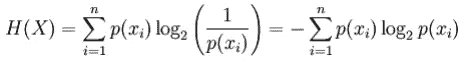
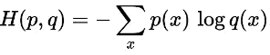
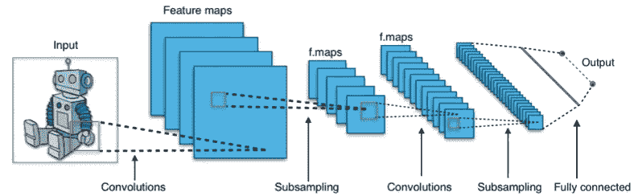
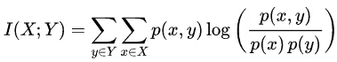
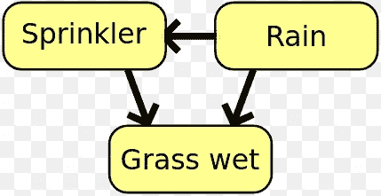
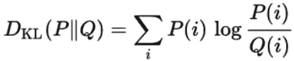

# 必须了解深度学习(AI)中的信息论概念

> 原文：<https://towardsdatascience.com/must-know-information-theory-concepts-in-deep-learning-ai-e54a5da9769d?source=collection_archive---------2----------------------->

信息论是一个重要的领域，对深度学习和人工智能做出了重大贡献，但对许多人来说却是未知的。信息论可以被视为深度学习的基本构建模块的复杂融合:微积分、概率和统计。人工智能中来自信息论或相关领域的一些概念的例子:

*   流行的交叉熵损失函数
*   基于最大信息增益构建决策树
*   维特比算法广泛应用于自然语言处理和语音中
*   在机器翻译 rnn 和各种其他类型的模型中普遍使用的编码器-解码器的概念

# 信息论历史简介

Claude Shannon, the Father of Information Age.

在 20 世纪早期，科学家和工程师一直在为这个问题而努力:“如何量化信息？有没有一种分析的方式或者一种数学的衡量方法可以告诉我们信息的内容？”。例如，考虑下面两句话:

*   布鲁诺是一只狗。
*   布鲁诺是一只棕色的大狗。

不难看出，第二句话给了我们更多的信息，因为它还告诉我们，布鲁诺除了是一只“狗”之外，还是一只“大”和“棕色”的狗。如何量化两句话的区别？我们能有一个数学方法来告诉我们第二句话比第一句话有多少信息吗？

科学家们正在努力解决这些问题。数据的语义、领域和形式只是增加了问题的复杂性。然后，数学家兼工程师克劳德·香农提出了“熵”的概念，这一概念永远改变了我们的世界，标志着“数字信息时代”的开始。

Shannon introduced the term “bit” in 1948, that he humbly credited to his colleague John Tukey.

Shannon 提出“数据的语义方面是不相关的”，当涉及到信息内容时，数据的性质和意义并不重要。相反，他用概率分布和“不确定性”来量化信息。香农还引入了“比特”这个术语，他谦逊地称之为他的同事约翰·图基。这一革命性的想法不仅奠定了信息论的基础，也为人工智能等领域的进步开辟了新的途径。

下面我们讨论深度学习和数据科学中四个流行、广泛使用且必须知道的信息理论概念:

# 熵

也称为信息熵或香农熵。

Entropy is a measure of randomness or uncertainty in an experiment.

## 直觉

熵给出了实验中不确定性的度量。让我们考虑两个实验:

1.  扔一枚硬币(P(H)=0.5)，观察其输出，比如 H
2.  扔一枚有偏向的硬币(P(H)=0.99)，观察它的输出，比如说 H

如果我们比较这两个实验，实验 2 比实验 1 更容易预测结果。因此，我们可以说实验 1 比实验 2 更不确定/不可预测。实验中的不确定性是用熵来衡量的。

因此，如果实验中有更多的内在不确定性，那么它就有更高的熵。或者实验越不可预测，熵就越大。实验的概率分布用于计算熵。

一个确定性的实验，是完全可预测的，比如扔一个 P(H)=1 的硬币，熵为零。一个完全随机的实验，比如说掷骰子，是最不可预测的，具有最大的不确定性，并且在这样的实验中具有最高的熵。

Experiment of tossing a fair coin has more entropy than tossing a biased coin.

看待熵的另一种方式是我们观察随机实验结果时获得的平均信息。从实验结果中获得的信息被定义为该结果发生概率的函数。结果越罕见，从观察中获得的信息就越多。

例如，在一个确定性实验中，我们总是知道结果，所以没有从观察结果中获得新的信息，因此熵为零。

## 数学

对于离散随机变量 ***X*** ，可能的结果(状态)为 x_1，…，x_n，以比特为单位的熵定义为:

其中 p(x_i)是 ***X*** 的 i^th 结果的概率。

## 应用

*   熵用于自动决策树构造。在树构建的每一步，使用熵标准进行特征选择。
*   模型选择基于最大熵原则，即从竞争模型中选择熵最高的模型为最佳模型。

# 交叉熵

## 直觉

交叉熵用于比较两种概率分布。它告诉我们两个分布是多么相似。

## 数学

在同一组结果上定义的两个概率分布 *p* 和 *q* 之间的交叉熵由下式给出:

## 应用

Convolutional Neural Network based classifiers often uses softmax layer as final layer that is trained using a cross-entropy loss function.

*   交叉熵损失函数广泛用于分类模型，如逻辑回归。交叉熵损失函数随着预测偏离真实输出而增加。
*   在像卷积神经网络这样的深度学习架构中，最终输出“softmax”层经常使用交叉熵损失函数。

# 交互信息

## 直觉

互信息是两个概率分布或随机变量之间相互依赖性的度量。它告诉我们一个变量携带了多少关于另一个变量的信息。

互信息捕捉随机变量之间的依赖性，并且比仅捕捉线性关系的普通相关系数更一般化。

## 数学

两个离散随机变量 **X** 和 **Y** 的互信息定义为:

其中 *p(x，y)* 为 **X** 和 **Y** 的联合概率分布， *p(x)* 和 *p(y)* 分别为 **X** 和 **Y** 的边际概率分布。

## 应用

In a Bayesian Network, the relationship structure between variables can be determined using mutual information.

*   特征选择:不使用相关性，可以使用互信息。相关性只捕获线性相关性，而遗漏了非线性相关性，但是互信息没有。零的相互独立性保证了随机变量是独立的，而零相关性则不然。
*   在贝叶斯网络中，互信息用于学习随机变量之间的关系结构，并定义这些关系的强度。

# Kullback Leibler 散度

也称为相对熵。

KL divergence is used to compare two probability distributions

## 直觉

KL 散度是发现两个概率分布之间相似性的另一个度量。它衡量一个分布与另一个分布的偏离程度。

假设，我们有一些数据，它的真实分布是“P”。但是我们不知道这个‘P’，所以我们选择一个新的分布‘Q’来近似这个数据。因为“Q”只是一个近似值，所以它不能像“P”那样很好地逼近数据，并且会发生一些信息丢失。这种信息损失是由 KL 散度给出的。

“P”和“Q”之间的 KL 散度告诉我们，当我们试图用“Q”近似“P”给出的数据时，我们丢失了多少信息。

## 数学

一个概率分布 *Q* 与另一个概率分布 *P* 的 KL 散度定义为:

## 应用

KL 散度通常用于无监督机器学习技术变分自动编码器。

信息论最初是由数学家和电气工程师克劳德·香农在 1948 年发表的开创性论文《通信的数学理论》中提出的。

注意:实验、随机变量和人工智能、机器学习、深度学习、数据科学等术语在上面已经被松散地使用，但在技术上有不同的含义。

如果你喜欢这篇文章，请关注我 [Abhishek Parbhakar](https://medium.com/u/3faa5cdb7ab4?source=post_page-----e54a5da9769d--------------------------------) 获取更多关于人工智能、哲学和经济学的文章。