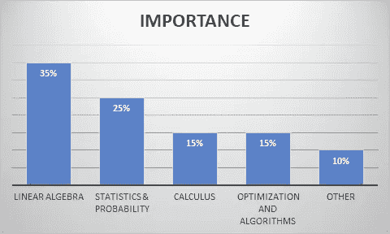

# 给有抱负的数据科学家的建议。

> 原文：<https://towardsdatascience.com/my-advice-to-an-aspiring-data-scientist-2ace6bd5cbe6?source=collection_archive---------4----------------------->

**简介**

在本文中，我将谈论我进入数据科学领域几个月来所信奉的价值观，任何有抱负的数据科学家都可以从中获得宝贵的见解。成功是一个旅程，而不是目的地，从成为伟大的人的过程中学到的价值观、经验和挑战才是这个过程值得的。

许多人专注于成为一名成功的数据科学家的技术层面，抛弃了非技术价值，这些价值不仅为成为一名伟大的数据科学家奠定了坚实的基础，也为成为一名全面的数据科学家奠定了坚实的基础。

那么，谁是数据科学家呢？数据科学家是使用统计、数学和数据技术解决业务问题的人。他必须通过提出正确的问题来了解业务领域，具备统计和数学技术的基本知识，如线性代数、微积分、优化和算法、概率等。对 OSEMN(获取、清理/清理、探索/可视化、建模、解释)等数据技术的扎实理解非常重要。

为了理解简单线性模型的工作原理，你需要耐心、学习新事物的欲望、好奇心(即使它杀死了猫)、结构性思维等，这些是你需要学会接受的价值观，也是我们将要关注的。

**心态决定一切。**

成为一名数据科学家既有趣又令人兴奋，也可能困难又无聊，这取决于你的心态。这一切都始于头脑！你如何让成为一名数据科学家变得有趣和令人兴奋？

你是你周围人的总和。如果你周围都是鼓励和积极的人，你很可能也会一样。LinkedIn 是社交工具之一，在数据科学的指导和激励方面拥有非常强大的社区支持。有伟大的数据专家，如[凯尔·麦基乌](https://www.linkedin.com/in/kylemckiou/)、[兰迪·劳](https://www.linkedin.com/in/randylaosat/)，他们有网站、课程和网络研讨会，致力于帮助有抱负的数据科学家。我从这些伟大的人身上获得了灵感和指导。没有人一开始就是专家，如果他们已经在他们所做的事情上取得了成功，你也可以取得成功，只是要有正确的心态。

一致性是关键，即使进展缓慢也要坚持下去，突破界限，被拒绝，这是你知道你真的在做一些伟大的事情的时候。参加漫长而无聊的 MOOCs 课程，最终你会学到新的东西。

**结构化思维。**

真正让数据科学家脱颖而出的是解决问题和结构化思维技能，工具只是实现这一点的一种方式。客户和利益相关者会告诉你一个业务问题，你需要制定策略并使用数据科学来解决。

## 你如何用结构化思维技巧解决问题？

*   **理解问题。大多数难题之所以难，是因为我们没有花时间去理解它们。这包括问正确的问题。不要急于解决问题，要对问题有一个清晰的定义，不管是业务上的还是技术上的。“如果你不能用简单的术语解释它，那么你就没有理解它。”**
*   **计划。**这包括规划您的解决方案。从基本问题开始，到问题的复杂部分。
*   **分**。大事是小事的总和。把你的问题分解成子问题，它会变得更容易解决。一旦你想通了每一个子问题，就把这些点连接起来，因为这将给你原问题的解决方案。
*   **卡住了？？当你陷入解决问题的困境时，学会休息而不是放弃。你找到解决办法只是时间问题。现在用不同的方法回到问题上，重复上面的步骤。**
*   **练习！！我们通过做来学习。练习，练习，练习。**

提高技能的资源:

[结构化思维的艺术](https://www.analyticsvidhya.com/blog/2013/06/art-structured-thinking-analyzing/)。

[提高结构化思维的工具。](https://www.analyticsvidhya.com/blog/2014/02/tools-structured-thinking/)

**学习基础知识。**

当谈到理解数据科学的基础知识时，你必须咬紧牙关。获取统计和数学概念，因为它们有助于为您正在构建的模型打下坚实的基础。

重要性的突破:

**资源:**

*   [想统计数据。](http://www.greenteapress.com/thinkstats/)
*   [推理和描述统计](https://www.udacity.com/course/intro-to-descriptive-statistics--ud827)
*   [可汗学院概率](https://www.khanacademy.org/math/probability)

论编程语言，从 PYTHON 开始，擅长就行了。把它作为一个整体来学习，因为它能让你更好地理解每一个概念。由于模型易于部署并能快速投入生产，大多数公司现在都在转向 python。

资源:

[data camp 上的 Python 课程](https://www.datacamp.com/getting-started?step=2&track=python)

[用于数据分析的 Python](http://cs109.github.io/2015/)

[Python 数据科学](https://www.dataquest.io/)

数据存在于数据库中，知道如何检索它很重要。首先学习 SQL，许多有抱负的数据科学家忘记掌握这一基本技能。一点 SQL 就能走很长的路。学习内连接和左连接分组，理解空、更新、插入、删除等。

资源:

[SQL 简介](https://youtu.be/WNb7Q7Da0Qo?list=PLCV8PlnXJ9x6LAuqPXgXZNSeHznXQ3b3l)

[SQL 命令](https://www.youtube.com/watch?v=7Vtl2WggqOg)

**边做边学。**

成为数据科学家的最佳方式是从事数据科学。你必须把手弄脏。没有目标的学习是遗忘的秘诀。找到你感兴趣的任何项目或领域，获取数据集并开始工作。如果你陷入了一个给定的概念，学习和探索它，然后回去用获得的知识完成任务。

拥有一份优秀的作品集对于招聘者轻松雇佣你来说是非常重要的。

## 伟大的投资组合需要什么？

*   拥有至少两个解决现有业务问题的项目。这证明你了解公司面临的问题和挑战，因此可以用你的数据技能影响一个组织。
*   投资组合中的项目应该专注于提升你的个人技能，如探索性分析、特征工程等。
*   专注于在给定的技能组合中变得有能力，足够胜任一份工作。
*   概述项目中的挑战、失败和成功，最好是如何改进以有效解决手头的问题。

就实际工作经验而言，你可以在一个 [NGO](https://www.drivendata.org/) 或任何组织中做志愿者，提出数据驱动的解决方案，或者参加 [Kaggle](https://www.kaggle.com/) 竞赛，仅仅是为了让自己的手和脚沾湿。

分组学习。三个臭皮匠顶个诸葛亮。小组学习使你能够互相学习，分享不同的观点，共同成长。Linkedln 提供了这样一个伟大的社区，有杰出的个人，如[兰迪·劳、](https://www.linkedin.com/in/randylaosat/) [凯尔·麦基乌、](https://www.linkedin.com/in/kylemckiou/)[凯特·斯特拉赫妮](https://www.linkedin.com/in/kate-strachnyi-data/)。

**教导和帮助他人。**

*“如果你不能向一个六岁的孩子解释清楚，那你自己也不明白。”—阿尔伯特·爱因斯坦*

学习新东西的最好方法是教别人，因为这能激励你通过积极的研究更好地理解你所学的东西。努力分享你的知识、经验和所有失败中的精华，这样别人就能从你的错误中吸取教训，完善自己。你能提供的最好的服务是给别人。

我进入数据科学领域的核心动机之一是通过数据驱动的明智决策来改善人们的生活，我努力在日常生活中实现这一目标。

不要把你的技能局限于你使用的工具，包括有效沟通、与他人合作和共同创新的能力。

教育他人需要通过创建自己的博客、在 LinkedIn、Medium、Reddit、Github 等网站上分享想法和文章来保持强大的在线影响力。

**找个导师。**

导师通过建议、网络和支持强调长期发展。您可以从导师的错误和失败中学习，这是攀登数据科学成功阶梯的一种更简单、更快速的方式。从他们那里获得关于你的进展和项目的持续的、诚实的反馈，对于评估你的表现和知道你做的事情是否正确是非常重要的。

一个导师不一定是一个人，但是你可以从书籍、LinkedIn 帖子、文章、Github、Kaggle 内核等中学到很多东西。只要挑一个适合你的就行了。

**通过建立关系建立人脉。**

与公司中有影响力的潜在招聘人员建立个人关系是每个有抱负的数据科学家都应该长期掌握的一门艺术。你会面临很多拒绝，但坚持不懈地提高这项技能，你最终会得到你梦想的工作。

努力与招聘人员建立私人关系，而不是职业关系。这包括了解他们的爱好是什么，是什么激发了他们的工作，计划一次喝酒聚会或虚拟聚会，你能做些什么来帮助他们实现目标等等。

与一家有着远大目标、你渴望成为其中一员的合适公司合作是非常重要的。对公司、他们的技术、他们使用的工具、他们正在做的项目做一些研究，向他们展示你对他们的价值。

你不一定要做到最好，只要想好如何低效地展现你所擅长的领域就行了。你越早意识到你不可能成为所有事情的大师，你就会成为越好的数据科学家。记住你的经验在你的技能、心态和态度中。

**结论。**

我最大的满足是和一个在数据科学方面有相似兴趣的人一起学习、支持和成长。我总是渴望向我遇到的任何其他数据专家学习，因为我相信我们总是可以从彼此身上学到一些东西。我希望您能从这篇关于成为更好的数据科学家的文章中获得有价值的见解。

如果你想给这篇文章添加任何提示，请随时留言。感谢任何形式的反馈！不要忘记分享和帮助某人成为更好的数据科学家！！我们可以通过我的 [LinkedIn](https://www.linkedin.com/in/brianmwangi/) 继续讨论，或者你可以发电子邮件给我你的意见[brynmwangy@gmail.com](mailto:brynmwangy@gmail.com)。干杯！！