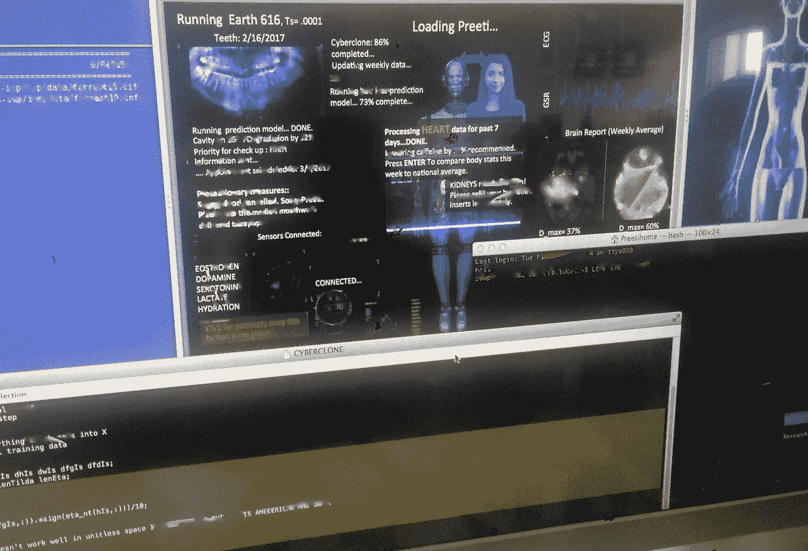

# 我的网络克隆:数字化自我

> 原文：<https://towardsdatascience.com/my-cyberclone-digitized-self-847782641c5c?source=collection_archive---------2----------------------->

#TBT 我的网络克隆#试用版 1。正在预加载…

#TBT to cyberlone MK1\. A lot of mock data is used.

我是在一年前作为个人夜间爱好开始钻研这个项目的([https://TechCrunch . com/2016/01/09/virtual-reality-and-a-parallel-universe-of-cyber clones/](https://techcrunch.com/2016/01/09/virtual-reality-and-a-parallel-universe-of-cyberclones/)[罗斯·芬曼](https://medium.com/u/450ae0b0c812?source=post_page-----847782641c5c--------------------------------) [本杰明·莱因哈特](https://medium.com/u/255625a0ab1b?source=post_page-----847782641c5c--------------------------------))。并不是说我在攻读博士学位、创业、指导学生和抱怨生活之间没有任何事情可做。但是，不像你们大多数人，我不擅长采取积极的措施来保持健康。去年一整年，健康对我来说都很糟糕，所以我只是想预测任何即将袭击我的健康灾难——让我远离编码、机器人和其他美好的生活。换句话说，我开始建立我自己的网络克隆——我的身体、情绪和行为的预测模型——我自己的数字印记。最终有一天，使用可植入的可穿戴设备/放电单元，自动调节(闭环系统)重要变量到一个名义参考值。这些可能是很多东西——一些例子可能是——葡萄糖、维生素甚至多巴胺——它当然会让你了解牙齿蛀牙的传播(是的，也有数学模型！)这样你就不会因为牙痛进两次急诊室(在美国，更换一颗牙齿要花掉我 4 个月的研究生津贴！！！这是一个巨大的动力。)

似乎体育界已经尝试了所有优化性能的方法——最终我们都将拥有自己的参数模型，使用可植入的可穿戴和放电单元进行优化。也许在遥远的未来，我们还会用实验室定制的神经元来取代我们的神经元，以增强我们的聪明度。

虽然我在先进的神经网络方面越来越好，但首先，我发现大量的人类行为是相当确定的，可以基于具有某些不确定性界限(也可以有条件地变化)的数据驱动的统计模型。我应用的大部分数学是从我博士学位的一部分借来的，在那里我编写了一个软件来处理多达 400 万个模糊的数据点，以估计未知的非线性(对于我简化的博士问题来说，这是不错的数据量，但在许多情况下，你可以处理 1000 倍以上的数据；你要学会什么是适量的样本)。我学到了很多关于数据采样，偏见，为什么太多的数据并不总是好的-然后归结为你在用它做什么。很多都是基于大型数据集的降维，建立变量之间的相关性(对于无法实时测量的事物和找出正确的生物标志函数尤为重要)，并确定足以描述问题模型的关键组件。最近，我开始编写非常简单的算法(通常是在我弄坏了无人机，需要分散注意力，或者只是生生活的气的时候)——来代表一个代理人应该如何应对与最初的预测模型相矛盾的失败、拒绝和心碎。在这个过程中，我对人类的身体和大脑有了相当多的了解——我对此知之甚少！

与生物人类的传统建模不同，我的工作可能有些简化——基于这样的假设，即我不需要按照科学在任何粒度级别匹配生物/化学过程。我最关心的是，主模块的输出是否与你在普通生物过程中看到的相匹配。原因是，无论如何，这个世界真的看不到你内心发生了什么。所以在多智能体交互问题中，我所关心的是仿真智能体在任何情况下的输出。我是按照生物学来模拟心脏还是大脑与我的问题无关，只要——比方说——让“真实的我”哭泣的外部刺激也让我的数字自我或“网络克隆”哭泣。新型号比我开始时的要好得多。不过进展很慢——没有足够的时间做副业。但是，我认为一旦我自动化持续的数据上传和模型更新，它会好得多。

仍然非常初步，但几天前就想把它加载到 Github 上。作为一名机器人专家，我必须更加负责任:)所以这将是一个个人的激情项目——尽管我总是很高兴在休息的时候和任何从事这方面工作的人交谈:)

一个困扰着我的人有时会感觉很糟糕——因为我认为我只是把我的生活经历、情绪甚至牙痛归结为数据和样本观察。