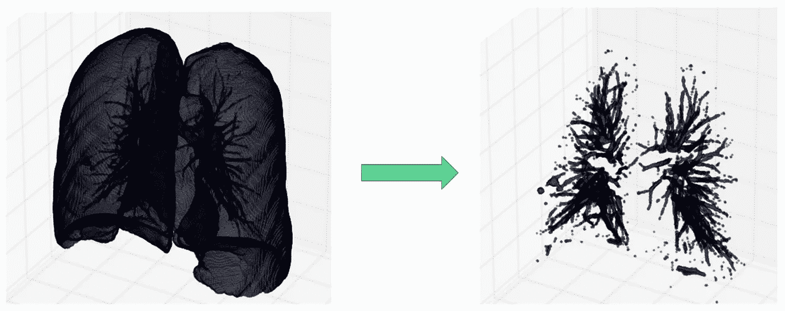
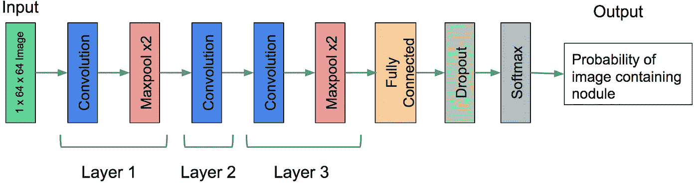
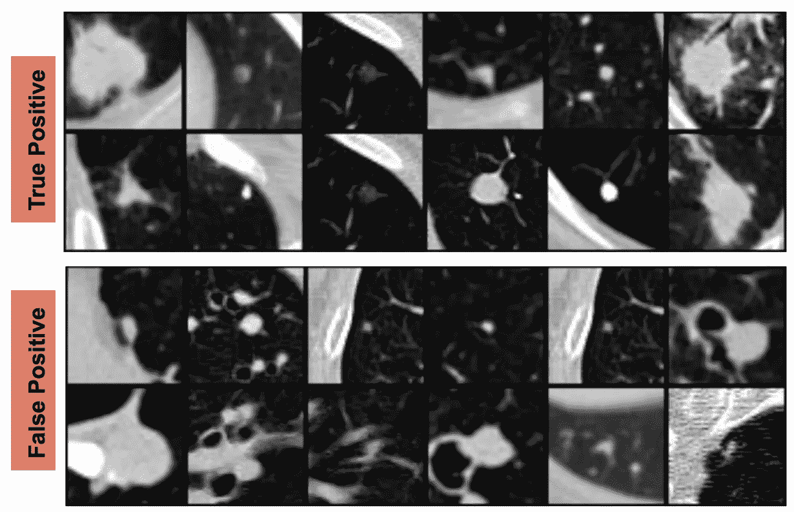

# 我参加 Kaggle 数据科学碗 2017(肺癌检测)的经历

> 原文：<https://towardsdatascience.com/my-experience-participating-in-kaggle-data-science-bowl-2017-lung-cancer-detection-4705032052ec?source=collection_archive---------4----------------------->

3D reconstruction in all three axes

# **简介**

我参加了 Kaggle 一年一度的[数据科学碗(DSB) 2017](https://www.kaggle.com/c/data-science-bowl-2017) ，很想和大家分享我激动人心的经历。首先，我想强调一下我对这场比赛的技术方法。这是我们面临的问题:我们必须从高风险患者的低剂量 ct 扫描中检测肺癌。本质上，我们需要预测患者在接受扫描后的一年内是否会被诊断为肺癌。

我认为竞争尤其具有挑战性，因为与一个患者(单个训练样本)相关的数据量非常大。因此，这使得很难将 3D CT 扫描数据输入到任何深度学习算法中。由于最近的流行，我真的想应用最新的深度学习技术。然而，我很快意识到，我们只是没有足够的数据来从头训练大型深度学习模型。所以，唯一能让我训练深度学习模型的方法就是把这个问题进一步分解成更小的子问题。

# 肺分割

所以首先要做的是。我想用传统的图像处理算法从 CT 扫描中剔除肺部。使用阈值和聚类，我想检测肺部的 3D 结节。发现肺部的恶性结节是至关重要的，因为这是放射科医生为患者检测肺癌的主要指标。按照这些 Kaggle 内核中的代码([圭多·祖德霍夫](https://www.kaggle.com/gzuidhof/data-science-bowl-2017/full-preprocessing-tutorial)和[阿纳夫·贾恩](https://www.kaggle.com/arnavkj95/data-science-bowl-2017/candidate-generation-and-luna16-preprocessing))，我很快就能够预处理并从 CT 扫描中分割出肺部。看看下面的图片。

Segmented lung and its internal structure

在进一步分析数据后，我意识到使用简单的阈值来检测结节并将其用于特征提取是不够的。在我们从这些候选结节中提取特征之前，我需要一种方法来减少假阳性。

# 使用 LUNA 数据的结节检测

这个竞赛允许我们使用外部数据，只要这些数据是免费提供给公众的。因此，我决定探索在 Kaggle 论坛上提到的[**LU**ng**N**ode**A**analysis(LUNA)Grand Challenge](https://luna16.grand-challenge.org/)数据集。该数据集提供了由多名放射科医师注释的 CT 扫描中的结节位置。了解结节的位置使我能够建立一个可以检测图像中结节的模型。为了简单起见，我决定建立一个 2D 卷积神经网络(CNN)来预测图像是否包含结节。我遵循了与这里的[Sweta subra manian](https://github.com/swethasubramanian/LungCancerDetection)记录的完全相同的方法。

CNN architecture of the nodule detector

该 CNN 模型的输入是 64×64 灰度图像，它生成包含结节的图像的概率。使用这个 CNN 模型，我能够在 LUNA 验证数据集上实现 85.38%的精确度和 78.72%的召回率。以下是一些从 LUNA CT 扫描数据中截取的样本图像。

True Positive (Top) and False Positive (Bottom) sample images of the LUNA validation set

# **最终 XGBoost 模型**

我从初始分割方法中生成的每个候选结节，我能够从其中心裁剪出一个 2D 补丁。

通过将训练好的 CNN 模型应用于这个 2D 斑块，我能够排除没有产生高概率的候选结节。所有剩余的结节用于生成特征。最终的功能集包括:

*   结节面积、直径、像素密度和结节数量
*   来自已训练 CNN 模型的最后全连接层的聚集特征
*   预训练 ResNet 模型的最后一个全连接层的聚合特征(此处描述的迁移学习方法)
*   与 CT 扫描相关的简单特征(即分辨率、切片数量、切片厚度)

利用这些特性，我能够建立一个 XGBoost 模型，预测患者被诊断为肺癌的概率。使用我的最佳模型，我在 stage2 私人排行榜上获得了 0.59715 的对数亏损分数。作为参考，我想强调的是，获胜团队的对数损失分数为 0.39975(分数越低越好)。

# 结束语

有几个方法我真的很想尝试，但是由于时间限制，没有时间去实现。具体来说，在使用 2D CNN 看到有希望的结果后，训练 3D CNN 来检测结节将是我的下一个方法。看起来许多获奖的解决方案成功地利用 3D CNN 利用 LUNA 数据检测结节。我对结果很满意，因为我能投入比赛的时间有限。总的来说，我试图尽可能地利用现有的工作，以便我可以专注于挖掘更高层次的功能。这是一种在短时间内学习最新机器学习技术和工具的极好方式。源代码和 python 笔记请参考获取我的 [GitHub 页面](https://github.com/ashish217/kaggle/tree/master/data_science_bowl3)。