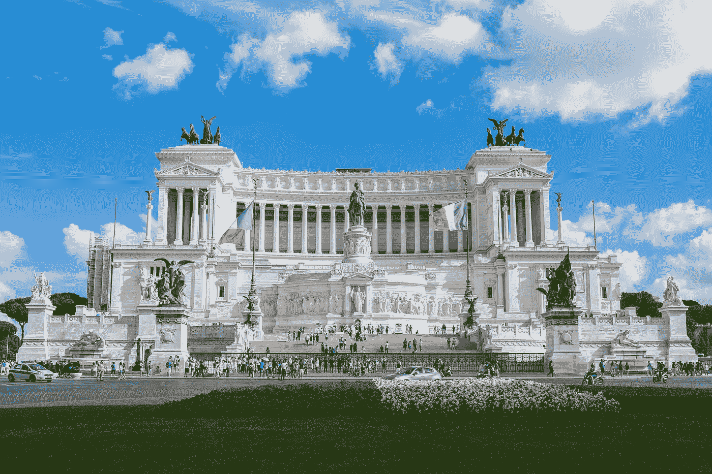
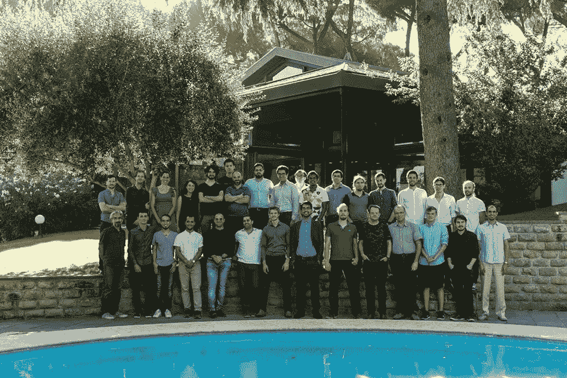
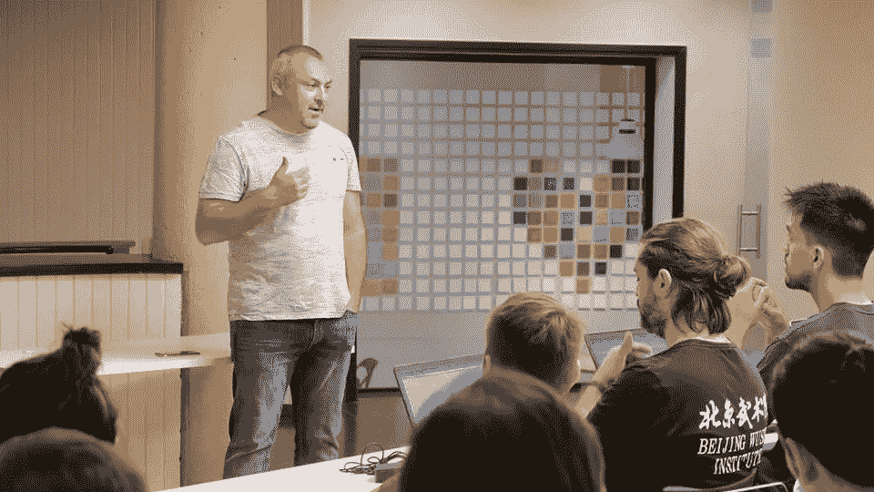
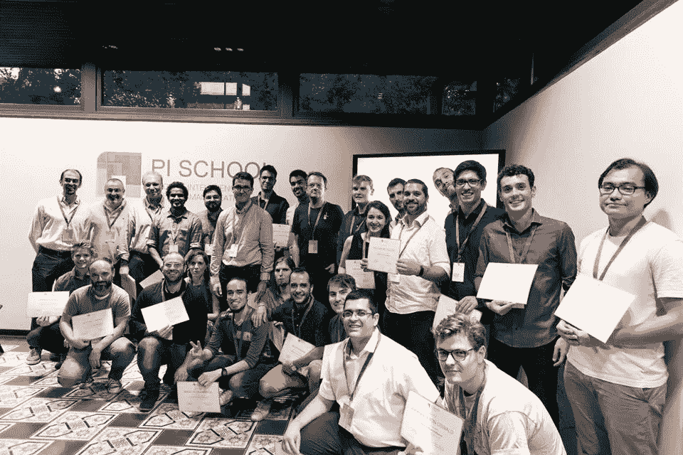

# 我在意大利罗马 Pi 学校做人工智能学者的经历

> 原文：<https://towardsdatascience.com/my-experiences-as-an-ai-scholar-at-pi-school-in-rome-italy-1f0641ce6538?source=collection_archive---------2----------------------->

Altare della Patria (Image courtesy: Pixabay.com)

我将从这篇文章的概述开始。在这篇文章中，我将回顾我在意大利罗马 Pi 学校参加为期 8 周的人工智能学习项目时的学习经历和愉快时刻。

这是一个关于激情和努力的故事:)

在 2018 年的黎明，我对自己说，我将超级认真地对待全栈软件工程和数据科学。在数据科学中，我特别选择机器学习和深度学习，因为我已经在这些领域研究了一段时间。你可能会疑惑是什么让我选择了两条路。一个主要原因是，到目前为止，我作为全栈软件工程师和研究工程师在这个行业只有两年多的时间，这意味着我的职业生涯还有很长的路要走。所以在研究和产业之间取得平衡是好的。是啊，这是一个个人偏见的意见，我似乎同意:)

现在我的日常编程语言是 Node.js 和 Python(感谢我毕业后马上工作的公司)。我伸出手指，开始用 Node.js 和 Python 做宠物项目，我在 Coursera 上完成了吴恩达的机器学习课程，我开始学习杰瑞米·霍华德和瑞秋·托马斯的 fast.ai，我开始向卡格勒学习(我复制了相同的代码，并向同行学习:)。有几天，我早上 4 点就去睡觉，第二天早上 8:30 醒来，然后去上班。我不觉得累，因为我对我正在做的事情充满热情(我现在仍然在做，以一种优化的方式；) ).

一个晴朗的夜晚，在工作的时候，我看到了一封来自 Kaggle 的电子邮件，是关于这个迷人的奖学金项目的。这是一个关于在强大的罗马进行的为期 8 周的人工智能研究项目。我的第一反应是，“哇，这太酷了！！!"。首先，这是一个奖学金，你可以免费学习人工智能。第二，它发生在罗马古城:D。我马上查看了链接，并开始阅读网页"[皮学校人工智能](https://picampus-school.com/programme/school-of-ai/)计划"[1]。

仔细阅读本页后，我对这个项目有一个正面的印象。在我在这一页发现的几个事实中，很少有东西真正引起我的兴趣。

1.  这是一个全额资助的项目，包括你的全部课程费用
2.  涵盖 8 周期间的生活费用(包括旅行、住宿、食物和基本需求)
3.  项目负责人简介[Sebastian bratièRES](http://mlg.eng.cam.ac.uk/sebastien/)【2】
    ——我注意到这个项目的负责人拥有著名的剑桥大学的博士学位，他在人工智能方面有 15 年以上的经验。
4.  与行业和大学的合作
    —思科、亚马逊、谷歌、卡内基梅隆大学、苏塞克斯大学++
5.  我满足:D 的所有最低要求(以及一些优先要求)

我总是寻找新的机会。我总是想扩大我的关系网，我想边做边学。我向同龄人学习，这是一个绝佳的机会。

**申请奖学金**

在这一点上，我很确定我会申请这个项目。我在网页上填了申请奖学金的表格。然后，项目经理联系了我，向我询问了我的简历和求职信，以推进选拔过程。

我在同一天收到了确认我的申请的回复。我必须回答的一个特别的问题是，“我是否能在这 8 周内都有空”。作为一名全职员工，这是具有挑战性的。然而，我说服自己，如果我有这个机会，我会参加。

**面试准备**

下一步是准备。申请并不意味着被选中参加最初的面试，但我满怀希望:)坦率地说，尽管我对这个项目有着积极的印象，但我还想了解更多。我看过很多关于新兵训练营的文章/广告，参与者必须付费的研讨会。但这完全不同。这引起了我的好奇心，想多了解一下 Pi 派。

在搜索的时候，我在 Pi School 脸书页面【3】上发现了一个相当有趣的[视频。从这个视频中，我了解了很多关于 Pi 学校的愿景和创始人(如果你打算申请这个项目，这是一个明确的观看；)).](https://www.facebook.com/picampusrome/videos/1721109364597481/?hc_ref=ARRZUcAFB4w4NJKSOwsL89fJdvrHGB9wDUn8WuLNlkRcxZYKit9eXLgGW7G_Ckn-Z9A)

在圆周率派的创始人之一马可·特龙贝蒂的几个有趣的陈述中，有一个陈述真正引起了我的注意。这是我爱上的说法之一。*** **重要** ***

> “你一生中最重要的会议、你的结婚对象、你的商业伙伴通常都发生在学校里。如果我们需要一所学校来创建世界上最大的有创造力的优秀公司，我们就要建一所”

这就是为什么我们仍然想回到我们的学生时代和大学生活的记忆里的确切原因。我们在学校和大学都有很好的人际网络。我们在学校/大学期间遇到的人在我们的生活中发挥了重要作用。他们以积极的方式塑造了我们。

我继续看完整的视频(花了大约 100 分钟，完全值得)。看完这个视频，我已经成为了 Pi 派的一员。我非常想被选中参加这个项目，我知道现在是我复习线性代数、统计和概率知识的时候了(这些领域在最低要求中有提及)。

几天后，我收到了项目经理的邮件，说我已经进入了第一轮面试的候选名单。我感到很高兴，我想确保我有充分的准备来面对这次面试。项目经理特别要求找到一个合适的地方进行有效的对话(即一个有合适的亮度、稳定的互联网连接且没有噪音的地方)

在面试那天，我确保在面试时间前 10 分钟让自己有时间。我设法为我的采访找到了一个合适的环境。我发邮件给我的面试官说我已经准备好了，在 3-5 分钟内我收到了继续面试的确认。

**面试期间**

我的第一次采访是与 Pi School 的人工智能和机器人顾问(他参加了 Pi School AI 2017 计划)，他目前正在机器人领域攻读硕士学位。问我的第一个问题是，我是否能让自己整整 8 周都有空，我将如何做到这一点。我已经下定决心参加整个 8 周，所以我说服了我的面试官，从我的角度来说，这在技术上是可能的。这次面试检查了我对线性代数、概率和统计以及机器学习概念的整体理解。我被要求解释我的背景，我做过的项目等。我特别强调了我一直在做的 ML 项目。有人问我，我是如何保持自己与 ML 同步的。我大致解释了自 2018 年黎明以来我一直在做的事情。在面试过程中，你可能会面临的一个非常重要的问题是，“为什么你想成为其中的一员？”。我已经为这个问题做好了准备；).我说我渴望成为数据科学专业的人才(我想这在这类面试中很常见:P)。然后我说，我看了脸书大学开学典礼的视频，也看了上一期人工智能项目的视频。我特别强调了 Marco 的这句话，这显然是我成为这个项目一部分的原因。“我一直在寻找机会，而 Pi 学校似乎是一项有利可图的投资”。我向我的面试官传达了这个信息。我可以说这次面试有 80%-85%是成功的。有些问题我本可以回答得更好。反正我是满怀希望的:)

大约 5-7 天之后(如果我没记错的话)，我收到了项目经理的另一封电子邮件，称我已被列入 Pi School 人工智能项目的项目总监 Sebastian Bratières 的第二轮面试候选名单。第二天我参加了面试。在准备第二轮的时候，我解决了第一轮面试时卡住的问题。我坚信这是任何面试准备中非常重要的一步。我觉得面试会像第一次面试一样，我们可能会深入线性代数，概率和统计以及机器学习的概念。

我设法找到了一个类似的会议环境，做了和会议前第一次面试差不多的事情。我让自己准时出现。正如我所想的那样，我提出的问题基于线性代数、统计/概率和机器学习概念。在面试中，我被要求写一些公式，还有一点编码。有一个问题会导致偏差/方差以及过拟合和欠拟合，这个问题基于一个真实的 ML 项目。在第一次面试时，我被问了一些贝叶斯定理和贝叶斯网络的问题，我觉得我在第一次面试中会回答得更好。这些是我在准备复试时特别关注的问题。你猜怎么着，它成功了！:D。这就是为什么在最初的面试步骤中练习那些你不能回答的问题是非常重要的。这次采访也很顺利。我再次充满希望:)

大约 3-5 天后，我收到了那封我从一开始就一直在等待的邮件。这是一封来自项目经理的电子邮件，确认我被 Pi 学校人工智能项目选中。我非常兴奋和高兴，因为到目前为止，这是我在 2018 年赚到的最大一笔钱。我签署了最初的合同，并确认我参加这个可怕的计划:D

**申请签证**

一旦你被选中，下一步就是准备搬迁到罗马 8 周。这个过程取决于你的国籍。也许你不想签证进入意大利。就我而言，我需要签证。大多数时候，这是基于你的国籍。

我想对我的签证过程中给予我巨大支持的项目经理表示诚挚的感谢。我知道这个过程背后有很多 Pi 学校的人。我直接与项目经理联系，他给了我尽可能好的支持来帮助我办理签证(特别是给大使馆的官员写信和在早上 5 点接听电话)。如果你被选中并需要去罗马的签证，请随时写信给 Pi 学校的项目经理，他/她会全程陪伴你。

**Pi 学校 8 周**

Group picture of the School of AI 18 (courtesy: Pi School media)

我可以在 8 周内写很多东西。我精心挑选了几个，这样你就能知道 Pi 学校在这 8 周里做了什么，参与者做了什么。

Pi School 从一开始就确保向所有参与者提供所有必要的材料。在正式毕业典礼之前(即。6 月 11 日)，组织者共享了一个包含学习材料、管理材料和其他相关文档的 Google Drive 文件夹，授予了对 GitHub 存储库的访问权限，为所有参与者创建了 AWS 实例，创建了一个专用的 Slack 实例来促进交流和开放交流，并在“Basecamp”上创建了一个项目管理实例。

在正式开学的前一天，举行了一个隆重的欢迎会，那是一个平静的星期天。来自世界各地的 26 名与会者，即斯里兰卡、意大利、巴西、法国、德国、伊朗、哥伦比亚、希腊、冰岛和哈萨克斯坦。我总是很好奇，想了解更多不同的文化，这种氛围让我很兴奋。

该计划于 2018 年 6 月 11 日正式开始。所有参与者都有所需的基础设施、桌子、椅子、大屏幕、AWS 实例和 GitHub 访问。Pi School 创建了 13 个组，每组有 2 名参与者。每个小组都被分配到一个项目中，这个项目得到了工业界优雅的赞助者的资助。有几个行业合作伙伴。我想强调几个，这样你就可以对 Pi 校园与技术行业的合作有一个总体的了解。几个合伙人分别是[思科](https://www.cisco.com/)、[亚马逊](https://www.amazon.com/)、[索尔多](https://www.soldo.com/en-eu/b/business/)、[意大利邮政](https://www.poste.it/)、 [Xriba](https://xriba.com/) 和[翻译](https://www.translated.net/en/)。

我非常荣幸有核心深度学习实践者作为我的工作伙伴。他来自巴西，在巴西一家顶级石油公司工作。他知道深度学习概念的来龙去脉。作为一名人工智能新手，我的工作伙伴是金矿:D。所有参与者都有一项独特的技能，使他们与众不同。这种独特性给了每个团队一个很好的平衡。惊喜不止于此。后来我和我的合伙人知道我们被分配到思科系统公司赞助的项目。我付出了全部的灵魂和努力来获得这笔奖学金，每天我都得到巨大的惊喜:D。这就是为什么我总是相信努力和态度:D :P。态度和努力战胜一切。相信我，:D

从第一天开始，参与者就知道他/她的同伴、项目和预期的交付成果，团队配备了基础设施和讲座指导。

我玩 AI，ML 已经有一段时间了。Pi 学校给我布置的项目和我一直在做的宠物项目完全不一样。大多数时候，我们从 MOOCs、书籍和论文中学习的项目，我们可以找到一个标记良好的数据集(可能是 CSV 或任何其他非常方便的格式)。与这些类型的项目相反，我们都参与的项目有一个显著的独特性。参与者有责任确定/生成他们需要的数据集。所以对于大多数项目(可能是所有项目)，没有 CSV 或类似的东西。

我喜欢列出几个项目。

1.  设计和开发深度学习工作流来分析加密网络流量(Cisco)——这是我和我的合作伙伴做的项目。帖子的更多信息:)
2.  ICD 分类(Noovle) —协助卫生当局按代码付费(医疗编码行业)
3.  根据用户数据打开电子邮件(回报)—根据用户配置文件预测电子邮件收件人是否可能会打开电子邮件
4.  呼叫中心活动 KPI 的异常检测(Covisian)
5.  关注无预约顾客(意大利邮报)——预测无预约顾客的年龄和性别

为了保证每个项目的顺利进行，每个人都必须完成一些管理任务。

1.  维护项目日志——这是一个谷歌文档，团队维护它来报告他们的日常活动，特别是他们做了什么，结果，挑战和克服挑战的步骤。当准备与项目发起人和导师的周会时，这些日志文件变得非常方便。
2.  与利益相关者/导师的周会——根据可用性，安排与利益相关者和导师的会议。在我们的项目中，我们每周与项目发起人 Cisco:)举行会议。在这些会议期间，团队提供了关于他们的项目、他们所面临的挑战以及他们为克服挑战所采取的措施的最新情况。利益相关者和导师通常会提供积极的反馈，并在必要时提出建设性的改变。这些会议非常有助于发展每个公司在人工智能领域的技术目标的亲和力。此外，这是一个亲自了解利益相关者和导师的好机会，因为他们将在参与者生活中的某个时刻发挥巨大作用，可能是作为推荐人、导师或未来的潜在雇主。这些会议持续约 1 小时左右，取决于导师/利益相关者的可用性。Pi School 与每位与会者分享了一份指南清单，其中包含准备这些会议时要遵循的步骤/流程。例如，当展示每周的进展时，分享代码(伪代码)、绘图、图表、公式、模型图、学习曲线、特性使用、模型/任务的基线、模型配置等等。作为一名数据科学从业者，我在准备会议时仍然遵循这些指导方针:)此外，为了避免会议期间出现任何技术问题，Pi School 分享了一份清单，这样就不会有任何延迟，也不会比预定时间要求更多的时间。会议结束后，团队在所有利益相关者之间共享会议记录，以便每个人都知道已经做了什么和将要做什么。
3.  “全体会议”——这是每周一次的会议。每周四上午 10 点整，Sébastien Bratières 邀请所有参与者分享他们的每周更新。每个团队有大约 5-7 分钟的时间来分享他们的进展、挑战以及他们采取的缓解挑战的措施。由于这是一次公开会议，每个人都有机会了解其同事的状况。

Pi School AI 学者的一天通常从上午 9 点开始。我们享用了免费早餐，然后马上开始项目，在下午 5:30 或 6 点左右结束一天的工作。

白天，我们将 80%以上的时间投入到项目中。在剩下的时间里，我们与其他队友讨论了项目事宜，讨论了人工智能、人工智能初创公司等方面的最新研究工作/论文。几天来，我们有关于人工智能主题的辅导课，强调了最先进的技术和实践方面。Pi 学校的组织者非常鼓励参与者展示他们感兴趣的领域。我的同事们也参加了与 GPU 计算、使用 Python 的最佳机制、GitHub 实践、AWS 和安全漏洞相关的会议。这些会议非常有助于我们学习新的东西，加深我们对已知事物的理解。

我注意到的关于 Pi 学校工作人员的一个特别的事实是，他们是罗马(也许也是意大利)的 AI/ML 积极分子。在罗马，有两个团体(据我所知)在学生、行业合作伙伴和其他爱好者中创造 AI/ML 的意识。这些小组是“TensorFlow X Rome”和“机器学习/数据科学会议”小组。在项目期间，我们有幸参加了由这两个团体组织的活动。此次活动的特邀演讲者来自 Twitter(加州办公室)和 H2O。这次活动给我的收获是免费啤酒和披萨:P .哈哈哈，我只是开玩笑。来自 Twitter 的演讲者做了一个关于情绪分析的会议，并强调了在某些情况下 AI 可能会表现出种族主义，研究人员热衷于纠正这个问题。来自 H2O 的演讲者介绍了 H2O 平台提供的 ML 生态系统，以及他们未来扩展到 GPU 支持平台的计划。

(Image courtesy: Pixabay.com)

“成为一名企业家”，“用人工智能制造产品”肯定是我们大多数人心中的想法。因此，了解它的最佳方式是直接与他们互动(或听成功的故事)。通常这类成功案例的样本量非常小。只有极少数人有故事可以分享，让你从中学习。在 Pi School，我能够与其他参与者交流，他们目前是自由 AI 开发人员，但对建立自己的初创企业有着巨大的热情。我从他们那里学到了很多。Pi 学校时期帮助大多数参与者向他们的同龄人学习。而且不仅仅是来自同行，有时候也来自受邀的演讲者。在我们逗留期间，我们与 Illia Polosukhin 进行了一次会谈，她是 near.ai 的联合创始人(也是 TensorFlow 的主要贡献者)。Polosukhin 分享了他对成为一名连续创业者的个人看法。是的，他确实谈到了 near.ai，但我发现他让自己的产品变得伟大的热情相当有趣。他分享了他个人对不读博士的偏见，这是我至今仍在思考的问题。还有一场会议(这一次是虚拟会议)，由一位来自奥地利的企业家主持(遗憾的是我不记得他的名字了)。他强调了为什么他在攻读博士学位后从学术职业转向工业。他非常坦率地分享了他在创业初期必须面对的所有障碍。他明确表示，尽管他在技术上多才多艺，但他仍在不断提高自己的人员管理技能，这是任何初创公司的关键因素。这对于任何希望创办自己公司的人来说都非常重要，因为最终我们将与人类和他们的个人价值观打交道。

我相信我们每个人在生活中都会经历一次“做决定”的情绪起伏。我们不知道该走哪条路，不知道如何从多个选项中做出选择。大多数时候，我们的直觉帮助我们做出决定。一天晚上，在我们享用了免费午餐后，Pi School 的首席执行官 Jamshid Alamuti(我们称他为 Jam)进行了一次会议，以提高我们的软技能，特别是在决策领域。尽管如此，我还是会凭直觉行事，因为我知道，通过利用“六顶思考帽”,给这个过程一个更符合逻辑的方法。当然，当我需要衡量自己行为的利弊时，这在我的职业生涯中至关重要，尤其是在“攻读博士学位”的时候。

AI 学校是 Pi 学校开展的众多项目之一。如果你仔细观察他们的项目，你会发现有关于领导力、创意孵化、设计、展示等更多方面的项目。除了 AI 学校项目，在我们逗留期间，Pi 学校也发生了一些事情。在其中一次活动中，有来自以色列的非常成功的投资者。这显然暗示了关于圆周率派领导层的远见卓识。对于这个事件，参与者是在最后一刻被邀请的。但是我们大多数人都高度专注于我们的项目工作。去过那里的几个人说，这是一个很棒的演讲，投资者谈论了他们打算通过人工智能的方式前进的方向。此外，在我们项目的中期，项目的利益相关者来到 Pi 学校，学者们有机会更多地讨论项目，并更好地了解导师和利益相关者。这是一个非常美好的夜晚，有啤酒和食物。(我和那位来自 Noovle 的先生交谈过)。

Networks (Image courtesy: Pixabay.com)

我应该说一点我和我的同伴做的项目(简单地说:)。如你所知，我们都被分配到思科赞助的项目。我们的任务是开发一个“分析加密网络流量的深度学习工作流”，从数据获取的角度，通过可视化来推断深度学习的结果。该项目由思科系统公司的“领导，公司战略人工智能项目”直接监督和指导。该问题被定义为分类问题(分析恶意软件和良性流量)。在搜索公开可用的恶意软件库时，我的同伴提出了一个想法，因为这是一个分类问题，我们可以根据网站的类型进行自己的实验来对网络流量进行分类。我们选择的网站类型有新闻网站(如华尔街日报)、流媒体网站(YouTube)和社交媒体(脸书)。我们使用 Cisco Joy 工具捕获数据(网络流量)，该工具可以捕获和分析网络流量。捕获的数据作为 JSON 对象存储在. gz 文件中。每个 JSON 对象都有许多与网络相关的属性。有些是包输出、字节输出、包输入、字节输入、网络头特定数据(TLS、DNS、HTTP)等等。在我们的工作中，我们利用了网络属性中的手工设计功能，因为以前的工作也严重依赖于特定任务的手工设计功能。网络数据结构是一个复杂的分层嵌套字典列表，编写一个统一的函数来从网络属性中提取特征并不是一种通用的方法。我的朋友想出了一个独特的主意，写一个自定义的递归函数来分析输入数据的结构。在我们的工作中，我们提出了一种使用数据结构来识别和提取有意义特征的自动化方法。网络数据是嵌套字典的复杂层次结构。我们介绍了能够处理这种特定类型数据的神经网络架构(FF、RNN 和 Conv1D ),并提出了能够适应数据结构的模型。另一个非常重要的任务是，模型调整和选择。我们开发的功能允许测试多个模型和调整超参数，只需改变一个 YAML 配置文件。简而言之，这是我们所做工作的概述。(如果时间允许的话，我会在以后就这个项目写一篇单独的文章)

在项目的最后两周，所有的团队都忙于项目工作。我们必须在 Pi 学校作为 AI 学者的最后一天前 4 天左右提交最终报告。也要在期末日期前 2 天提交期末报告。尽管这种安排起初看起来很艰难，但每个团队都相信这是一个好策略，就好像我们都坚持到最后一天提交所有东西，这将是一个巨大的痛苦。每个人都设法按时交付所有项目可交付成果。

最后一周的一个晚上，Sébastien Bratières 邀请我们所有人参加他的最后一次会议。他准备了几个话题与我们讨论，一些话题是关于高等教育、企业家精神、剑桥、准备从事数据科学等。

如果我没记错的话，在期末考试的前一天晚上，我们决定去附近的一家餐馆享用一顿丰盛的晚餐。我的一个朋友深深地陷入了沉思。我问他为什么。他说，他找到了一种方法来优化他的结果，甚至比以前的结果更好，这是在完成最终报告后，他下定决心要做最后一搏。第二天我和他谈话时，他已经完成了:D，不仅是最终模型，而且他用最新的结果修改了最终报告和最终演示文稿。你会在:D Pi 学校遇到这样的人，他们追求卓越。

Pitching session with Marco Trombetti (courtesy: Pi School media)

所有 Pi 学校学者的最后工作是在最后一天向所有将出席最后活动的杰出赞助商展示他们的作品。Marco Trombetti、Jamshid Alamuti 和 Sébastien Bratières 对这项活动非常认真。因此，Marco 为我们所有人安排了一次会议，分享他对“投球艺术”的看法。Marco 分享了他如何向投资者进行令人信服的推介的经验。我们的赞助商是我们的投资者，因为他们投资了我们的项目。Marco 陈述了成功推销时需要遵循的 5 个步骤。

1.  理解**问题**——你的创业想法应该解决一个普遍的痛点
2.  定义**解决方案**——清楚地展示您如何解决棘手问题
3.  了解**市场** — [总目标市场](https://en.wikipedia.org/wiki/Total_addressable_market)
4.  表明你的用户群随着时间的推移而增长(**牵引力**)
5.  **团队-** 为什么你们是最棒的

团队被给予充分的自由来利用这些要点，提出一个持续约 5 分钟的可靠演示。在最后一天的前一天，所有团队都向 Marco、Jamshid 和 Sebastian 提交了他们准备好的演示文稿。每个人都收到了反馈，每个人都准备好迎接最后的重要时刻:D

最后一天的安排非常平和，有专业的活动氛围。每个人都热切地期待着展示他们的作品。在晚上最后一场活动正式开始之前，我和我的同伴有幸与我们来自思科的赞助商/导师进行了交谈。在正式活动之前，我们已经安排了一个舒适的转换。我们讨论了我们做的项目和总体项目。我们更加了解自己，这是一个很好的机会。想象一下，几周前你还在做普通的编码工作，而现在你正在和思科的高层领导谈话。我和我的同伴为我们的最后陈述排练。在完全陌生的观众面前，我往往会有点紧张，直到我在演讲中获得动力。因此，在最后的推介/演示中，准备工作非常方便。

最后的活动以 Marco、Sebastian 和 Jamshid 的发言开始。然后是我们展示的时候了。13 个团队展示了他们的作品，每个杰出的参与者似乎都被他们的展示深深吸引。一旦每个人都做了，塞巴斯蒂安交给我们的证书。我们享用了食物和饮料，度过了作为人工智能学者的最后一夜。(第二天凌晨 1 点左右，我和我的朋友们决定打破这个夜晚，所以我们去了:D 罗马的一个聚会区)。

我们在 Pi 学校的最后一天，我的朋友告诉“**这不是结束，这是我们所有人新的开始…** ”。那是完全正确的。在我看来，我建立了一个真正的高质量的网络，见证了古罗马的辉煌，对不同的文化和人民变得更加开放。有很多。我们大多数人仍然拥有从圆周率学校获得的动力。我知道很少有人一起参加高尔夫比赛。我和我的朋友们参与了几个项目。希望我们将来能一起做伟大的事情。

我想以此结束这篇文章。你会觉得我很欣赏，偏向 Pi 派。那是因为我真的是。我在各方面获得的东西是无法用言语表达的。这就是为什么我想表达我衷心的感谢。这是一张免费票。我们生命中最美好的东西永远都是免费的:)。我在罗马过得很愉快。

尽你最大的努力去参加这个项目，我们中的很多人都会成为:D

Closing Event of the 2nd Edition of the School of Artificial Intelligence. (courtesy : Pi School media)

参考资料:
【1】[https://picampus-school.com/programme/school-of-ai/](https://picampus-school.com/programme/school-of-ai/)
【2】[http://mlg.eng.cam.ac.uk/sebastien/](http://mlg.eng.cam.ac.uk/sebastien/)
【3】[https://www . Facebook . com/picampusrome/videos/1721109364597481/？HC _ ref = arrzucafb 4 w 4 njksowsl 89 fjdvrhgb 9 wdun 8 wulnlkrcxzykit 9 exlggw 7g _ Ckn-Z9A](https://www.facebook.com/picampusrome/videos/1721109364597481/?hc_ref=ARRZUcAFB4w4NJKSOwsL89fJdvrHGB9wDUn8WuLNlkRcxZYKit9eXLgGW7G_Ckn-Z9A)
【4】[https://www.crunchbase.com/person/marco-trombetti](https://www.crunchbase.com/person/marco-trombetti)
【5】[https://picampus-school.com/programmes/](https://picampus-school.com/programmes/)