# 我的第一次卡格尔比赛

> 原文：<https://towardsdatascience.com/my-first-kaggle-competition-using-random-forests-to-predict-housing-prices-76efee28d42f?source=collection_archive---------10----------------------->

## 使用随机森林预测房价

# 介绍

我最近偶然发现了由[雷切尔·托马斯](https://www.linkedin.com/in/rachel-thomas-942a7923/)写的这篇[文章](https://medium.com/@racheltho/why-you-yes-you-should-blog-7d2544ac1045)，描述了博客的各种优势，瞧，我的第一篇文章就在这里。

在这篇文章中，我将分享我第一次参加 kaggle 比赛的经历。我完成了 fast.ai 的[面向程序员的机器学习 MOOC](http://course.fast.ai/ml.html) ，我希望在这次 kaggle 比赛中应用从这门课程中学到的知识。

# 概观

我们将参加[房价预测](https://www.kaggle.com/c/house-prices-advanced-regression-techniques)比赛。
描述说:

> 对于已经完成机器学习在线课程并希望在尝试特色比赛之前扩展技能集的数据科学学生来说，这是一场完美的比赛。

问题很简单，我们必须预测爱荷华州埃姆斯的住宅价格(因变量)。我们被提供了 79 个解释特征(独立变量)来描述(几乎)房子的每一个方面。

对于这个问题，我们将使用**随机森林**，它是决策树的集合。随机森林建立多个决策树，并将它们合并在一起，以获得更准确和稳定的预测。

# 看着这些数据

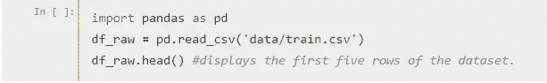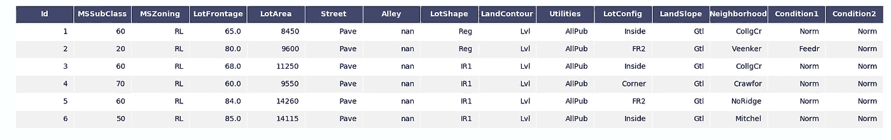

for full image visit [https://i.imgur.com/BEtQD00.png](https://i.imgur.com/BEtQD00.png)

这些列和它们的字段大部分对我们来说没有太大意义，但是 kaggle 已经在竞赛的[数据部分](https://www.kaggle.com/c/house-prices-advanced-regression-techniques/data)为我们提供了一些简要的描述。您可以进一步查找 *data_description.txt* 资源，以获得每一列及其数据字段的详细描述。

# 评估指标

评估指标是 [**RMSLE**](https://stats.stackexchange.com/a/56659) (均方根对数误差)，因此在这种情况下，取因变量(即销售价格)的对数是有意义的。

```
df_raw.SalePrice = np.log(df_raw.SalePrice)
```

# 数据解释

您可能已经注意到,“Alley”列的前六行都是 NaN 值(描述了各行的**缺失数据**)。因此，让我们找出所有要素在整个数据集中缺失值的百分比。

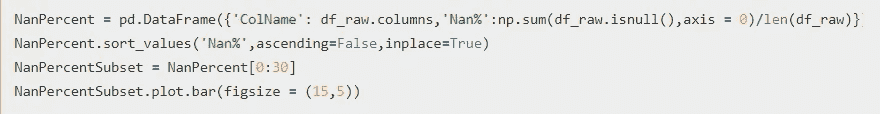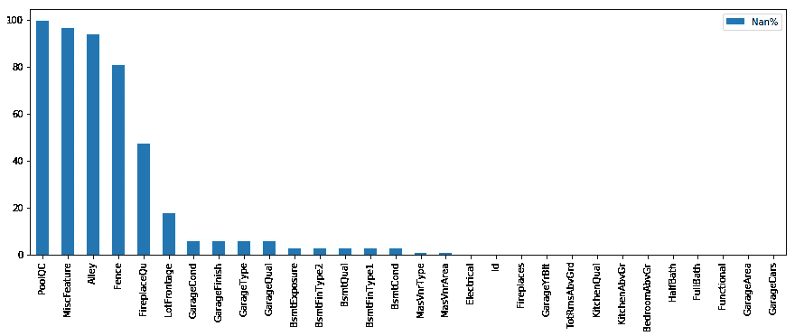

Columns with missing data

我们有 5 个 Nan%大于 50 的特征。这些特征很可能不会为我们提供任何关于数据集的有用信息，因此我们可以考虑现在删除它们，但我们很快就会看到特征的重要性，所以我们现在保留它们，让*随机森林*为我们做出这个*决策*。

# 数据清理

为了将这个数据集提供给随机森林，我们必须将所有非数字数据转换成数字数据。所有非数字数据列代表两种类型的分类数据:

**序数**:类别的顺序很重要。
**名义上的**:顺序不重要的地方。

有两种方法将这些转换成数值:

> **标签编码:** -用整数标签替换类别，范围从 0 到(类别数-1)。它使得分类数据在本质上是有序的。
> 
> **One-Hot encoding:** -将包含分类数据的一列拆分为多列(等于类别数)。数字由 1 和 0 代替，这取决于哪一列有什么值。

有关标签 vs 一键编码的更多信息，您可以访问这篇 [**文章**](https://medium.com/@contactsunny/label-encoder-vs-one-hot-encoder-in-machine-learning-3fc273365621) 。

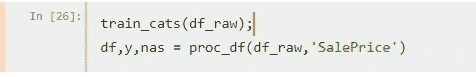

无论如何，大多数列都是有序的，所以我们将对这个数据集使用标签编码(我后来也尝试了一次热编码，它使我的 RMSLE 增加了 0.01)。“*train _ cats”*和“*proc _ df”*取自 Github 上的 [fastai repo](https://github.com/fastai/fastai) 。如果你愿意，你可以查看源代码和文档。

我们还用相应列的中值替换了数字数据列的缺失值，并添加了一个{name}_na 列
，用于指定数据是否缺失。

查看数据时，我发现没有为我们提供房屋的**年龄的特征，所以我添加了这个特征以及另一个给出**总居住面积**的特征。**

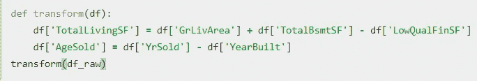

# 分成训练集和验证集

在构建我们的随机森林之前，最后一件事是将我们的数据集分成两部分:训练集和验证集。机器学习中最重要的想法可能是拥有独立的训练和验证数据集。作为动机，假设你没有分割你的数据，而是全部使用。假设你有很多参数:


最右边的模型(蓝色曲线几乎完美地穿过红色点)的图片数据点的误差最低，但这不是最佳选择。这是为什么呢？如果您要收集一些新的数据点，它们很可能更接近中间图表中的曲线。

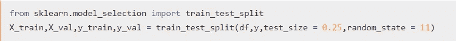

splitting our raw data set to a training and a validation set

这说明了使用我们所有的数据会导致**过度拟合**。验证集有助于诊断这个问题。你的模型在验证集上的分数将代表你的模型在真实世界中，在它从未见过的数据上的表现。所以，验证集只是你的数据集的*子集，它告诉你你的模型有多一般化。*

# 训练模型

我们终于准备好建立随机森林了。我们将使用 [**Parfit**](https://medium.com/mlreview/parfit-hyper-parameter-optimization-77253e7e175e) 来优化我们的超参数。

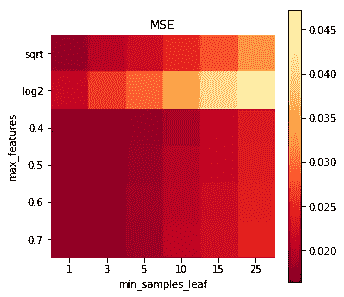

最佳超参数为:
min_samples_leaf : 1，

max_features : 0.4，

使用随机森林的优化参数，我们在验证集上得到的 RMSLE 为 **0.1258** 。

# 可视化随机森林

让我们来看看随机森林中的一棵树(估计值)。

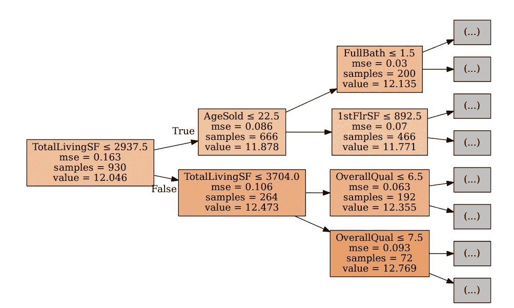

One tree from our forest

这棵树已经被可视化到深度= 2。树的每个节点将我们的数据分成两半，这样 MSE 的加权平均值是最好的。随着我们继续向下，MSE 在减小，因为树基本上在为每个节点寻找**最佳可能分裂点**。
该树首先根据 TotalLivingSf 划分数据，然后分别根据 AgeSold 和 TotalLivingSf 划分其子代，以此类推。
我们的森林中有 **300 个估算者**，我们取所有这些估算者的平均值来进行预测。

# 特征选择

接下来，我们将深入研究要素的重要性，以移除冗余要素，并找出哪些要素负责为我们的数据提供最深入的见解。

函数' *rf_feat_importance'* 将返回一个熊猫数据帧，其中包含列名及其各自的特征重要性。我们使用*‘plot _ fi’*函数绘制一个水平条形图，描述所有列的特性重要性。

```
def rf_feat_importance(m**,** df)**:** return pd.DataFrame({'cols': df.columns,'imp' :
    m.feature_importances_}).sort_values('imp',ascending = False)fi = rf_feat_importance(m,df)def plot_fi(fi):
      return fi.plot('cols', 'imp', 
      'barh' figsize(20,12), legend=False)plot_fi(fi[:50])
```

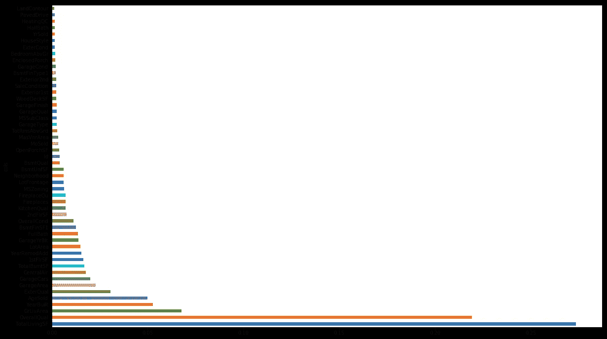

Feature Importance Bar graph.

该图显示，重要性**以指数方式**下降，因此没有必要考虑那些几乎无法洞察我们数据集的特性。我们将删除 imp < 0.005 的所有功能，然后根据新数据重新训练我们的模型，并检查 RMSLE。

```
tokeep = fi[fi.imp >= 0.005].cols
dfToKeep = df[tokeep]X_train,X_val,y_train,y_val = train_test_split(dfToKeep,y,
                              test_size = 0.25,random_state = 11)
m.fit(X_train,y_train)
```

此后的 RMSLE 为 **0.12506** ，比之前的 0.1258 略有提高。特征的数量已经从**的 79 个减少到 25 个**。一般来说，删除冗余列应该不会使情况变得更糟。如果这让 RMSLE 变得更糟，那么它们终究不是多余的。

删除多余的列可能会使我们的模型更好一点。如果你想想这些树是如何建立的，当算法决定在什么上分裂时，它会有更少的事情需要担心。

很有可能用更少的数据创建一个更好的树，但是它不会改变结果太多。这将让我们专注于最重要的功能。

# 基于相关性的特征选择

现在我们将使用 **S** [**pearman 的等级相关系数**](https://en.wikipedia.org/wiki/Spearman%27s_rank_correlation_coefficient) 来找出特征之间的相关性。如果两个特征为我们提供了相同的洞察力，去掉其中一个是明智的，因为它基本上是多余的。这项技术有助于找到多个特征之间的联系。

我们将绘制的东西称为 [***树状图***](https://en.wikipedia.org/wiki/Dendrogram) ，这是一种层次聚类。

```
from scipy.cluster import hierarchy as hc
corr = np.round(scipy.stats.spearmanr(dfToKeep).correlation, 4)
corr_condensed = hc.distance.squareform(1-corr)
z = hc.linkage(corr_condensed, method='average')
fig = plt.figure(figsize=(16,15))
dendrogram = hc.dendrogram(z, labels=dfToKeep.columns, orientation='left', leaf_font_size=16)
plt.show()
```

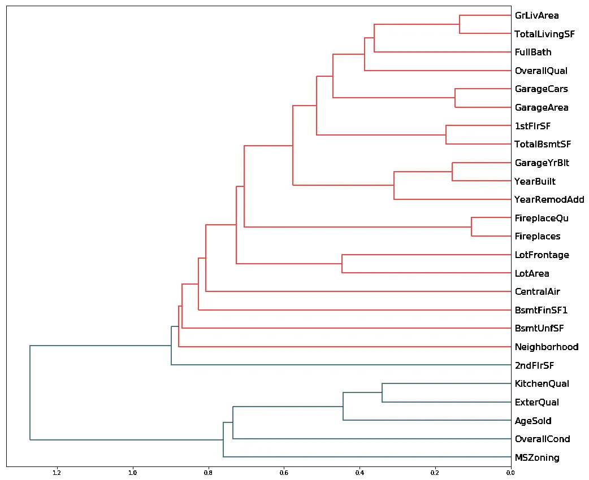

dendrogram showing the correlation between all the features.

两个特征碰撞得越早，它们的相关性就越强。基于此，我们可以看到五对彼此高度相关的特征。

这些是:
1。)GrLivArea 和 TotalLivingSF。
2。)GarageArea 和 GarageCars。
3。)1stFlrSF 和 TotalBsmtSF。
4。)GarageYrBlt 和 YearBuilt。
5。)壁炉 Qu 和壁炉。

每对中的两个特征都为我们提供了相似的洞察力，所以从每对中去掉一个特征是明智的。但是这两者中的哪一个将被删除？让我们找出答案。

现在为了找出(每对中的)两个特征中的哪一个要被移除，首先，我计算了一个基线分数(包括所有的 25 个特征)，然后开始逐一移除这十个特征。在移除每个特征之后，我们将再次计算分数(在重新训练模型之后),并将其与基线进行比较，以查看特定特征的移除如何影响我们的分数。

```
def get_oob(df,y):
    m = RandomForestRegressor(bootstrap=True,
           criterion='mse',max_depth=None,
           max_features=0.4,max_leaf_nodes=None,
           min_impurity_decrease=0.0, min_impurity_split=None,
           min_samples_leaf=1, min_samples_split=2,
           min_weight_fraction_leaf=0.0, 
           n_estimators=300,n_jobs=-1,
           oob_score=False,random_state=11,
           verbose=0,warm_start=False)X_train,X_val,y_train,y_val = train_test_split(df,y,
                     test_size =  0.25,random_state = 11)
    m.fit(X_train, y_train)
    return [rmse(m.predict(X_val),y_val)]get_oob(dfToKeep,y)
```

我们得到的基线分数是 **0.12506** 。

现在，我们将开始删除这 10 个特征，并重新计算分数。
下面代码的每个输出告诉我们在新数据上重新训练模型后的 RMSLE。第一个标记告诉我们被删除的特征(或列),第二个标记告诉我们从数据中删除特定特征后的 RMSLE。

```
for c in ['GrLivArea','TotalLivingSF','1stFlrSF','TotalBsmtSF','GarageYrBlt','YearBuilt','GarageArea','GarageCars','Fireplaces','FireplaceQu']:
    print(c, get_oob(dfToKeep.drop(c, axis=1), y))GrLivArea [0.12407075391075345]
TotalLivingSF [0.12487110485019964]
1stFlrSF [0.12658563342527962]
TotalBsmtSF [0.12518884830074287]
GarageYrBlt [0.12475983278616651]
YearBuilt [0.12672934344370876]
GarageArea [0.12412925519107317]
GarageCars [0.12538764179293327]
Fireplaces [0.1258181905119676]
FireplaceQu [0.12630040930065195]
```

我们可以看到，去掉 GrLivArea、TotalBsmtSF、GarageYrBlt 和 GarageArea 减少了我们的错误。所以，我们可以去掉所有这些多余的特征。

```
to_drop = ['GrLivArea','GarageYrBlt','TotalBsmtSF','GarageArea']
get_oob(dfToKeep.drop(to_drop,axis=1),y)[0.12341214604541835]
```

我们的 RMSLE 在去掉所有冗余特征后，将**从 0.1258 减少到 0.12341** 。

```
dfToKeep.drop(to_drop,inplace=True,axis=1)
len(dfToKeep.columns)21
```

从 79 个特性开始，我们现在只剩下 21 个特性。这是我们的最终模型。
我们现在应该合并我们的训练和验证集，并在这个合并的数据集上重新训练我们的模型。

```
dfTrainAndVal = df[columns]
print(len(dfTrainAndVal.columns))
m.fit(dfTrainAndVal,y)
```

# 提交预测

现在，我们将为测试集生成预测，但在此之前，我们需要对测试集进行类似的转换。

```
df_test = pd.read_csv('data/test.csv')
transform(df_test) # add "ageSold" and "TotalLivingSF" to the set.
train_cats(df_test) 
df_test,_,_ = proc_df(df_test,na_dict = nas)
Id = df_test.Id
df_test = df_test[columns]
ans = np.stack((Id,np.exp(m.predict(df_test))),axis= 1)
```

该模型在 Kaggle 测试集上给我们的分数是 **0.12480** ，这对应于排行榜上 4052 中的**排名 1338，这使我们进入了**前 34 %** 。**

# 结束语

我目前正在学习第二种类型的决策树集成，即 boosting。在这篇文章之后，我将围绕梯度推进回归器而不是随机森林进行实现，看看这如何影响我们的特征重要性和最终得分。

任何意见和建议将不胜感激。

我要感谢[](https://medium.com/@jeremyphoward)**和 [**雷切尔·托马斯**](https://medium.com/@racheltho)**；制作这些非凡的网络公开课。我会推荐大家去看看 [fast.ai](http://www.fast.ai/) ，他们也有深度学习和计算线性代数以及机器学习的课程。****