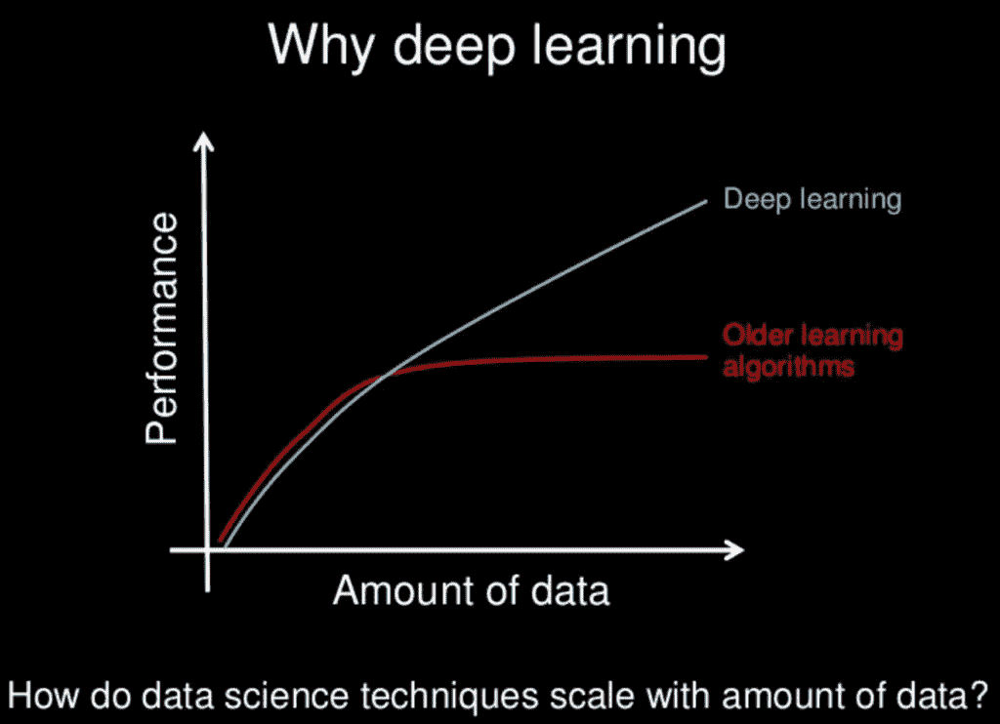
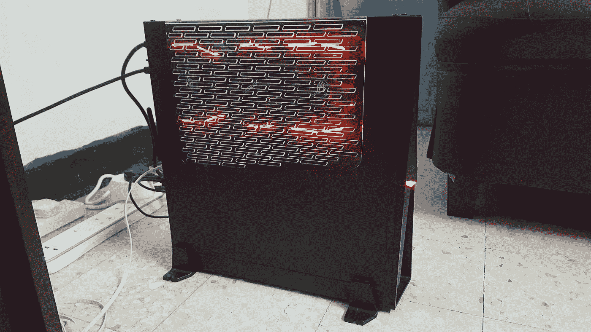
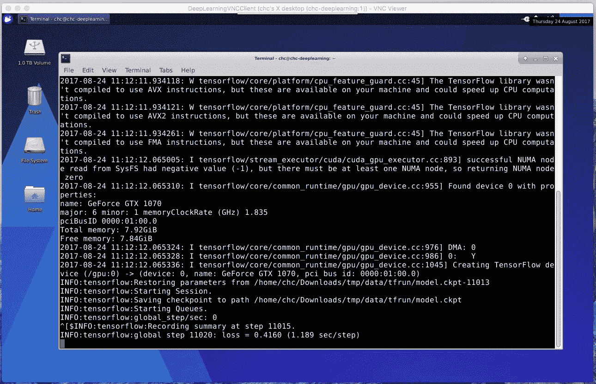
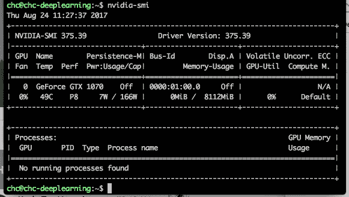
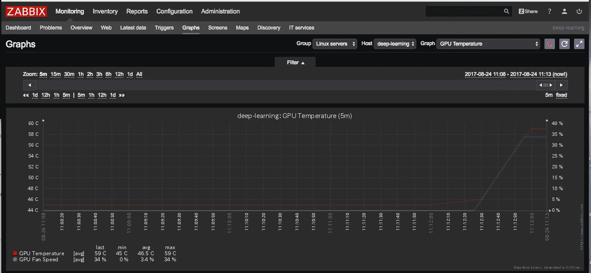
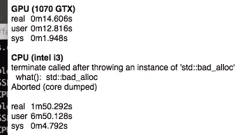

# 我与 Udacity 和 Coursera 进行深度学习冒险的第一步

> 原文：<https://towardsdatascience.com/my-first-step-for-deep-learning-adventure-with-udacity-and-coursera-ee135042ac1e?source=collection_archive---------8----------------------->

[为什么是深度学习——吴恩达](https://www.slideshare.net/ExtractConf)，他对为什么深度学习正在兴起的解释可以用下图来总结。



在报名参加来自 [Udacity](https://www.udacity.com/course/deep-learning-nanodegree-foundation--nd101) 和 [Coursera](https://www.coursera.org/specializations/deep-learning) 的在线深度学习课程之前，我决定在家里构建自己的 GPU 实例。Udacity 向亚马逊 AWS 提供 100 美元信用来剥离 GPU 实例，而 Coursera 没有。在花费之前拥有用于训练模型的内部 GPU 实例总是好的💰在云上。我用的 GPU 是[英伟达 GTX 1070](https://www.nvidia.com/en-us/geforce/products/10series/geforce-gtx-1070/)

我把这些部件[用于我自己的 CPU 实例，下面是结果。](https://pcpartpicker.com/list/Dwcpcc)



花费大部分时间💸在 GPU 上而不是 CPU 上。

我正在使用 [Xbuntu](https://xubuntu.org/) [17.04](https://xubuntu.org/getxubuntu/) 但它可能太前沿了，但我猜尝试更多最新的内核没有坏处。

在设置以下内容之前，我做了标准的路由器设置来启用我的 gpu 实例的 SSH 和 https，并使用 [letsencrypt](https://letsencrypt.org/getting-started/) 通过 SSL 证书保护它。除此之外，我使用 NGINX 作为网络服务器。

# 日常活动的 SSH 设置

1.  安装 ssh 服务器

```
sudo apt-get install openssh-server
```

2.配置无密码登录

在本地 PC 上生成一个 SSH 密钥，在这个上有一个来自数字海洋的优秀的[教程](https://www.digitalocean.com/community/tutorials/how-to-use-ssh-keys-with-digitalocean-droplets)

完成后，我们需要通过以下方式将我们的公钥添加到我们的登录名中

```
cat ~/.ssh/id_rsa.pub | ssh [login]@[your.ip.address.here] "cat >> ~/.ssh/authorized_keys"
```

然后编辑/etc/ssh/sshd_config，这将强制只使用密钥登录，从而更加安全

```
# To disable tunneled clear text passwords, change to no here!
#PasswordAuthentication yes
#PermitEmptyPasswords no
PasswordAuthentication no
```

除此之外，我们还需要在/etc/ssh/sshd_config 中添加 X11Forwarding，如果我们希望在本地显示 X11，稍后会用到它

```
Match User [login]
        X11Forwarding yes
        AllowTcpForwarding yes
        X11DisplayOffset 10
```

重启 SSH 服务器

```
sudo systemctl restart sshd
```

最后，我们可以不用输入密码就可以登录，这对于稍后为 VNC 创建 SSH 隧道的下一个设置非常重要

# 运行长期运行流程的 VNC 设置

Digital Ocean 有一个关于使用 xfce4 设置 VNC 的极好的教程,这就是为什么我选择使用 Xbuntu 发行版，它没有额外的软件包。这就是我们可以进行长期训练的环境



# Anaconda 设置准备编码环境

在我们安装 anaconda 之前，我们需要在我们的服务器上安装 nvidia 驱动程序、CUDA 和 cuDNN。这个来自 [floydhub](https://github.com/floydhub/dl-setup) 的指南非常有用，但仍然适用于 Xbuntu 17.04 版本。一旦一切就绪，我们就可以使用命令进行验证

```
nvidia-smi
```

它应该看起来像这样



Udacity 对建立[蟒蛇](https://www.continuum.io/downloads)环境有很好的介绍。我发现在培训/开发期间维护 tensorflow gpu 和 tensorflow cpu 环境进行比较非常有用

# 用于监控 GPU 的 Zabbix 设置

我正在使用 [zabbix](https://www.zabbix.com/) 来监控 GPU，并为此使用了优秀的数字海洋[教程](https://www.digitalocean.com/community/tutorials/how-to-install-and-configure-zabbix-to-securely-monitor-remote-servers-on-ubuntu-16-04)。

一旦 zabbix 被相应地安装和配置，我们就可以为 zabbix 获得 Nvidia 模板。有了它，我们可以在利用率方面(温度、风扇和处理)密切关注我们 GPU



最后，使用来自 Udacity 简介的 [style-transfer](https://github.com/lengstrom/fast-style-transfer) 和以下命令比较了 GPU 和 CPU 的一些统计数据:-

```
time python evaluate.py — checkpoint ./rain-princess.ckpt — in-path lesu-0596.jpg — out-path lesu-0596-style.jpg
```



GPU vs CPU

我的图像分辨率是 4242 × 2828，大约是 7.9MB 的文件大小，有趣的是看到 [tensorflow](https://www.tensorflow.org/) CPU 与 GPU 相比有一个核心转储。我还注意到有一个巨大的速度提升，我猜这就是深度学习所依赖的，用 GPU 进行实验和获得反馈的速度！关于内部部署与云比较的更多详细信息[请点击此处](https://medium.com/towards-data-science/on-premise-diy-vs-cloud-gpu-d5280320d53d)