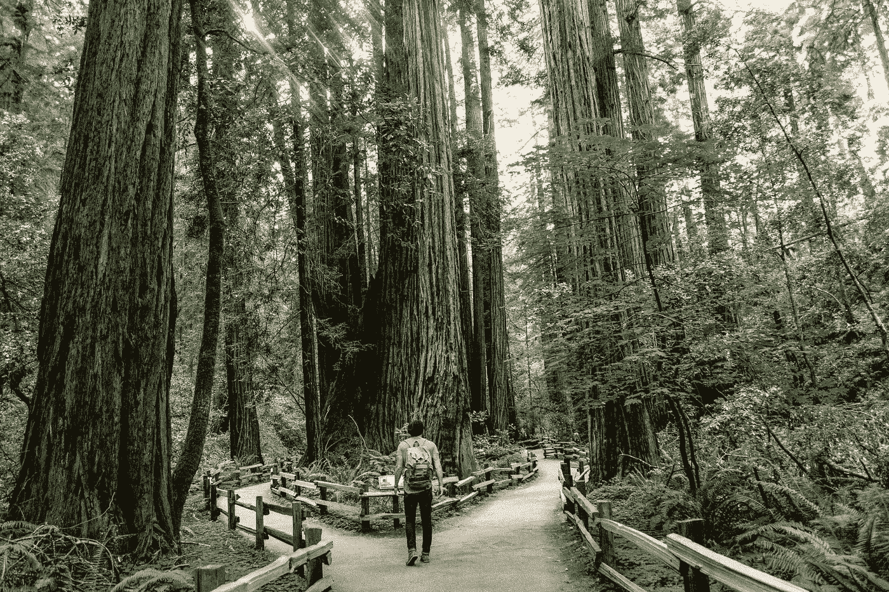
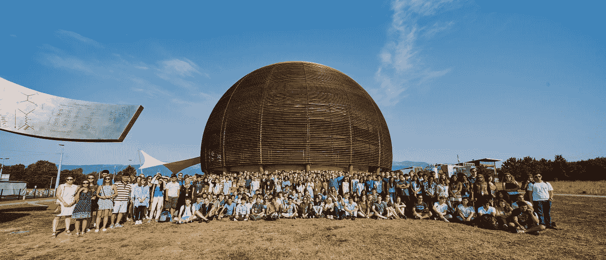
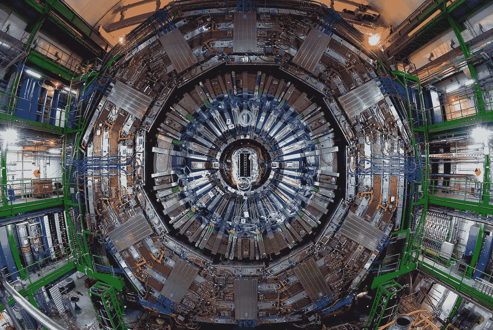
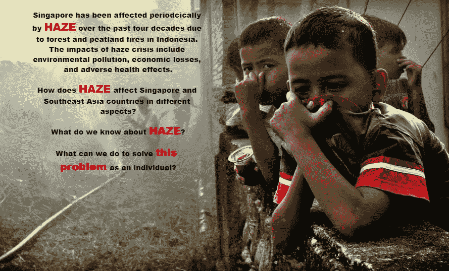
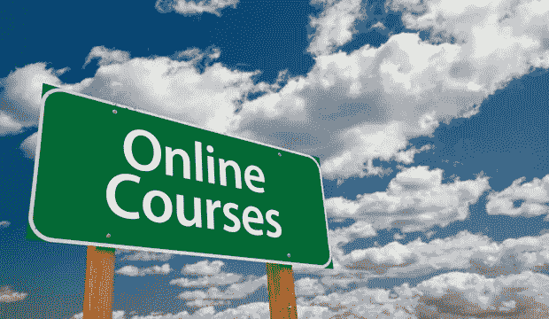
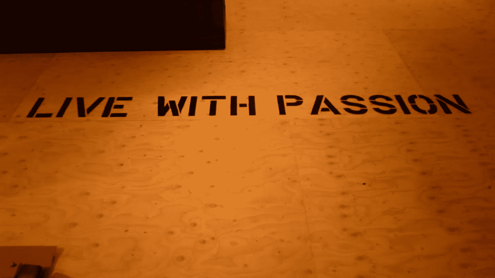

# 我从物理学到数据科学的旅程

> 原文：<https://towardsdatascience.com/my-journey-from-physics-into-data-science-5d578d0f9aa6?source=collection_archive---------1----------------------->

随着我对数据科学领域的热情不断增长，我每天都在学习新知识。作为一名即将毕业的物理系学生，要追求不同的职业轨迹，必须要回答**‘为什么’**和**‘如何’**个问题。被许多人问到我从学术界——物理学到数据科学的转变，我希望我的故事可以回答关于**为什么我决定成为一名数据科学家**和**我如何追求目标**的问题，并最终**鼓励和激励更多的人追求他们的激情**。我们开始吧！

# 这一切都始于在欧洲核子研究中心的暑期学生生活

*CERN Summer Student Programme 2017*

欧洲粒子物理研究所暑期学生项目为物理、计算和工程专业的本科生提供了千载难逢的机会，让他们在瑞士日内瓦的欧洲粒子物理研究所与多文化团队中的顶尖科学家一起参与他们的研究项目。

2017 年 6 月，我非常幸运地被接受加入该计划。我简直欣喜若狂，因为粒子物理一直是我的研究兴趣，能够在欧洲粒子物理研究所进行研究对我来说简直是梦想成真的经历！在 2 个月的实习期间，我通过全球 LHC 计算网格&云计算为[小型μ介子螺线管(CMS)](https://home.cern/about/experiments/cms) 实验做了一些**万亿字节数据的事件重构的分析和模拟。**

Compact Muon Solenoid (CMS) in the cavern

此外，暑期学生还参加了一系列讲座、研讨会，并参观了欧洲粒子物理研究所的设施，涵盖了理论和实验粒子物理以及 ***计算*领域的广泛主题。**

在此期间，我通过讲座、研讨会甚至我的项目本身接触到了机器学习和大数据分析。这些机器学习技术如何在如此庞大的数据量下以非凡的精度分类和检测各种微观粒子，这让我特别震惊。百思不得其解，我毫不犹豫地深入研究了机器学习和云计算主题，仅仅是因为我热爱它！

> 谁会想到这次曝光会成为我人生的转折点。是的，我用数据找到了我的婚姻。

然而，尽管我渴望学习这些主题，我仍然对数据科学有模糊的概念。虽然听起来很模糊，但我知道在发现我的 ***真正的激情*** 后，我必须发现更多。

# 深入研究数据科学领域

当我结束实习回到新加坡后，我做了一些研究来了解更多关于数据科学的知识，令我惊讶的是，这个领域并没有一个明确的定义。但总的来说， [**数据科学**](https://www.kdnuggets.com/2016/10/battle-data-science-venn-diagrams.html) 可以概括为**编程技能、数学统计知识、领域知识**的结合。这里的解释绝不是详尽的，而是为了从总体上阐明这个定义(欢迎任何评论！😄).

尽管如此，我对数据如何被用来产生洞察力和推动公司的商业价值感到惊讶。从了解业务问题，到收集和可视化数据，直到原型制作、微调和将模型部署到现实世界应用程序的阶段，我发现了利用数据解决复杂问题的挑战的成就感。渐渐地，我的激情开始形成…

> “没有数据，你只是另一个有观点的人”
> 
> 爱德华·戴明

# 我的起点—数据可视化

[Tableau Dashboard](https://public.tableau.com/profile/lee.kin.lim#!/vizhome/Haze/Storyline)

2017 年 8 月，作为迈向数据科学的第一步，我参加了由 Tableau 和 Infocomm Media Development Authority(IMDA)共同举办的 [**NIC Face-Off 数据竞赛**](https://public.tableau.com/en-us/s/2017-nic-face-community-driven-data-stories-competition) ，这是我第一次接触数据可视化。

这次经历让我有机会使用 **Tableau Public** 可视化各种调查东南亚雾霾起源的公开数据源，以提供可操作的见解。我很高兴能与您分享简单的 [Tableau 仪表盘](https://public.tableau.com/views/Haze/Storyline?:embed=y&:display_count=yes\)(欢迎在下面留下您的评论！).

# 我在 [SMRT](https://smrt.com.sg/) 的第一份兼职数据分析实习

同月，我偶然发现了一个机会，在 SMRT 种子基金资助的初创公司 mobilityX 做兼职数据分析实习生。我使用 **Python** 进行编码主要是因为它的高级编程语言、可读性和广泛的社区支持。

> 老实说，当我在大学第一年开始学习编程时，我真的想过放弃编码。运行一个简单的 for 循环可能会让我挂几天(甚至几周！).更糟糕的是，“我就是没有天赋”的消极想法给了我沉重的打击…

我对编程的兴趣始于我在第三年学习期间与我系里的一位教授一起着手一个研究项目，该项目要求开发数据分析工具。正如你可能已经预料到的，我开始拿起 Python 来构建工具，并且我爱上了它！

我告诉自己——“***我就是没有天赋*** ”的日子一去不复返了，取而代之的是以下学习编程的步骤(至少对我来说):

1.  **理解编程的基本逻辑**
2.  选择一种编程语言，并学习如何使用它(语法等。)
3.  **练习，练习，练习**
4.  **重复步骤 1–3**

## 抱歉，在写作的时候，我太激动了，无法与你分享我的学习之路…

兼职实习持续到 2018 年 3 月，学习之旅卓有成效。我使用 PostgreSQL 和 Python 学习并执行了数据清理和操作、web 抓取和数据提取。

# 我提前一个学期毕业去做数据科学实习

所有之前的经历进一步增强了我的热情，并为数据科学奠定了基础。下定决心，我计划了我的学习时间表，并设法提前毕业，于 2017 年 12 月在[量子发明](http://www.quantuminventions.com/)从事我目前的全职数据科学实习。

在这个阶段，你可能会问——为什么我去实习而不是全职的数据科学职位？**简而言之**是——在申请全职工作之前，通过处理真实世界的数据，获得更多的技术接触，并从零开始体验数据科学流的完整周期。

这是我真正的数据科学之旅开始的整个故事的核心部分。下面的列表简要总结了我在许多伟人和不同在线资源的帮助下的学习之路。

# 1.教科书

我读的第一本教科书是[统计学习导论——R](https://www.amazon.com/Introduction-Statistical-Learning-Applications-Statistics/dp/1461471370/ref=as_li_ss_tl?ie=UTF8&linkCode=ll1&tag=admond-20&linkId=56cae79615eac13a2d8a774becc37513)中的应用。我向初学者强烈推荐这本教科书，因为这本书侧重于统计建模和机器学习的基本概念，并附有详细而直观的解释。如果你是一个数学铁杆，你会喜欢这本书:[统计学习的要素](https://www.amazon.com/Elements-Statistical-Learning-Prediction-Statistics-ebook/dp/B00475AS2E/ref=as_li_ss_tl?keywords=The+Elements+of+Statistical+Learning&qid=1540663930&s=Books&sr=1-1&ref=sr_1_1&linkCode=ll1&tag=admond-20&linkId=5e253b43464e49b4d4a6379b8c45f8ec)。

其他值得一提的教材有[绝对初学者的机器学习](https://www.amazon.com/Machine-Learning-Absolute-Beginners-Introduction-ebook/dp/B07335JNW1/ref=as_li_ss_tl?keywords=Machine+Learning+for+Absolute+Beginners&qid=1540663964&s=Kindle+Store&sr=1-3&ref=sr_1_3&linkCode=ll1&tag=admond-20&linkId=3d87be630161f81f099e6e044b11e25f)、Sebastian Raschka 的 [Python 机器学习](https://www.amazon.com/Python-Machine-Learning-scikit-learn-TensorFlow-ebook/dp/B0742K7HYF/ref=as_li_ss_tl?keywords=Python+Machine+Learning&qid=1540663991&s=Kindle+Store&sr=1-3&ref=sr_1_3&linkCode=ll1&tag=admond-20&linkId=ea1b45a87fddeb911f15aae01c273ca2)和 Jake VanderPlas 的 [Python 数据科学手册](https://www.amazon.com/Python-Data-Science-Handbook-Essential-ebook/dp/B01N2JT3ST/ref=as_li_ss_tl?keywords=Python+Data+Science+Handbook&qid=1540664022&s=Kindle+Store&sr=1-3&ref=sr_1_3&linkCode=ll1&tag=admond-20&linkId=5fc00a8547524626d4bf9cdd731c3788)。

# 2.在线课程

Coursera。[**Coursera 联合创始人吴恩达教授的机器学习**](https://click.linksynergy.com/deeplink?id=zeF/0G0dYHo&mid=40328&murl=https%3A%2F%2Fwww.coursera.org%2Flearn%2Fmachine-learning) 。我一直着迷于他将复杂的概念分解成简单的学习信息的能力。为期 11 周的课程重点关注监督学习、非监督学习和机器学习的最佳实践，以及在现实世界中的实际应用。我有时仍然会参考课堂笔记，以解决建立机器学习模型时的欠拟合或过拟合问题。

Udemy。 [**何塞·波尔蒂利亚教授的数据科学与机器学习训练营**](https://click.linksynergy.com/deeplink?id=zeF/0G0dYHo&mid=39197&murl=https%3A%2F%2Fwww.udemy.com%2Fpython-for-data-science-and-machine-learning-bootcamp%2F)Python。本课程从讲授 Python 的基础知识开始，逐步指导您如何使用 scikit-learn 和 tensorflow 实现各种机器学习和深度学习代码。这个课程让我对 Python 中实现机器学习模型的各种可用库有了一个很好的概述。另外，我强烈推荐我个人最喜欢的课程: [**深度学习 A-Z:基里尔·叶列缅科和哈德林·德·庞特维斯教授的动手操作人工神经网络**](https://click.linksynergy.com/deeplink?id=zeF/0G0dYHo&mid=39197&murl=https%3A%2F%2Fwww.udemy.com%2Fdeeplearning%2F) 。这是我第一次接触深度学习，相信我，他们的课程真的是独一无二的，非常强调本能的理解水平，有监督和无监督深度学习的动手编码教程。

琳达。 [**Python 对于数据科学的基本训练**](https://www.lynda.com/Python-tutorials/Python-Data-Science-Essential-Training/520233-2.html) 由 Lillian Pierson 教授。本课程讲授数据管理和数据可视化以及其他统计分析的基础知识。

# 3.商务化人际关系网

好吧。你对数据科学/分析领域感兴趣？如果你没有 LinkedIn 账户，那就创建一个。

LinkedIn 是一个强大的平台，拥有紧密联系的数据科学社区。分享学习的环境简直令人惊奇，人们愿意分享他们的经验、思想和知识来帮助他人。事实上，LinkedIn 是我学习最多的地方，无论是技术知识、职业建议等等。受到启发，我现在开始通过在我的 LinkedIn 上分享我的想法和经历来回馈社区。😃

一些数据科学家甚至聚在一起开展每周一次的网络研讨会— [**数据科学办公时间**](https://www.youtube.com/channel/UC5c7r0SlnNmPfqxEyni71FA) ，讨论数据科学的基础知识并发表见解(数据准备、特征提取、数据可视化等)。).一定要去看看！

# 4.其他资源

大多数数据科学领域的初学者经常被浩瀚的资源淹没(像我一样)，人们可能会对选择哪一个感到困惑。我在 LinkedIn 上的一个朋友 Randy Lao 分享了一个非常全面的数据科学资源列表，这些资源会定期更新。

我认为有用的其他学习平台或资源包括:面向数据科学的**[**Quora**](https://www.quora.com/)[**DZone**](https://dzone.com/)[**KD nuggets**](https://www.kdnuggets.com/)[**Analytics vid hya**](https://www.analyticsvidhya.com/)[**DataTau**](http://www.datatau.com/news)**

# ****建立投资组合****

********

****有一个文件夹来展示你的经验和能力，特别是当[你没有成为数据科学家的博士学位的时候。](https://www.quora.com/How-do-I-become-a-data-scientist-without-a-PhD)****

****由于我拥有物理学学士学位，没有任何计算机科学学位，我在大学的前三年也没有任何相关的接触，所以除了从 MOOCs 学习广度主题之外，建立我的投资组合是必要的。这很重要，因为归根结底，公司想知道你学到了什么，以及你如何为他们的业务做出贡献和增加价值。****

****这也是我一边杂耍兼职实习，一边向 MOOCs 学习的原因之一。此外，我也是数据组织的志愿者，通过帮助其他非政府组织解决他们的问题来最大化社会影响。****

****我一直想参加 Kaggle 比赛，不久前，我有机会和我的朋友在 Kaggle 上参加了由 Shopee 和工程技术学院(IET)组织的[机器学习挑战赛](https://www.kaggle.com/c/shopee-iet-machine-learning-competition)。我真的很感激成为这个团队的一员，我确实从他们身上学到了很多。一定要查看一下他们的简介——[**【低伟鸿】**](https://www.linkedin.com/in/lowweihong/)**[**钟可欣**](https://www.linkedin.com/in/kexinchong/)****凌薇** ！********

****这是我第一次参加 Kaggle 比赛，学习如何使用卷积神经网络(CNN)和转移学习进行**图像识别**。学习曲线很陡，但这个过程绝对是值得的！期待在下一篇文章中与你分享更多关于我们比赛的项目！****

****如果时间允许，我也希望在我未来的帖子中与大家分享我的一些实习项目，代码将上传到 [GitHub](https://github.com/admond1994) 上。****

# ****最后的想法…****

********

> ****选择一份你热爱的工作，你这辈子一天都不用工作****

****目前就这些。我希望我确实给数据科学行业带来了一些启示，并使对数据科学的学习不那么可怕，而是更有趣、更平易近人！我从来没有发现“ ***我学得越多，我就越需要学习*** ”的感觉，直到我遇到了给我挑战和成就感的数据科学。****

****我希望通过记录我的学习旅程，这篇文章可以在某种程度上激励你去追求你的激情，尽管有挑战和困难的环境。****

****感谢你阅读这篇文章。这是我的第一篇文章，如果您能留下您的反馈和意见，告诉我如何进一步改进内容，我将不胜感激。我将在未来创造更多关于我的经历和项目的帖子。****

****如果您有任何问题，请添加我，我们在 [LinkedIn](https://www.linkedin.com/in/admond1994/) 上聊天，或者访问我的[个人网站](http://admond1994.strikingly.com/)了解更多信息:****

## ****关于作者****

****[**Admond Lee**](https://www.linkedin.com/in/admond1994/) 目前是东南亚排名第一的商业银行 API 平台[**Staq**](https://www.trystaq.com)**—**的联合创始人/首席技术官。****

****想要获得免费的每周数据科学和创业见解吗？****

****你可以在 [LinkedIn](https://www.linkedin.com/in/admond1994/) 、 [Medium](https://medium.com/@admond1994) 、 [Twitter](https://twitter.com/admond1994) 、[脸书](https://www.facebook.com/admond1994)上和他联系。****

**** [## 阿德蒙德·李

### 让每个人都能接触到数据科学。Admond 正在通过先进的社交分析和机器学习，利用可操作的见解帮助公司和数字营销机构实现营销投资回报。

www.admondlee.com](https://www.admondlee.com/)****