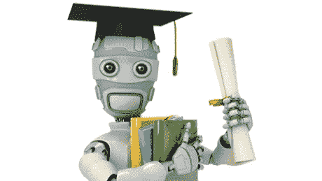

# 我的数据科学之旅

> 原文：<https://towardsdatascience.com/my-journey-into-data-science-ac1d2e09ed03?source=collection_archive---------4----------------------->

## 欢迎来到我的博客！

在这里，我将发布一些我一直在从事的数据科学和机器学习项目。写这个博客的主要动机是，我很快就要开始快速人工智能深度学习课程了。在讲课的同时写博客对我来说似乎是一个很好的机会，让我可以真正接触到材料，并结识其他学生。首先，让我简单介绍一下我进入数据科学之旅的背景。

大约一年前，我开始写我的工商管理硕士论文。除了这个硕士学位，我还开设了第二个营销传播硕士学位。此时，我已经完成了所有的课程，最后不得不开始写这两篇我一直拖延的硕士论文。我的学士学位论文的出发点是音乐行业的社交媒体策略。我在界定研究范围方面遇到了一些问题，也不太确定我到底想研究什么，直到我看到一篇改变了我论文方向的论文。

那篇论文是 Asur 和胡伯尔曼(2010)的《用社交媒体预测未来》。作者使用了一个简单的线性回归模型，其中包含推文数量和情绪的时间序列(以及电影播放的影院数量)。有了这个简单的模型，他们能够比好莱坞证券交易所更准确地预测电影在第一个周末的票房收入。我发现对 Twitter 数据的简单分析具有如此强大的预测能力，这非常令人着迷。读完这篇论文后，我终于有了研究的方向:社交媒体的预测能力。

Entering the Data Science journey

我很快意识到我需要更复杂的工具来执行分析，尤其是我想要做的情感分析。我的导师建议我去见一位计算机科学老师，所以我去了。然后这位老师问我最喜欢的语言是什么…我回答是英语。是的……这可能是你能给这个问题的最痛苦的答案了。虽然回过头来看我可以嘲笑它。这个例子显示了我是多么的无知。我不知道我要面对的是什么。

在接下来的对话中，这位老师给了我一种非常消极和批判的感觉。他显然认为我永远不会编程，更不用说做我的 Twitter 分析了。我总是被那些认为我做不到的人激励着，这次也不例外。我在 R 里面找到了一个做情感分析的包，于是，我做了我该做的事情:我开始学习 R，让我惊讶的是(当时)我认识的计算机专业的学生都没有和 R 一起工作过，我找到了一个有 R 课程的网站，开始尝试。这个网站是 DataCamp，如果你想学习数据科学的 R 或 Python，这是一个非常棒的平台。令我自己惊讶的是，我对编程的喜爱远远超过了我的预期。更令人惊讶的是，我有这方面的天赋！

接下来的几周，我花了很多业余时间参加 DataCamp 的课程，为论文的数据分析部分做准备。在编程、导入、清理、可视化和统计课程之后，我觉得自己已经准备好了。在我哥哥的帮助下，我们建立了 Twitter 流媒体 API，并开始在 MySQL 数据库中收集推文。当然，与课程中呈现给你的数据集相比，在使用“真实”数据集时，你会遇到许多问题。因此，这篇论文成为我的第一个数据科学项目，也是一次非常宝贵的学习经历。去年 12 月，我完成了这项研究。这是最后一篇硕士论文的链接(我可能也会写一篇关于这项研究的博客):[http://essay.utwente.nl/71482/](http://essay.utwente.nl/71482/)

这项研究的重点是使用 Twitter 来预测 Spotify 新发布专辑的流量。我的一位老师在一次会议上认识了 Spotify 的一位大数据工程师(目前是 Spotify 的数据工程总监)。他非常友好地询问了多名 Spotify 员工的反馈，我收到了来自 Spotify 的巨大回应！这些机会是你除了万分感激之外什么都不能争取的。这只发生在我的第一个数据科学项目之后！不幸的是，我还不能在 Spotify 开始工作，因为我还必须为我的另一项研究写第二篇硕士论文。我决定将这篇硕士论文与我目前正在做的毕业实习结合起来。

在写第一篇硕士论文期间和之后，我参加了更多的在线课程，我想提供一些概述。也许他们可以给其他一些有抱负的数据科学家一些启发。我在第一篇论文中遇到的主要问题之一是无法使用机器学习算法。我一直在阅读他们如何在情感分析上比“词典”方法表现得更好，但我还没准备好使用它们。这为我的数据科学之旅提供了下一步:机器学习！以下是我参加过的数据科学/机器学习课程的概述:

**机器学习** (Coursera —斯坦福大学)【https://www.coursera.org/learn/machine-learning】T4

每个人都会向你推荐的机器学习入门课程。这门课的确很棒，它对主要的最大似然算法及其背后的数学原理提供了很好的概述。对我来说，唯一的缺点是在练习中使用了 Octave/MATLAB。

**用于数据科学和机器学习的 Python**(Udemy)[https://www . Udemy . com/Python-for-Data-Science-and-Machine-Learning-boot camp/learn/v4/overview](https://www.udemy.com/python-for-data-science-and-machine-learning-bootcamp/learn/v4/overview)

真正让我开始接触 Python 的课程。非常清晰地解释了数据科学和机器学习的不同概念。本课程将使您掌握流行的用于机器学习的 scikit-learn 库。还包括对 Spark 和 TensorFlow 的介绍。

**完成 SQL boot camp**(Udemy)[https://www . Udemy . com/the-Complete-SQL-boot camp/learn/v4/overview](https://www.udemy.com/the-complete-sql-bootcamp/learn/v4/overview)

一个数据科学家需要有更多的工具，而不仅仅是 R 和 Python 编程。SQL 是另一种重要的语言，您将经常使用它与数据库进行交互。这门课程帮助我获得了目前的实习机会，并在两天内教会了我所有需要了解的 SQL 知识。

**Tableau**(Udemy)[https://www.udemy.com/mastertableau/learn/v4/overview](https://www.udemy.com/mastertableau/learn/v4/overview)

Tableau 是另一个你会经常在数据科学相关的职位空缺中看到的工具。它与我习惯的编程语言非常不同，而是使用拖放界面。Tableau 非常适合可视化您的数据和构建交互式仪表板。

数据营(www.datacamp.com)

DataCamp 提供 4-6 小时的短期课程。这些课程以简短的解释视频为特色，之后你将通过练习应用视频中的原则。DataCamp 的伟大之处在于一切都发生在你的浏览器中，所以你不需要安装任何东西。这使得 DataCamp 成为 R 和 Python 编程的完美入门。当我开始使用 DataCamp 时，他们几乎只提供 R 课程，但他们一直在以非常高的速度增加 Python 课程。以下是我在 DataCamp 上完成的所有课程的概述。

**R 课程(共 15 门)**:

*   R 简介
*   中级 R +中级 R 实践
*   用 R 编写函数
*   将数据导入 R
*   正在清除 R 中的数据
*   用 dplyr 实现 R 中的数据操作
*   使用 ggplot2 实现数据可视化
*   统计学导论:导论，学生的 T 检验和方差分析
*   用 R Markdown 报告
*   机器学习导论
*   文本挖掘:词汇袋
*   使用 RStudio IDE

**Python 课程:**

*   面向数据科学的 Python 简介
*   面向数据科学的中级 Python
*   Python 数据科学工具箱
*   Python 中的深度学习

最后，我非常兴奋即将开始深度学习的快速人工智能课程([http://course.fast.ai/index.html](http://course.fast.ai/index.html))。本课程最初是在旧金山大学数据研究所开设的。令人欣慰的是，作者们也非常好心地创建了该课程的 MOOC 版本。深度学习一直在现有数据集上不断突破其他 ML 算法的性能天花板。对于像图像识别、语音识别、自然语言处理和时间序列预测这样的任务，我已经迫不及待地开始深度学习了！

希望我的故事也能给其他人最后一次推动，让他们去研究数据科学。你目前所学的或者你是否有“阿尔法”背景并不能决定你能走多远。我花了四年多的时间在我的大学里学习，最终找到了我真正受到启发的东西。MOOCs 和不同的在线资源提供了学习和使用它们的绝佳机会！如果你努力工作，并愿意为此付出时间，你就能取得伟大的成就。数据科学需要大量的实践和拥有许多不同技能的大型工具集。你什么都不做是不会掌握这些的。然而，如果你想得到它，你应该全力以赴，永远不要因为你“需要一个计算机科学学位”而让自己止步不前！

好了，今天对我来说这是足够的鼓舞人心的谈话。不要害怕关注我或给我发消息。回头见:)

*你也可以在这里找到我:*

领英:【www.linkedin.com/in/rutger-ruizendaal 

# 【2017 年 9 月更新

这里有一个快速更新:我现在已经结束了我的实习，我的第二个硕士毕业了！10 月份，我将开始成为一名数据科学家。终于有了正式的‘头衔’感觉太棒了。有趣的是，作为一名数据科学家，我现在已经获得了工商管理和通信研究两个硕士学位。你真的永远不知道生活会带你去哪里。我也完成了 fast.ai 深度学习课程的第 1 部分。第 2 部分最近已经上传，我迫不及待地想开始了:)

**参考文献**

阿苏尔和胡伯尔曼，文学学士(2010 年 8 月)。用社交媒体预测未来。在*Web Intelligence and Intelligent Agent Technology(WI-IAT)，2010 IEEE/WIC/ACM 国际会议上* (Vol. 1，PP . 492–499)。IEEE。