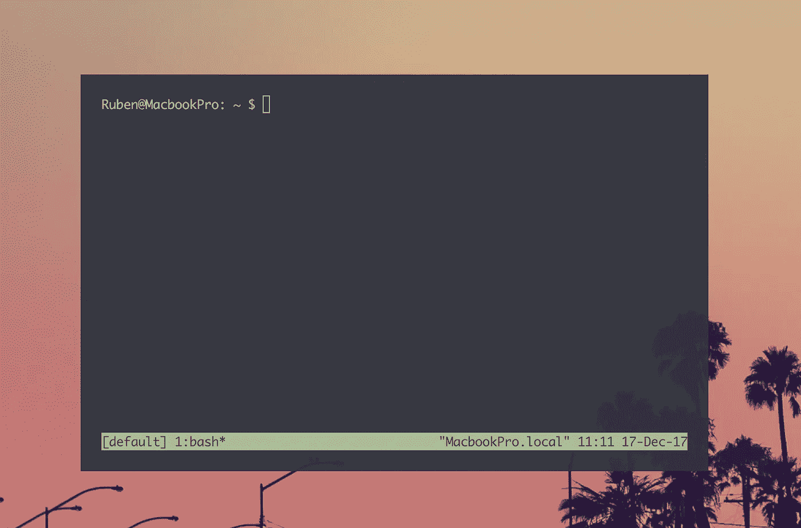
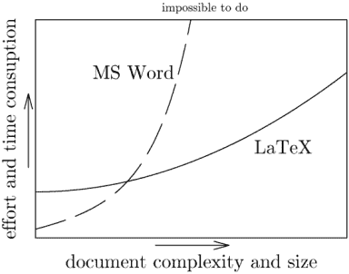

# 我的数据科学和生物信息学之旅—第 1 部分:编程

> 原文：<https://towardsdatascience.com/my-journey-into-data-science-and-bio-informatics-749ece4d8860?source=collection_archive---------2----------------------->

> "算法是新药，医生是新技术的处方者." *—* [*休·哈维，放射科医师*](https://towardsdatascience.com/@DrHughHarvey?source=post_header_lockup)

根据 IBM 的调查，每天产生 250 万兆字节(10 ⁸)的数据(平均每台电脑只能容纳 1 兆字节)。现有数据的 90%是在过去两年中生成的。此外，预计这一增长将继续加速。这导致了数据处理和解释滞后的瓶颈。面临这些问题的不仅仅是推特、脸书、谷歌和网飞。生物医学、生物学、物理学、制药……也面临这个问题。

为了进一步说明这个问题，单个全基因组测序的大小可能是数百千兆字节(外显子组和 RNA 大约是 100 千兆字节)。小 100 倍)。处理如此大量的数据需要一套特定的技能。这就是生物信息学的用武之地。

# 背景

整整一年前，我从未执行过一行代码。因此，我绝不是数据科学家或生物信息学专家，但我也不是一个完全的初学者。

去年我在做关于全基因组测序的硕士论文时熟悉了数据科学和生物信息学，突然面临一个问题:我必须打开一个 3 300 000 行 40 列的. csv(逗号分隔值)文件。不用说，Excel 过得并不愉快。在尝试使用 Excel 或其他程序但毫无结果之后，我意识到我必须使用命令行，这是我从其他领域的朋友那里听说的。从那以后，事情自然就演变到了我今天的位置。

我学到的几乎所有东西都要感谢朋友、同事和导师建议的探索主题。实际的学习是通过辅导课、博客帖子、互联网上的大规模开放在线课程(MOOCs)的帮助，或者通过谷歌搜索我遇到的具体问题，因为我没有时间获得额外的硕士学位。

但我面临的问题是，几乎每个主题都有数百门课程。这将是一篇由 2 或 3 部分组成的博客，第一部分是关于编程的，侧重于资源和我参加的推荐课程(免费或以很低的价格)，考虑的是绝对的初学者。第二部分将更加面向生物信息学(DNA 和 RNA 测序)，重点是关键的期刊文章，但也有其他在线资源和常用工具。

# Bash 和 Linux

# 安装 Linux

如果你有一台 Mac，你可以打开终端，运行任何 bash 命令，没有任何问题。对于 Windows 用户来说，这并不容易。你必须安装 Linux，一个不同于 Windows 的操作系统。Linux 有许多版本，其中 Ubuntu 是最流行的发行版。

*   对于想要尝试 Linux 的绝对初学者，建议使用虚拟机。虚拟机不会有太大的问题，它在 Windows 中运行 Ubuntu。查看[这本指南](https://www.lifewire.com/run-ubuntu-within-windows-virtualbox-2202098)了解更多信息。
*   双引导有点复杂，你把 Ubuntu 安装在 Windows 旁边。小心，你可以用这种方法删除你所有的数据。如果对电脑了解多一点的话推荐。查看[这份指南](https://www.tecmint.com/install-ubuntu-16-04-alongside-with-windows-10-or-8-in-dual-boot/)。
*   Windows 10 上的 Ubuntu 是大约一年前的新特性。与虚拟机或双引导相比，这似乎是一个更优雅的解决方案，但我没有尝试过，我不知道它在更高级的工作中表现如何。

# 尝试

一旦启动并运行 Linux，打开终端(或者直接在 macOS 上打开终端)，就可以在 Bash 命令语言/shell 中输入命令。

The terminal on macOS

Bash 是一种通用编程语言，在其上可以完成基本任务，在高性能计算(HPC)集群上运行程序。它也使得重复的任务变得更加容易和快速。这是一项基本技能，因为生物信息学社区开发的大多数工具都是由命令行控制的。

*   [data camp 上的 shell for data science 简介](https://www.datacamp.com/courses/introduction-to-shell-for-data-science)从零开始，但是有非常好的例子说明 Bash 为什么如此有用。它也只有 4 个小时长。在进一步阅读之前，先从这里开始。

# Python 和 R

在生物信息学中，几乎每个任务都可以用两种编程语言中的一种来完成:R 和 Python。Python 是一种通用的编程语言，在过去的几年里广受欢迎:

Source: [stackoverflow blog](https://stackoverflow.blog/2017/09/06/incredible-growth-python/)

这种大规模增长的原因是 Python 易于学习&易于阅读，但它非常通用。Youtube 上有一个关于为什么 Python 是如此受欢迎的语言的精彩演讲，作者是[杰克·范德普拉斯](https://twitter.com/jakevdp)。简而言之，Python 可以做任何事情，从任务自动化的基本脚本，基本和高级统计，[高级绘图](https://seaborn.pydata.org/_images/grouped_violinplots.png)到机器和深度学习&等等。有些人不喜欢 Python，但是我认为它不应该受到如此的讨厌。特别是对于初学者来说，Python 做了它需要做的事情，而不会让事情变得过于复杂。

r 是一种专门为统计和数据处理而构建的编程语言，这与 Python 形成了鲜明的对比，Python 在其基础上构建了数据科学库。在过去的几年中，R 被生物信息学社区采用为发布新包的头号编程语言，部分原因是因为 [bioconductor](https://en.wikipedia.org/wiki/Bioconductor) (用于下一代测序分析的成熟库集合)和用于高级绘图的 [ggplot2](http://ggplot2.tidyverse.org) 库。有些人喜欢用 Python 进行数据清理，用 R 进行数据操作，但是 R 几乎可以做 Python 能做的任何事情，比如统计，甚至更多。我对 R 的唯一问题是有时不直观的语法。 [Tidyverse](https://rviews.rstudio.com/2017/06/08/what-is-the-tidyverse/) (dplyr、tidyr、ggplot2、…)中的包提供了一个优雅的 R 工作流，明确关注数据清理、探索和可视化。

# 计算机编程语言

因为 Python 是如此多才多艺，当你第一次接触它时很容易被淹没。推荐的资源和课程:

*   Charles Severance 的《Python 为 Coursera 上的每个人》。课程材料也可以在 py4e.com 的[找到(如果你按照](https://www.py4e.com)[的手册](http://do1.dr-chuck.com/pythonlearn/EN_us/pythonlearn.pdf)一直到第 11 章，你就为接下来的内容打下了坚实的基础)。如果你阅读编程方面的书籍，请确保你的笔记本电脑就在你身边，以便键入和执行书中的命令！我再怎么强调这一点也不为过，仅仅读一本书是不够的。最重要的是，做运动。你通过失败和搜索解决方案来学习编程。
*   Wes McKinney 的《用于数据分析的 Python》是一本很好的参考书，但我个人更喜欢通过讲座/视频来学习。
*   这让我想到了这篇博文[，推荐何塞·波尔蒂利亚/Udemy 的](https://medium.freecodecamp.org/i-ranked-all-the-best-data-science-intro-courses-based-on-thousands-of-data-points-db5dc7e3eb8e) [Python 用于数据科学和机器学习训练营](https://www.udemy.com/python-for-data-science-and-machine-learning-bootcamp)。这是一门很棒的课程，我怎么推荐都不为过。它的星级为 4.6，拥有 80，0 00 多名学生。这本书基本上是由韦斯·麦金尼(Wes McKinney)编写的，包含 21 个小时的视频讲座和真实世界的练习。不要支付超过 15 欧元，Udemy 有频繁(如果不总是)的折扣。
*   [Enki](https://play.google.com/store/apps/details?id=com.enki.insights&hl=en) 是一款用于智能手机的应用程序，每天花 10-15 分钟修改 Python 和其他编程语言，这有助于将最常用的代码保持在记忆中。

# 稀有

我犯了一个错误，试图把 R 作为我的第一门编程语言来学习。如果你以前从未编程过，先学习 Python，R 作为编程语言会更有意义。

*   Roger Peng 在 Coursera 上的 R-programming 是我上的第一堂关于 R 和编程的课程。一门非常好的入门课程。然而，在第二周之后，难度会急剧增加，这也是我建议从 Python 作为你的第一语言开始的主要原因。本课程也没有很好地涵盖绘图，也没有关注清理数据/数据科学。它也可以作为[好书](https://leanpub.com/rprogramming)使用，可以与之前提到的 Python For Everybody 手册相媲美，涵盖了 dplyr。花点时间仔细阅读，你就会对 R 是什么以及它的核心是如何工作的有一个坚实的基础。
*   [漩涡](http://swirlstats.com/students.html)是一个在运行 R/R-studio 时学习 R 的 R 包。没有视频的，纯文字的。在写这篇博文的时候，我重新发现了它。强烈建议您掌握基本概念，这也是 R 编程 Coursera 课程的一部分。几乎涵盖了一切。
*   数据科学和机器学习训练营是何塞·波尔蒂利亚的数据科学课程的 R 版本。我更喜欢 Python 课程，因为该课程更详细地介绍了这些主题。然而，它值得一读，因为它涵盖了 ggplot2、dplyr、tidyr，并且对如何使用 R 进行机器学习有一个总体介绍。如果你觉得太容易(特别是如果你学了 Coursera 课程)，在 Python 课程之后再学，以 2 倍的速度浏览前几章。

# 乳液

你花了多少时间来调整 Word 文档的布局，直到它变得完美，才注意到你做了一个小调整，然后一切又都错了？这就是乳胶的用武之地。来自[官方文档](https://www.latex-project.org/about/):“LaTeX 基于这样一种理念，即最好将文档设计留给文档设计者，让作者继续编写文档”。

LaTeX in a nutshell

缺点是 LaTeX 的学习曲线几乎是垂直的。但是一旦你掌握了基础知识(在 [ShareLaTeX](https://www.sharelatex.com/learn/Learn_LaTeX_in_30_minutes) 上有很好的介绍)，这实际上比用 Word 写文档要有趣得多。对于非常短的文档，我仍然更喜欢 Word，但是对于超过几页的文档，LaTeX 是无与伦比的，尤其是与作为参考管理器的 JabRef 结合使用时。

一个缺点是，一个包含所有包的完整的 LaTeX 安装会变得非常复杂和耗费资源。与多个人合作写作也不容易。背页(以及之前提到的 [ShareLaTeX](https://www.sharelatex.com/) )是这两个缺点的解决方案:这是一种类似谷歌文档的协作写作方法，它在云中运行 LaTeX，使跨平台和跨机器写作变得轻而易举。多个日志(bioRxiv！)甚至支持直接通过背页提交。它是免费增值，高级版起价 12 欧元/月(学生减半)。

虽然 LaTeX 知识对于数据科学来说并不重要，它也不是真正的编程语言，但是如果您有几个小时的空闲时间，可以尝试一下。你以后会感谢我的。

# 未来展望

# 可复制软件

我注意到我花了相当多的时间让我的脚本恰到好处，但我在这里和那里做了一些小的调整。有些变化很难跟踪，例如，如果我想重新运行 3 个月前的东西。未来，我希望通过强调再现性来改进我的工作流程。

## 饭桶

Git 是一个版本控制系统，它使得在多人之间协调文件和版本变化成为可能。如果你犯了一个错误，导致整个程序崩溃，那么很容易回到以前的版本。我将使用数据营的[课程作为指导。参见《公共科学图书馆计算生物学》中的](https://www.datacamp.com/courses/introduction-to-git-for-data-science)[利用 git 和 GitHub 的十个简单规则](https://www.ncbi.nlm.nih.gov/pmc/articles/PMC4945047/)，了解为什么使用 Git 是个好主意的更多信息。

## 码头工人

Docker 是另一个迅速获得成功和流行的软件包。它是一种在计算机和服务器之间分发应用程序或其他程序的方法。它由类似于虚拟机的“容器”组成，但具有更好的可移植性和更轻的重量。容器映像是一个轻量级的、独立的、可执行的软件包，包含了运行它所需的一切:代码、运行时、系统工具、系统库、设置。

为什么学习这个是必要的或者有用的？嗯，如果你想与同事、朋友或在你的出版物中分享你制作的工具或程序，你会遇到这样的问题:你的程序依赖于不同的程序(例如特定的 Python 模块)，甚至依赖于特定的版本(例如 Python 3.5.2)。Docker 将您的应用程序与正确的依赖项捆绑在一起，这样最终用户就不需要担心安装特定版本的特定软件，可能会使他们计算机上已经存在的版本崩溃，并导致许多挫折和/或您的程序的不良采用。Docker [官方文档](https://docs.docker.com)和关于 [GitHub](https://github.com/docker/labs/tree/master/beginner) 的教程是一个很好的起点。

## 管道

管道是程序或脚本执行的特定顺序，将输出从第一个脚本“管道化”到第二个脚本。在下一代测序(NGS)中，这包括下载原始数据文件、质量控制、预处理、绘制参考基因组图谱和后处理，但在关于生物信息学的第 2 部分中对此有更多介绍。为了使这个过程自动化，可以编写一个“主脚本”,将所有这些不同的步骤组合在一个脚本中。在 Bash 中，这是可能的，但是对于复杂的管道，它的伸缩性不是很好。工作流管理软件有助于使您的管道具有可重复性和可扩展性。选项是无穷无尽的:

*   [Luigi](http://luigi.readthedocs.io/en/stable/) ，基于 Python 和 Spotify 开发的[(！)，但现在也被 NGS 社区所采用(开源软件的力量)。SciLuigi](https://medium.com/outlier-bio-blog/why-we-chose-luigi-for-our-ngs-pipelines-5298c45a74fc) 是 Luigi 的包装器，用于优化科学工作流程。
*   [Snakemake](https://snakemake.readthedocs.io/en/stable/) ，也是基于开源和 Python 的。
*   [下一个流程](https://www.nextflow.io)
*   [WDL](https://software.broadinstitute.org/wdl/) ，由远大研究所开发
*   [鲁弗斯](http://www.ruffus.org.uk)
*   [b 管道](https://github.com/ssadedin/bpipe)

正如你所料，它们都有优点和缺点。浏览文档，在 Google 或 [Stack Overflow](https://github.com/ssadedin/bpipe) 上搜索，找到最适合您需求的工作流管理软件。关于 bash、make Nextflow、snakemake 的详细介绍[请点击](https://jmazz.me/blog/NGS-Workflows)。

# 推荐软件

下面列出的软件取决于个人喜好。

## 文本编辑器和 IDE

我更喜欢 Atom，但是还有很多其他的(崇高文字，Vim，…)。看看 [Hydrogen](https://atom.io/packages/hydrogen) ，这是 Atom 的一个包，可以让你在文本编辑器中运行 Jupyter Notebook 这对测试/调试时运行代码块非常有用。对于 LaTeX，我使用 [TeXstudio](https://www.texstudio.org) ，对于 R [Rstudio](https://www.rstudio.com) 。

## 末端的

在 MacOS 中我用 iTerm2 搭配 [tmux](http://www.hamvocke.com/blog/a-quick-and-easy-guide-to-tmux/) (见封面图片)。Tmux 将你的终端拆分成多个窗口，方便多任务处理。 [Homebrew](https://brew.sh) 是 macOS 的一个包管理器，可以在 Mac 上通过命令行安装程序。在 Ubuntu 中，我使用默认的 GNOME 终端。

## 调色板和主题

我个人是受不了白底黑字的终端的。一个好的终端和文本编辑器的调色板可以让脚本编写变得更加有趣和高效。在 MacOS 上，我喜欢为 macOS 上的应用程序使用 [Nord](https://github.com/arcticicestudio/nord) 调色板。尤其是 macOS 上的 [colored ls](https://apple.stackexchange.com/questions/33677/how-can-i-configure-mac-terminal-to-have-color-ls-output) 或者 Ubuntu 上的 [dircolors](https://github.com/arcticicestudio/nord-dircolors) 是一个巨大的帮助。在 Ubuntu 上，我使用了 [Arc Darker](https://github.com/horst3180/arc-theme) 主题和 [Numix Circle 图标](https://github.com/numixproject/numix-icon-theme-circle)来使它在视觉上更具吸引力，并通过一些[扩展](https://extensions.gnome.org)来添加开发者遗漏的功能。

# 结论

这篇相对较短的博文中的内容会让你忙碌 200 多个小时。它为你需求领域的进一步专业化打下了坚实的基础。如果你不得不做一个重复的特定任务，有一种方法可以用 Python/Bash 或 r 来实现自动化。从快速的 Google 搜索开始，99%的情况下有人试图做类似的事情，并且会在 Stack Overflow 或另一个论坛上询问。借助本页链接中的技能和知识，您将能够理解语法并根据您的要求修改和调试它。也有其他的编程语言，比如 NCBI 作为通用语言使用的 [perl](https://www.perl.org) ，以及用于文本处理的 [awk](https://en.wikipedia.org/wiki/AWK) / [sed](https://en.wikipedia.org/wiki/Sed) 。然而，对于 Python/R 组合，您应该已经准备好了，以后如果您真的需要它们，您可以探索它们。

请记住，除了这里列出的，还有很多非常好的编程和数据科学课程(例如[data camp 上的这个 67 小时 Python 课程](https://www.datacamp.com/tracks/data-scientist-with-python)看起来很有前途)。帖子里的只是我拍的，我个人喜欢和推荐的。大多数也是免费的，只是尝试一些，如果不适合你的个人需求，就转移到下一个。

祝你好运！

我想感谢我在这篇博文中提到的每一个人，以及以各种方式帮助我的导师、朋友、同事和其他人。

如果你喜欢读这本书，如果你把它推荐给你的朋友和同事，或者在脸书的推特上分享，那会很有帮助。

*关于作者:*

*我是 Ruben Van Paemel 博士，2017 年从医学院毕业后，开始在根特大学(医学遗传学中心)担任博士研究员，由研究基金会 Flanders 资助。我也是根特大学医院的儿科住院医师。可以在 Twitter 关注我:*[*@ RubenVanPaemel*](http://www.twitter.com/RubenVanPaemel)

我从事神经母细胞瘤的研究，这是一种罕见但极具破坏性的肿瘤，最常见于非常年幼的儿童。我们的团队试图了解潜在的基因改变，以提高神经母细胞瘤儿童的诊断、治疗和最终存活率。大数据和现代测序技术让我对编程、生物信息学、统计学和人工智能产生了兴趣。