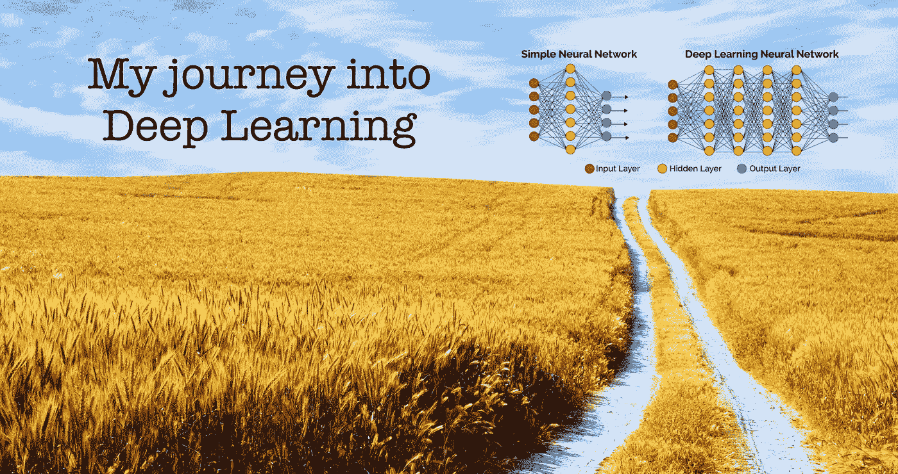
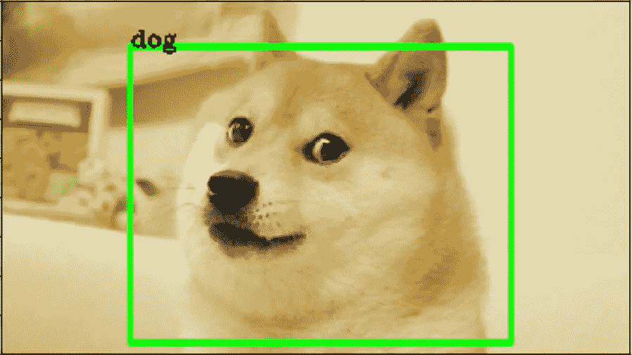
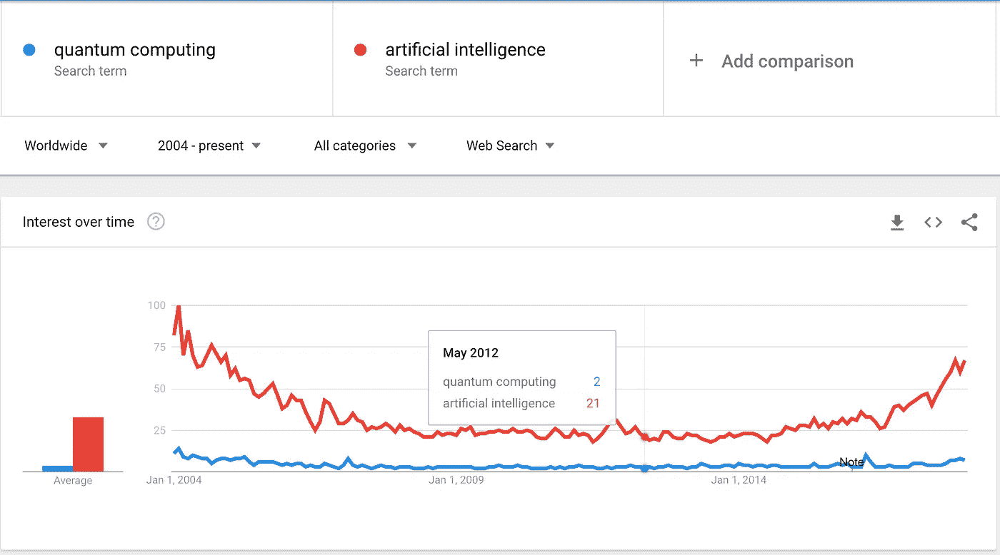
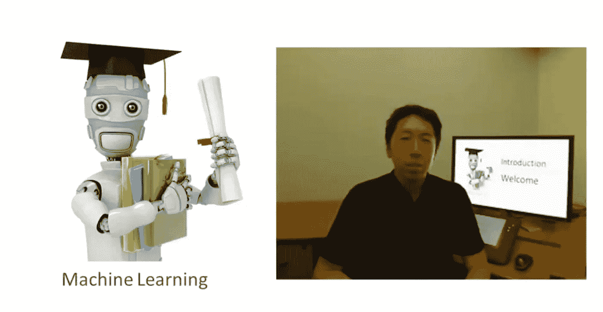
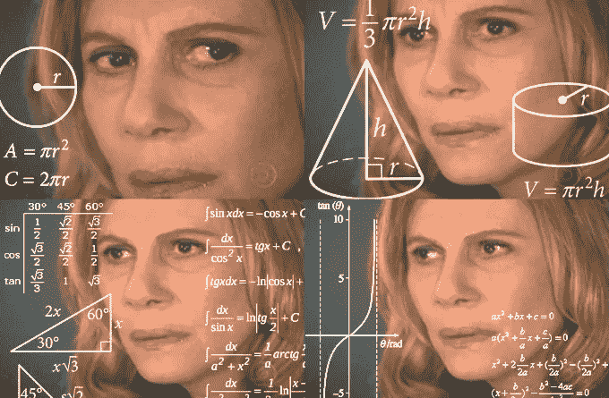
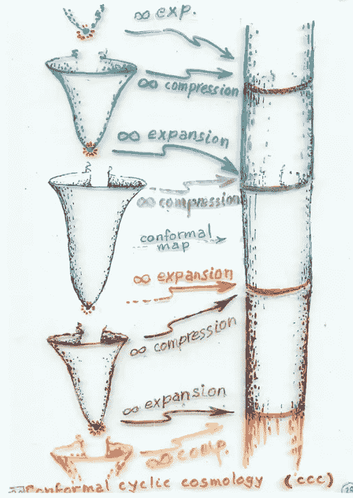
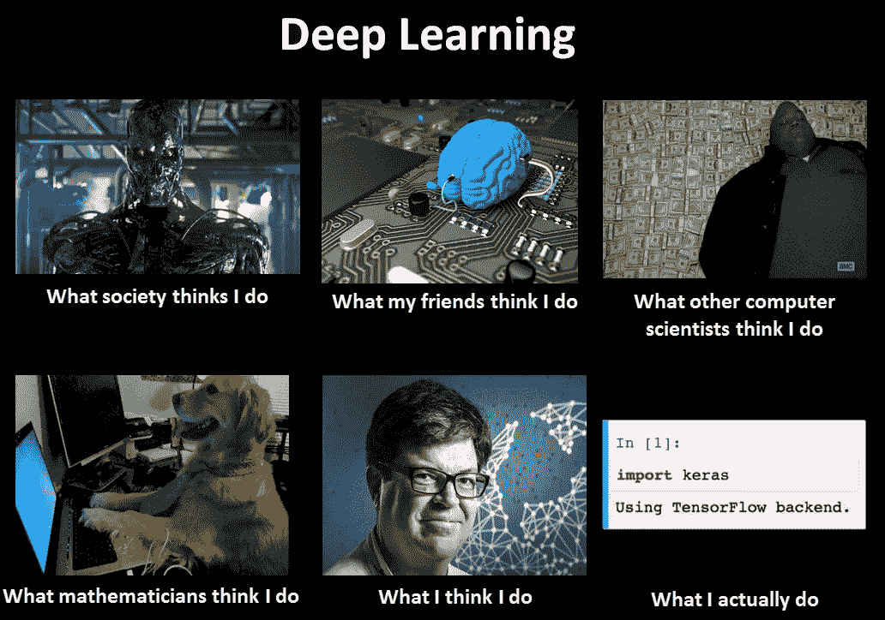
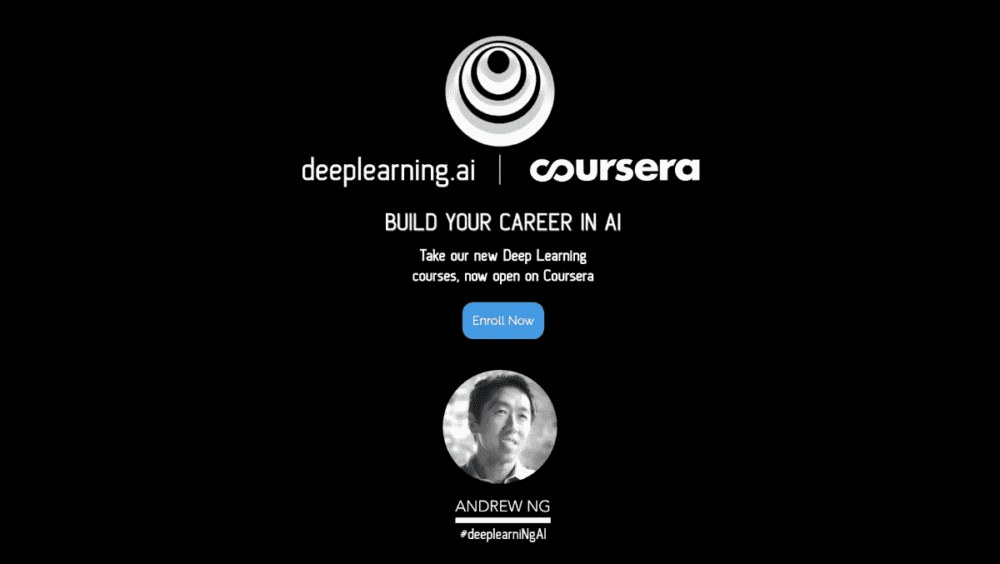
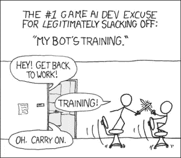

# 我的深度学习之旅

> 原文：<https://towardsdatascience.com/my-journey-into-deep-learning-c66e6ef2a317?source=collection_archive---------4----------------------->

在这篇文章中，我将分享我如何研究深度学习并使用它来解决数据科学问题。这是一个非正式的帖子，但内容有趣(我希望如此)。

## 一点关于我和深度学习

我来自物理和计算机工程。我在委内瑞拉学习了这两个专业，然后在墨西哥攻读了物理学硕士。但我认为自己是一名数据科学家。有趣吧？因此，尽管我在数学、微积分和统计学方面有着良好而广泛的背景，但开始机器学习和深度学习并不容易。

这个主题并不新鲜，但是我们研究它们的方式，我们如何构建使用它们的软件和解决方案，以及我们编程或与它们交互的方式都发生了巨大的变化。

我之前写了一篇[文章](https://becominghuman.ai/deep-learning-made-easy-with-deep-cognition-403fbe445351)，其中我谈到了深度学习的一些理论以及为什么它现在如此重要，但要再次说的是，使深度学习成为当前“炒作”的因素是几个简单但重要的算法改进的发展，硬件(主要是 GPU)的进步，以及过去十年中数据的指数级生成和积累。

## 我从哪里开始？

2012 年左右，当我在学习计算机工程时，我上了一堂关于人工智能的课(这是课程的名字)。当时我真的被这个题目弄糊涂了。我的意思是，我知道这很重要(当时“有原因”)，但这很奇怪。

我研究了专家系统、神经网络、遗传算法，并阅读了一些论文，其中两个我发现非常有趣的是:

*   [**计算机械与智能**](https://www.csee.umbc.edu/courses/471/papers/turing.pdf) 艾伦·图灵著
*   [**创造力与人工智能**](http://citeseerx.ist.psu.edu/viewdoc/download?doi=10.1.1.667.3710&rep=rep1&type=pdf) 作者玛格丽特·博登

当我阅读这些论文时(我不知道机器学习的进展，甚至不知道它的存在)，我认为我们离实现真正的人工智能真的真的很远。我仍然认为我们并不像我们想象的那样亲密，有些事情我们必须弄清楚，但以后会有更多的。

所以，因为那时(22 岁)人工智能对我来说是一个失去的希望，我开始研究量子计算，对我来说它是人工智能之前的事情，当然我错了:

但是它对我来说真的很有趣，因为它融合了很多科学和工程。

## 我对人工智能的兴趣

那么回到人工智能和所有这些，发生了什么？为什么我现在对人工智能、机器学习、深度学习如此热情，而我确信我们离所有这些都很远？

发生在我身上的是**阿帕奇火花**和**吴恩达**。什么？

于是，2014 年(24 岁)，刚从物理专业毕业，正在做工程中黑洞模拟的论文，然后，嘣！我发现了 Coursera、机器学习、吴恩达和 Apache Spark。

我对严肃的在线学习感到非常惊讶，这是我以前没有尝试过的事情(我仍然不知道为什么)，我开始学习各种课程，从基因组学到天文学，从 scala 到 python，从机器学习到[索伦·克尔凯郭尔的哲学理论](https://es.wikipedia.org/wiki/S%C3%B8ren_Kierkegaard)(顺便说一句，他很棒)。

我没有路，也没有导师，所以我只是在探索这个世界，试图弄清楚我这一生想做什么。

与此同时(2014 年底)，我发现了吴恩达的机器学习课程和 Apache Spark 项目。我在两周内完成了这个课程，我简直不敢相信这个领域有多神奇。然后我开始编写我在 Scala 和 Apache Spark 中学到的东西，所以我开始了解分布式计算、Hadoop、HDFS 和所有这些伟大的东西。

我早期的一些关于机器学习和 spark 的项目(不是很好)你可以在我的 GitHub 中找到它们。去我最后的回复！

 [## 法维奥·巴斯克斯(法维奥·安德烈·巴斯克斯)

### FavioVazquez 有 111 个存储库。在 GitHub 上关注他们的代码。

github.com](https://github.com/FavioVazquez) 

## 我的第一份数据科学工作

我的第一份工作是 2014 年结束的数据科学工作，我是公司里唯一一个试图弄清楚你可以用数据做什么的数据科学家。我很困惑，事情并不像课程中那样！我不再在 R 中导入虹膜数据集，我在处理奇怪的数据，我不知道数据在现实生活中是“脏”的。

但是我一直在学习。有趣的是，我一点也不确定！)当时的数据科学是什么。

我构建了一些简单的模型，以及更复杂的模型，主要是用 Scala 和 Python。Scala 是我 2015 年的生活。

然后我意识到我喜欢开源。我开始在简单的项目中合作，一些是我自己的，然后是一些大的项目，比如 Apache Spark。我在 Spark 项目上接受了一些委托，感觉自己像个英雄。有些很简单，有些更先进，但我觉得我在为社会做贡献。我仍然不知道怎么做，但我知道我在做贡献。

## 宇宙冒险

Roger Penrose theory of Conformal Cyclic Cosmology

数据科学是我继物理学和宇宙学之后的第二个爱好(我想现在它们是同一个地方)，所以我来到墨西哥攻读物理学硕士。这是一次令人惊奇的经历，但是仍然缺少了一些东西。我需要编码！我爱上了编程！

我学习了基础物理课程，比如经典力学、量子力学，还有数值方法、高性能计算，然后是贝叶斯推理和机器学习。

所以最终我的主人被我的两种激情所分裂。而且我在论文里用 Python 写了很多代码，真的很开心。

## 成为数据科学家

当我完成我的硕士学位(2017 年)时，我决定我想做的是成为一名数据科学家，帮助社会。是的，我花了点时间。

如果你想知道我是如何在这个领域找到一份令人惊叹的工作的，看看我几周前写的这篇博客吧:[如何找到一份数据科学家的工作？](/how-to-get-a-job-as-a-data-scientist-f417078fe13e)

我也开始在我的 [LinkedIn](https://www.linkedin.com/in/faviovazquez/) 上分享我的经历、想法和知识，这是非常重要的事情。我认识了很多了不起的人，他们帮了我很多，现在我在帮助别人，回报别人:)。

我每天都在学习、编码、为开源项目做贡献，同时也帮助人们，所以我对自己所做的事情非常满意。

## 深度学习呢？

这不是一个关于深度学习的帖子吗？

是的，但是我需要告诉你为什么深度学习现在对我很重要。我采取的所有这些步骤让我走到了这一步。

作为一名数据科学家，以及大多数职业，你需要了解最新的理论、技术和框架；所以去年我们看到了深度学习的爆发，就在我对机器学习感到舒服的时候，这是一个全新的学习内容。令人惊讶但压力很大。

你知道我从哪里开始的吗？猜猜…

是啊！又是吴恩达！

[https://www.deeplearning.ai](https://www.deeplearning.ai)

我真对他感到惊讶。当我开始一个领域时，他已经在教了。

但是，我仍然在学习这些课程。但我没有就此止步。我也需要更多的实用信息。于是我开始学习 [TensorFlow](https://www.tensorflow.org) 然后是 [Keras](https://keras.io) 。

对于那些不知道 Keras 的人来说，它是一个高级神经网络 API，用 Python 编写，能够在 [TensorFlow](https://github.com/tensorflow/tensorflow) 、 [CNTK](https://github.com/Microsoft/cntk) 或 [Theano](https://github.com/Theano/Theano) 之上运行。它是由 Franç ois Chollet 开发的，专注于实现快速实验。能够以尽可能少的延迟从想法到结果是做好研究的关键。

有很多学习实用深度学习的资源，比如 GitHub repos 和书籍。现在我正在读这本书，它已经成为我的图书馆的一个惊人的补充:

 [## 使用 Python 进行深度学习

### 我见过的对深度学习最清晰的解释...阅读是一种乐趣。

www.manning.com](https://www.manning.com/books/deep-learning-with-python) 

## 深度学习的未来

> "预言是一种艺术，它先说将会发生什么，然后解释为什么没有发生！"

我不知道如何预测未来。但我能说的是我看到正在发生的和可能发生的。

我去年看到的深度学习最好的东西之一是[深度认知](http://deepcognition.ai)。这是一个创建和部署人工智能的解决方案。简单的 drag & drop 界面帮助你轻松设计深度学习模型。深度学习工作室可以自动为你的定制数据集设计深度学习模型，这要归功于他们先进的 **AutoML** 功能。

我认为 GUI 和 AutoML 可以成为深度学习的不远的将来。不要误解我，我喜欢编码，你也可以在那里编码。但是我认为我们明年要写的代码数量将会减少。我们不能在世界范围内花费这么多时间一遍又一遍地编写相同的东西，所以我认为这两个特性(GUI 和 AutoML)将帮助数据科学家提高生产率和解决更多的问题。

我将在未来发表一些关于如何用代码和深度认知平台创建一些简单的深度学习解决方案的帖子，所以我们很快会再见。

如果您有任何问题，请添加我，我们可以在这里聊天:

 [## 法维奥·巴斯克斯|职业简介| LinkedIn

### 查看 Favio Vázquez 在世界上最大的职业社区 LinkedIn 上的个人资料。Favio 有 10 个工作列在他们的…

www.linkedin.com](https://www.linkedin.com/in/faviovazquez/)