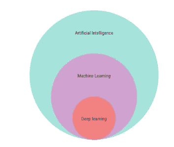
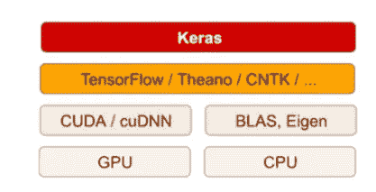
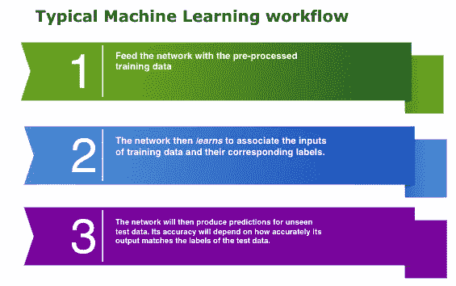
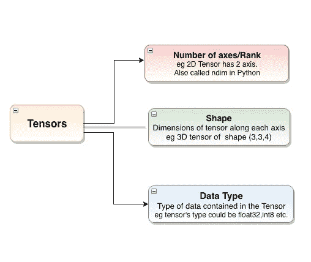
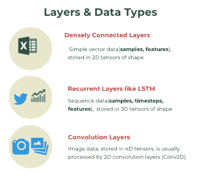
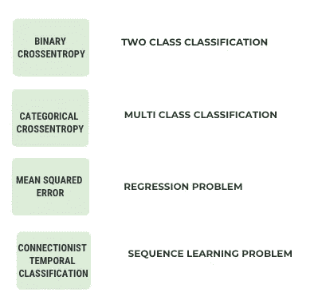

# 我使用 Keras 的深度学习之旅

> 原文：<https://towardsdatascience.com/my-journey-into-deeplearning-using-keras-part-1-67cbb50f65e6?source=collection_archive---------13----------------------->

## 介绍如何在 Keras 中从头开始构建和训练神经网络。


PC: [Felipe Lopez](https://unsplash.com/@flopez_nice?utm_source=medium&utm_medium=referral) on [Unsplash](https://unsplash.com?utm_source=medium&utm_medium=referral)

> “不要相信短期炒作，但要相信长期愿景。人工智能可能需要一段时间才能发挥其真正的潜力——这种潜力的全部程度还没有人敢梦想——但人工智能正在到来，它将以一种奇妙的方式改变我们的世界”——Francois Chollet

深度学习是机器学习的一个迷人领域，也是一个有前途的领域。它表现得非常好，尤其是在视觉和听觉等感知问题领域，这些问题曾经是机器无法解决的。我第一次接触深度学习发生在几年前，当时我正在 Kaggle 解决问题。正是在这里，我被介绍给 Keras，我想探索它的细节。在我遇到的所有其他深度学习库中，我发现 Keras 非常容易、灵活和简单易用。文档和示例也很方便，容易理解。

为了对这个主题有更强的理解，我一直在看一本名为《[**Francois Chollet**](https://twitter.com/fchollet)**用 Python 进行深度学习》的书，他也是 Keras **的作者。这已经成为我最喜欢的关于这个话题的书之一，我从中学到了很多。就像我常说的，我有在阅读任何书籍时创建笔记的习惯，所以这里是我从使用 Python 的**深度学习**一书中获得的笔记。我试图总结基本概念，并以一篇文章的形式呈现出来。对于任何想开始或刚刚开始进入深度学习世界的人来说，这些笔记会很有用。****

# **目标**

**本文的目标是熟悉 Keras 的世界、它的安装、部署以及如何用它来解决机器学习问题。本文不涉及像 LSTM、康维兹等先进的深度学习概念。我打算在我的下一系列文章中讨论这些主题。**

# **你应该知道什么**

**由于你已经涉足深度学习领域，并且对 Keras 特别感兴趣，所以假设你:**

*   **有基本的编程经验**
*   **有一个在 Python 和**
*   **都知道基本的机器学习概念。**

# **目录**

*   **深度学习:初级读本**
*   **Keras:简介|安装|硬件要求**
*   **MNIST 的 Keras 工作流程示例**
*   **结论**

# **1.深度学习:初级读本**

****

**深度学习是机器学习的一个特定子领域。深度学习强调学习越来越有意义的表示的连续*层*。深度学习中的 ***深度*** 代表使用连续层表示的思想。这些分层表示是通过被称为神经网络的模型来学习的，这些神经网络被构造成堆叠在彼此顶部的文字层。**

## **为什么现在要深度学习？**

**总的来说，今天有三种技术力量正在推动机器学习的重大进步**

*   **五金器具**
*   **数据集和基准以及**
*   **算法进步**

**正是由于今天所有这三个领域的丰富和改进，深度学习获得了动力。**

## **深度学习到目前为止取得了哪些成果**

**深度学习已经取得的一些主要成功是:**

*   **接近人类水平的图像分类和语音识别。**
*   **接近人类水平的手写转录**
*   **改进的机器翻译**
*   **改进的文本到语音转换**
*   **Google Now 和亚马逊 Alexa 等数字助手**
*   **回答自然语言问题的能力**

# **2.keras:Python 深度学习库**

****

**[source](https://keras.io/#keras-the-python-deep-learning-library)**

**[**Keras**](https://keras.io/#keras-the-python-deep-learning-library) (κέρας)在希腊语中是*号角*的意思。这是指古希腊和拉丁文学中的一个文学形象，最早见于《奥德赛》。 Keras 最初是作为 ONEIROS 项目(开放式神经电子智能机器人操作系统)研究工作的一部分而开发的。Keras 是一个用 Python 构建深度神经网络的框架。Keras 使我们能够建立最先进的深度学习系统，就像在谷歌和脸书使用的那些系统一样，没有什么复杂性，也只有几行代码。其**的一些主要特征**是:**

*   **用户友好的 API**
*   **内置对卷积网络(用于计算机视觉)、递归网络(用于序列处理)以及两者任意组合的支持。**
*   **支持任意网络架构:多输入或多输出模型、层共享、模型共享等等。**

**Keras 是用 Python 编写的前端层，运行在其他流行的深度学习工具包之上，如 **TensorFlow、Theano** 和**微软认知工具包(CNTK)** 。您用 Keras 编写的任何代码都可以在这些后端中的任何一个上运行，而无需对代码做任何修改。通过 TensorFlow/Theano /CNTK，Keras 可以在 CPU 和 GPU 上无缝运行。**

****

**The deep-learning software and hardware stack**

## **装置**

**在安装 Keras 之前，我们需要安装它的一个后端引擎，即 TensorFlow、Theano 或 CNTK 中的任意一个。在本文中，我们将使用 TensorFlow 后端。阅读详细说明[这里](https://www.tensorflow.org/install/)安装 Tensorflow。**

****安装 Keras 有两种方式:****

*   ****从 PyPI 安装 Keras(推荐):****

```
sudo pip install keras
```

**如果您使用的是 virtualenv，您可能希望避免使用 sudo:**

```
pip install keras
```

*   ****或者:从 GitHub 源安装 Keras】****

**首先，使用`git`克隆 Keras:**

```
git clone [https://github.com/keras-team/keras.git](https://github.com/keras-team/keras.git)
```

**然后，`cd`到 Keras 文件夹并运行安装命令:**

```
cd keras
sudo python setup.py install
```

**如有任何安装相关的疑问，请参考 Keras [官方文件](https://keras.io/#installation)。**

## **硬件要求:设置工作站。**

**作者建议(尽管不是绝对必要的)在现代 NVIDIA GPU 上运行深度学习代码。或者，您可以考虑在 AWS EC2 GPU 实例或 Google 云平台上运行您的实验(随着时间的推移，这将变得非常昂贵)。**

**在本文中，我将使用 **Jupyter notebooks** 来开始使用 Keras，尽管这不是必需的:您也可以运行独立的 Python 脚本，或者从 PyCharm 之类的 IDE 中运行代码。**

# **3.Keras 工作流程**

**典型的机器学习工作流程如下:**

****

**一个 Keras 工作流没有什么不同，要完全理解它；我们将在中使用一个神经网络的例子，这个神经网络使用 Keras 对手写数字进行分类。它就是著名的 **MNIST** 数据库问题也叫深度学习的“ **Hello World** ”。问题是将手写数字(28 × 28 像素)的灰度图像分为十类(0 到 9)。**

 **[## MNIST 手写数字数据库，Yann LeCun，Corinna Cortes 和 Chris Burges

### MNIST 数据库是由 NIST 专题数据库 3 和专题数据库 1 构成的

yann.lecun.com](http://yann.lecun.com/exdb/mnist/)** 

> ***MNIST 数据集以一组四个 Numpy 数组的形式预加载到 Keras 中。***

# **步伐**

**让我们强调我们将采取的步骤，利用 Keras 解决这一问题。**

# **I)在 Keras 中加载 MNIST 数据集**

```
**from keras.datasets import mnist****(train_images, train_labels), (test_images, test_labels) = mnist.load_data()**
```

**图像被编码为 Numpy 数组，标签是一个数字数组，范围从 0 到 9。存储数据的多维数组称为**张量**。你可以把张量想象成数据的容器。更具体地说，张量是矩阵到任意维数的推广。张量可以由三个关键特征来定义:**

****

****我们来看看训练和测试数据。****

```
**#Training Data
train_images.shape**
(60000, 28, 28)
**len(train_labels) #** Total no. of training images
60000
**train_labels**
array([5, 0, 4, ..., 5, 6, 8], dtype=uint8)**#Testing Data
test_images.shape**
(10000, 28, 28)
**len(test_labels)**
10000
**test_labels**
array([7, 2, 1, ..., 4, 5, 6], dtype=uint8)
```

**所以我们这里有一个 8 位整数的 3D 张量。更准确地说，它是一个由 60，000 个 28 × 28 整数矩阵组成的数组。每个这样的矩阵都是灰度图像，系数在 0 到 255 之间。**

# **ii)预处理数据**

**i) **准备图像数据****

**在输入之前，我们需要对数据进行预处理。这是通过将其重新整形为网络所期望的形状来实现的。我们还将缩放范围(0，1)之间的所有值。**

```
train_images = train_images.reshape((60000, 28 * 28))
train_images = train_images.astype('float32') / 255test_images = test_images.reshape((10000, 28 * 28))
test_images = test_images.astype('float32') / 255
```

**因此，我们将形状为`(6000, 28, 28), type — uint8`的数组中的训练图像转换为形状为`(60000, 28 * 28)`的`float32`数组，其值介于 0 和 1 之间。**

**ii) **对标签进行编码****

**标签也需要被分类编码，因为我们不能将整数列表输入神经网络。**

```
from keras.utils import to_categoricaltrain_labels = to_categorical(train_labels)
test_labels = to_categorical(test_labels)
```

# **iii)构建网络架构**

**深度学习网络本质上由模型和层组成。**

## **层**

****层**是神经网络的核心构建模块。它充当一种数据处理模块。各层从输入数据中提取出 ***表示*** ，并输入其中。本质上，深度学习包括堆叠这些层以形成模型。**

> **层是深度学习的乐高积木**

## **模型**

**模型是层的线性堆叠。它就像一个数据处理的筛子，由一系列不断增加的称为层的精细数据过滤器组成。Keras 中最简单的模型是 **sequential** ，由层顺序堆叠而成。**

## **模型结构**

**我们将在 Keras 建立我们的第一个模型，只有两层。这里，我们将输入数据的预期形状传递给第一层。**

```
**from keras import models
from keras import layers****network = models.Sequential()
network.add(layers.Dense(512, activation='relu', input_shape=(28 * 28,)))
network.add(layers.Dense(10, activation='softmax'))**
```

**我们的网络由一系列两个**层**组成，它们是**密集连接的**(也叫*全连接的*)神经层。**

*   **第一层由 512 个单元组成，接受从 28×28 图像转换的 784 维阵列的输入。使用的激活函数是 ReLU(整流线性单位)。一个 [**整流线性单元**](https://github.com/Kulbear/deep-learning-nano-foundation/wiki/ReLU-and-Softmax-Activation-Functions) 如果输入小于 0 则输出 0，否则为原始输出。也就是说，如果输入大于 0，则输出等于输入。**
*   **第二层(也是这里的最后一层)是 10 路 ***softmax*** 层，这意味着它将返回 10 个概率分数的数组(总和为 1)。每个分数将是当前数字图像属于我们的 10 个数字类之一的概率。你可以在下面阅读更多关于 **softmax** 函数的信息。**

**[](https://developers.google.com/machine-learning/crash-course/multi-class-neural-networks/softmax) [## 多类神经网络:Softmax

### 例如，假设您的例子是只包含一个项目的图像——一片水果。Softmax 可以确定…

developers.google.com](https://developers.google.com/machine-learning/crash-course/multi-class-neural-networks/softmax) 

不同的层最适合不同类型的数据处理。**一般**规则(不是经验法则)是:



# iv)网络编译

我们现在知道，我们的网络由两个密集层组成，每一层都对输入数据应用一些张量运算。这些操作涉及权重张量，并且网络的*知识*出现在这些权重上。

模型构建完成后，我们进入编译阶段，该阶段主要包括三个基本要素:

*   **损失函数(目标函数)** : ***损失*** 【预测—实际值】是我们在训练一个神经网络的过程中试图最小化的量。因此，测量损失函数是我们试图解决的任务成功的度量。为一个问题选择正确的目标函数是非常必要的。常用损失函数见下图。



Commonly used Loss functions

*   **优化器**:指定损耗梯度用于更新参数的确切方式。换句话说，它决定了如何根据损失函数更新网络。优化器可以是 RMSProp 优化器、SGD with momentum 等等。
*   **度量**:衡量模型的准确性。在这种情况下，我们将使用准确性。

```
**network.compile(optimizer='rmsprop', loss='categorical_crossentropy',****metrics=['accuracy'])**
```

本质上，损失的减少是通过小批量随机梯度下降实现的。管理梯度下降的具体使用的确切规则由作为第一个参数传递的 rmsprop 优化器定义。

# 五)培训网络

我们现在准备训练网络，这在 Keras 中是通过调用网络的**拟合方法**来完成的——我们*将模型拟合*到它的训练数据:

```
**network.fit(train_images, train_labels, epochs=5,batch_size=128)**Epoch 1/5
60000/60000 [==============================] - 5s 90us/step - loss: 0.2567 - acc: 0.9264
Epoch 2/5
60000/60000 [==============================] - 5s 88us/step - loss: 0.1032 - acc: 0.9694
Epoch 3/5
60000/60000 [==============================] - 5s 89us/step - loss: 0.0679 - acc: 0.9798
Epoch 4/5
60000/60000 [==============================] - 6s 92us/step - loss: 0.0490 - acc: 0.9856
Epoch 5/5
60000/60000 [==============================] - 5s 89us/step - loss: 0.0375 - acc: 0.9885
```

网络将开始以 128 个样本的小批量迭代训练数据 5 次(所有训练数据的每次迭代称为一个 ***时期*** )。在每次迭代中，网络将计算关于批次损失的权重梯度，并更新权重

训练期间显示两个量:

*   **训练数据的网络丢失**，以及
*   **网络对训练数据的准确度**。

训练数据的准确性大约在`98.9%`左右。现在让我们检查一下模型在测试集上的表现。

# vi)测试数据测试

```
test_loss, test_acc = network.evaluate(test_images, test_labels)
10000/10000 [==============================] - 1s 66us/stepprint('test_acc:', test_acc)
test_acc: 0.9783
```

测试集的准确度是 `97.8%`——比训练集的准确度低很多。但这就是 ML 术语中著名的 [**过度拟合**](https://machinelearningmastery.com/overfitting-and-underfitting-with-machine-learning-algorithms/) 的问题。通过从原始训练数据中创建大约 10，000 个图像的验证样本并将其放在一边，可以避免这种情况。测试可以在这个样本上进行，因为它以前没有暴露于训练。整个代码可以从这里的[访问](https://github.com/parulnith/My-Journey-into-DeepLearning-using-Keras/blob/master/MNIST%20problem%20with%20Keras.ipynb)。** 

# **结论**

**差不多就是这样了。在 Keras 的帮助下，我们详细解决了整个 MNIST 数字分类问题。我们刚刚从零开始建立并训练了一个神经网络。但是，理论是学习的一个方面，实际应用又是另一个方面。所以起来出发吧。通过处理一些真实的数据集来利用你新发现的知识。我们将在下一部分看到，我们将学习利用 Keras 解决一些高级问题。在那之前，祝你阅读愉快。**