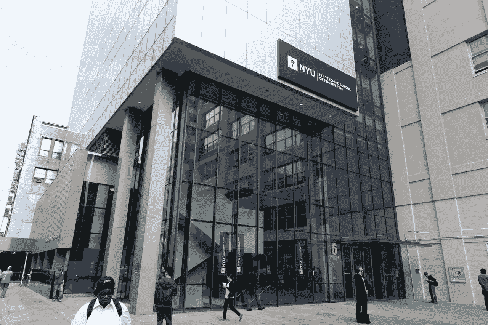
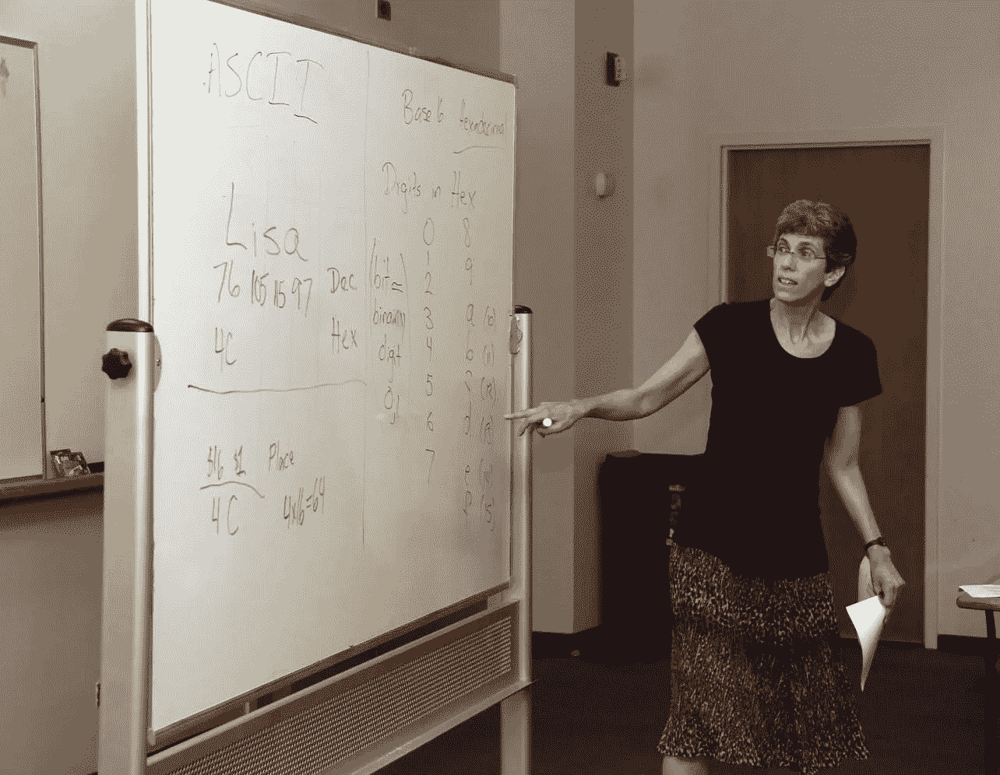
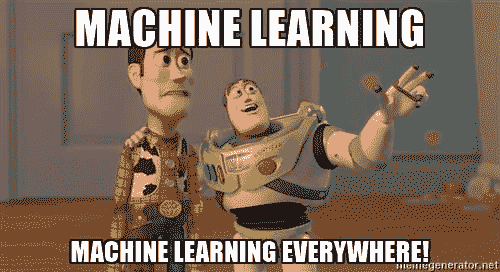
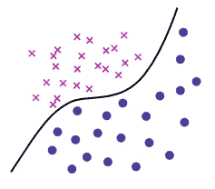
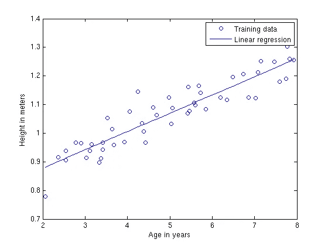
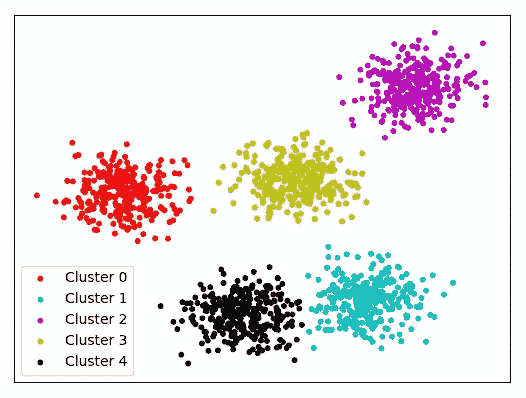
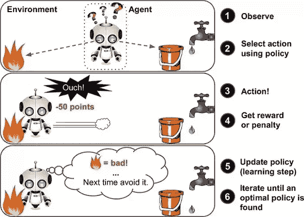
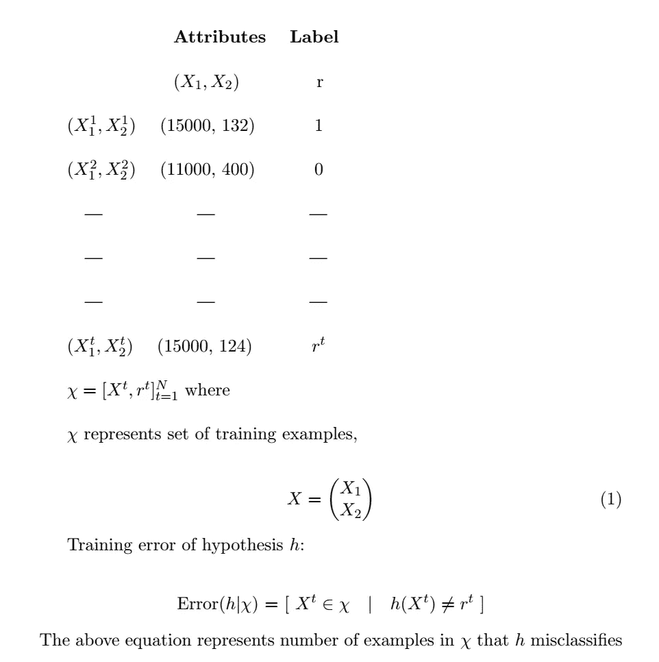

# 我的机器学习之旅:第一课

> 原文：<https://towardsdatascience.com/my-journey-into-machine-learning-class-1-43a003f69666?source=collection_archive---------7----------------------->

我是纽约大学研究生一年级学生，攻读计算机科学。我已经决定在我的研究生课程“机器学习”中保留笔记。我相信它是最强大的媒介(无意双关！)来分享，可能会帮助很多感兴趣的读者进入 ML。它也提供了一个如何构建研究生课程的洞察力。我将根据每周课堂上所教授的内容来写文章。

# **课程和讲师简介**

CS-GY 6923“机器学习”是纽约大学坦登工程学院教授的核心课程。研究生需要完成四门核心课程，本课程是其中之一。本课程介绍机器学习领域，涵盖标准的机器学习技术，如决策树、最近邻法、贝叶斯方法、支持向量机和逻辑回归。

丽莎·赫勒斯坦博士是 2018 年春季这门课程的讲师。她于 1984 年在哈佛大学获得了应用数学/计算机科学学士学位。然后，她于 1989 年在加州大学伯克利分校获得了计算机科学博士学位。她在期刊论文、书籍文章和会议上发表了超过 55 篇论文/文章。她的研究领域包括计算学习理论、机器学习算法、复杂性理论和离散数学。

# 来源

这些笔记的灵感来自各种材料，包括但不限于:

1.  [Alpaydin 的机器学习入门](https://www.amazon.com/Introduction-Machine-Learning-Ethem-Alpaydin/dp/8120350782)
2.  [汤姆·米切尔的机器学习](https://www.amazon.com/Machine-Learning-Tom-M-Mitchell/dp/0070428077)
3.  [Andrew NG 的机器学习课程](https://www.coursera.org/learn/machine-learning)
4.  赫勒斯坦教授的讲座、笔记和幻灯片
5.  互联网

# 机器学习简介

机器学习是当今计算机科学中最具爆炸性的领域之一。这是一个令人兴奋的领域，其重点是让计算机有能力做出自己的决定。这是一个遍及商业、工业、科学和所有人类日常生活的领域。让我们从它的定义开始我们进入这个广阔领域的旅程。

根据亚瑟·塞缪尔的说法，*“机器学习是一个研究领域，它赋予计算机无需明确编程就能学习的能力。”*Tom Mitchell 最近的另一个定义是，*“据说一个计算机程序可以学习它在任务 T 中的性能，用性能 P 来衡量，是否随着经验 e 而提高”*我从上面的定义中理解的是，机器学习是让计算机通过处理数据来思考和决策。

如果机器不能学习，就很难称之为智能的。我们知道，要让计算机解决问题，需要算法。算法是将输入转换为输出的一系列指令。例如，要对一个数字进行排序，机器需要一个算法(如合并排序)将输入(未排序的数组)转换为输出(排序的数组)。

但是，对于某些任务，很难拿出一个算法。例如，检测垃圾邮件。在垃圾邮件中，输入通常是由字符序列组成的文件。这里期望的输出是决定电子邮件是否是垃圾邮件(是)或不是(否)。这里，我们不知道如何将输入转换为输出，因为:

*   被视为垃圾邮件的内容会随着时间而变化
*   垃圾邮件对不同的人有不同的含义

我们不知道将电子邮件分类为垃圾邮件的算法。但是我们在知识上的不足，我们用数据来弥补。计算机自动提取任务的算法。我们可能无法完全确定这一过程，但我们相信我们可以构建一个良好而有用的近似值，即我们可以检测某些模式或规律。这是机器学习的利基。这些模式可能:

*   帮助我们理解这个过程，或者
*   用于预测

与机器学习相关的另一个常见术语是数据挖掘。这两个过程是相互关联的。事实上，将机器学习方法应用于大型数据库被称为数据挖掘。在数据挖掘中，大量的数据被处理以构建一个简单的模型，该模型具有有价值的用途，例如，高预测准确性。

# 机器学习的应用

以下是机器学习正在积极应用的一些领域:

*   **零售:**零售商使用机器学习来了解客户的购买习惯，以便他们能够有效地锁定他们，增加他们的收入
*   **金融:**银行分析过去的数据，为信用卡申请、欺诈检测和股票市场建立模型
*   **制造业:**学习模型在制造业中用于提高生产能力、降低材料消耗和优化供应链
*   **医学:**机器学习用于医学诊断、个性化治疗、预测疫情爆发、发现药物
*   **电信:**分析呼叫模式，以实现网络优化和服务质量最大化
*   **科学:**机器学习使物理、化学、天文学中的大量数据得到更快的处理和分析
*   **互联网:**更快地在网上搜索相关信息(想想谷歌)
*   **视觉:**机器学习帮助识别人脸的模式，如对称性、眼睛的位置、耳朵等。从样本数据和使用这种模式，识别脸(想想苹果的脸锁)

机器学习也可以定义为使用示例数据或过去的经验对计算机进行编程，以优化性能标准。我们有一个定义了一些参数的模型。学习是使用训练数据/过去的经验来执行计算机程序以优化模型的参数。型号可以是:

*   预测:对未来做出预测
*   **描述性:**从数据中获取知识
*   **或两者都有**

机器学习在建立数学模型时使用统计理论，因为核心任务是从样本中进行推断。计算机的作用是双重的:

*   在训练中，我们需要高效的算法来解决优化问题，以及存储和处理我们拥有的大量数据
*   一旦学习了一个模型，确保它的表示和推理的算法解决方案是有效的

在一些应用中，学习或推理算法的效率，即空间和时间复杂度，可能与其预测准确性一样重要。

# 机器学习方法的应用

# 1.学习协会

就零售业而言，机器学习的一个流行应用是购物篮分析。购物篮分析的目的是发现顾客购买的产品之间的关联。例如，如果通常购买产品 X 的人 A 也购买产品 Y，并且如果另一个人 B 购买产品 X 而不购买产品 Y，则人 B 是潜在的 Y 客户。一旦我们找到这样的客户，我们就可以针对他们进行交叉销售。

在寻找关联规则时，我们感兴趣的是学习 P(Y|X)的条件概率，其中:

*   y:以 X 为条件的产品
*   x:购买的产品/产品组

# 2.分类

分类是一种监督学习方法，其输出是离散值(即 0 或 1)。

监督学习方法是一种已经给出“正确答案”的机器学习方法。目标是产生更多这样的正确答案。

在金融应用中，分类是指机器学习系统将模型与过去的数据进行拟合，以便能够预测(例如，计算风险)新的应用，并决定归类为{低风险，高风险}中的任一种。有关客户的信息作为分类器的输入，分类器的任务是将输入分配给两个类中的一个。在用过去的数据训练之后，分类规则可以是以下形式:

> *如果收入> x1 和储蓄> x2，那么风险低；其他高风险*

上述规则是判别式的一个例子。判别式是将不同类别的样本分开的函数。

一旦我们有了符合过去数据的规则，并且如果未来与过去相似，我们就可以对新的实例做出正确的预测。

在某些情况下，我们可能希望计算一个名为 P(Y|X)的概率，而不是做出 0/1(低风险、高风险)类型的决策，其中:

*   x:客户属性
*   Y : 0/1(低风险、高风险)

从这个角度来看，我们把分类看作是学习从 X 到 y 的联想。

> *P(Y=1|X=x) = 0.8*

从上面的等式，我们可以说:

*   客户有 80%的可能性是高风险客户
*   客户有 20%的可能性是低风险客户

分类的另一个应用是在光学字符识别(OCR)中。这里的任务是从图像中识别字符代码。这是一个多分类的例子，其中输入是手写数字的图像，输出是实际的数字(即，机器应该能够识别出您手写的“8”是实际的“8”)。

分类也用于人脸识别。这里，输入是图像，输出是被识别的人。学习程序学习将面部图像与身份相关联。在这里应用分类有点问题，因为类别太多，输入图像往往非常大，并且姿势和光照的某些差异可能导致图像中的显著变化。

分类还用于医疗诊断(识别疾病)、语音识别、自然语言处理(垃圾邮件检测、大型文档汇总)和异常值检测等。

一旦进行了分类，我们就可以从数据中学习规则。这就是所谓的知识提取。这个规则是一个解释数据的简单模型，通过这个模型，我们可以解释数据背后的过程。学习还执行压缩，因为通过使规则适合数据，我们得到比数据更简单的解释，即，需要更少的存储器来存储和更少的计算来处理。

例如，一旦我们有了加法规则，我们就不需要记住每一对可能数字的总和。

# 3.回归

回归是一种监督学习方法，其输出为连续值。

例如，预测二手车的价格是一个回归问题。输入是汽车属性，输出是汽车的价格。回归通常具有以下形式:

> y = wx + w1 其中

> w =直线的斜率，
> 
> w1 =常数

典型地，在监督学习中，任务是学习从输入到输出的映射。机器学习的一个标准方法是，我们假设一个定义了一组参数的模型:

> y = g(x / w)其中

> y 是输出，
> 
> x 是属性，
> 
> w 是参数，
> 
> g(x/w)可以是回归函数，也可以是判别函数

机器学习优化“w ”,以使近似误差最小化，即我们的估计尽可能接近训练集中给定的正确值。

回归的一些例子包括:

*   **机器人汽车导航:**输入是传感器，比如摄像机，GPS，输出是方向盘应该转动的角度。通过监控和记录人类驾驶员的动作来收集训练数据。
*   **咖啡烘焙:**输入的是咖啡的属性，如温度、时间、咖啡豆种类等。进行了许多实验，对于这些输入的不同设置，我们测量咖啡的质量作为顾客满意度(比方说)。为了找到最佳设置，我们拟合了一个回归模型，将这些输入与咖啡质量联系起来，并在当前模型的最佳值附近选择新的采样点，以寻找更好的配置。我们对这些点进行采样，检查质量，并将其添加到数据中，以适应新的模型。这通常被称为*响应面设计*。

有时，我们希望能够学习相对位置，而不是估计绝对数值。例如，在推荐系统中，我们部署了一个排名函数，其中输入是电影属性和用户评级，输出是已排名电影的列表。

# **4。无监督学习**

无监督学习方法是一种不给出“正确答案”的机器学习方法。目标是找到数据的结构。

通过找到数据中的某些模式，我们可以找到数据的结构。在统计学中，这被称为*密度估计*。

密度估计的一种方法是*聚类*。聚类是一种旨在发现输入数据分组的聚类的技术。

例如，基于客户的人口统计、过去的交易(即，客户数据)找到客户的分组。该公司希望了解经常出现的客户类型。聚类模型将属性相似的客户分配到同一组。这叫做*客户细分。*这将有助于公司针对不同的客户群体提供服务和产品。

另一个例子是图像压缩。在图像压缩中，输入是表示为 RGB 值的图像像素。聚类程序将具有相似颜色的像素分组在同一组中，并且这样的组对应于图像中频繁出现的颜色。

文档聚类是聚类的另一个例子。目的是将类似的文档，如新闻、宗教话题、体育等进行分组。文档被表示为单词包，即我们预定义了一个由 ***N*** 个单词组成的词典。每个文档都是一个 ***N-*** 维二元向量，如果 ***i*** 出现在文档中，则其元素 ***i*** 为 1。后缀' s '，'-ing '和' of '，' in '等单词被删除。然后根据共享单词的数量对文档进行分组。如何选择词汇至关重要。

# 5.强化学习

强化学习是让一个主体在世界中行动以最大化其回报的问题。例如，考虑教一只狗一个新把戏:你不能告诉它做什么，但如果它做对/错的事情，你可以奖励/惩罚它。它必须弄清楚它做了什么使它得到了奖励/惩罚，这就是众所周知的信用分配问题。我们可以使用类似的方法来训练计算机完成许多任务，例如玩双陆棋或象棋，调度作业，以及控制机器人肢体。

# 教授的重要建议

*   我们将在本课程中使用一些基本术语:

例数: ***N***

培训示例:

*   应该使用随机分布生成训练样本
*   假设有一个分布，但是你对这个分布不做任何事情
*   **PAC 模型:**[PAC(大概正确近似学习)模型](https://en.wikipedia.org/wiki/Probably_approximately_correct_learning)是一个框架，学习者接收样本，必须从某一类可能的函数中选择一个泛化函数(称为*假设*)。目标是，以高概率(“可能”部分)，所选函数将具有低泛化误差(“近似正确”部分)。总是假设数据来自未知分布
*   **直觉:**简单的规则会比复杂的规则概括得更好，前提是训练误差低。
*   **VC-Dimension:**[VC-Dimension(Vapnik-Chervonenkis Dimension)](https://en.wikipedia.org/wiki/VC_dimension)是一种衡量一组假设简单性的方法。如果存在具有低训练误差的简单假设，并且存在“足够”的训练数据，则该假设很可能具有低预测误差。
*   **奥卡姆剃刀定律:** [奥卡姆剃刀定律](https://simple.wikipedia.org/wiki/Occam%27s_razor)指出，如果一件事有两种解释，越简单的解释越好(或者)你必须做出的假设越多，解释就越不可能。给出两种解释来解释数据，你应该选择更简单的一种。只有在绝对必要的情况下，你才应该有一个复杂的规则。
*   你并不总是希望选择训练误差较低的假设。它可能不会很好地“学习”或概括。

这就是本周的全部内容。敬请期待下节课！