# 我的机器学习之旅:第四课

> 原文：<https://towardsdatascience.com/my-journey-into-machine-learning-class-4-eb0f681cec65?source=collection_archive---------5----------------------->

大家好！感谢你和我一起踏上机器学习之旅！这是该系列的第四篇文章；如果你还没有看过第一篇、[第二篇](https://goo.gl/BD13rR)和[第三篇](https://goo.gl/cch8Yp)的文章，请查看一下。

上周，我们学习了线性回归的核心概念。我们一直从贝叶斯的角度思考，研究朴素贝叶斯算法。我们还简要地了解了模型是如何被评估的。

本周，我们将:

*   讨论验证集的必要性
*   继续研究交叉验证
*   讨论引导
*   直观和数学地理解偏差和方差

请注意，上周，尽管我提到我们将从头实现一个朴素贝叶斯算法，但我不会在本文中这样做(我们将在接下来的文章中讨论它，所以不要担心！).

# 来源

这些笔记的灵感来自各种材料，包括但不限于:

1.  [Alpaydin 的机器学习入门](https://www.amazon.com/Introduction-Machine-Learning-Ethem-Alpaydin/dp/8120350782)
2.  [汤姆·米切尔的机器学习](https://www.amazon.com/Machine-Learning-Tom-M-Mitchell/dp/0070428077)
3.  [Andrew NG 的机器学习课程](https://www.coursera.org/learn/machine-learning)
4.  加州大学伯克利分校的机器学习博客
5.  赫勒斯坦教授的讲座、笔记和幻灯片
6.  互联网

# 模型评估(续)

上周，我们讨论了交叉验证，以及它如何成为评估模型的一种强有力的方式，尤其是在数据较少的情况下。我们还讨论了数据科学家通常如何将数据集分为两组:训练集和测试集。但在实践中，大多数数据科学家将数据集分为三组:

*   训练集，
*   测试集，以及
*   验证集

人们经常问的一个常见问题是:

> "测试集和验证集之间有什么区别？"

验证集主要用于调整学习算法的参数，而测试集仅用于评估算法的性能。

所以你有一个学习算法，你想评估它的表现。的确，您可以将数据集划分为训练集和测试集，并通过对训练数据进行训练和对测试数据进行评估来评估您的模型有多准确(好)。但是像多项式回归这样的学习算法有许多参数，我们想要测试参数的每一个设置。因此，通过在验证集上评估学习算法，我们可以得到一个学习算法的最佳参数设置。然后使用学习算法的这个最佳设置，我们在测试集上评估它的性能。这通常能创造奇迹！

要点是:

*   更新学习算法的参数以获得数据的最佳算法设置所必需的验证集
*   测试集对于评估我们从验证集中得到的算法的最佳设置的性能是必不可少的

现在你会问，

> “但是等等易勒雅斯！高次多项式(在回归中)的性能通常不会比低次多项式好吗？”

是的，这是真的。高次多项式有过度拟合数据的趋势。我们得到的精度可能很高，但在推广方面做得很差。因此，如果您在不同的数据集上使用相同的模型(比方说具有相同的属性)，它的性能会大大降低。

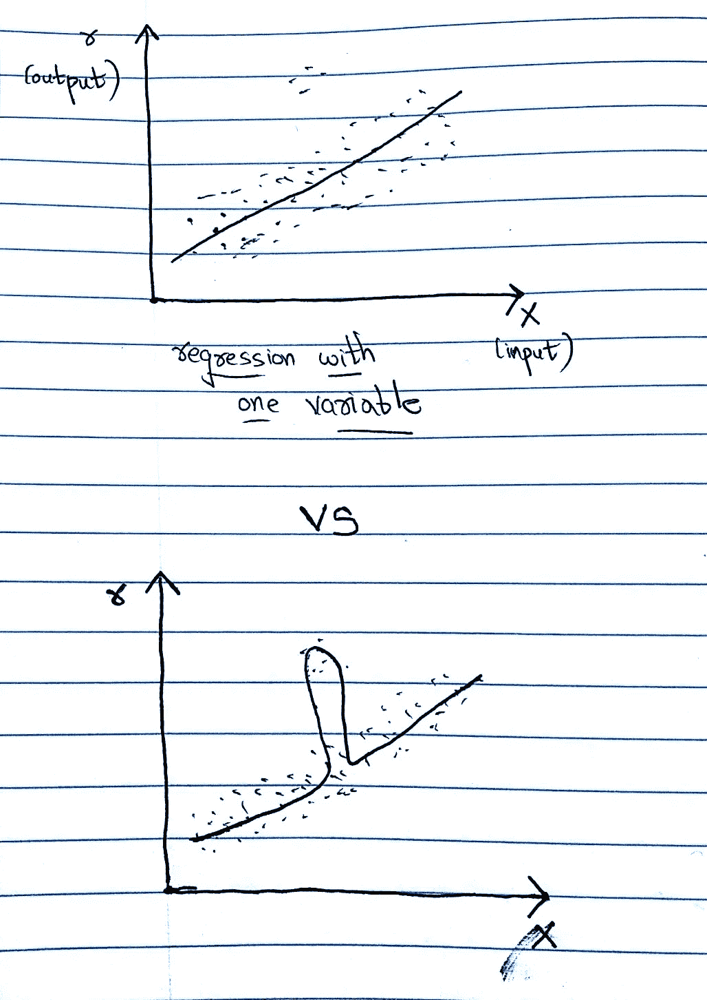

图 1 是低次多项式，而图 2 是高次多项式。正如我们可以清楚地看到，高次多项式试图执行太难，甚至适合离群值。

反之亦然:多项式次数过少可能无法很好地推广。

图 1 是低次多项式，而图 2 是高次多项式。可以清楚地看到，在这种情况下，高次多项式更适合数据。

那么，当我们考虑一个验证集时，我们如何处理这个问题呢？我们如何选择多项式的最佳次数，使模型既不欠拟合也不过拟合？

嗯，我们使用交叉验证！

如果我们只记录总体数据的误差，显然高次多项式会表现得更好。因此，我们使用交叉验证(回收数据)，以便数据中的每个集合都可以作为训练集和验证集重用。这样，在一个验证集中起作用的高次多项式不太可能在另一个验证集中起同样的作用。这样，我们可以得到我们一直在寻找的多项式的最佳次数！

一般程序如下:

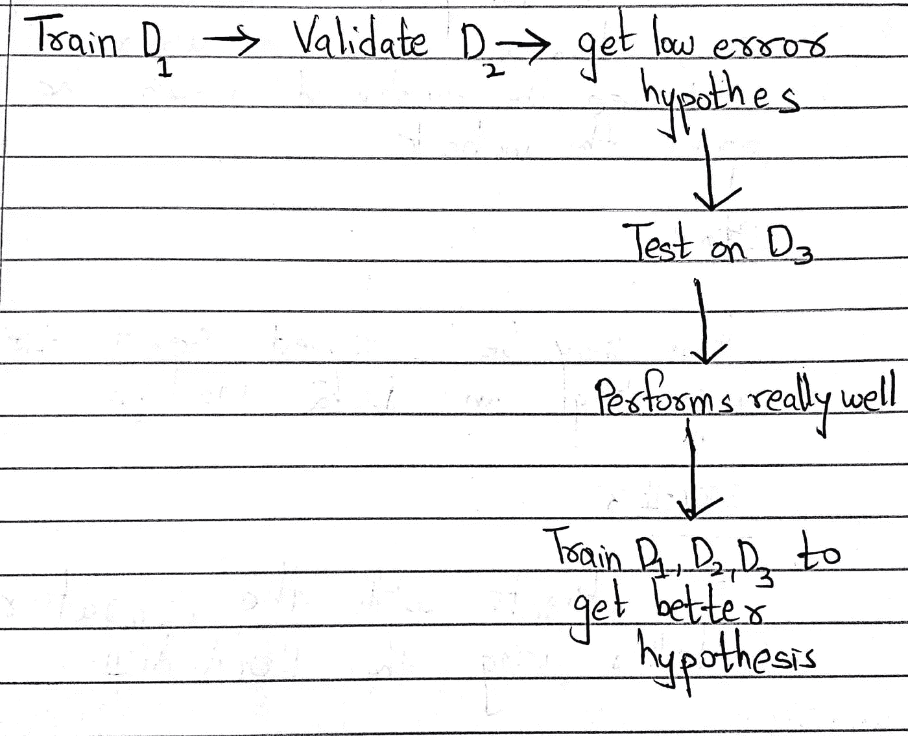

让

*   D1 —培训套件
*   D2 —验证(调谐)装置
*   D3 —测试集

执行 k 重交叉验证时，保持 D3 独立，不要接触它

对于每个 k:(其中 k = 1，2，3，4，…..多项式的次数)

1.  使用设置为 k 的学习算法训练假设

2.计算 D2 假设的误差

3.对所有折叠重复此操作

4.选择 k，它给出了所有褶皱的 D2 平均误差的最小值

5.现在，在测试集 D3 上用 k 的这个设置运行学习算法。如果它表现良好(即准确性值得称赞)，就保留它。

另一个可能被问到的问题是:

> “如果学习算法在 D2 上跨所有折叠都执行得很好，但在 D3 上(从未见过的测试集)却不行，会怎么样？”

这意味着三者之一:

*   学习算法是不能够的
*   怀疑过度拟合
*   出了问题，比如 D1、D2 非常小或者 D3 非常小(可能不适用于交叉验证场景)

如果我们遭受类不平衡问题，我们应该使用分层 k-fold 交叉验证。分层是一个重新排列数据的过程，以确保每个折叠都是整体的良好代表。例如，如果我们有两个类，分层确保每个折叠都有两个类的 50%。

**另一个关键问题是:**

> **我们如何选择交叉验证中折叠数“k”的值？**

没有金科玉律来定义训练、验证和测试集应该有多大。我们希望每个数据集足够大，以减少**方差**(方差衡量数据集分布的程度；我们很快就会谈到它！)的估计。估计方差有两种形式:

*   适合训练数据的假设(学习算法)的方差
*   验证/测试风险估计值的方差

好的启发法(通常)是:

*   50%/25%/25%用于培训/val/测试分割，以及
*   k = 5 或 k = 10
*   随机拆分数据，集合之间的实例没有重叠

我们应该总是设法减少验证/测试风险估计的方差以及学习算法估计的方差。

所以差异是由两个因素驱动的:

*   **训练/拟合:**
    -随着模型的复杂度与训练数据大小之比的增加，模型可能会过度拟合，这增加了模型的方差。
*   **小型测试/验证集:**
    ——测试/验证风险是整个数据集中每个样本风险的平均值。均值估计值的标准误差与 sqrt(数据集的大小)成比例减少

交叉验证的替代方法是**引导**。

Bootstrapping 是一种通过从原始样本**中抽取实例并替换**来生成新样本的方法。这类似于从单个样本生成多个样本。原始样本在这里被当作一个“群体”。

更具体地说:

*   训练数据集—从总共 N 个数据实例中随机选择 N 个替换样本
*   验证数据集-原始数据集(不属于训练数据集的实例)

bootstrap 样本可能比交叉验证样本重叠更多(因为我们是用替换样本进行采样的)，因此它们的估计更具依赖性；但是它被认为是对非常小的数据集进行重采样的最佳方式。

现在:

我们选择一个实例的概率= 1/N

我们不选择实例的概率= 1 - 1/N

在 N 个实例后我们不挑选的概率

= (1 - 1/N)^N

=(大约。)e^-1

= 0.368

这意味着训练数据包含大约 63.2%的实例；即，系统将不会对 36.8%的数据进行训练。因此，误差估计将是悲观的。为了使我们的误差估计更准确，我们复制；即多次重复该过程并观察平均行为。

在某种程度上，我们使用 bootstrap 程序根据经验计算估计量的方差，并将方差估计纳入我们的选择机制。

关于引导要记住的要点:

*   是一种[非参数方法](http://www.statisticshowto.com/parametric-and-non-parametric-data/)(即，不假设任何关于基础分布的事情)，不需要假设人口分布的参数形式
*   用替代品取样
*   将原始样本视为“总体”
*   潜在的假设是，从大小为 N 的原始样本中进行替换的抽样模拟了从更大的总体中抽取大小为 N 的样本
*   适用于各种各样的问题，如非线性回归，分类，置信区间估计，偏差估计，调整 p 值，和时间序列分析
*   必须记住，它并不真正代表原始人口

自举不仅仅是我们讨论的内容。我推荐你通读以下文章，以便更好地理解它:

*   要获得自举的[置信区间](http://www.statisticshowto.com/probability-and-statistics/confidence-interval/)，请参考[这个](https://ocw.mit.edu/courses/mathematics/18-05-introduction-to-probability-and-statistics-spring-2014/readings/MIT18_05S14_Reading24.pdf)
*   关于为什么自举运行得非常好，请参考[这个](https://stats.stackexchange.com/questions/26088/explaining-to-laypeople-why-bootstrapping-works)

# 偏见和差异:两难

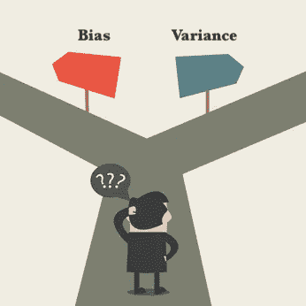

偏差-方差困境是机器学习和数据科学领域中最流行的困境之一。理解它也很重要。为了理解偏差和方差，我将用两种方式来解释它:

*   直观的方式(你可以很容易地跟随)
*   一种更数学化的方式

# 对偏差和方差的直观理解

偏差-方差困境具有现实世界的意义。它导致成千上万人死亡。流行的 ***【福岛核电站灾难】*** 就是过度拟合的结果。让我们回过头来看看欠拟合和过拟合与偏差和方差有什么关系。

我们希望我们的学习算法能够非常接近地模拟训练数据，即捕捉相关的属性和趋势。然而，如果我们过于接近我们的学习算法，我们可能会高估离群值。这是机器学习算法试图踩在预测上的微妙平衡。

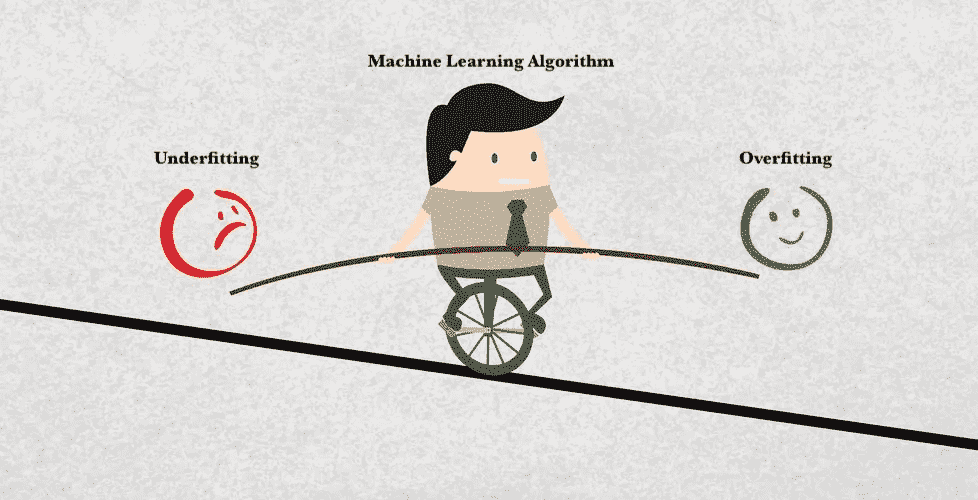

事情是这样的:

*   我们希望避免过度拟合，以停止重视离群值
*   但是在我们尝试这样做的时候，我们可能会适得其反:忽略训练数据中的重要特征

你可能拥有宇宙中最快的计算机、最先进的算法、计算密集型 GPU，但如果你的模型过拟合/欠拟合，你的学习算法的预测能力将仍然很糟糕。

偏差和方差是统计领域的术语。偏差是一个定义非常松散的术语，但它通常被定义为*“实际参数和计算统计值之间的差异”*。如果您不知道统计数据和参数之间的区别，请参考[这个](http://www.statisticshowto.com/how-to-tell-the-difference-between-a-statistic-and-a-parameter/)。另一方面，方差被定义为*“对数据分布程度的度量”*。

偏差对应于欠拟合，而方差对应于过拟合。看这个图:

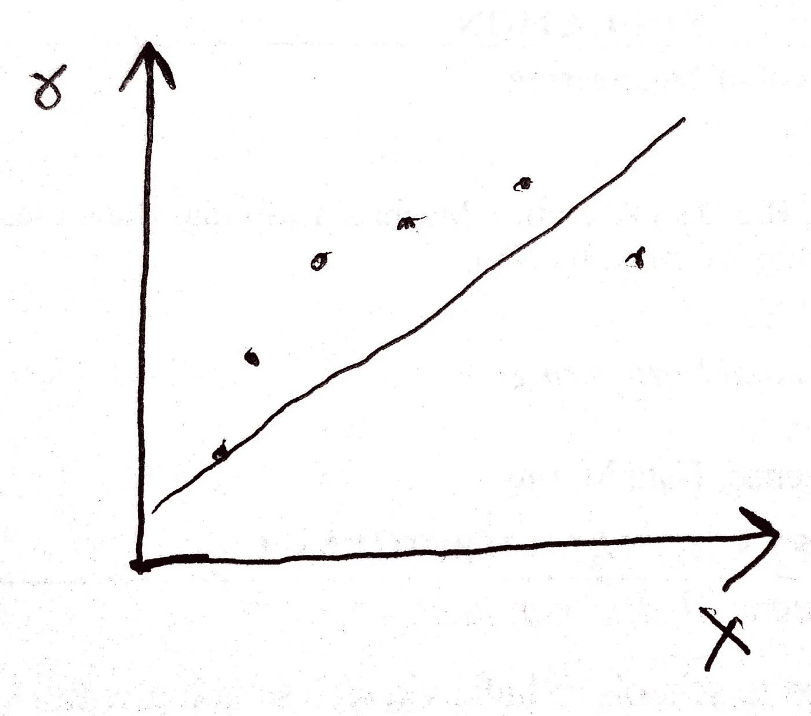

在这里，我们看到线性模型表现出**高偏差**，即它欠拟合。这个模型不够复杂，无法捕捉信息的潜在趋势。我们的模型是有偏差的，因为它隐含地假设数据以某种方式运行(在这个例子中，是线性的),即使这个假设不是真的。需要记住的一个关键点是，我们的线性模型没有任何问题；它正尽力而为。问题出在模型本身，也就是说，它不够复杂，无法从数据中获取足够的信息。

看一下这个例子:

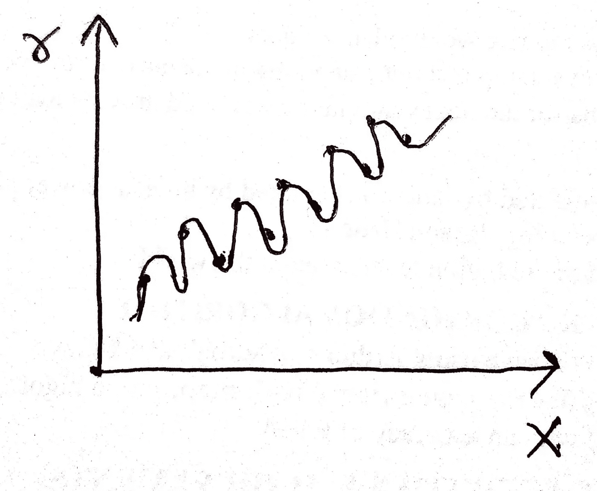

从图中可以看出，模型过拟合。这也叫**高方差**。数据表明，曲线对于捕捉信息可能是必不可少的，但我们的模型选择了复杂的曲线来做到这一点。在这种情况下，它表现出高方差和非常低的偏差(低偏差，因为它不对数据做任何假设)。事实上，它对数据的适应性太强了。

需要记住的一个关键点是，模型本身没有任何问题；它适应每一个数据点。对上述数据使用这种模型存在问题。我们的模型想要考虑每一个数据点，因此过度概括。过度概括的模型具有很高的方差，因为它基于无关紧要的数据细节而变化太多。

太好了！但是现在你问:

> “嘿，易勒雅斯！我明白你说的偏差和差异是什么意思。但是为什么它们的背后会有取舍呢？为什么我们不能利用两者的优点，即低偏差和低方差？”

碰巧偏差和方差是一个因素的副作用:我们模型的复杂性。

当我们的模型的复杂性低，我们有高偏差和低方差。另一方面，当我们的模型的复杂性很高时，我们有低偏差和高方差。

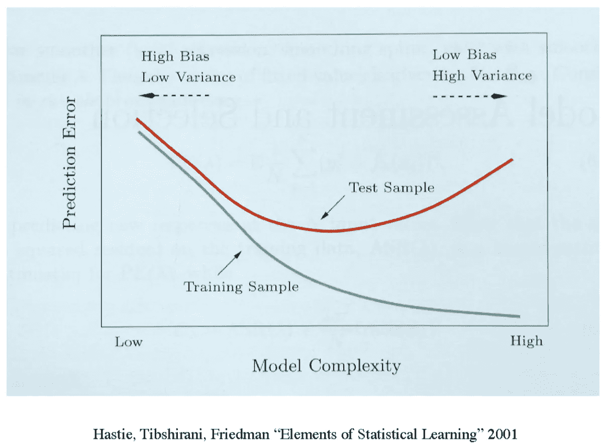

我们能做的最好的事情就是在两者之间找到一个平衡点，也就是说，选择一个既不太复杂也不太简单的模型。

还有一件事我想让你记住:

*   训练误差总是会随着模型复杂度的增加而减少(从上图中的绿线可以看出)
*   测试误差会降低到某一点，然后增加(从上图中的红线可以看出)
*   因此，这些误差是确定您的模型是否欠拟合/过拟合的良好度量

扩展上述观点:

*   **低复杂度**模型导致训练和测试数据的**精度差**和**误差大** **。这是因为模型本质上缺乏足够的复杂性来描述数据。**
*   **高复杂度**模型导致**高精度**和**高测试误差**。这是因为该模型将能够很好地描述训练数据，因此不能推广到测试数据。

# 参数方法

别再凭直觉了！让我们试着从数学上理解偏差和方差！在具体谈论偏差和方差之前，让我们先了解什么是参数方法。

在参数方法中，我们假设样本来自服从已知模型的某种分布，例如高斯(正态)。参数化方法的优点是模型被定义为少量的参数(例如，均值和方差)。这些被称为分布的充分统计量。这意味着一旦从样本中估计出参数，整个分布就是已知的。

我们:

*   根据给定的样本估计分布的参数，
*   将这些估计值代入假设模型，
*   得到一个估计的分布，然后
*   用它来做决定

我们用来估计分布参数的方法是最大似然估计(MLE)(如果你读过以前的文章，现在应该知道了)。

让我们将样本定义为独立同分布。这意味着我们样本中的每个随机变量都具有与其他变量相同的概率分布，并且相互独立。它表示如下:

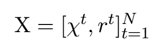

我们假设 x^t 是从一些已知的概率密度函数 p(x |θ)中提取的实例，定义为参数θ:

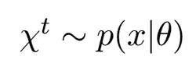

我们想找到θ，使得从 p(x |θ)采样 x^t 尽可能的可能。因为 x^t 是独立的，给定样本 x 的参数θ的可能性是各个点的可能性的乘积:

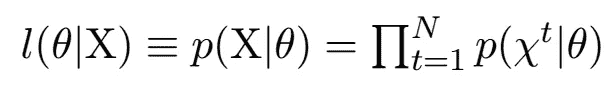

在最大似然估计中，我们感兴趣的是找到使 X 最有可能被画出的θ。因此，我们寻找最大化上述可能性的θ。我们可以最大化可能性的对数，而不改变取最大值的地方的值。应用对数技巧(对数将乘积转换为总和)，我们将对数似然性定义为:

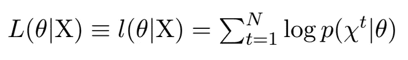

**对于高斯(正常)密度:**

x 是高斯分布，具有:

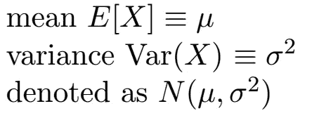

如果你在想上面的 E 是什么，那就是随机变量 x 的期望值，对于连续型随机变量，期望值一般是均值。更多信息，请参考[本](http://www.statisticshowto.com/probability-and-statistics/expected-value/)。

密度函数如下所示:

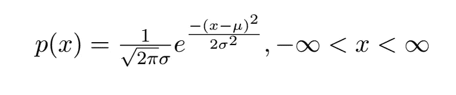

现在，考虑到:

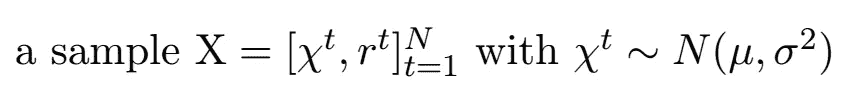

对数可能性是:

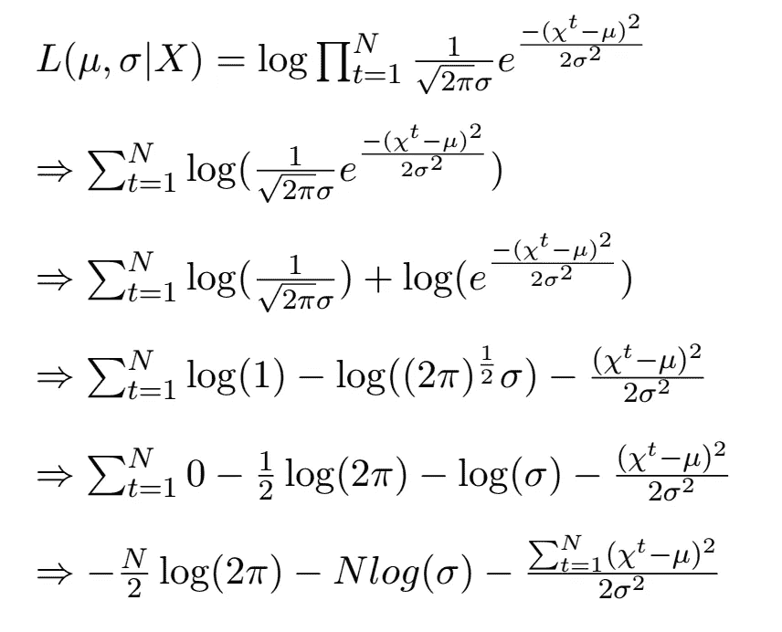

现在，我们通过对上述导出的对数似然进行偏导数(w.r.t mu 和 sigma 以获得估计值)并将其设置为 0 来找到 MLE。我们得到:

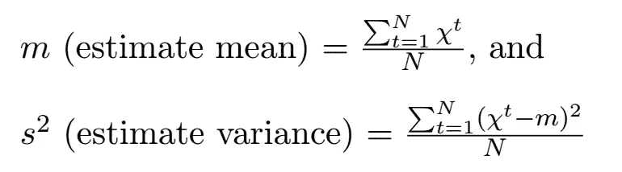

# 评估一个估计量:偏差和方差

我们终于准备好讨论偏差和方差了！

让:

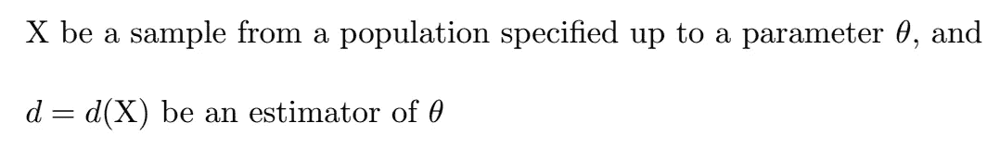

为了评估该估计量的质量，我们可以测量它与θ的差异，即，

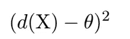

但是由于估计量是一个随机变量(它取决于样本 X)，我们需要**在所有可能的 X 上平均**，并考虑 r(d，θ)，估计量 d 的均方误差定义为:

估计量的偏差是估计量的平均值和实际参数θ之间的差值:

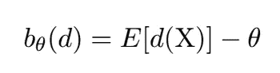

如果上述 bias 值等于 0(零)，我们说 d 是*θ*的无偏估计量。如果 x^t 是从具有实际均值 *mu* 的某个密度中抽取的，则样本平均值 m 是实际均值 *mu* 的无偏估计量，因为:

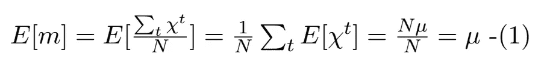

请注意， *m* 是样本的估计平均值， *mu* 是总体的实际平均值。所以上面基本上说的是，如果我们从很多这样的样本中取很多这样的 *m* ，所有这样的 *m 的平均值*就会接近实际平均值(mu)。因此，随着样本数量的增加，样本均值将(几乎)等于实际均值。

*m* 也是一致估计量，这意味着 Var(m)—>0 为 N—>无穷大。

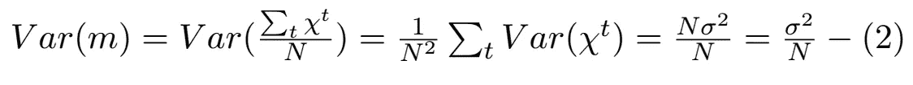

随着样本中的点数 N 变大， *m* 偏离 *mu* 越小。

现在让我们检查 s，实际方差σ的 MLE(最大似然估计):

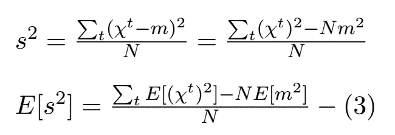

鉴于:

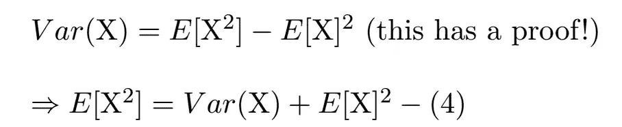

如果你对上面的证明感到好奇，可以参考[这个](https://en.wikipedia.org/wiki/Variance#Definition)。

从(4)中，我们可以写出:

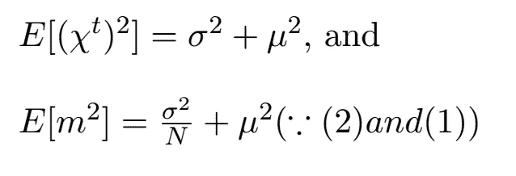

将上述值代入(3)，我们得到:

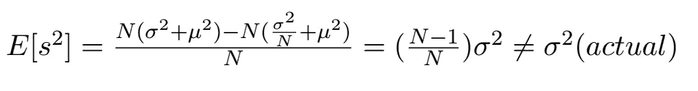

上式表明 s 是*μ的有偏估计量。*如果我们将 N 项从 R.H.S 移动到 L.H.S，我们得到(N/(N-1))s，这是一个无偏估计量(即，它等于实际σ)。但是，当 *N* 变大时，差别可以忽略不计。这是一个渐近无偏估计量的例子，当 *N* 趋于无穷大时，其偏差趋于 0。

最后，回到我们的均方差:

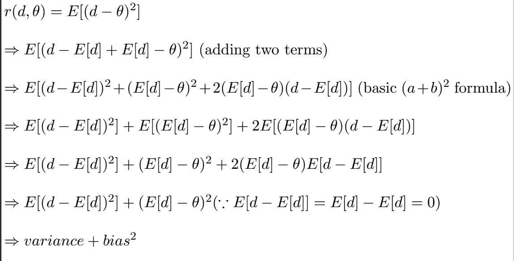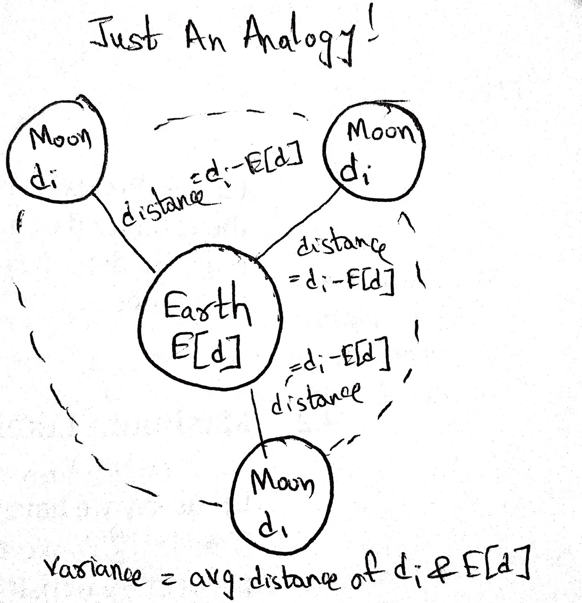

***Fig. Analogy by my friend,*** [***Rakshit Sareen***](https://www.linkedin.com/in/rakshitsareen/)

E[(d - E[d]) ]是公式中的方差。它衡量特定 di 在期望值(即估计平均值)附近的平均变化程度(即期望值 E)。

为了记住这一点，想想地球和月球之间的类比。地球的位置是估计的平均值(E[d])。月球在任何给定时间的位置都是 D1。方差就是两者的平均差。

因此，具有实际参数θ的模型的误差(均方误差)为:

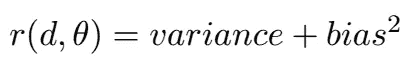

注意，如果偏差= 0，即估计平均值(E[d]) =实际平均值(θ):

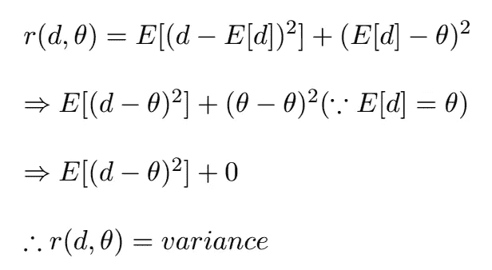

你有它！偏差和方差的数学分解！现在你在直觉上和数学上已经准备好处理偏差和方差了。

这就是本周的全部内容，各位！下周见！