# 我的机器学习之旅:第五课(回归)

> 原文：<https://towardsdatascience.com/my-journey-into-machine-learning-class-5-regression-cb6f04006b29?source=collection_archive---------11----------------------->

欢迎回来，伙计们！机器学习巡航继续！这是该系列的第五篇文章；请务必阅读以前的职位，因为我从那里建立了很多。

上周，我们讨论了对验证集的需求。我们继续讨论了交叉验证，并讨论了作为交叉验证替代方法的自举。我们也试图直观和数学地理解偏差和方差。

在本帖中，我们将讨论:

*   回归模型—单变量、多变量和多项式
*   正规方程方法
*   梯度下降算法
*   正规化

# 来源

这些笔记的灵感来自各种材料，包括但不限于:

1.  [Alpaydin 的机器学习入门](https://www.amazon.com/Introduction-Machine-Learning-Ethem-Alpaydin/dp/8120350782)
2.  [统计学习的要素](https://www.amazon.com/Elements-Statistical-Learning-Prediction-Statistics-ebook/dp/B00475AS2E)
3.  [吴恩达的机器学习课程](https://www.coursera.org/learn/machine-learning)
4.  [艾琳金姆🙏](https://medium.com/u/1d8994ad0efc?source=post_page-----cb6f04006b29--------------------------------)的文章
5.  赫勒斯坦教授的讲座、笔记和幻灯片
6.  互联网

# 一元线性回归模型

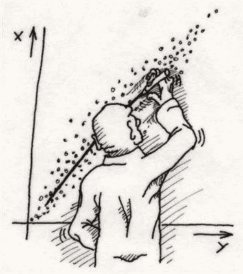

在[第三篇文章](https://goo.gl/cch8Yp)中，我介绍了线性回归的核心概念。概括地说，我们希望有一个函数 *f* 来模拟我们的数据。我们建立一个函数 *f* 的近似器，称为*g*，表示为:

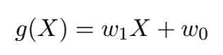

我们使用误差函数来衡量函数对数据的逼近程度。误差函数有许多变体，但我们将利用:

例如，假设我们的数据如下:

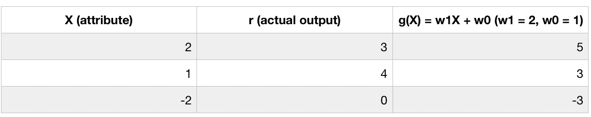

上述的误差函数为:

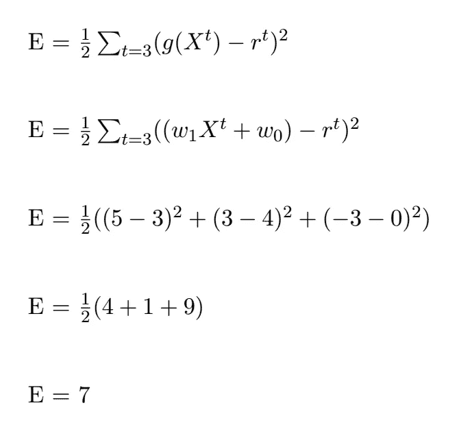

我们的误差函数值不是很大。值越接近 0，我们的模型就越好。如您所见，我们的误差函数取决于:

*   属性/特征 X
*   参数 w1 和 w0

我们不能改变属性 X 的值，因为它代表实际的数据(我们可以对它进行规范化，但不能随意改变它的值)。然而，我们可以改变参数 w1 和 w0 的值。一元线性线中的 w1 和 w0 表示:

*   w1 -斜率或梯度(我们的线有多陡)
*   w0 - y 轴截距(直线与 y 轴相交的位置)

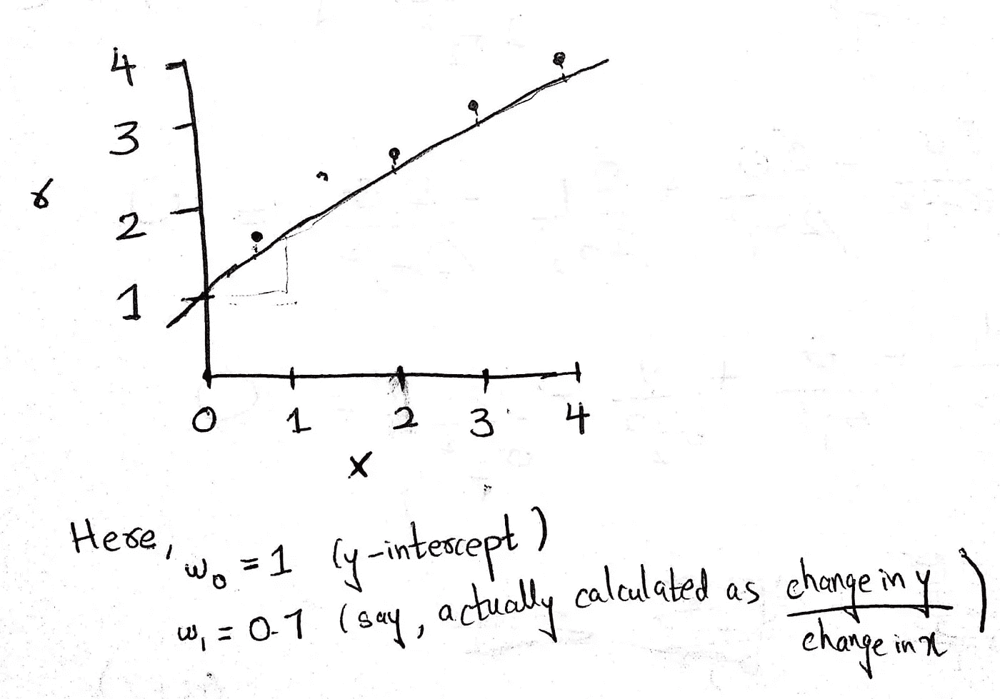

如果我们能够控制 w1 和 w0 的值，我们可以使上面的线准确地穿过我们的数据！

在我们讨论如何精确地优化 w1 和 w0 的值之前，我想用矩阵来表示上述误差函数。

让:

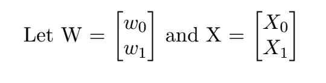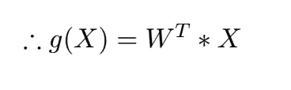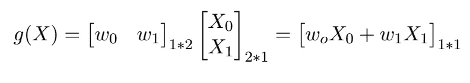

请注意 X_0 = 1。这是因为 X_0 不是一个真正的属性，但我们用它来简化我们的矩阵符号。这只是一个培训示例。如果我们有一个以上的训练示例(比如 3 个)，我们的矩阵符号就变成:

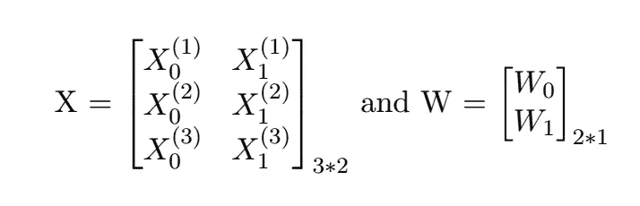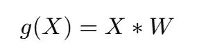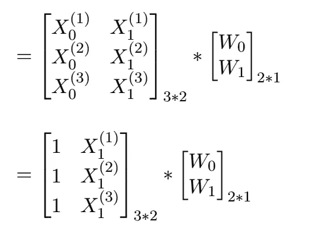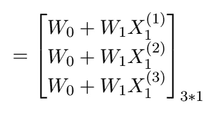

产生的向量(向量是具有单行/列的矩阵)是我们预测值的集合(g(X)的值)。

现在我们已经定义了矩阵术语，让我们看看如何优化参数 w1 和 w0 的值。

有两种方法可以获得 w1 和 w0 的优化值:

*   正规方程法，以及
*   梯度下降算法

# **1。正规方程法**

正规方程方法是一种非迭代方法，它帮助我们确定 W(带有我们希望优化的参数的矩阵)的优化值。

在我们继续之前，我想定义一些术语:

**残差:**观测值(r)和估计值之间的差值(在我们的例子中是 g(X))

**误差:**观察值(r)与 r 的**真值**(不可观察)之差

**RSS(残差平方和):**表示为

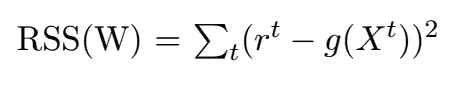

**最小二乘法:**最小化 RSS 的方法。它测量模型的**平均**拟合缺失。它分为两类:普通(线性)最小二乘法和非线性最小二乘法

**闭型表达式:**可以在有限次运算中求值并有解的数学表达式。

**普通最小二乘法:**有一个封闭形式的解(我们这里的正规方程组方法)

**非线性最小二乘法:**一般来说，没有封闭形式的解

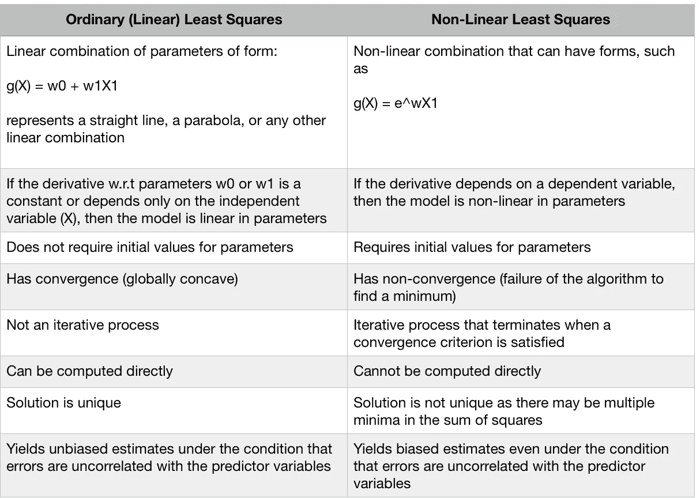

我们这里考虑的正规方程组方法是**普通最小二乘法**。在这种方法中，我们通过明确地对 w 求导并将它们设置为 0 来最小化误差函数。它由以下公式给出:

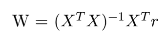

如果你对这个等式是如何推导出来的感兴趣，那么 Aerin Kim 将是一个很好的起点🙏笔下的[文章](/big4-tech-interview-question-derive-the-linear-regression-c45ccdd213e3)。我还推荐你浏览一下维基百科的页面和博客。

关于正规方程，需要记住几个要点:

*   正规方程只需一步即可解析求解 W
*   不需要要素缩放(将要素/属性的值转换为相同的比例，通常为-1 比 1)
*   计算(X^T X)的倒数的时间复杂度为 O(n ),其中 n =特征的数量
*   如果我们有非常多的特征，法线方程将会很慢
*   实际上，当 n > 10，000 时，可能是从常规解决方案进入迭代过程的好时机
*   法线方程非常适用于线性模型，尤其是当要素数量较少时
*   它不适用于其他模型，如逻辑回归(我们将在后面介绍！)
*   有时，(X^T X)的逆可能不存在，即(X^T X)是不可逆的(它的行列式是 0)
*   如果(X^T X)是不可逆的，常见原因可能是:

1.  **冗余特征**，其中两个或多个特征非常相关(即，它们是线性相关的)

例如，如果我们有以米为单位的 X1 -尺寸，以厘米为单位的 X2 -尺寸，X1 = 100X2，那么 X1/X2 是一个多余的特征，应该被删除

2.**功能太多**。在这种情况下，删除一些特征或使用*正则化*

现在让我们来看看获得优化参数的迭代解决方案。

# 2.梯度下降算法

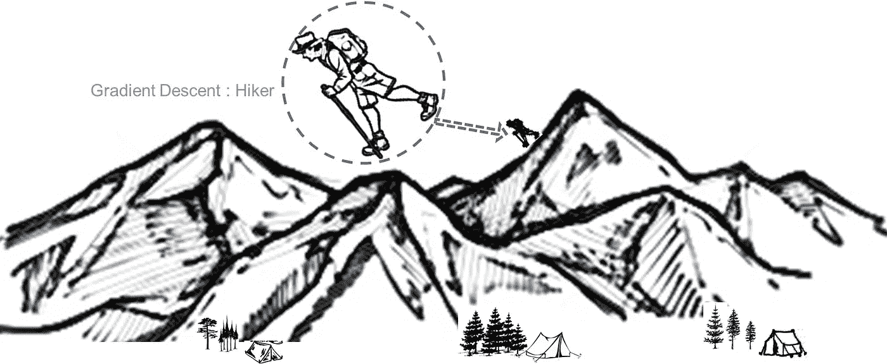

梯度下降是一种迭代算法，可以最小化我们的误差函数。这是一个非常强大的通用算法，广泛用于机器学习，而不仅仅是线性回归。

让我们试着直观地理解我们的误差函数和参数的目的是什么。我们将画出 g(X)和误差函数 e。

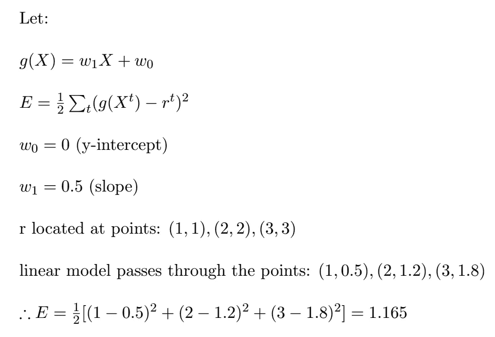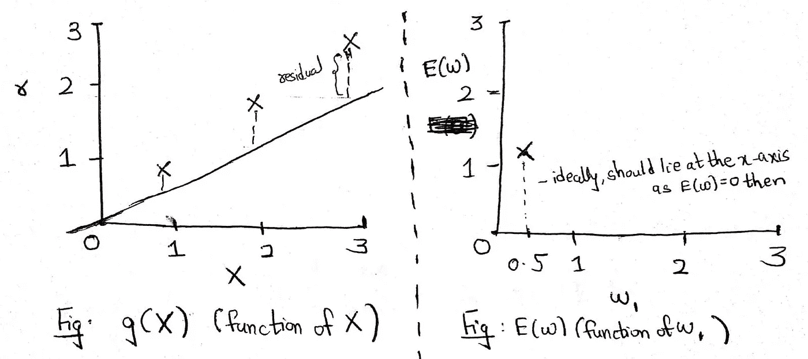

在我们的例子中，我们得到 E = 1.165。理想情况下，我们应该得到 E = 0。为此，我们不断改变 w1 的值，以使该点位于 x 轴上。然后，我们的 E(w)将是 0，我们将有一个模型，完美地描述我们的数据。

上图是我们假设只有一个参数的时候。让我们考虑参数 w0 和 w1，并想象我们的 E(w)。

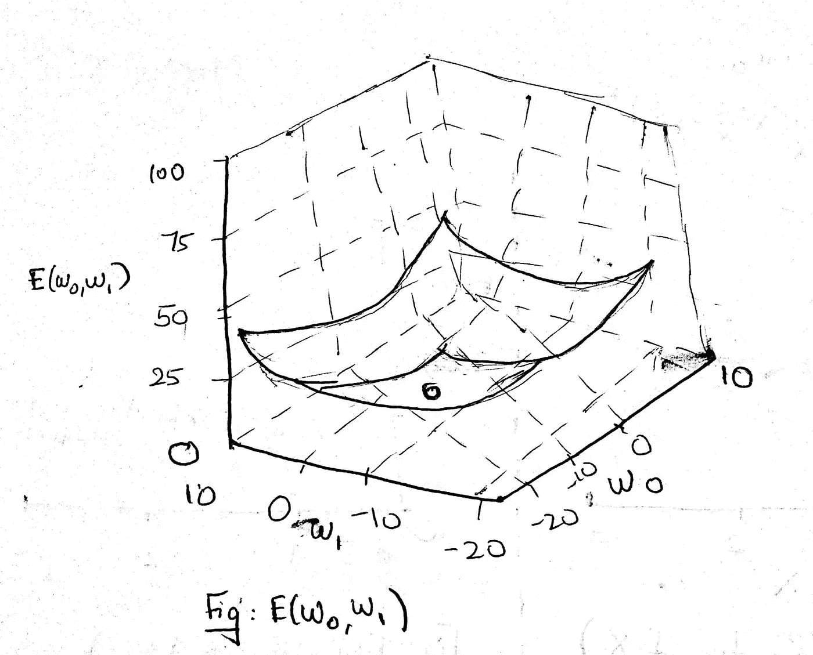

我为我糟糕的绘画技巧道歉。当我们考虑参数 w0 和 w1 时，我们得到 3D 表面图。当我们对 w0 和 w1 取不同值时，弓形表面就是我们的误差函数。这个弓形表面的底部点是我们得到误差函数最低的地方。同样的图形可以用[等高线图](http://www.statisticshowto.com/contour-plots/)绘制在二维平面上，但我们不会在这里深究。

因此，我们可以手动绘制如上图，找到 w1 和 w0 的值，并查看我们的误差函数如何响应这些值。但这是一个极其繁琐的过程。更不用说，当我们有两个以上的参数时，我们会得到更高维度的图形，这些图形不容易绘制，也更难可视化。

我们希望有一种有效的算法，能够自动找到 w1 和 w0 的值，使我们的误差函数最小。这个算法就是**梯度下降。**

通过一个例子可以更好地理解梯度下降。

想象你和你的爱人去爬山。经过艰苦的努力和时间，你终于到达了山顶！(万岁！).当你沉浸在荣耀中时，你突然意识到你的爱人不在你身边。惊慌失措中，你呼唤着爱人的名字。幸运的是，你的爱人回应说他/她在山的最低点(山很小！).

你想尽快到达这座山的最低点。你可以随意往任何方向走，希望你能找到你的爱人。但是你的爱人可能会有危险(有凶猛的野兽在附近徘徊！).你不想拿你爱人的安全冒险。

你深吸一口气，开始分析你的环境。从你站的地方，你环顾四周，选择最陡下降的方向。你推理说，如果在每一步，你都选择最陡的下坡路，你会比盲目地朝一个随机的方向走更快地到达你的爱人。这需要你一些时间，但是按照上面的策略，你最终会找到你的爱人(干杯！).

根据上面的类比:

*   **您的位置** -当前故障点功能
*   **你女朋友的位置**——误差函数最低的点
*   **最陡下降** -误差函数的导数(该点切线的斜率)

这可以想象如下:

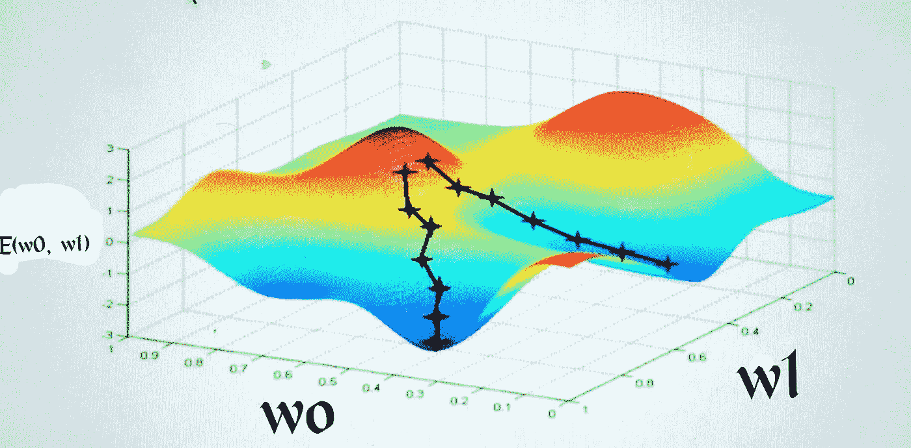

从图中可以看出，我们的目标是到达图表中的最底部，也就是说，当它的值最小时。

方法是将误差函数 w.r.t 对参数 w0 和 w1 求导。我们在下降速度最快的方向上逐步降低误差函数。

每一步的大小由参数 *alpha* ***，*** 决定，称为**学习率**。较小的α会导致较小的步长，而较大的α会导致较大的步长。采取步骤的方向由 E(w0，w1)的偏导数决定。根据一个人在图上的起点，他可能会在不同的点结束。

在上图中，我们注意到对于两个不同的起点，我们到达不同的最低点(局部最小值)。我们稍后将详细讨论这一点。

梯度下降算法可以封装在一个公式中:

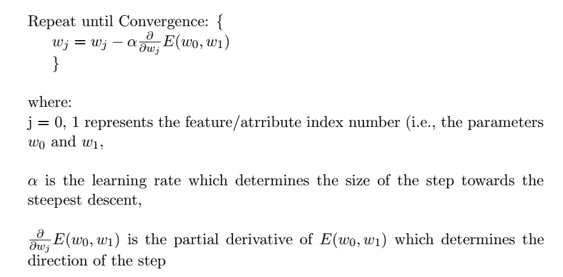

可能会出现一个问题:

> **为什么取导数的负值，而不取正值？**

任何函数的导数的方向都是该函数最大**增加**的方向。因为我们的目标是 E(w0，w1)(我们的函数)的**最小化**，我们选择函数的负导数，因为它给出了函数的最大**减少**的方向。

为了直观地理解它，考虑下面的例子:

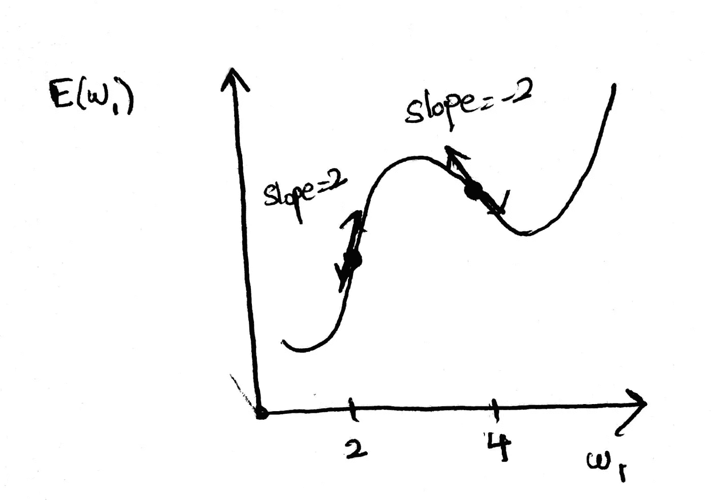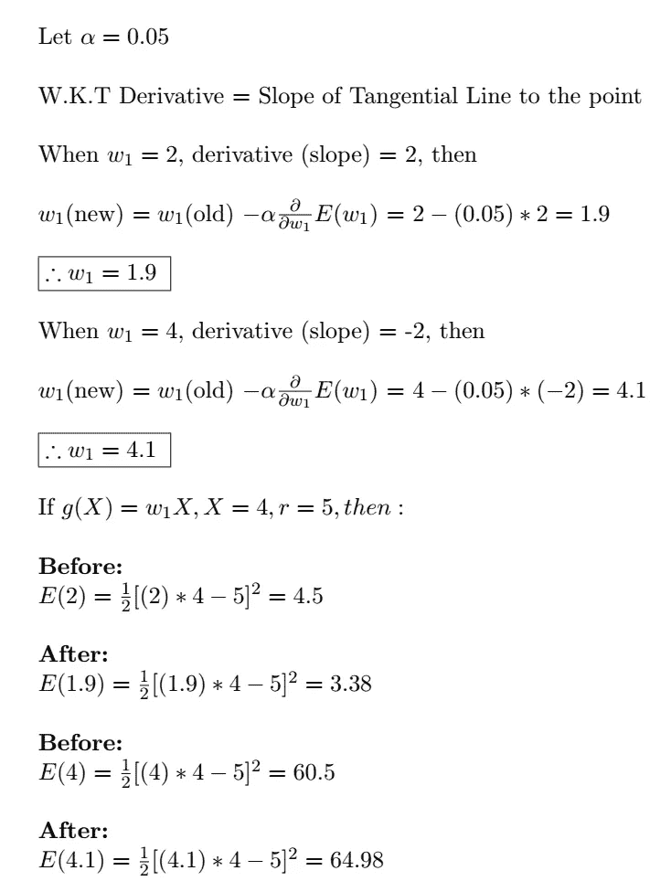

你可以清楚地看到:

*   当我们考虑正斜率时，w1 减小，因此误差函数也减小
*   当我们考虑负斜率时，w1 增加，因此误差函数也增加

另一个重要的问题是:

> **梯度下降如何以固定步长*大小* alpha *收敛？***

收敛背后的直觉是，当我们接近凸函数的底部时，导数接近 0。在最小值点，导数将始终为 0，因此，我们得到:

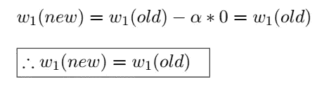

当我们接近局部最小值时，梯度下降将自动采取较小的步骤。偏导数的值会随着我们向下移动到局部最小值而减小。这就是为什么，我们确实需要改变学习速度。

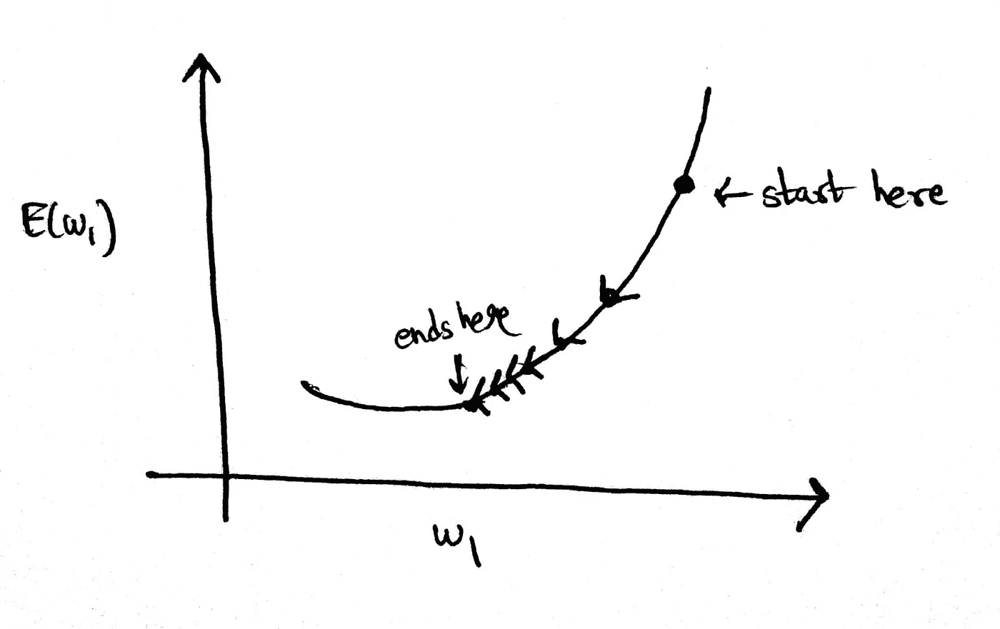

当梯度下降专门应用于线性回归的情况时，可以导出一种新形式的梯度下降方程:

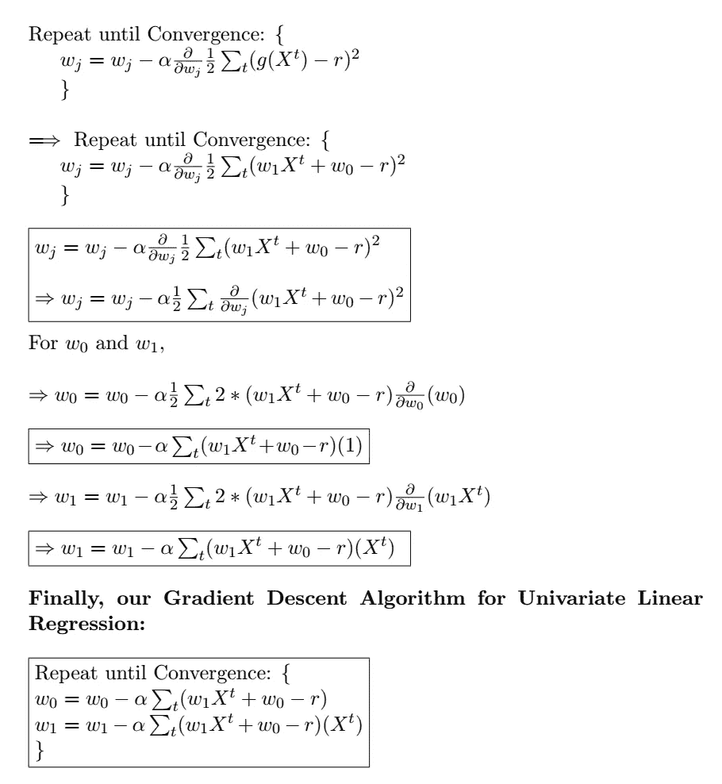

所有这些的要点是，如果我们从估计量(g(X))的猜测开始，然后重复应用梯度下降算法，我们的估计量将变得越来越精确。

上述梯度下降算法被称为**批量梯度下降**，因为它查看整个训练集中的每个示例(求和部分)。它对[凸函数](https://en.wikipedia.org/wiki/Convex_function)非常有效，因为凸函数只有一个全局最小值(即只有一个局部最小值)。然而，当我们有[凹函数](https://en.wikipedia.org/wiki/Concave_function)(凹函数有不止一个局部极小值)时，这在计算上极其昂贵并且根本不可行。

因此，为了减轻计算，使用梯度下降的另一个变体，称为**随机梯度下降**。在随机梯度下降中，我们不是查看每步的整个训练集(求和部分)，而是只查看每步的一个样本。单个样本可能有噪声，因此随机梯度下降的许多变体使用小批量(每步几个样本，而不是每步一个样本)。

如果你想看看批量梯度下降与随机梯度下降，我强烈推荐 [Aerin Kim🙏](https://medium.com/u/1d8994ad0efc?source=post_page-----cb6f04006b29--------------------------------)的[文章](/difference-between-batch-gradient-descent-and-stochastic-gradient-descent-1187f1291aa1)和这个 [StackExchange 回答](https://stats.stackexchange.com/questions/49528/batch-gradient-descent-versus-stochastic-gradient-descent)。

要了解凸凹函数的区别，看一下这篇[文章](https://www.emathhelp.net/notes/calculus-1/convex-and-concave-functions/definition-of-convex-and-concave-functions/)。

关于梯度下降需要记住的几点:

*   **梯度下降需要特征缩放**，因为如果缩放不均匀，梯度可能会花费很长时间，并在最终找到全局最小值之前来回振荡
*   在特征缩放中，每个特征(即 X)大约在-1 ≤ X ≤ 1 的范围内
*   特征缩放将使梯度下降**运行得更快**和**在更少的迭代中收敛**
*   要素缩放包括将输入值除以范围(即最大值-最小值)或标准差
*   另一个称为**均值归一化**的变量，包括用相同变量的平均值减去输入变量的值
*   结合特征缩放和均值归一化，我们得到:

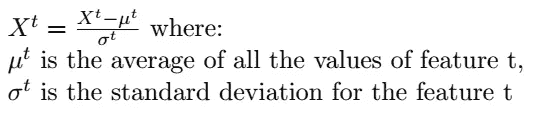

*   为了确保梯度下降能够正常工作，我们可以绘制一个如下图:

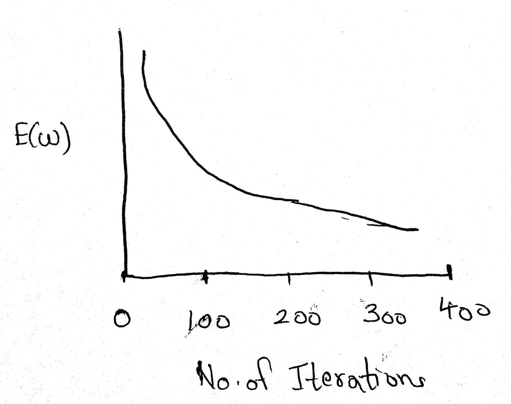

*   我们可以在每 100 次迭代中评估 E(W)的值。要点是 E(W)应该在每次迭代后减小
*   对于特定应用，梯度下降收敛所需的迭代次数可能会有很大变化。可能需要 30、3000、300000 次迭代
*   很难预先知道梯度下降需要多少次迭代才能收敛。通常通过绘制如上图，我们可以发现梯度下降是否收敛。
*   也有可能提出一个**自动收敛测试**:如果 E(W)减少小于ε(比如 10^-3)in 一次迭代),则宣布收敛
*   ε是一个很小的值，是一个阈值。一般来说，选择阈值的值是非常困难的。因此，依靠图表是更可取的
*   有时，你的 E(W)可能在每次迭代中增加而不是减少

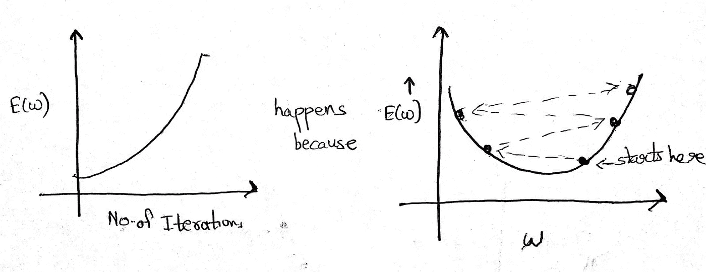

*   发生这种情况是因为:

1.  梯度下降可能不起作用
2.  阿尔法太大了
3.  你的代码中有一个错误

*   选择α值是梯度下降算法的一个重要部分
*   如果α太小:收敛速度慢
*   如果α太大:E(W)可能不会在每次迭代中减少，也可能不会收敛
*   Andrew NG 提出的一个很好的启发是:

1.  最初，设置 alpha = 0.001(或任何小值)
2.  将后续 alphas 设置为大约是其先前值的 3 倍，即 0.001、0.003、0.01、0.03 等等
3.  对于每个α值，绘制 E(W)作为迭代次数的函数
4.  选择看起来能使 E(W)迅速减小的α值

*   当特征数较少时，最好使用正规方程组方法
*   如果数据集太大，使用小批量随机梯度下降比批量梯度下降更好

# 多元线性回归

多元意味着我们有不止一个变量(特征)。它的工作方式与一元线性回归完全相同。我们只需要推广多元线性回归的上述方程。

# 1.正规方程方法

矩阵的维数变了，但我们的正规方程保持不变。

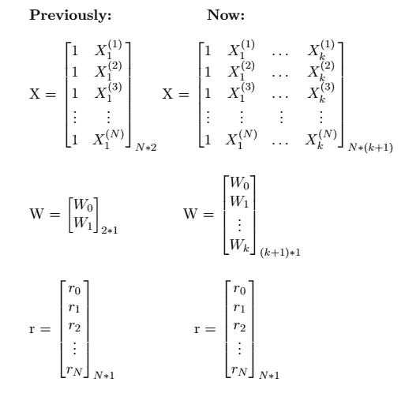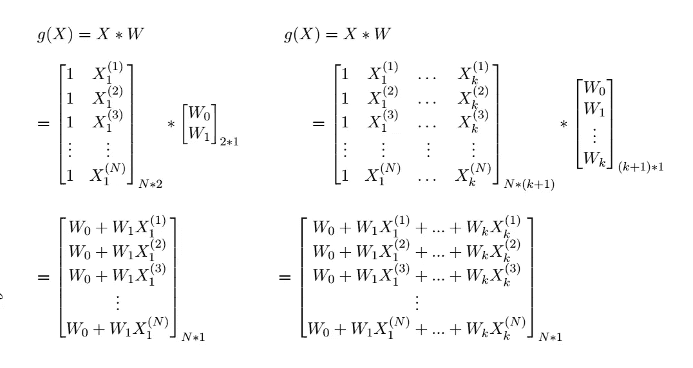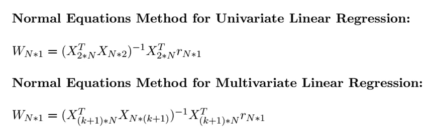

# 2.梯度下降

梯度下降方程本身一般也是这种形式；我们只需要对 k 个特性重复这个过程。

# 多项式回归

多项式回归是回归分析的一种形式，其中自变量(在我们的例子中是 X)和因变量(r)之间的关系被建模为次数≥ 2 的多项式。

次数= 1 的多项式是线性方程。我们上面看到的例子都是次数= 1 的多项式。

多项式回归允许您使用线性回归的机制来拟合非常复杂的非线性函数。

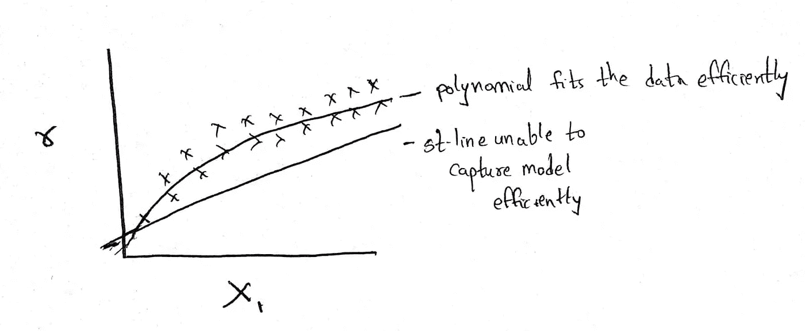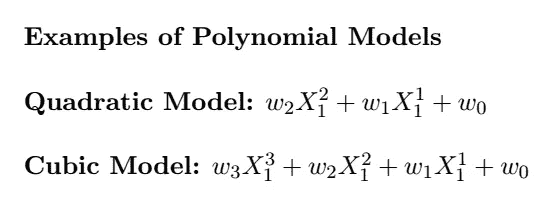

将多项式模型表示为线性模型的一个小技巧是通过替换。内容如下:

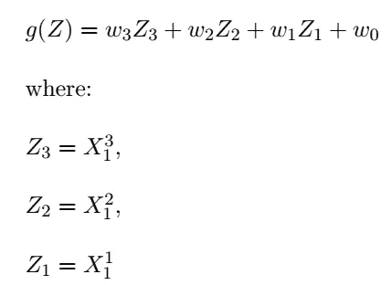

如果我们像这样选择我们的特征，那么特征缩放对于梯度下降算法变得越来越重要。

高次多项式有过度拟合的趋势。因此，高次多项式的精度将优于低次多项式的精度。

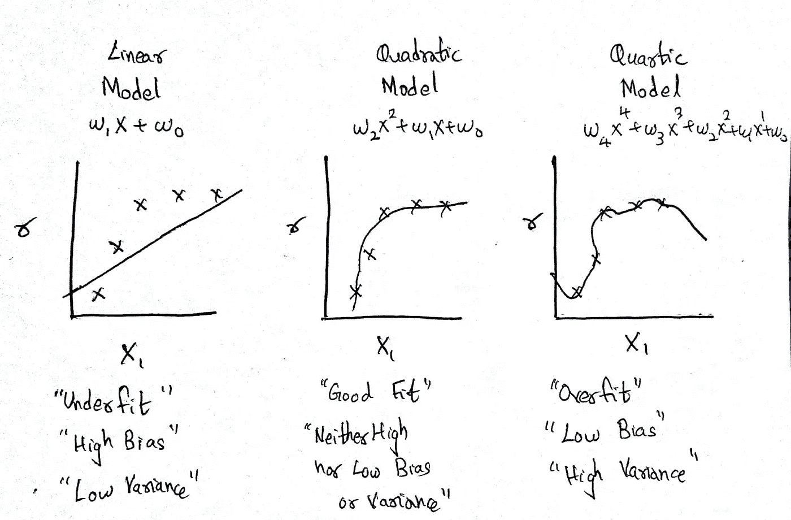

为了解决过度拟合的问题并实现良好的通用模型，我们有两种选择:

*   **减少功能的数量:**这是通过只选择最重要的功能，扔掉那些不太有用的功能来实现的。为了自动选择重要的特征，我们使用了**模型选择方法**，例如**最佳子集选择**、**逐步选择**(正向和反向)、以及**逐步回归**等等(我们将在后面介绍这些方法！)

上述方法的问题是它导致信息的删除(特征或者被保留或者被丢弃)。因此，它通常表现出很高的方差

*   **正则化(或收缩方法):**正则化是引入惩罚项(称为 lambda)的过程。该λ确保惩罚高复杂度模型(更高阶多项式)，即，它平滑系数(w0，w1，…，wK)。为了说明正则化如何帮助我们获得更好的拟合，考虑这个例子:

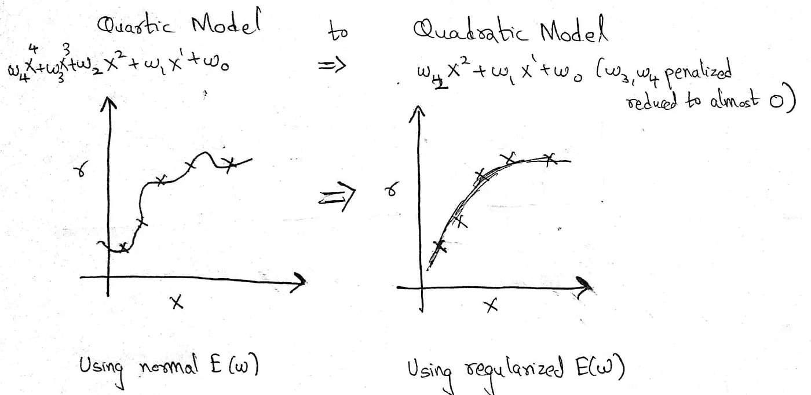

有两种常用的正则化类型:

1.  L2 正则化(岭回归)
2.  L1 正则化(拉索回归)

# 1.L2 正则化(岭回归)

L2 正则化由以下公式给出:

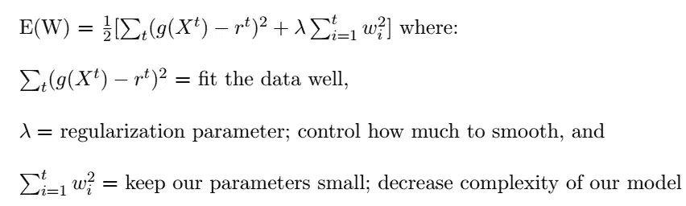

请注意，我们在正则化项中不考虑 w0。为什么？因为这是一种惯例，在实践中，我们是否包括 w0 关系不大。

# 2.L1 正则化(拉索回归)

LASSO(最小绝对收缩和选择运算符)由以下公式给出:

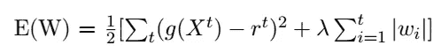

这里唯一的区别是我们考虑参数 w 的模，而不是它们的平方。

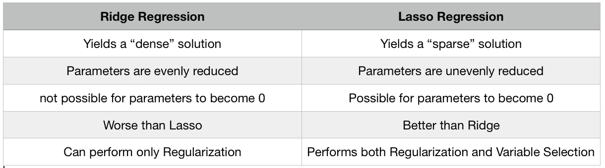

比脊和套索更好的正则化方法是**弹性网正则化。**

弹性网络正则化结合了脊和套索，由以下公式给出:

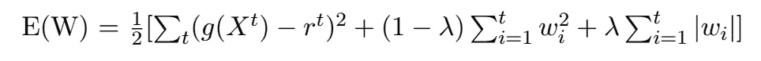

为了理解为什么这更好的直觉，我推荐你阅读提出这种方法的[原始论文](https://web.stanford.edu/~hastie/Papers/B67.2%20(2005)%20301-320%20Zou%20&%20Hastie.pdf)。但是简而言之，当你有高度相关的特性时，那么弹性网就是你要走的路！

正则化的一个问题是选择λ的值:

*   如果 lambda 太高，模型就会太简单，从而导致拟合不足
*   如果 lambda 太低，你实际上没有受到惩罚，因此，你的模型仍然很复杂

为了选择最佳的λ，在不同的λ值上使用**交叉验证**，选择产生最低 E(W)的λ。

另一个**要注意的要点**:在使用正则化时，鼓励特征缩放，因此参数的惩罚是基于它们的预测能力，而不是它们的比例。

我希望这篇文章能够帮助您更好地理解回归。伙计们，这几周就到这里吧！下一篇帖子再见！