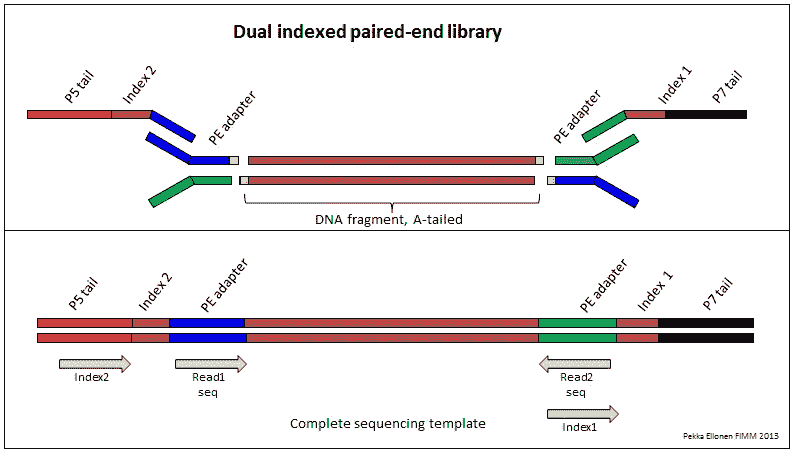
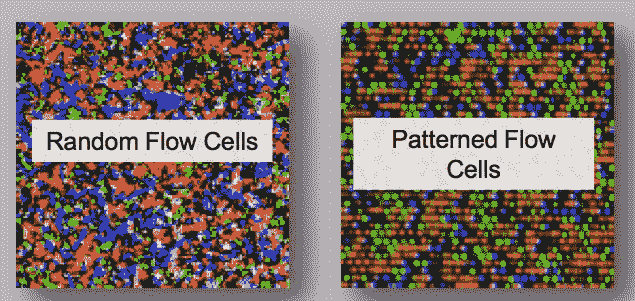
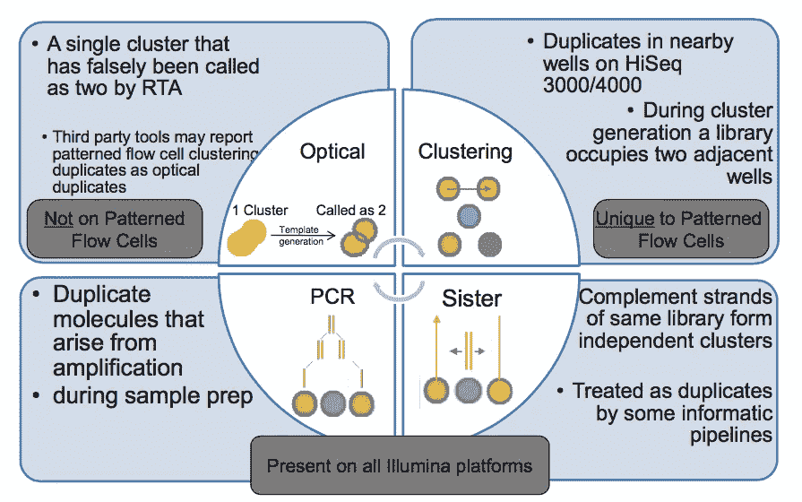
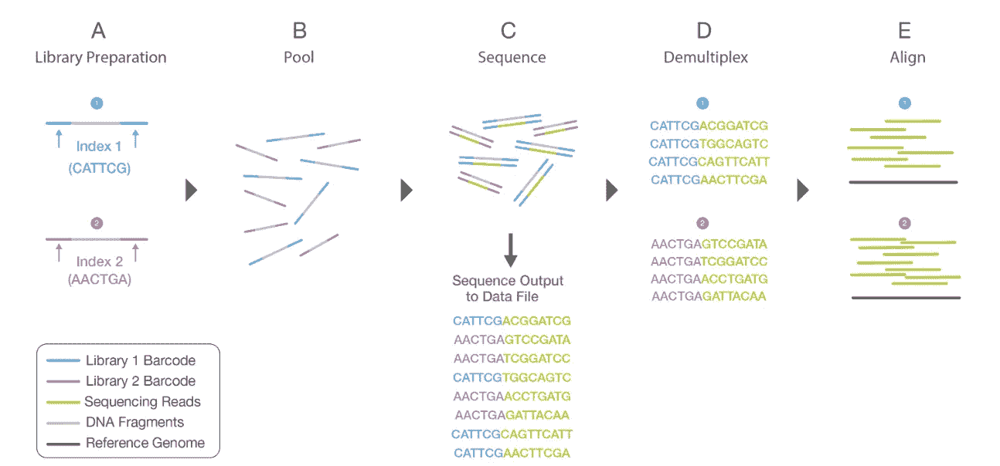
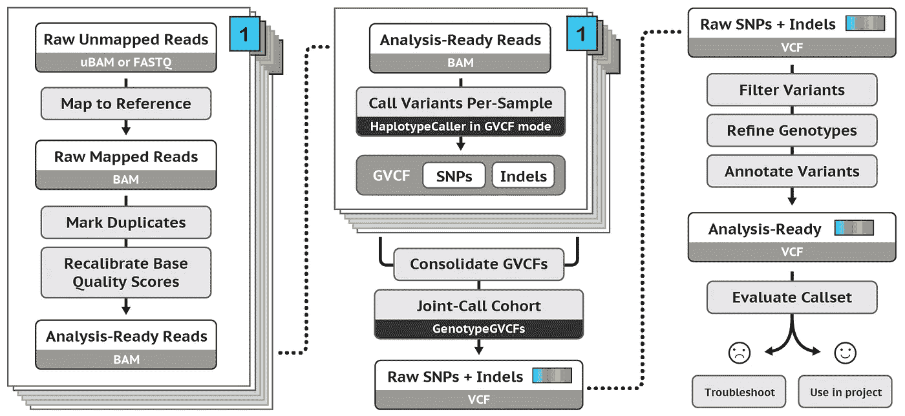
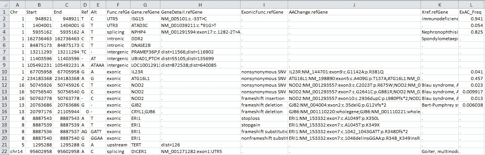

# 我的编程和生物信息学之旅:第 3 部分

> 原文：<https://towardsdatascience.com/my-journey-into-programming-and-bioinformatics-part-3-224ea62e92e0?source=collection_archive---------10----------------------->


生物信息学是一个非常广阔的领域，甚至还有专门的生物信息学硕士学位。在 10 分钟左右的阅读时间内涵盖所有方面是不可能的。如果你刚刚起步，对专业术语感到困惑，请阅读这篇文章。如果你想深入研究，Github *上有免费开放的* [*生物信息学课程。*](https://github.com/ossu/bioinformatics)

既然我们可以(在某种程度上)编程(第 1 部分)并对大规模并行测序(第 2 部分)的一些概念有所了解，我们可以继续并将这些应用于我们面临的任何问题。

更类似于第 1 部分，这篇文章将是一个教程、指南和期刊文章的集合，可以帮助您找到进一步研究的正确方向。这里的很多信息在 [Illumina 测序介绍中也有涉及。](https://www.illumina.com/content/dam/illumina-marketing/documents/products/illumina_sequencing_introduction.pdf)

在我们开始之前，了解常用术语是很重要的。我也将只涉及基于 Illumina 的测序，因为它是最广泛使用的测序类型。

## 词汇表

**覆盖面或阅读深度。**单个核苷酸的覆盖率或阅读深度(例如 30X)是该核苷酸被测序运行有效调用的次数。人类基因组 30 倍的平均覆盖率意味着平均每个核苷酸被测序 30 次。为什么这很重要？假设你只调用每个核苷酸一次。这样，你永远也不能说出这个位点是纯合的还是杂合的。如果你调用每个核苷酸两次，你可能会碰巧得到两次相同的核苷酸(例如一个 T)。你会认为这是一个纯合位点，而实际上，它是一个杂合位点(例如 A/C)。增加你调用该碱基的次数会增加以该碱基的真实频率结束的几率(50-50%，在蚊子或癌症中非常小的亚克隆的情况下为 1-99%)。

**成对末端读取。**成对末端测序能够对 DNA 片段的两端进行测序。因为每对读数之间的距离是已知的，比对算法可以使用该信息更精确地绘制重复区域的读数。这导致更好的读数比对，特别是在基因组的难以测序的重复区域，并允许检测结构变异。[更多信息请点击这里](http://www.illumina. com/technology/next-generation-sequencing/paired-end-sequencing_assay.html)。

**Phred (Q)质量评分。**Q = 10 log(10)P，其中 P =不良碱基或变异呼叫的概率。例如，如果 Phred 给碱基分配 30 (Q30)的 Q 分数，这相当于 1000 次中不正确碱基呼叫 1 的概率。这意味着碱基调用的准确性(即，正确碱基调用的概率)是 99.9%。[更多信息点击这里](https://www.illumina.com/documents/products/technotes/technote_Q-Scores.pdf)。

**FASTA 和 FASTQ 文件。**FASTA 格式用于存储生物序列(如核苷酸:“AGTCGGCTATTGCGAG”或氨基酸:“LIAEAYPEDSNATST”)。FASTQ 格式是 FASTA 格式的扩展，包含相应核苷酸的 Phred 质量分数，以显示测序仪对该核苷酸的“确信”程度。[更多信息请点击此处。](https://en.wikipedia.org/wiki/FASTQ_format)

**参考基因组。**当测序仪显示读数时(FASTQ 格式)，您需要将它们与参考基因组进行比对，以查看它们来自哪里。更简单的是，目前有三个参考基因组在使用。2009 年:GRCh37 和 hg192013 年:GRCh38。GRCh37 和 hg19 的染色体位置相同，但 GRCh*使用“chr”前缀表示染色体，而 hg*不使用。虽然这似乎是一个微不足道的问题，但如果你决定交换参考基因组，这可能会给你带来很多麻烦。挑一个坚持下去，除非真的要改。[这里是关于差异的更多信息](https://www.biostars.org/p/113100/)。[阅读如何选择参考基因组。](https://lh3.github.io/2017/11/13/which-human-reference-genome-to-use)虽然如果每个人都改用 GRCh38 会更好，但许多工具仍然依赖于 2009 版本，这使得转换很困难。

**SAM/BAM/CRAM-files。**SAM 格式是用于与参考序列比对的生物序列的格式，支持短和长读取(高达 128 Mb)。BAM 与 SAM 完全相同，但采用二进制格式以实现高效压缩(BAM 可由计算机读取，而 SAM 可由人类读取),因为 SAM 文件可能会变得非常、非常、非常大。CRAM 是 BAM 的更压缩版本。更多信息可在 [SAMtools 文档中找到。](https://samtools.github.io/hts-specs/SAMv1.pdf.)

**变体呼叫格式(VCF)。**VCF 格式是包含元信息行、标题行和数据行的文本文件，每一行都包含关于基因组中位置的信息。标题行命名了 8 个固定的强制列。这些列是:CHROM(染色体)、POS(位置)、ID(如 rsID)、REF(参考)、ALT(替代)、QUAL
(质量)、FILTER(通过或失败)、INFO(附加信息)。SAMtools 文档中提供了更多信息[。](http://samtools.github.io/hts-specs/VCFv4.2.pdf.)

## 图书馆准备

在您开始处理数据之前，显然您首先需要数据。将“原始”DNA 或 RNA 转化为可以测序的东西的过程被称为*文库制备*或简称为文库制备。它包括将 DNA 片段化成短序列(~300bp)并添加衔接子、索引和尾部。测序引物需要衔接子来结合。后面的解复用需要索引(见下文),最后，尾使 DNA 片段结合流动细胞成为可能。如果您对此感到困惑，请阅读第 2 部分了解更多信息。



[Illustration by Fimm](https://www.fimm.fi/en/services/technology-centre/sequencing/next-generation-sequencing/dna-library-preparation)

我不会在这里涉及湿实验室方面，让湿实验室的人在你开始做这些类型的分析时施展他们的魔法。但是，每个实验都是不同的，您需要了解您的样品使用的是哪种文库制备。如果你不这样做，你会有解释 QC 图的问题。

## 定序

在大多数情况下，当你刚刚开始时，你的工作将在测序运行结束时开始。看看测序的质量。我怎么强调都不为过。如果你有坏的数据开始，因为，例如，你的文库制备或测序运行出错，你的下游分析也将是坏的。垃圾进=垃圾出。

如果你的跑步记录被上传到 Basespace，你需要在[https://basespace.illumina.com/](https://basespace.illumina.com/)建立账户。

第一次打开 Basespace 时，你会被一系列你不理解的 QC 参数击中。为了更好地了解在 Basespace QC 中发生的事情，最好了解 Illumina 测序实际上是如何工作的。为此，我们需要深入研究流动池。根据您使用的机器，有两种流动池:模式化流动池和随机流动池。



[Further reading at CoreGenomics](https://core-genomics.blogspot.com/2016/01/almost-everything-you-wanted-to-know.html)

图案化和非图案化流动池都有优点和缺点。



Sources of duplicate reads on Illumina platforms. Source: Illumina.

如果您使用的是未形成图案的流动池，机器必须预先(用显微镜)目测决定簇的位置。通常(取决于测序机器)，这在前 5 个循环中完成。如果你使用一个低多样性的库，这会导致问题。例如，如果您的文库中的前 5 个核苷酸都是相同的(以 CAGTG 开始)，测序仪将不知道哪里有簇(因为在循环 1 中，整个流动池有 1 种颜色，C；在周期 2 中，整个流动池具有不同的颜色，等等)。

为了解决这个问题，你可以插入一个更复杂的不同的库，比如 [PhiX 基因组。](https://www.illumina.com/products/by-type/sequencing-kits/cluster-gen-sequencing-reagents/phix-control-v3.html)通常，在文库中加入约 1%的 PhiX 作为阳性对照来计算错误率。您知道 PhiX 基因组的序列，并且您知道比对后 PhiX 基因组中有多少错误，从而允许您计算测序运行中其他样品的错误率。在低多样性库的情况下，增加更高%的 PhiX 会增加库的多样性。

Illumina 有一个指南[解释地下室的参数](https://help.basespace.illumina.com/articles/descriptive/runs-charts/)。如果你认为你的跑步过于拥挤，这里有一个有用的指南[。](https://www.illumina.com/content/dam/illumina-marketing/documents/products/other/miseq-overclustering-primer-770-2014-038.pdf)

一个常见的问题是，你需要多少阅读量来准备你的图书馆。老实说，我不知道。使用覆盖率计算器。

在看了几次测序运行后(特别是如果你有一次不好的运行)，你会更熟悉什么参数是重要的，要注意什么等等。如果你不知道你在看什么，问问你的同事。

## Fastq 产生和解复用

你的测序给了你。bcl 文件(基本调用文件)。对于下游分析，我们需要。fastq 文件，用 [bcl2fastq](https://support.illumina.com/content/dam/illumina-support/documents/documentation/software_documentation/bcl2fastq/bcl2fastq_letterbooklet_15038058brpmi.pdf) 生成。如果您使用的是 Basespace，这是自动完成的。大多数情况下，您会希望每次测序运行对多个样品进行测序，因为(a)每个样品不需要那么多读数，(b)这样更便宜，(c)这样更快。

这就是为什么对于每个样本，你的 DNA 片段会有不同的索引。将读数合并回原始样本的过程称为*解复用*。Basespace 会自动为您完成这项工作。如果出于某种原因，你需要手动操作，[Gavin Wilkie 的](http://bioinformatics.cvr.ac.uk/blog/how-to-demultiplex-illumina-data-and-generate-fastq-files-using-bcl2fastq/)是一个很好的指南。



[Illustration by Illumina](https://www.illumina.com/content/dam/illumina-marketing/documents/products/illumina_sequencing_introduction.pdf)

## **使用 FastQC 进行质量评估**

更多质量控制！耶！请注意，我们仍然没有做任何事情来解释我们测序运行的生物学结果。

FastQC 是一个很好的工具，可以让你先看看你的数据。它可以给你一个印象，如果你的数据中有某些偏差，或者如果你的文库准备或测序运行中出现了问题。这真的很容易运行，只需在命令行中键入以下内容(安装后):

```
fastqc sample1.fastq.gz --outdir=/some/other/dir/
```

您将收到一个包含不同情节的. html。更多信息，一如既往，[在文档中。](https://www.bioinformatics.babraham.ac.uk/projects/fastqc/Help/3%20Analysis%20Modules/)不要依赖于 FastQC 上的通过/警告/失败，这真的取决于你的库准备。例如，在亚硫酸氢盐测序中，每个碱基序列中几乎没有胞嘧啶，但这是意料之中的(因为它们几乎都转化为胸腺嘧啶)。FastQC 将这些错误标记为“失败”。像 Basespace 一样，在解释 FastQC 图时，经验也很重要。如果你对某事感到困惑，问问同事。

大多数情况下，您会分析多个样本，并且会生成相当多的日志文件。 [MultiQC](http://multiqc.info/) 是一款非常棒的软件，只有一个命令:

```
multiqc .
```

您可以将所有日志文件汇总到一个报告中。我一直在用，怎么推荐都不够。

如果您对编写处理 fastq 文件的最佳实践管道感兴趣，您可能会对 [bcbio](https://bcbio-nextgen.readthedocs.io/en/latest/index.html) 感兴趣。但是你仍然需要知道在 bcbio 管道的引擎盖下发生了什么，或者你可能想要自己开发一个。

# 绘图

将产生的读数与参考序列进行比对的过程被称为“作图”。组装就是在没有参考序列的情况下生成基因组。这种方法的优点是检测结构变异、复杂的重排和重复序列。然而，精确的*从头*组装需要相对长的读数，这在 Illumina 测序中是不可能的。但是更长的阅读测序技术(纳米孔和 PacBio)即将出现，所以我们可能很快就会看到一些变化。然而，在 RNA 测序中，转录组的*从头*组装已经被用于检测新的转录物。

对于 DNA 图谱，最受欢迎的图谱绘制者是[BWA-记忆](http://bio-bwa.sourceforge.net/)和[鲍蒂 2](http://bowtie-bio.sourceforge.net/bowtie2/index.shtml) 。

对于 RNA 测序来说，最受欢迎的图谱绘制者是 [STAR](https://github.com/alexdobin/STAR) 、 [HISAT2](https://ccb.jhu.edu/software/hisat2/index.shtml) 和 TopHat。只有在 STAR 遇到内存问题时才使用 TopHat。总的来说，对于 RNA 测序，我喜欢参考 Conesa 及其同事的[这篇论文](https://www.ncbi.nlm.nih.gov/pmc/articles/PMC4728800/)和 Sahraeian 及其同事的[这篇论文](https://www.nature.com/articles/s41467-017-00050-4)。

为了绘制 DNA 甲基化图谱(亚硫酸氢盐转化的 DNA)，我使用 [Bismark](https://www.bioinformatics.babraham.ac.uk/projects/bismark/) 。

映射后，您的。fastq 通常被转换成. bam 文件。同样，查看日志文件。如果只有 35%的读数被唯一定位，那么你的文库准备、测序或数据分析可能出了问题。

## 重复读取

通常，您还会对样品中重复的数量感兴趣。如果> 99.9%是重复的，你将只是在你的文库制备中看到一些独特的片段。除非你在处理扩增子测序，否则你不会想要这个。

重复读取可能源于测序(见上文；流动细胞的类型)或从文库制备中的 PCR 获得。这些可以用[皮卡德](https://broadinstitute.github.io/picard/command-line-overview.html#MarkDuplicates)识别(用 MultiQC 可视化):

```
java -jar picard.jar MarkDuplicates \
      I=input.bam \
      O=marked_duplicates.bam \
      M=marked_dup_metrics.txt
```

如果一切看起来都很好，你可以继续进行下游分析，这取决于你的输入:DNA，RNA 或 DNA 甲基化。

# 例子:DNA 测序

## 变体调用

变异体调用是识别与参考序列(单核苷酸变异体、SNVs 和插入/缺失、indels)不同的核苷酸的过程，在这种情况下是您选择的参考基因组。根据你的输入材料，你可能对种系变异或体细胞变异感兴趣。

变体调用很难。非常辛苦。对我们来说幸运的是，布罗德研究所开发了一个工具包，名为[基因组分析工具包(简称 GATK)](https://software.broadinstitute.org/gatk/)，它附带了[【最佳实践】](https://software.broadinstitute.org/gatk/best-practices/)关于如何从全基因组测序、外显子组测序和靶向测序中为种系和体细胞变异调用进行变异调用。



GATK workflow for germline short variant discovery —June 2018

GATK 附带了大量的文档和教程。如果你有问题，而且你是在非常罕见的情况下，你不能在文档或谷歌上找到它，[开发者会非常迅速地在论坛](https://gatkforums.broadinstitute.org/gatk)上回答问题。留意你附近的 GATK 工作室。我有幸参加了 2017 年在比利时鲁汶举行的一次研讨会，这是我参加过的最有用的研讨会之一。GATK 进化的速度也很惊人。去年，体细胞 CNV 呼叫(见下文)仍处于早期测试阶段，现在已经有了经过验证的最佳实践指南。

虽然 GATK 是一个很棒的软件，但它对你放进去的东西也很挑剔。如果你正在用 GATK 开发一个管道，不要偷工减料。如果你在想“哦，我不需要按坐标排序我的 bam 文件，它可能会运行”。

剧透:不会的。

或者“我用的是 GRCh37，这个参考集在 hg19 中，这可能不成问题”。相信我，会的。我想我已经从 GATK 那里得到了所有存在的错误信息。但是过一会儿你就知道陷阱在哪里了。

成功运行 GATK 后，您将拥有一个. vcf 文件。然而，这是一个很长的变体列表。你如何从生物学角度理解这一点？首先，您可以从注释. vcf 开始。

## VCF 注释

答。没有任何注释的 vcf 看起来有点像:

```
[HEADER]
#CHROM  POS     ID      REF    ALT      QUAL    FILTER  INFO                    
1	889455	.	G	A	100.0	PASS	AF=0.0005
1	897062	.	C	T	100.0	PASS	AF=0.0005
```

[SnpEff](http://snpeff.sourceforge.net/S) 就是一个注释这个的工具。带有功能信息的 vcf。它用基因名称、错义/无意义变体、编码或非编码等信息更新 INFO 字段，结果如下所示:

```
#CHROM POS     ID        REF    ALT     QUAL FILTER INFO                    
1	889455	.	G	A	100.0	PASS	AF=0.0005;EFF=STOP_GAINED(HIGH|NONSENSE|Cag/Tag|Q236*|749|NOC2L||CODING|NM_015658|)
1	897062	.	C	T	100.0	PASS	AF=0.0005;EFF=STOP_GAINED(HIGH|NONSENSE|Cag/Tag|Q141*|642|KLHL17||CODING|NM_198317|
```

接下来，SnpSift(不要与 [SIFT](http://sift.jcvi.org/) 混淆)允许您基于您选择的参数过滤带注释的 VCF(例如，过滤掉质量分数低于 30 的变体):

```
cat variants.vcf | java -jar SnpSift.jar filter " ( QUAL >= 30 )" > filtered.vcf
```

这是一个非常强大的工具，可以做更多的事情，一定要看看文档。

[ANNOVAR](http://annovar.openbioinformatics.org/en/latest/user-guide/startup/) 是另一个为注释. vcf 而设计的工具，与 SnpSift 不同，ANNOVAR 的输出是. csv 或。tsv(逗号或制表符分隔的文件)。这些文件可以很容易地在 Excel 或其他电子表格程序中打开(只要确保基因名称没有被转换成日期，因为 Excel 是出了名的)。《T4》快速入门指南让你一切顺利。最后，你会得到这种格式，对于非生物信息学领域的人来说也很容易使用:



Source: ANNOVAR quick start guide

使用 Excel，您可以基于群体频率、内含子/外显子进一步筛选，以进一步探索数据。

## 复制号码变体(CNV)呼叫

拷贝数变异是大于 1000bp 的 DNA 片段的增加或减少。CNV 打电话也是辛苦的，这体现在[许多刊物](https://academic.oup.com/bib/article/17/2/185/1744035)上 CNV 打电话。

> 没有黄金标准，不同的工具针对非常不同的场景进行了优化。一些工具需要匹配的法线。一些使用法线池来更好的覆盖归一化。有些支持不使用平铺探针的检测的脱靶读数。有些是肿瘤纯度和倍性意识，并提供整数拷贝数。有些工具在高吞吐量环境中比其他工具工作得更好。有些在临床样品(例如低纯度 FFPE 样品)中比其他样品效果更好。— [马库斯·里斯特](https://www.biostars.org/p/242992/)

本质上看你想做什么。如果你想看看种系 CNVs，那就看看 [CNVkit](https://cnvkit.readthedocs.io/en/stable/) 。CNVKit 可以处理靶向测序、外显子组测序和全基因组测序数据，是 bcbio 推荐的。也很好用。Illumina 还有一个工具， [Canvas](https://support.illumina.com/help/BaseSpace_App_SmallPedigree_v1_OLH_1000000042562/Content/Source/Informatics/Canvas_Intro_swBS.htm) ，可以处理 WGS 数据。另一方面，如果你对体细胞 CNVs 感兴趣，今天是你的幸运日:GATK4 [有最佳实践](https://software.broadinstitute.org/gatk/best-practices/workflow?id=11147)。如果你想看看等离子体中的 CNVs，看看 [WISECONDOR。](https://github.com/VUmcCGP/wisecondor)

# 现在去哪里？

最后，基于最初的临床问题或假设，你会想要做一些生物学上的解释。你可能会对家庭成员之间共享的变体感兴趣(或缺乏变体，从头开始*变体)。还有一个工具[可以完成这个任务。或者，你可能对癌症中的体细胞热点突变感兴趣。或者是易患癌症的种系突变。或者完全不同的东西(那样的话，谷歌就是你的朋友。在写你自己的脚本之前，记住*某人*在某个时候也可能想做同样的事情。](https://gemini.readthedocs.io/en/latest/index.html)*

在从原始读取到变量调用的每一步过程中，保持你最初的假设是头脑。当与最初的问题(一个极端的例子:进行拷贝数变异呼叫以发现肺癌中的 EGFR T790M 突变)结合时，您的工作流程有意义吗？如果答案是“我不知道”或“可能”，你应该再次咨询做文库准备的湿实验室科学家和/或启动测序运行或项目的临床医生或研究人员。

为了简洁起见，我在这里只关注 DNA。我可以继续下去，用 RNA 和甲基化测序的类似资源填充另外 4 个段落。但是一旦你对以上有了一些经验，你就能自己找到你需要的。然而，如果你对一个关于 RNA 或甲基化的帖子感兴趣，请给我留言！

*我想感谢我在这篇博文中提到的每一个人，以及导师、朋友、同事和其他以各种方式帮助我的人。我与我提到的任何公司都没有任何关系。*

如果你喜欢读这本书，如果你把它推荐给你的朋友和同事，或者在推特或脸书上分享，那会很有帮助。

*关于作者:*

*我是 Ruben Van Paemel 博士，2017 年从医学院毕业后，我开始在根特大学(医学遗传学中心)担任博士研究员，由研究基金会 Flanders 资助。我也是根特大学医院的儿科住院医师。可以在 Twitter 关注我:*[*@ RubenVanPaemel*](http://www.twitter.com/RubenVanPaemel)

*我从事神经母细胞瘤的研究，这是一种罕见但极具破坏性的肿瘤，最常见于非常年幼的儿童。我们的团队试图了解潜在的基因改变，以提高神经母细胞瘤儿童的诊断、治疗和最终存活率。大数据和现代测序技术让我对编程、生物信息学、统计学和人工智能产生了兴趣。*