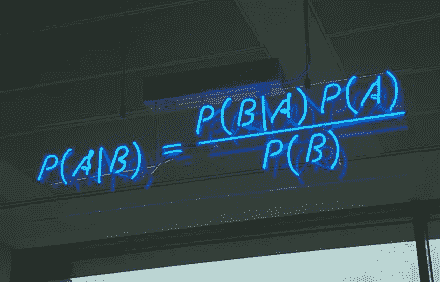

# 我的贝叶斯统计之旅

> 原文：<https://towardsdatascience.com/my-journey-to-bayesian-statistics-4097d432a853?source=collection_archive---------6----------------------->

Photo by [Guillermo Velarde](https://unsplash.com/@guille_velard?utm_source=medium&utm_medium=referral) on [Unsplash](https://unsplash.com?utm_source=medium&utm_medium=referral)

2018 年夏天，我有一个极好的机会，加入了马萨诸塞大学阿默斯特分校 Leontine Alkema 教授的实验室。我们用贝叶斯模型做了一个生物统计学研究。在这篇文章中，我将分享一些在我的研究中一直帮助我的资源。如果你也在学习贝叶斯统计的话，希望这能对你有所帮助！

# 一些关于我背景的信息

我是美国第一所女子学院 Mount Holyoke 学院的计算机科学专业学生。我 10 岁的时候开始了我的第一堂编程课。我对 Java、R、Python 和版本控制都很得心应手。而且，我对统计学和艺术史很感兴趣。在此研究之前，我对数据科学中的机器学习算法有基本的了解和项目经验。我每年还参加当地的数据科学竞赛。

# 我想分享的资源

0. [**基本概率**](https://www.probabilitycourse.com/chapter3/3_1_3_pmf.php) :概率是贝叶斯统计的前提。如果你没有任何概率方面的背景知识，请点击链接。

1. [**做贝叶斯数据分析，与 R，JAGS，斯坦的教程作者:约翰·克鲁施克**](https://www.amazon.com/Doing-Bayesian-Data-Analysis-Second/dp/0124058884/ref=sr_1_1?s=books&ie=UTF8&qid=1532228210&sr=1-1&keywords=doing+bayesian+data+analysis+a+tutorial+with+r%2C+jags%2C+and+stan) :这是我刚开始学习贝叶斯统计时的入门书。有了所有的例子和情节，很容易理解一些必须的想法。

2. [**麻省理工学院电子讲座**](https://ocw.mit.edu/courses/mathematics/18-650-statistics-for-applications-fall-2016/index.htm) :这门课完全免费。菲利普·里戈莱教授很容易理解。他有两节关于贝叶斯统计的课。你也可以利用这些讲座来概括一些统计学的基础知识。

3.[**Bradley p . Carlin 和 Thomas A. Louis 的数据分析贝叶斯方法**](https://www.amazon.com/Bayesian-Methods-Analysis-Chapman-Statistical/dp/1584886978) :这本书有很多例子和 R 代码。与 Kruschke 的书不同，这本书用大量的细节来解释贝叶斯模型。

4.彼得·d·霍夫的《贝叶斯统计方法初级教程》 [**:这本书解释了贝叶斯统计为什么以及如何工作。它被选为许多贝叶斯统计课的教科书。**](https://www.springer.com/us/book/9780387922997)

5. **MCMC 和 Metropolis 算法**

6. [**置信区间和可信区间**](https://stats.stackexchange.com/questions/2272/whats-the-difference-between-a-confidence-interval-and-a-credible-interval) : Keith Winstein 的回答是我迄今为止见过的最直白的解释之一。我把这个推荐给大家。

7. [**时间序列**](https://people.maths.bris.ac.uk/~magpn/Research/LSTS/STSIntro.html) :将时间序列添加到你的贝叶斯模型中总是很有趣:这是一个关于时间序列的简单易懂的入门教程。

[**【周期性和季节性时间序列**](https://robjhyndman.com/hyndsight/cyclicts/):Rob J hynd man 的精彩解释

8.**使用贝叶斯统计的更多示例**:

 [## 经验贝叶斯方法的模拟(使用棒球统计)

### 我们即将结束关于经验贝叶斯方法的这个系列，并且已经触及了许多统计方法…

varianceexplained.org](http://varianceexplained.org/r/simulation-bayes-baseball/) 

我喜欢大卫·罗宾逊的博客！他们太棒了，真的让我在贝叶斯世界大开眼界。因为我的研究都是关于计划生育的，所以很高兴看到贝叶斯统计如何应用于其他现实生活场景。大卫还写了一本书，名为[经验贝叶斯导论:棒球统计的例子](http://varianceexplained.org/r/empirical-bayes-book/)。如果你正在学习贝叶斯统计，你不想错过它！

 [## 贝叶斯统计如何说服我去健身房

### 一个有趣的旅程到线性回归理论与贝叶斯触摸(嘘嘘:我用公制测量在这…

towardsdatascience.com](/how-bayesian-statistics-convinced-me-to-hit-the-gym-fa737b0a7ac) 

读到 Tuan Doan Nguyen 的这篇文章，我真的很兴奋。很励志！我真的很期待在中国建立一个案例模型。

9.**其他检查列表**

 [## 数据科学的贝叶斯统计

### 这是博客文章系列“数据科学的概率与统计”的第五篇，这篇文章涵盖了这些主题…

towardsdatascience.com](/bayesian-statistics-for-data-science-45397ec79c94) 

安基特·拉希写了这个惊人的博客系列，其中还包括许多有用的链接！我从他们身上学到了很多。非常感谢！

我要感谢实验室里的每一个人，让我们度过了这个美妙的夏天:Leontine Alkema、Krzysztof Sakrejda、Emily Peterson、Greg Guranich、Chuchu Wei、Wang 和 Remy Wang。

感谢您阅读我的博客，希望对您有所帮助。如果你想关注我未来的更新，请随时通过 [LinkedIn](https://www.linkedin.com/in/serena-wang-899562119/) 和 [Medium](https://medium.com/@syjwang09) 与我联系。加油贝叶斯！

(credit: [https://en.wikipedia.org/wiki/Bayes%27_theorem](https://en.wikipedia.org/wiki/Bayes%27_theorem))