# 我的图书推荐系统建设之旅。。。

> 原文：<https://towardsdatascience.com/my-journey-to-building-book-recommendation-system-5ec959c41847?source=collection_archive---------2----------------------->

推荐系统已经占据了我很长一段时间，由于我喜欢看书，探索图书交叉数据集非常有吸引力。

在线推荐系统是许多电子商务网站要做的事情。推荐系统广泛地向顾客推荐最适合他们口味和特点的产品。关于推荐系统的更多细节，请阅读我关于推荐系统的介绍性文章和一些使用 Python 的插图。

当我遇到[图书穿越](http://www2.informatik.uni-freiburg.de/~cziegler/BX/)数据集时，我开始了构建图书推荐系统的旅程。该数据集由 Cai-Nicolas Ziegler 于 2004 年编制，由用户、图书和评分三个表组成。显性评分用 1-10 分表示(数值越高表示欣赏程度越高)，隐性评分用 0 分表示。

在建立任何机器学习模型之前，了解数据是什么以及我们试图实现什么是至关重要的。数据探索揭示了隐藏的趋势和见解，数据预处理使数据准备好供 ML 算法使用。

那么，我们开始吧。。。

首先，我们加载数据集并检查图书、用户和评级数据集的形状，如下所示:

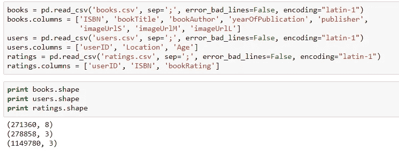

# 书

逐一研究这些数据集，从 books 数据集开始，我们可以看到 image URLs 列似乎不是分析所必需的，因此可以删除它们。

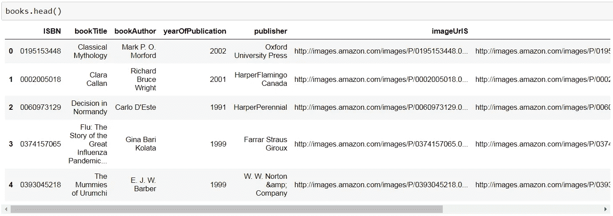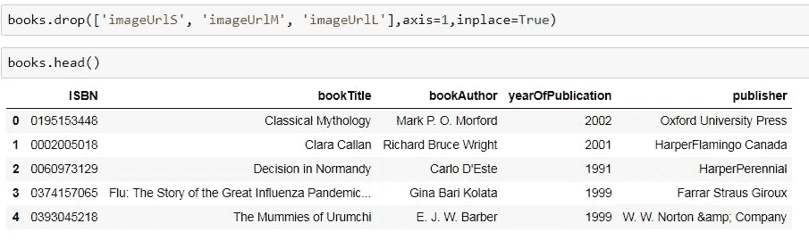

我们现在检查每一列的数据类型，并纠正缺失和不一致的条目。我还调整了列宽，以显示各列的全文。

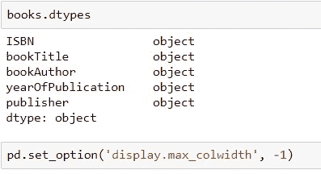

## **出版年份**

现在我们检查这个属性的唯一值。

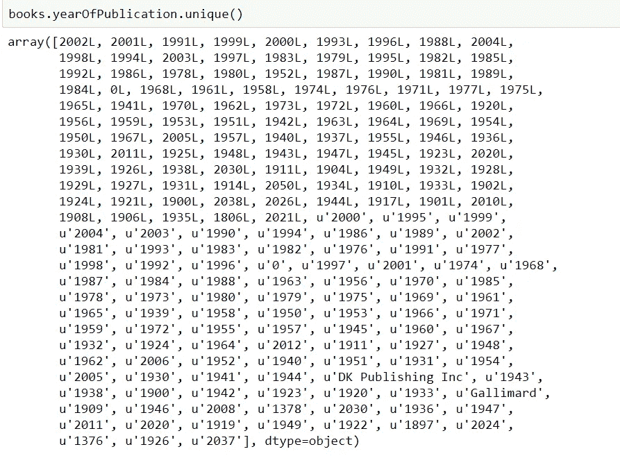

yearOfPublication 中有一些不正确的条目。由于 csv 文件中的一些错误，出版商名称“DK Publishing Inc”和“Gallimard”似乎被错误地加载为数据集中的 yearOfPublication。此外，一些值是字符串，在某些地方相同的年份被输入为数字。我们将对这些行进行必要的更正，并将 yearOfPublication 的数据类型设置为 int。

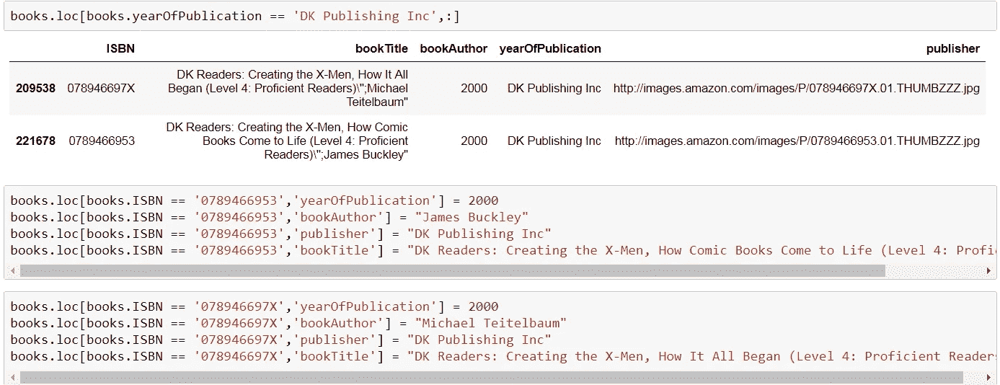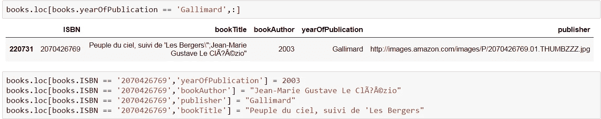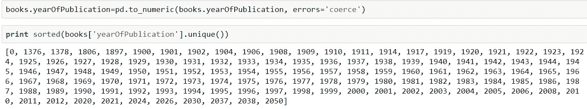

现在可以看到 yearOfPublication 的类型是 int，其值的范围是 0–2050。由于这个数据集是在 2004 年构建的，我假设 2006 年以后的所有年份都是无效的，保留两年的余量，以防数据集可能已经更新。对于所有无效条目(包括 0)，我会将这些转换为 NaNs，然后用剩余年份的平均值替换。

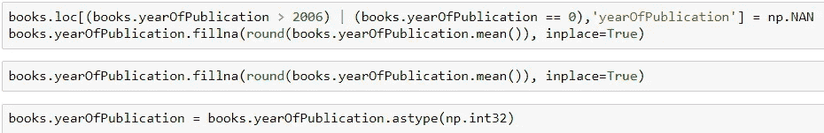

## 出版者

来到“publisher”列，我已经处理了两个 NaN 值，将它们替换为“other ”,因为经过一些调查后无法推断出 publisher 的名称(检查 jupyter 笔记本嵌入)。

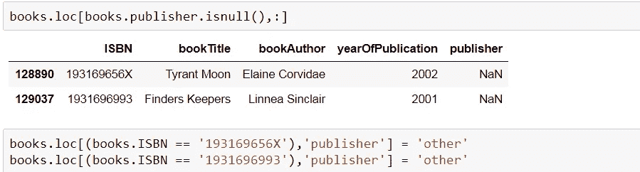

# 用户数据集

现在，我们研究用户数据集，首先检查它的形状、前几列和数据类型。

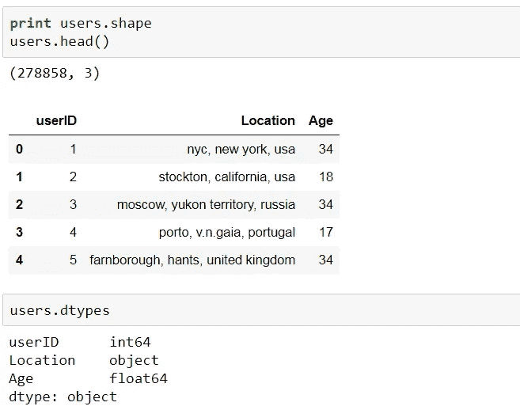

## 年龄

在检查唯一值时，userID 看起来是正确的。但是，年龄列有一个 NaN 和一些非常高的值。在我看来，5 岁以下和 90 岁以上没有太大的意义，因此，这些正被 NaNs 所取代。然后，所有的 NaNs 都被替换为年龄的平均值，其数据类型被设置为 int。

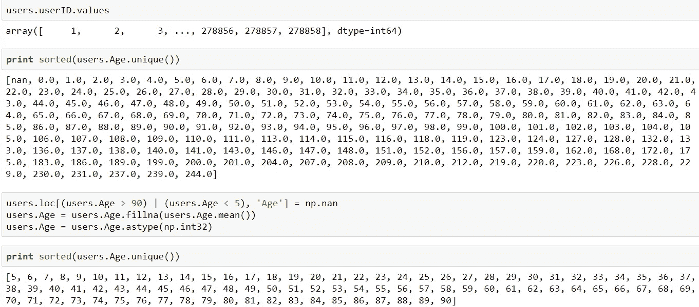

我在这里没有对 Location 列进行任何处理。但是，如果您愿意，您可以进一步将其分为城市、州、国家，并使用文本处理模型进行一些处理。

# 评级数据集

我们检查评级数据集的形状和前几行。它揭示了我们的用户-图书评分矩阵将非常稀疏，因为实际评分与评分矩阵的大小(用户数×图书数)相比非常小。

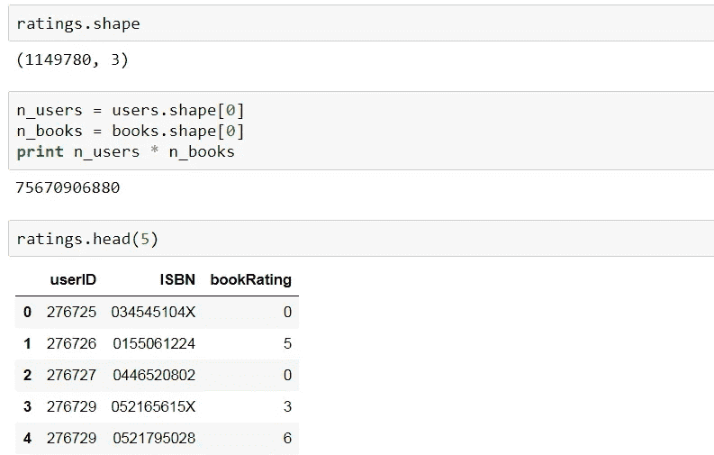

现在评级数据集应该有 userID 和 ISBN，它们存在于各自的表中，即。用户和书籍。

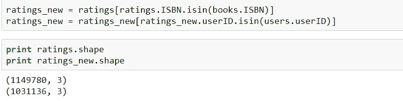

很明显，用户已经对一些书籍进行了评级，这些书籍不是原始书籍数据集的一部分。数据集的稀疏度可以计算如下:

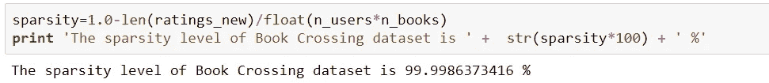

由 1-10 表示的明确评级和由 0 表示的隐含评级现在必须分开。我们将只使用明确的评级来建立我们的图书推荐系统。类似地，用户也被分为那些明确评级的用户和那些隐含行为被记录的用户。

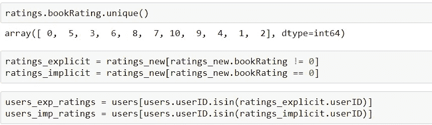

bookRating 的计数图表明，较高的评分在用户中更常见，评分 8 被评为最高次数。

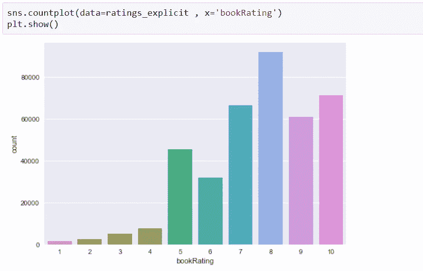

# 简单的基于流行度的推荐系统

在这一点上，一个简单的基于流行度的推荐系统可以基于不同书籍的用户评级计数来构建。很明显，J.K .罗琳写的书很受欢迎。

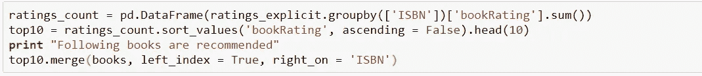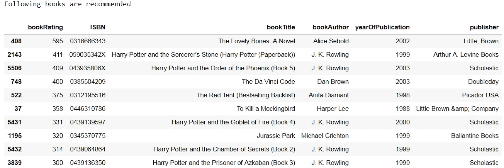

# 基于协同过滤的推荐系统

为了应对我的机器拥有的计算能力并减少数据集的大小，我正在考虑对至少 100 本书评分的用户和至少有 100 个评分的书。

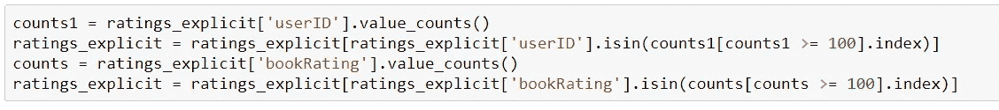

构建基于 CF 的推荐系统的下一个关键步骤是从评分表中生成用户项目评分矩阵。

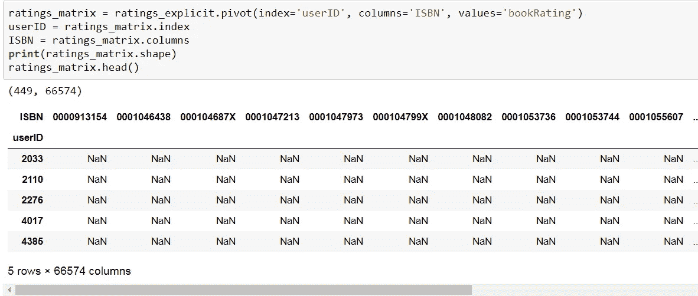

请注意，评级矩阵中的大部分值都是 nan，表示缺少评级，因此数据稀疏。另外，请注意，这里只考虑了显式评级。由于大多数机器学习算法不能处理 nan，我们用 0 来代替它们，这现在表示没有评级。

# 基于用户的 CF

我将重用我的文章[中的功能，例如基于 CF 的推荐系统](/collaborative-filtering-based-recommendation-systems-exemplified-ecbffe1c20b1)。函数**findksimilarrusers**输入 userID 和评级矩阵，并返回 k 个相似用户的相似度和索引。(阅读我以前的故事，了解基于用户/项目的 CF 方法的概念和公式)

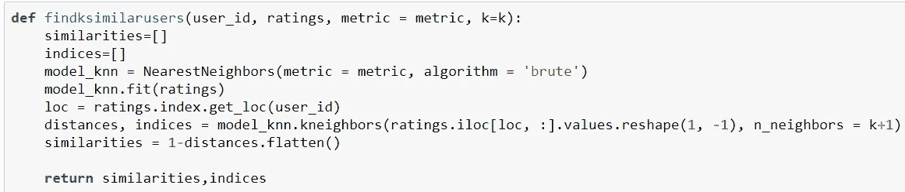

函数 **predict_userbased** 基于基于用户的方法预测指定用户-项目组合的评分。

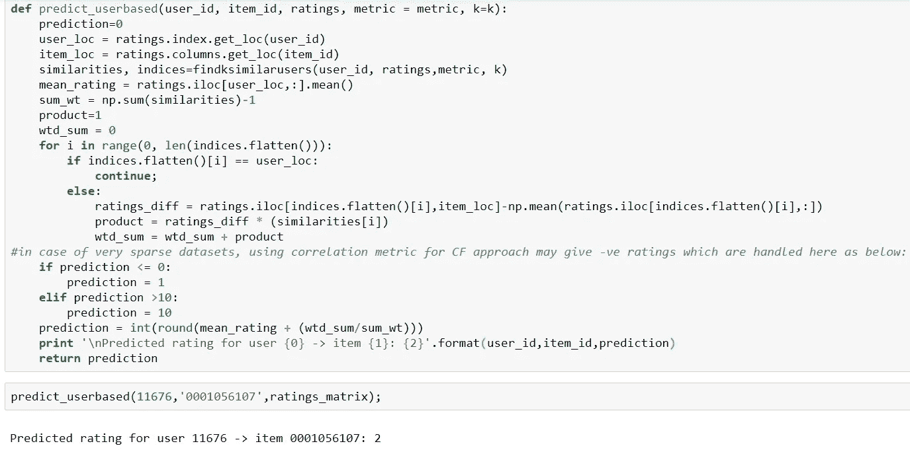

函数 **recommendItem** 使用上述函数为基于用户或基于项目的方法(基于选定的方法和指标组合)推荐图书。如果一本书的预测评级大于或等于 6，并且该书还没有被评级，则进行推荐。调用此功能时，您可以选择相似性度量(**余弦/相关性**)。

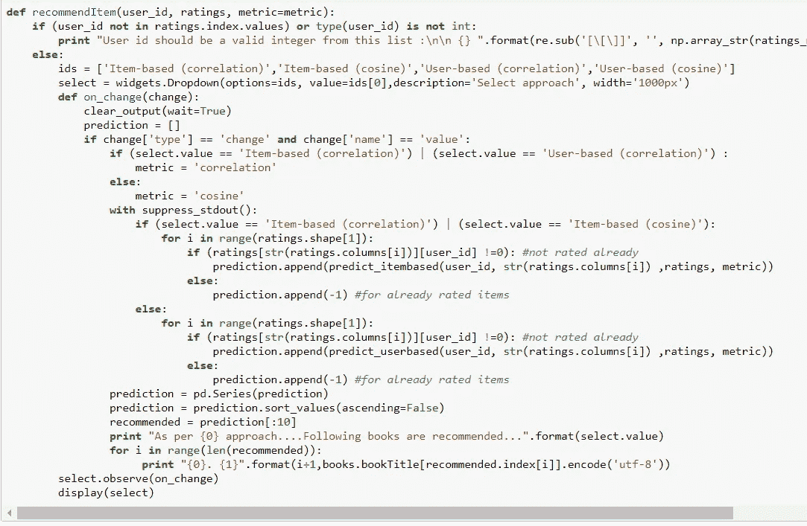

瞧啊。！！基于基于用户的 CF 方法，检查用户 4385 的前 10 本书推荐。

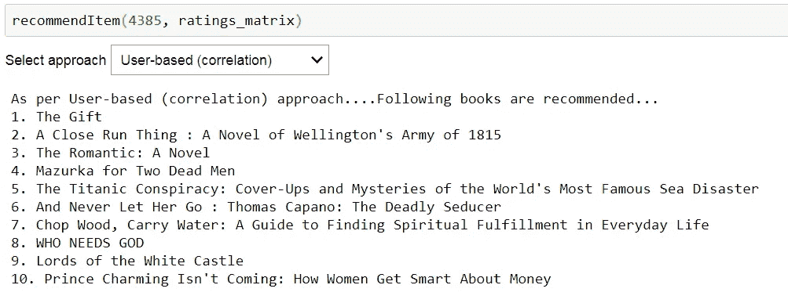

# 基于项目的 CF

已经为基于条目的 CF 编写了类似的函数来查找 k 本相似的书，并预测用户对每本书的评分。相同的功能**recommende item**可用于根据基于项目的方法和所选指标推荐书籍。如果一本书的预测评级大于或等于 6，并且该书还没有被评级，则进行推荐。

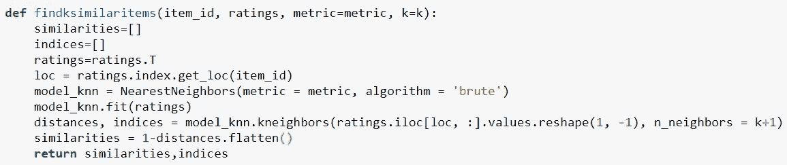

哇！！！根据基于条目的 CF 方法，检查为用户 4385 推荐的前 10 本书。这些与基于用户的方法所建议的显著不同。

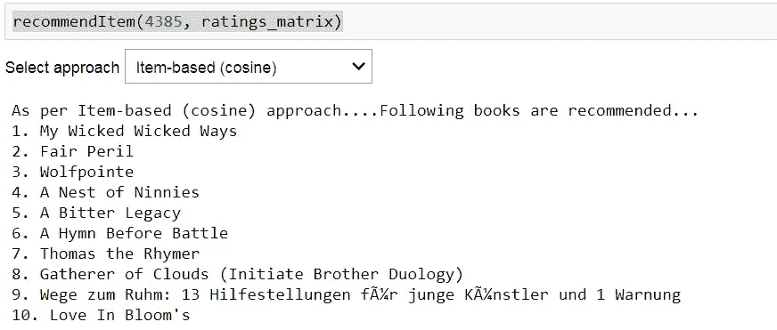

在这篇文章中，像交叉验证、测试序列分割和推荐系统的评估这样的领域还没有被讨论，这些领域值得探索。下面嵌入了 Jupyter 笔记本的这个代码。

 [## csaluja/JupyterNotebooks-中号

### 在 GitHub 上创建一个帐户，为 JupyterNotebooks-Medium 开发做出贡献。

github.com](https://github.com/csaluja/JupyterNotebooks-Medium/blob/master/Book%20Recommendation%20System.ipynb) 

感谢阅读！我希望你喜欢这篇文章。请在下面的评论区分享你的观点。同时，我会去为自己查一些书籍推荐。

参考资料:

1.[https://towards data science . com/how-do-we-build-book-recommender-systems-in-hour-the-fundamentals-dfee 054 f 978 e](/how-did-we-build-book-recommender-systems-in-an-hour-the-fundamentals-dfee054f978e)

2.[https://Cambridge spark . com/content/tutorials/implementing-your-own-recommender-systems-in-Python/index . html](https://cambridgespark.com/content/tutorials/implementing-your-own-recommender-systems-in-Python/index.html)