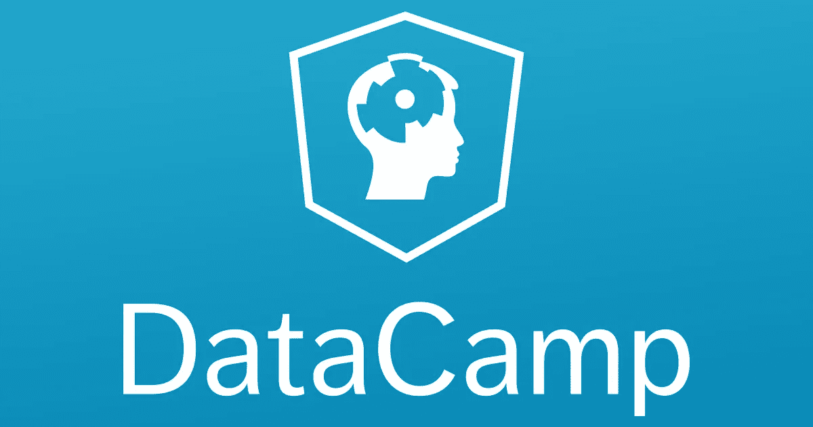
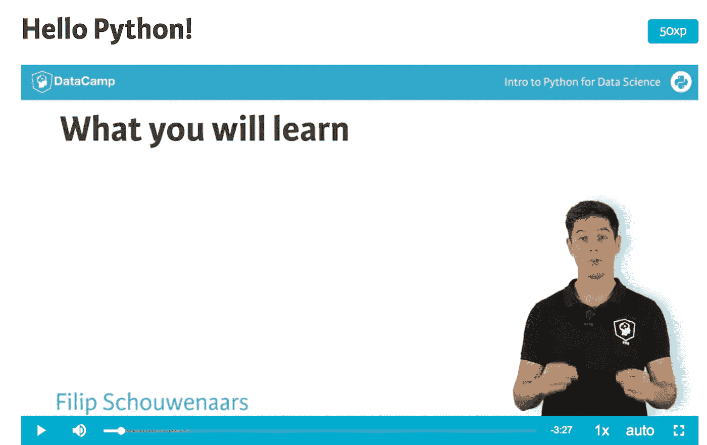
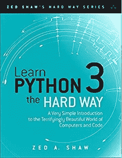
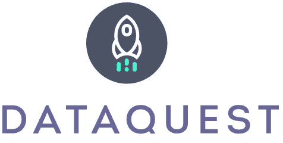

# 我的数据科学之旅(面向零编码经验的初学者)

> 原文：<https://towardsdatascience.com/my-journey-to-data-science-for-beginner-with-zero-coding-experience-1e7896b564d3?source=collection_archive---------1----------------------->

正如我在上一篇博客文章中所说，自从我在大会上开始数据科学沉浸式课程以来，已经过去了三周。只是给你一个视角，让你了解我现在的学习进度。我想说，我学到了很多关于 python(我们在课堂上使用的主要语言)和一些基本的统计算法(t 检验、p 值、z 得分)。然而，我还没有自信到可以教人的程度。但是我认为如果我继续努力，这是可行的。今天，我想与你分享我采取的步骤和我使用的一些好的资源。

供您参考，在本课程之前，我的编码经验非常有限。我在大学时学过 HTML 和 CSS，但仅此而已。好像是五年前。GA 的要求之一是在参加课程之前完成课前准备工作，旨在帮助我们快速学习数据科学沉浸式课程。课前工作是一个基于网络的学习工具，名为 DataCamp(链接:[https://www.datacamp.com/home](https://www.datacamp.com/home))。它提供了各种各样的计算机科学相关的课程，你可以从初级水平到高级水平。

**以下是我喜欢它的地方:**

1.  非常有活力的教学风格。编码有时会被解释和混淆。它提供了一段视频，由一名教师演示材料并解释编码背后的逻辑，如果你能通过观看更好地学习，这将非常有帮助。此外，它使整个学习过程变得直观，并允许用户返回视频进行任何参考。
2.  实践。很多练习。通常看完视频后，他们会围绕这个话题做几个练习。练习也有不同的形式，通常坚持多项选择题和在给出指令的界面上编写代码。
3.  提供演示幻灯片的 PDF 版本，您可以下载到您的本地资源进行查看。
4.  它保存了你的进步。如果你有一个繁忙的时间表，它允许你跳回到你上次离开的地方。

**以下是我推荐给初学者参加的 DataCamp 的一些课程:**

Screenshot of DataCamp interactive platform with instructor teaching

1.  面向数据科学的 python 简介-涵盖了您需要了解的关于 Python 的所有基本资料。共有 4 个不同主题的章节。不要继续下一章，直到你有一个坚实的理解，因为每一章通常是建立在前一章的基础上。如果有必要的话，多做几次。

2.面向数据科学的中级 Python 一旦您掌握了基础知识，这就是您应用知识和进行案例研究的地方。它涵盖了更深入的课程，如可视化工具，数据结构和其他软件包的实施。这可能是你想花更多时间关注每一章的地方，因为随着时间的推移，你会在案例研究中用到本课程的大部分工具。

所以我在 DataCamp 一共上了 8 门不同的课程。我不会说我记得所有的事情，但它确实让我开始编码并在案例研究中应用逻辑。请记住，如果 DataCamp 不适合你的学习风格，有很多资源可以帮助初学者。

**我为初学者推荐的其他资源:**

Hard cover of the book

**艰难地学 Python 数字&书** —这本书是为没有编码经验的初学者设计的。作者用非技术人员也能理解的方式解释了一切，做得非常好。此外，他一步一步地解释练习，很容易跟上。你可以购买这本书或者阅读免费的 html 版本。

链接:【https://learnpythonthehardway.org/book/ 

**DataQuest** —另一个类似 DataCamp 的学习平台。它允许你根据你想要完成的目标来选择学习路径。尽管这种学习方式更多的是基于文本的。对那些通过阅读学得更好的人来说很棒。你将阅读概念，然后做练习。此外，它提供的指令不如 DataCamp 具体。所以你不能猜测答案，而在 DataCamp 中，你可以通过阅读说明来推断答案。我所做的是，我将学习 DataCamp 的基本形式，并从 DataQuest 进行更多的练习。有限的课程是免费的，但是如果你想打开所有的课程以及其他的额外津贴，你可以选择按月订阅。

链接:[https://www.dataquest.io/home](https://www.dataquest.io/home)

如果你有其他好的资源想要分享，请在帖子里留下评论。我确信有人能从中受益。记住，当你学习新的东西时，它必然会有一个学习曲线。一旦你投入了足够的时间和精力，这些点将开始连接起来，你会有更多的学习乐趣。