# 我的强化学习之旅——第 1.5 部分:使用 Q 学习的简单二进制图像转换

> 原文：<https://towardsdatascience.com/my-journey-to-reinforcement-learning-part-1-5-57f334189655?source=collection_archive---------8----------------------->

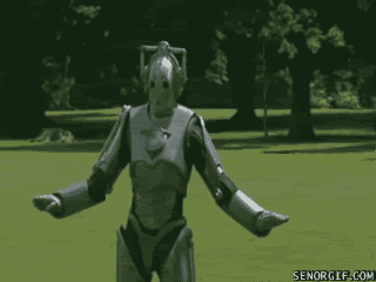

GIF from this [website](https://giphy.com/gifs/cheezburger-robot-nambot-1Mng0gXC5Tpcs/download)

所以今天，我想用 Q-learning 解决一个非常简单的问题，希望能让我的理解更加具体。

> ***警告**我还在学习 RL，我学习东西的方式是通过给自己解释概念，而这篇帖子正是如此。注意，我还在学习这个话题，所以如果你是来学习 RL 的，我推荐你不要看我的帖子，而是来自 UCLA 博士生的这个帖子:* [***深度强化学习去神秘化(第 0 集)***](https://medium.com/@m.alzantot/deep-reinforcement-learning-demystified-episode-0-2198c05a6124)

**实验设置**

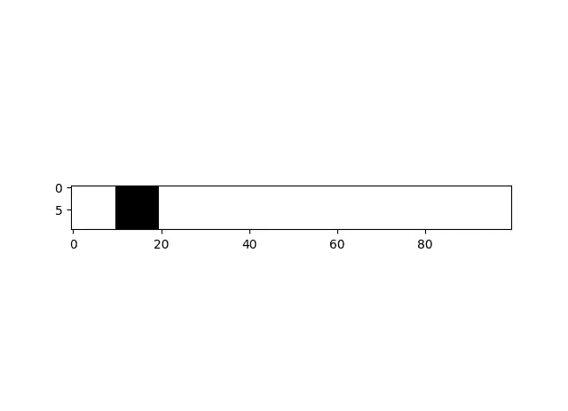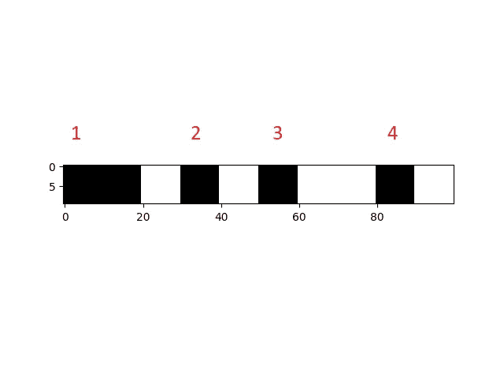

**左侧图像** →原始图像
→右侧图像 →变换图像
→红色数字 →添加黑色块，共有 4 个

所以整个实验非常简单，我们想从左边的图像到右边的图像。我们只想在给定的图像中增加 4 个黑色块。

**Q-学习设置(状态，动作)**

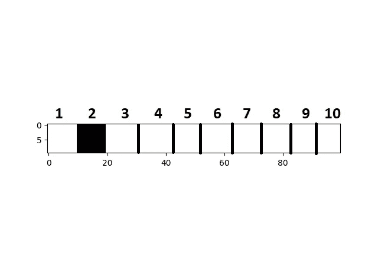

**黑色数字/线条** →将图像分成 10 个小状态

首先，让我们制作状态，因为我们的原始图像的尺寸是 10 * 100，让我们把图像分成小方块(10 * 10)，这样我们就有 10 个方块。

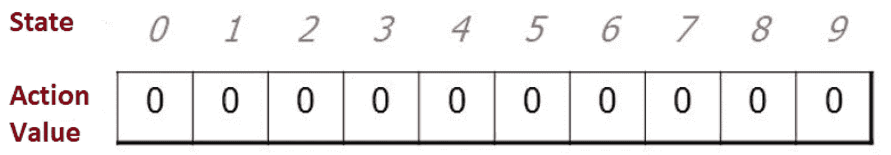

Modified Image from [here](http://slideplayer.com/slide/8688800/)

所以我们的 Q-Learning 表看起来会像上面这样。它是一个一维数组，数组的索引是状态，数组中的值是阈值。这意味着我们将有一个阈值过滤器，只让特定的像素强度通过，其他的将被过滤掉。

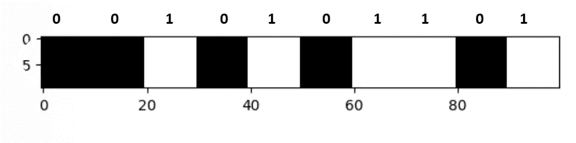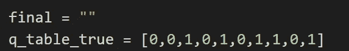

上面我们可以看到手工制作的地面真值表，我们可以看到零号的索引对准了图像中有黑色块的地方。但是我们想学习这些阈值，而不是手工制作。因此，让我们首先初始化我们的 Q 表如下，所有的 1。

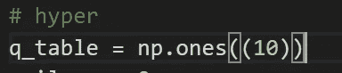

最后，让我们定义奖励可以是什么，因为这让我们简单地对我们有阈值的图像和地面真实图像进行逐位 XOR 运算。

**Q-学习设置(奖励-异或不同值)**

Image from this [website](http://android.okhelp.cz/drawbitmap-clippath-union-difference-intersect-replace-xor-android-example/)

**红框** →图像中的异或运算

在两幅图像之间进行 XOR 运算，将会给出这两幅图像之间有多少差异。因此，如果两个图像相同，XOR 差值将为 0，因为没有差异。否则，如果图像完全不同，我们将获得 XOR 运算的正值，因为存在巨大的差异。

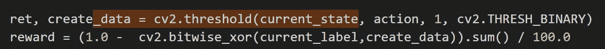

**create_data** →阈值运算后创建的图像
**奖励**→create _ data 与地面真值之间的异或运算

因为我们的目标是用正确的值填充 Q 表，所以我们应该减去 1 并除以最大像素强度，即 100。如果阈值是正确的，则奖励 1，如果阈值是错误的，则奖励 0。

**电子贪婪探索**

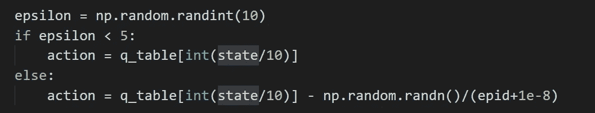

我们将创建一个名为 epsilon 的变量，根据这个值，我们将更改阈值或保持不变。此外，随着事件数量的增加，我们将采用较小的数量级，为了数值稳定性，我们将添加 1e-8。

**结果**

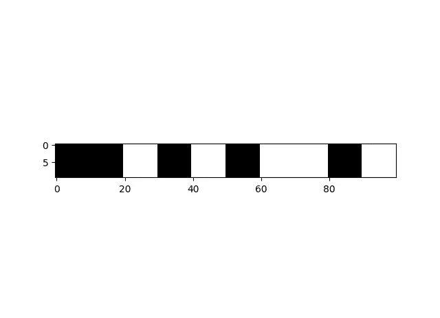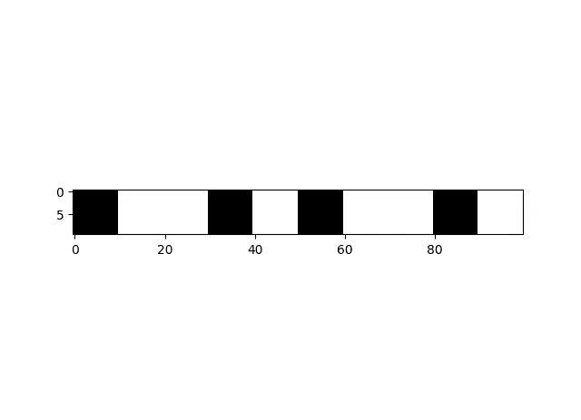

**左上** →原始图像
**右上** →地面真实图像
**左下** →由学习的 Q 表值生成的图像
**右下** →由手工制作的 Q 表值生成的图像

我们的 Q 表已经错过了一个块，这是第二个黑色块。但是让我们看看原始的 Q 表结果。

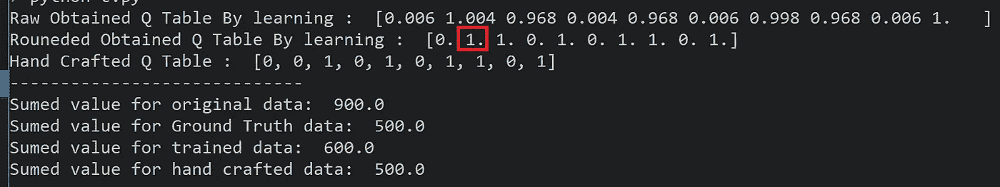

**红框** →阈值 1 的值不正确

**交互代码**

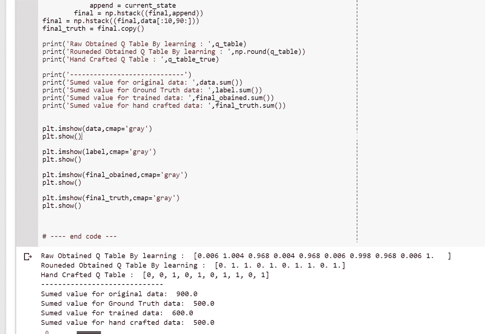

*对于谷歌 Colab，你需要一个谷歌帐户来查看代码，而且你不能在谷歌 Colab 中运行只读脚本，所以在你的操场上做一个副本。最后，我永远不会请求允许访问你在 Google Drive 上的文件，仅供参考。编码快乐！*

要获取这篇文章的代码，[请点击这里。](https://colab.research.google.com/drive/1vK9rfNrhujBzK_cLaxiMZ1n_dVoao_q4)

**最后的话**

滑铁卢大学的一位教授已经给出了使用 RL 来执行分割的示例“ [*增强学习在经直肠超声图像分割中的应用*](https://bmcmedimaging.biomedcentral.com/articles/10.1186/1471-2342-8-8) ”我也希望尽快实现该论文。

如果发现任何错误(因为我仍在学习，会有很多)，请发电子邮件到 jae.duk.seo@gmail.com 给我，如果你希望看到我所有写作的列表，请在这里查看我的网站。

同时，在我的 twitter 上关注我[这里](https://twitter.com/JaeDukSeo)，访问[我的网站](https://jaedukseo.me/)，或者我的 [Youtube 频道](https://www.youtube.com/c/JaeDukSeo)了解更多内容。如果你感兴趣的话，我还做了解耦神经网络[的比较。](https://becominghuman.ai/only-numpy-implementing-and-comparing-combination-of-google-brains-decoupled-neural-interfaces-6712e758c1af)

**参考**

1.  构建 Java 程序第 7 章— ppt 下载。(2018).Slideplayer.com。检索于 2018 年 4 月 10 日，来自[http://slideplayer.com/slide/8688800/](http://slideplayer.com/slide/8688800/)
2.  drawBitmap，clipPath，UNION，DIFFERENCE，INTERSECT，REPLACE，XOR Android 示例|面向开发者的软件和源代码。(2018).Android . ok help . cz . 2018 年 4 月 10 日检索，来自[http://Android . ok help . cz/draw bitmap-clip path-union-difference-intersect-replace-xor-Android-example/](http://android.okhelp.cz/drawbitmap-clippath-union-difference-intersect-replace-xor-android-example/)
3.  f .萨赫巴、h .提祖什和 m .萨拉马(2008 年)。强化学习在经直肠超声图像分割中的应用。BMC 医学影像，8(1)。doi:10.1186/1471–2342–8–8