# 我的强化学习之旅——第二部分:多臂强盗问题

> 原文：<https://towardsdatascience.com/my-journey-to-reinforcement-learning-part-2-multi-armed-bandit-problem-eefe1afab73c?source=collection_archive---------7----------------------->

GIF from this [website](https://giphy.com/gifs/dice-trigonal-1Cho4T0V1ddAc)

目前，我正在研究强化学习，我想解决著名的多臂强盗问题。(既然这个问题已经非常有名，我就不详细解释了，希望你没问题！).下面是我们将用来解决这个问题的不同类型的解决方案。

> 请注意，这篇文章是关于我的学习过程的，因为我学习的方式是向自己解释概念，这篇文章就是这样。

**问题介绍(多臂土匪)**

Image from this [website](https://www.michaelpacheco.net/blog/RL-multi-armed-bandit)

现在这个问题已经很出名了，因为我不擅长英语(lol)，我已经链接了我朋友(Michael)关于这个问题的解释。如果你想阅读它，请[点击这里](https://www.michaelpacheco.net/blog/RL-multi-armed-bandit)，或者如果你想阅读更多内容，请[点击这里](https://www.quora.com/What-is-the-multi-arm-bandit-problem-What-are-some-of-its-implications)。然而，我将集中讨论解决这个问题的不同方法。(因为我在研究中发现，确实有多种方法可以解决这个**部分信息序贯**决策问题。)

**解决方案 1)ε-贪婪代理**

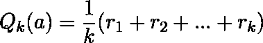

Image from this [website](/solving-the-multi-armed-bandit-problem-b72de40db97c)

上面的等式是行动-价值函数，它衡量在某个状态下有多好，采取什么行动。然而，在我们的问题中，我们只有一个国家，我们选择哪个国家武装土匪拉，因此我们可以删除符号 s。(这就是为什么我们看不到它的原因。)

如上所述，经过一些扩展和替换，我们可以得到一个更简单的方程。等式的另一种格式可以在下面看到…

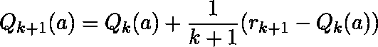

Image from this [website](/solving-the-multi-armed-bandit-problem-b72de40db97c)

我们现在可以将动作函数写入 python，如下所示。

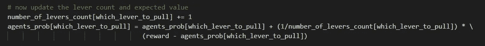

如果我们运行代码，我们可以得到如下所示的结果。

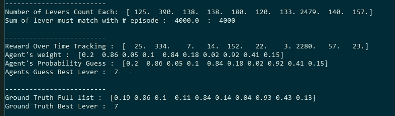

如上所述，一些百分比是关闭的，然而谢天谢地，我们的代理人正确地预测，土匪# 9 有最高的概率。(归功于这个解决方案 [michaelpacheco](https://michaelpacheco.net/) 和 [Anson Wong](https://towardsdatascience.com/@ankonzoid?source=post_header_lockup) )

**解决方案 2)政策梯度**

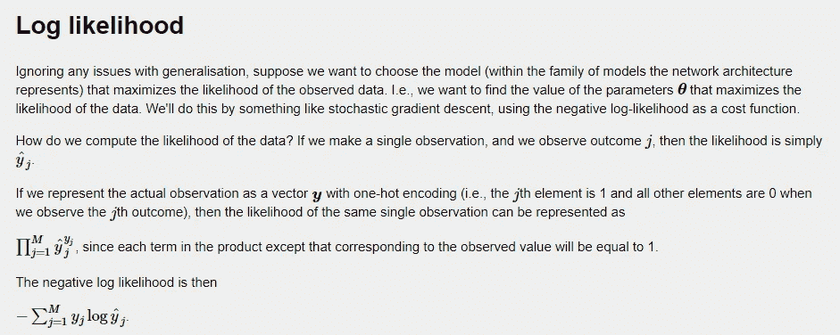

Image from this [website](http://www.awebb.info/blog/cross_entropy)

这种方法非常简单，在我们进入更深层次的神经网络之前，让我们只使用简单的对数似然及其导数来选择最佳水平。(有关该解决方案的更多深入解释，请[点击此处。](https://medium.com/@awjuliani/super-simple-reinforcement-learning-tutorial-part-1-fd544fab149))

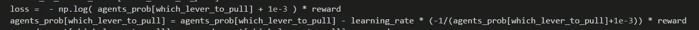

实验的设置与前一个完全相同，但是现在我们要更新代理的权重。正如上面所看到的，当在 numpy 中实现时，我们将需要执行衍生我们自己。下面是结果…..

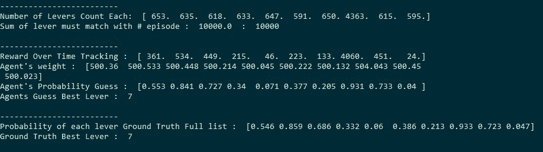

如上所述，代理对每个概率的猜测与实际的真实概率有些接近。(归功于这个解决方案[亚瑟·朱利安尼](https://medium.com/@awjuliani?source=post_header_lockup)

**解决方案 3)政策梯度(多层网络)**

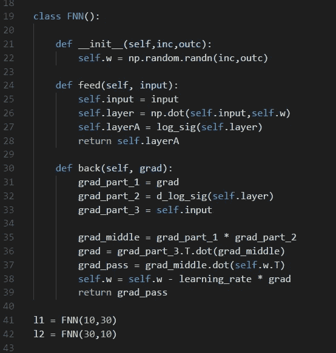

如上所述，我们可以很容易地创建两个完全连接的网络，使用这种方法，我们可以扩展解决方案 2)，而不是直接获得我们想要拉的土匪，我们可以训练一个神经网络来计算最佳土匪。(使用反向传播)

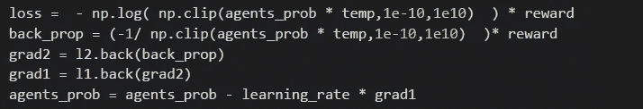

如上所述，在摆弄网络本身的时候，我不得不剪切梯度以防止它增加 log()的无效输入。(log(0)未定义)。下面是结果……

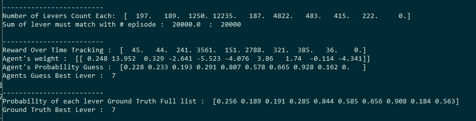

如上所述，代理能够猜测每个强盗相似的概率，然而，出于某种原因，它从来没有想要拉最左边的强盗。

**解 4)线性奖励无为**

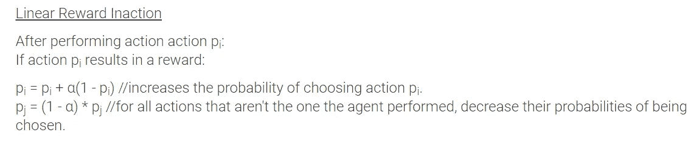

Image from this [website](https://michaelpacheco.net/blog/RL-multi-armed-bandit-2)

这种方法比使用神经网络更简单，我们只是要增加在给定的概率分布中选择最佳 bandit 的概率。

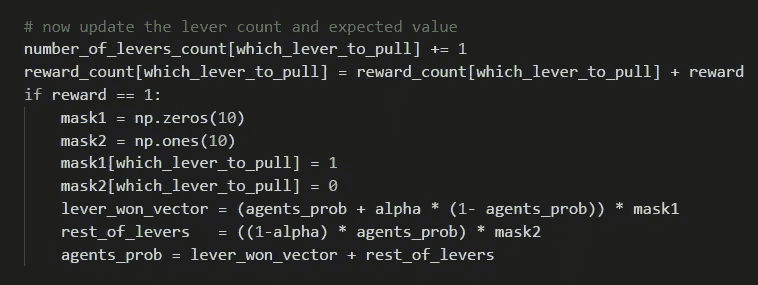

如上所述，我们只有在收到强盗的奖励时才会更新。当我们没有任何奖励时，我们不会更新任何东西。

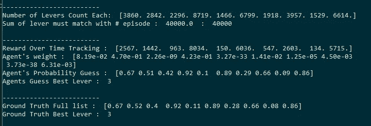

代理人对每个杠杆的最终概率实际上是相当准确的。(归功于这个解决方案[迈克尔·帕切科](https://michaelpacheco.net/))

**解 5)线性奖励惩罚**

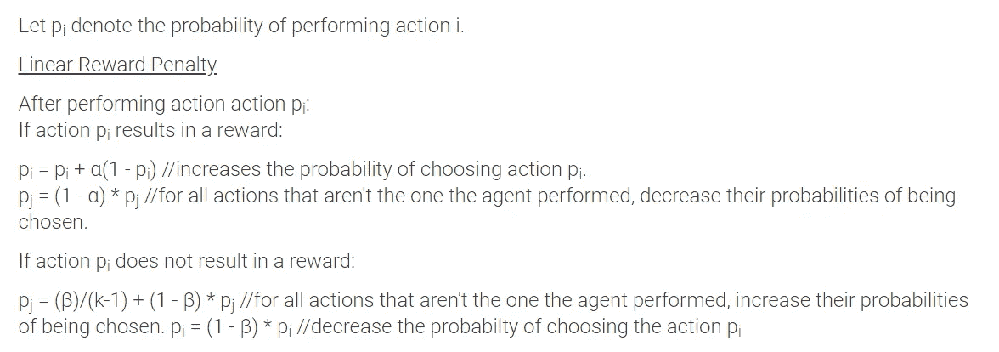

Image from this [website](https://michaelpacheco.net/blog/RL-multi-armed-bandit-2)

现在，让我们简单地扩展前面的解决方案，如上所述，当我们没有得到某些土匪的奖励。我们只是要降低那个强盗在下一轮被选中的概率。

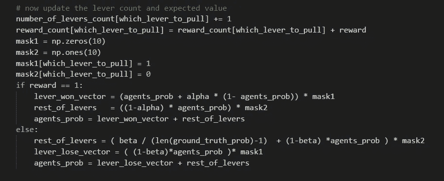

添加一条 else 语句，增加几行代码来降低概率，可以得到如下结果。

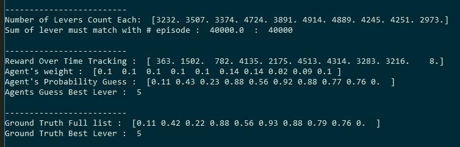

几乎完美地预测了每一个强盗的概率。(归功于这个解决方案[迈克尔·帕切科](https://michaelpacheco.net/))

**交互代码**

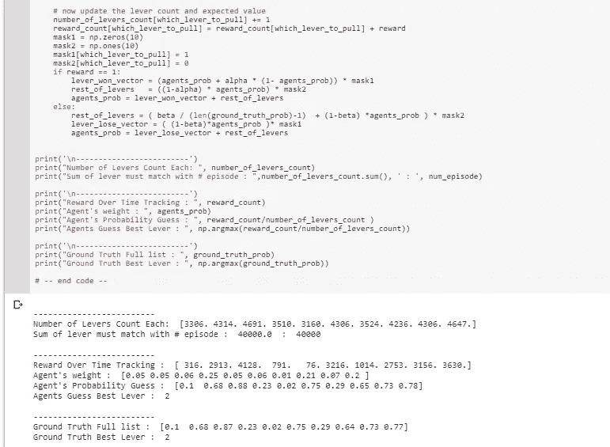

*对于 Google Colab，您需要一个 Google 帐户来查看代码，而且您不能在 Google Colab 中运行只读脚本，因此请在您的游戏场上制作一份副本。最后，我永远不会请求允许访问你在 Google Drive 上的文件，仅供参考。编码快乐！*

要访问解决方案 1 的代码，[请点击此处。](https://colab.research.google.com/drive/1WHEuo0MeftUVWeE3fbIFUEZNWQZYYI2j)
要访问解决方案 2 的代码，[请点击此处。](https://colab.research.google.com/drive/1xPvd1v7t9FaG1KpLl8rxnH-t-jqrWPEv) 要访问解决方案 3 的代码，[请点击此处。](https://colab.research.google.com/drive/1-Vq1Xtr4Ypc2Xg-iIBDMX2XtbP-o35SP)
要访问解决方案 4 的代码，[请点击此处](https://colab.research.google.com/drive/1g-r9dVS4YWKQhG8AiHkzPadOFiw2R5-y)。
要访问解决方案 5 的代码，[请点击此处。](https://colab.research.google.com/drive/17N1lZNkTMQ7LJ8wclenlEEqal5wIKcJj)

**最后的话**

我想把下面的幻灯片/论文包括进来，作为一个例子来说明这个问题有多么复杂和基本…..

Image from this [website](https://web.stanford.edu/class/cs229t/Lectures/bandits.pdf)

Paper from this [website](http://hunch.net/~jl/projects/interactive/sidebandits/bandit.pdf)

Paper from this [website](https://www.cs.cornell.edu/people/tj/publications/yue_joachims_09a.pdf)

如果发现任何错误，请发电子邮件到 jae.duk.seo@gmail.com 给我，如果你想看我所有写作的列表，请在这里查看我的网站。

同时，在我的推特上关注我[这里](https://twitter.com/JaeDukSeo)，访问[我的网站](https://jaedukseo.me/)，或者我的 [Youtube 频道](https://www.youtube.com/c/JaeDukSeo)了解更多内容。我还实现了[广残网，请点击这里查看博文 pos](https://medium.com/@SeoJaeDuk/wide-residual-networks-with-interactive-code-5e190f8f25ec) t。

**参考**

1.  NumPy . random . uniform—NumPy v 1.14 手册。(2018).Docs.scipy.org。检索于 2018 年 6 月 28 日，来自[https://docs . scipy . org/doc/numpy/reference/generated/numpy . random . uniform . html](https://docs.scipy.org/doc/numpy/reference/generated/numpy.random.uniform.html)
2.  NumPy . set _ print options—NumPy v 1.13 手册。(2018).Docs.scipy.org。检索于 2018 年 6 月 28 日，来自[https://docs . scipy . org/doc/numpy-1 . 13 . 0/reference/generated/numpy . set _ print options . html](https://docs.scipy.org/doc/numpy-1.13.0/reference/generated/numpy.set_printoptions.html)
3.  百分比，R. (2018)。真实 Python 随机百分比。堆栈溢出。检索于 2018 年 6 月 28 日，来自[https://stack overflow . com/questions/15613041/real-python-random-percentage](https://stackoverflow.com/questions/15613041/real-python-random-percentage)
4.  分布，G. (2018)。生成具有给定(数字)分布的随机数。堆栈溢出。检索于 2018 年 6 月 28 日，来自[https://stack overflow . com/questions/4265988/generate-random-numbers-with-a-given-numerical-distribution](https://stackoverflow.com/questions/4265988/generate-random-numbers-with-a-given-numerical-distribution)
5.  迈克尔·帕切科。(2018).Michaelpacheco.net。检索于 2018 年 6 月 28 日，来自 https://www.michaelpacheco.net/blog/RL-multi-armed-bandit
6.  反正切函数。(2018).Rapidtables.com。检索于 2018 年 6 月 28 日，来自[https://www.rapidtables.com/math/trigonometry/arctan.html](https://www.rapidtables.com/math/trigonometry/arctan.html)
7.  NumPy . arctan—NumPy 1.14 版手册。(2018).Docs.scipy.org。检索于 2018 年 6 月 28 日，来自[https://docs . scipy . org/doc/numpy/reference/generated/numpy . arctan . html](https://docs.scipy.org/doc/numpy/reference/generated/numpy.arctan.html)
8.  导数表。(2018).Math.com。检索于 2018 年 6 月 28 日，来自[http://www.math.com/tables/derivatives/tableof.htm](http://www.math.com/tables/derivatives/tableof.htm)
9.  @，D. (2018)。numpy dot()和 Python 3.5+矩阵乘法@的区别。堆栈溢出。检索于 2018 年 6 月 28 日，来自[https://stack overflow . com/questions/34142485/difference-between-numpy-dot-and-python-3-5-matrix-乘法](https://stackoverflow.com/questions/34142485/difference-between-numpy-dot-and-python-3-5-matrix-multiplication)
10.  Atan(反正切)函数。(2018).Communityviz.city-explained.com。检索于 2018 年 6 月 28 日，来自[http://community viz . city-explained . com/community viz/s 360 web help 4-2/formulas/function _ library/atan _ function . htm](http://communityviz.city-explained.com/communityviz/s360webhelp4-2/formulas/function_library/atan_function.htm)
11.  学习率。(2018).Users.ics.aalto.fi 于 2018 年 6 月 28 日检索，来自[http://users.ics.aalto.fi/jhollmen/dippa/node22.html](http://users.ics.aalto.fi/jhollmen/dippa/node22.html)
12.  “1E+09”是什么意思？—使用修改过的库存零件。(2013).克巴尔空间计划论坛。检索于 2018 年 6 月 28 日，来自[https://forum.kerbalspaceprogram.com/index.php?/topic/36897-what-quote 1e 09 quot-mean-playing-a-moded-stock-part/](https://forum.kerbalspaceprogram.com/index.php?/topic/36897-what-does-quot1e09quot-mean-playing-with-a-modded-stock-part/)
13.  自然对数的导数。(2018).Oregonstate.edu。检索于 2018 年 6 月 28 日，来自[https://oregonstate . edu/instruct/mth 251/CQ/stage 6/Lesson/log . html](https://oregonstate.edu/instruct/mth251/cq/Stage6/Lesson/log.html)
14.  对数的导数—log(x)’。(2018).Rapidtables.com。检索于 2018 年 6 月 28 日，来自[https://www . rapid tables . com/math/algebra/logarity/logarity _ derivative . html](https://www.rapidtables.com/math/algebra/logarithm/Logarithm_Derivative.html)
15.  [在线]请访问:[https://www . quora . com/What-is-the-multi-arm-bandit-problem-What-is-some-of-its-implications](https://www.quora.com/What-is-the-multi-arm-bandit-problem-What-are-some-of-its-implications)[2018 年 6 月 28 日访问]。
16.  解决多臂强盗问题-走向数据科学。(2017).走向数据科学。检索于 2018 年 6 月 28 日，来自[https://towards data science . com/solving-the-multi-armed-bandit-problem-b 72 de 40 db 97 c](/solving-the-multi-armed-bandit-problem-b72de40db97c)
17.  迈克尔·帕切科。(2018).Michaelpacheco.net。检索于 2018 年 6 月 28 日，来自[https://michaelpacheco.net/](https://michaelpacheco.net/)
18.  解决多臂强盗问题-走向数据科学。(2017).走向数据科学。检索于 2018 年 6 月 28 日，来自[https://towards data science . com/solving-the-multi-armed-bandit-problem-b 72 de 40 db 97 c](/solving-the-multi-armed-bandit-problem-b72de40db97c)
19.  NumPy . clip—NumPy 1.14 版手册。(2018).Docs.scipy.org。检索于 2018 年 6 月 29 日，来自[https://docs . scipy . org/doc/numpy/reference/generated/numpy . clip . html](https://docs.scipy.org/doc/numpy/reference/generated/numpy.clip.html)
20.  (2018).Cs.cornell.edu。检索于 2018 年 6 月 29 日，来自[https://www . cs . Cornell . edu/people/TJ/publications/yue _ joachims _ 09a . pdf](https://www.cs.cornell.edu/people/tj/publications/yue_joachims_09a.pdf)
21.  兰福德，j .，，张，T. (2008)。带边信息的多武装匪徒的历元贪婪算法。papers . nips . cc . 2018 年 6 月 29 日检索，来自[https://papers . nips . cc/paper/3178-the-epoch-greedy-algorithm-for-multi-armed-bottoms-with-side-information](https://papers.nips.cc/paper/3178-the-epoch-greedy-algorithm-for-multi-armed-bandits-with-side-information)
22.  交叉熵和对数似然。(2018).Awebb.info .检索于 2018 年 6 月 29 日，来自 http://www.awebb.info/blog/cross_entropy
23.  Tensorflow 中的简单强化学习:第 1 部分—双臂土匪。(2016).中等。检索 2018 年 6 月 29 日，来自[https://medium . com/@ awjuliani/super-simple-reinforcement-learning-tutorial-part-1-FD 544 fab 149](https://medium.com/@awjuliani/super-simple-reinforcement-learning-tutorial-part-1-fd544fab149)