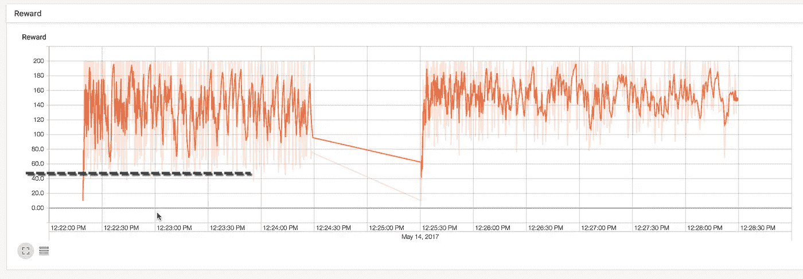

# 我与 TensorFlow 的旅程

> 原文：<https://towardsdatascience.com/my-journey-with-tensorflow-371bc31c2dbf?source=collection_archive---------6----------------------->

## 是的，不要读这个

## TL；速度三角形定位法(dead reckoning)

*   对 OpenAI 健身房的环境有一个基本的了解。值得注意的是，`env.observation_space.shape`和`env.action_space.n`。
*   理解 Q-Learning 是一个马尔可夫决策过程。你有状态，这对于有连续输入空间的东西来说很棘手。
*   实际上，要明白几乎每个强化学习问题都是一个 MDP。甚至那些或多或少具有无限状态/动作空间的仍然被视为 MDP。您可以将这些空间转换为功能空间，使它们更易于管理。

老实说，我对过去几年的整个神经网络运动非常感兴趣。我尤其对强化学习及其在游戏中的应用感兴趣(参见 [OpenAI Gym](https://gym.openai.com/envs#atari) )。凭借我在大学时对机器学习和微积分的基本了解，我现在正走在一条构建一些很酷的东西的道路上。

## 卑微的开始

> “好艺术家借，大艺术家偷”
> ~ [链接](http://levine.sscnet.ucla.edu/papers/b_l_review.pdf)

我想我会把下面这篇文章和 OpenAI 健身房的 CartPole-v0 结合起来。这个想法是从一个“更简单”的算法(Q-Learning)开始，然后转移到神经网络进行一些比较。

[](https://medium.com/emergent-future/simple-reinforcement-learning-with-tensorflow-part-0-q-learning-with-tables-and-neural-networks-d195264329d0) [## 使用 Tensorflow 的简单强化学习第 0 部分:使用表格和神经网络的 Q 学习

### 在我的强化学习系列的这个教程中，我们将探索一个叫做 Q……

medium.com](https://medium.com/emergent-future/simple-reinforcement-learning-with-tensorflow-part-0-q-learning-with-tables-and-neural-networks-d195264329d0) 

在对观察空间的大小和一些被否决的函数有一点困惑之后，我意识到 Q-Learning 不适合 CartPole，因为观察是连续空间而不是离散空间。幸运的是，TensorFlow 有一个 [**很棒的**初学者指南](https://www.tensorflow.org/versions/r0.11/tutorials/mnist/beginners/)使用 MNIST 数据集！

这给了我们代码，但是我们仍然需要把这个分类算法变成一个学习算法。[Github gist](https://gist.github.com/omdv/98351da37283c8b6161672d6d555cde6)为 CartPole 示例的“奖励模型”提供了一些背景。[Github gist](https://gist.github.com/iambrian/2bcc8fc03eaecb2cbe53012d2f505465)提供了一种非统计方法来“解决”问题。这很好，因为我们基本上想要“学习”手动方法。这个来自 tflearn 的 Github repo 的例子很好地模拟了我们正在做的事情，只是我们没有这么大的输入空间。

因此，过一段时间后，您可能会看到以下内容:

```
inputs = tf.placeholder(tf.float32, [
  **None**,
  action_repeat,
  env.observation_space.shape[0]    ])
net = tflearn.fully_connected(inputs, 4, activation='relu')
q_values = tflearn.fully_connected(net, env.action_space.n)
```

基本上，我们在我们的网络中存储了历史的样本。理想情况下，我们的网络将能够根据连续的帧来判断杆子朝哪个方向落下。

如果我们记录直到失败的迭代次数，我们可以看到如下结果:

```
took 51 iterations
took 46 iterations
took 51 iterations
took 29 iterations
took 33 iterations
took 38 iterations
took 73 iterations
```

没有明确的迹象表明我们的算法正在收敛到一个解。:(

## 后退几百步

在这一点上，很明显，即使对强化学习有很高的理解，也不足以构建一个算法。我把这比作使用网络浏览器和构建网络服务器。

我花了一点时间看了大卫·西尔弗的强化学习课程。我从第三课开始，虽然我真的应该从头开始。直到第七讲，演员批评的方法才被提出来。(此外，看起来还有另一个参考大卫·西尔弗讲座的综合信息[这里](https://github.com/dennybritz/reinforcement-learning))。

这篇博客文章我已经读过[一百万遍了。它有很多有用的信息，但我认为如果没有基本面，大部分信息都没有意义。](http://pemami4911.github.io/blog/2016/08/21/ddpg-rl.html)

以下是我收集的一些信息:

*   你可以把一个强化学习问题分解成两个步骤:奖励函数和策略函数。
*   有两种类型的问题:预测和控制。参见本讲座中[的第 21/22 张幻灯片。一方面，我们可以专注于建立预测](https://www.cs.cmu.edu/~katef/DeepRLControlCourse/lectures/lecture2_mdps.pdf)

我还发现了[这篇关于 CartPole-v0 的一些非常简单的策略的博文](http://kvfrans.com/simple-algoritms-for-solving-cartpole/)。我认为这在建立政策梯度方面做得最好。如果你理解了随机搜索和爬山是怎么做的，你就会对政策如何运作有一个直觉。



Sample Rewards for my implementation of Hill Climbing

爬山很容易实现。如果您想获得 TensorFlow 构建模块(摘要、占位符、会话、随机初始化)的经验，这是一个可靠的算法。我犯了一个错误，在“step”循环中添加了占位符。基本上，我们在我们的会话图中增加了新的操作(矩阵乘法),这(我认为)使得图的评估更加复杂。因此，性能会降低并最终停止。

未来几周，我将深入探讨政策梯度。请在这里随意查看我的一些示例代码:

[](https://github.com/jgensler8/my-tensorflow-journey) [## jgensler 8/my-tensor flow-journey

### 我的张量流之旅——开放健身房的一些实验

github.com](https://github.com/jgensler8/my-tensorflow-journey)