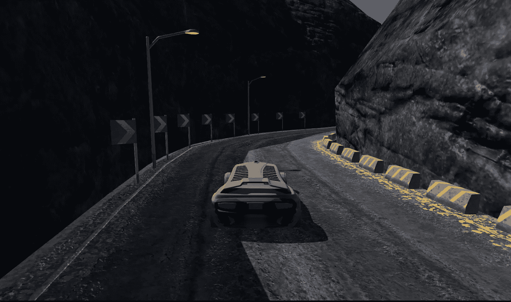
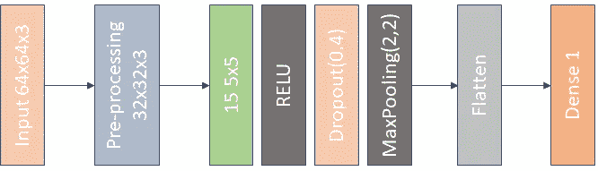
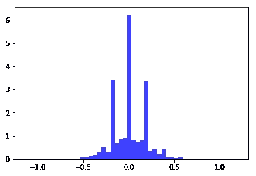
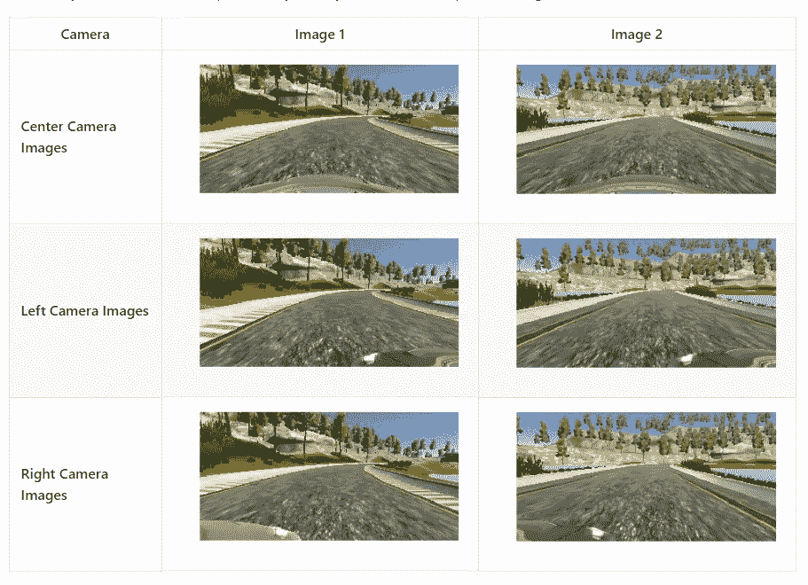
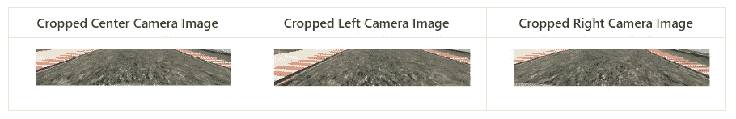

# 行为克隆:让汽车自动驾驶…

> 原文：<https://towardsdatascience.com/my-learning-from-udacity-sdc-nanodegree-do-we-really-need-a-complex-cnn-and-hours-of-training-4f80e28af90b?source=collection_archive---------5----------------------->

Driving Car on Simulator Provided By Udacity

是的，像往常一样，我从几十个卷积层和六个密集层的复杂 CNN 架构开始，因为 Keras(感谢 Keras 团队让 tensorflow 变得如此简单)使创建神经网络变得更容易。我是开玩笑的:-)我刚开始使用类似于 NVIDIA 的架构，它有五个卷积层和三个完全连接的层，以及大量的训练数据，通过放大左、右相机拍摄的每幅图像等。顺便说一下，我已经使用 Udacity 提供的数据集来训练我的模型。

是啊，看起来像是我完成了一件大事，对吧？但是，我们需要像 NVIDIA CNN 架构这样的复杂 CNN 架构吗？NVIDIA CNN 架构用于现实生活场景、数小时的培训时间和大量数据，以便在 Udacity 为该项目提供的模拟器上运行我们的汽车？

我们来讨论一下…

我们需要什么来确定可驾驶区域和预测转向角度，以便我们的车辆在模拟器上平稳行驶而不会出现任何故障？

对于识别转向角度的汽车，我们需要像道路边缘这样的特征。在 CNN 中，这样的高级特征是在初始层提取的。

记住这一点，我开始减少我的 NVIDIA CNN 模型的层数。我尝试了三个卷积层和三个致密层。然后我尝试了两个卷积层和两个致密层，最后一次尝试是一个卷积层和一个致密层。使用最后一种配置，我能够在大约五分钟的较短训练时间内达到与我以前的试验相似的性能。

我这个项目的最终模型由单一卷积层，然后是下降层，最大池层和单一密集层组成，如下所示

Model used for training CNN for project 3

*   正在生成数据集:-

为了生成这个模型的数据集，我通过使中心图像的原始转向角的转向角为-ve，拍摄了所有的中心摄像机图像及其翻转的对应物。翻转图像是为了平衡数据集，以便模型不会偏向任何特定条件。为了将恢复数据添加到我的数据集，我通过将左相机图像的转向角偏移 0.4 并将右相机图像的转向角偏移-0.3 来拍摄所有的右和左相机图像。我生成的数据集的分布如下所示

Steering angle distribution of generated dataset

我们可以看到数据集几乎是平衡的。由于我们的大部分赛道是直的，我保留了更多 0°转向角的样本。

*   处理图像:-

下图包含了每台相机拍摄的一些图像样本

Image samples from each camera

为了训练我们的模型，我们不需要上面图像中的所有细节，比如自然风景，天空，环境等等。我遵循的第一条基本原则是向网络提供你想让它看到的细节。为了去掉多余的细节，我从顶部裁剪了 80 像素，从底部裁剪了 20 像素。

裁剪后的图像示例如下

Cropped Images

然后我把图片的大小调整到 32 X 32，因为这将使模型更快，我们在这个场景中不需要低层次的细节。在对调整过大小的图像进行标准化之后，这些图像被作为输入传递给 CNN。

*   过度拟合:-

在训练模型时，我发现该模型在训练集上具有低的均方误差，但是在验证集上具有高的均方误差。这意味着模型过度拟合。

为了克服过度拟合，我添加了 dropout 层和 maxpooling 层，然后是卷积层，并将 epoches 数减少到 2。

有了这个模型，我可以在一号赛道和二号赛道上驾驶车辆。

我在模型中使用的参数

*   历元数= 2
*   使用的优化器- Adam
*   学习率-默认值为 0.001
*   验证数据分割- 0.2
*   生成器批量= 32
*   修正系数- 0.4 和-0.3
*   使用的损失函数- MSE(均方差，因为它对于回归问题是有效的)。
*   激活函数- RELU
*   下降- 40%(在第一个激活层之后，以 combact 过度拟合)
*   使用的数据集-由 Udacity 提供(除原始数据集外无其他图像)。

自主模式下的轨道 1 视频:-

Track 1

自动模式下的轨道 2 视频:-

Track 2

该模型能够在第二条赛道上驾驶，而无需为第二条赛道重新训练。因此，我们可以说，这是足够普遍的，而不是过度拟合。

链接到该项目的 github 库。