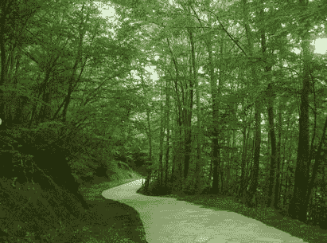
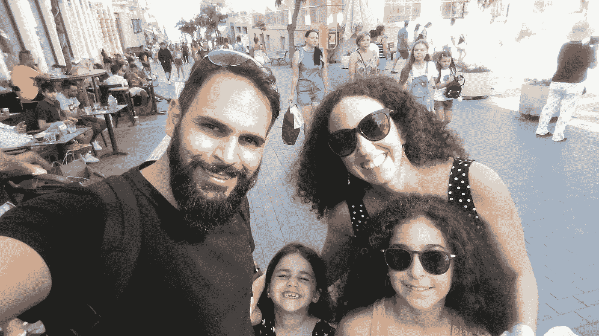
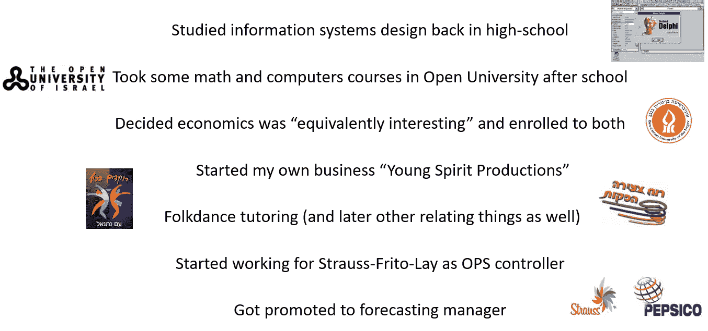
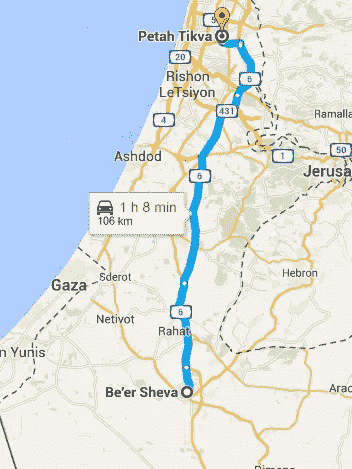
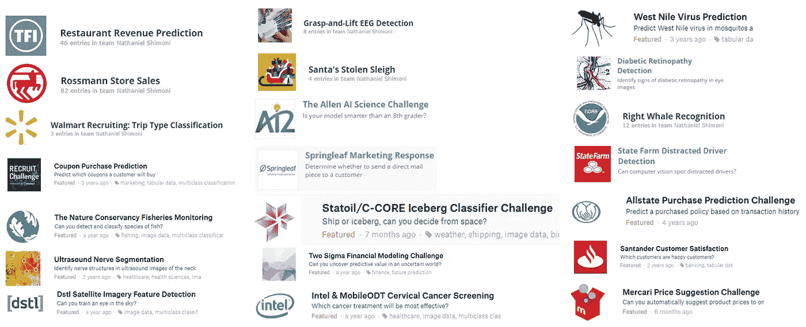
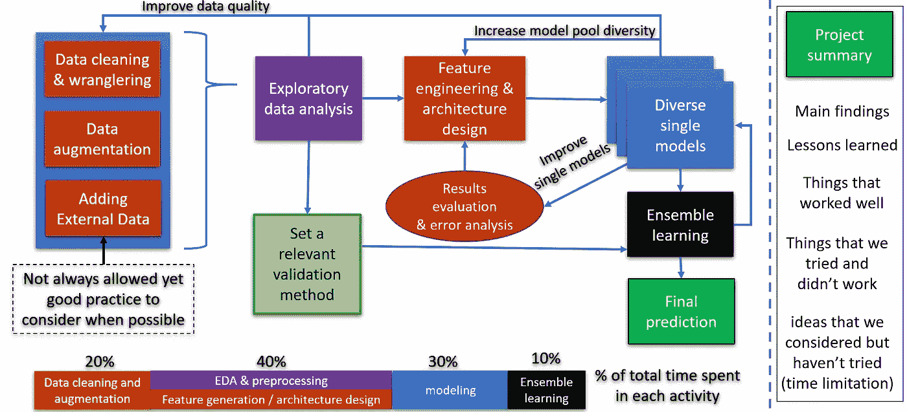
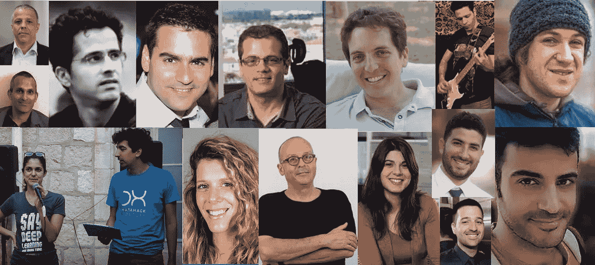
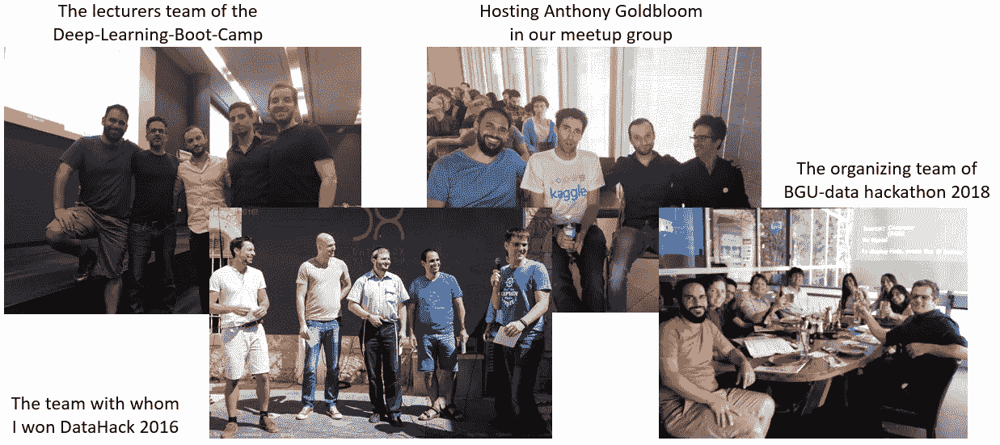
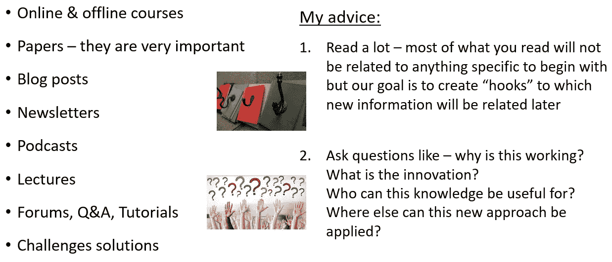

# 我的数据科学之路

> 原文：<https://towardsdatascience.com/my-path-to-data-science-b66c1538bb7e?source=collection_archive---------9----------------------->

## (以及给任何刚开始学习的人的一些建议)

首先简单介绍一下我自己:
嫁给 Yonit&Yahav&Arbel
的父亲作为一名数据科学研究员 [@Grid4C](http://www.grid4c.com)
与 [Shlomo Kashani](https://medium.com/u/5831e2923621?source=post_page-----b66c1538bb7e--------------------------------)
共同创立了“深度学习训练营”【巅峰时期】在超过 80，000 名活跃的 Kaggle 竞争者中排名第 175
【自学成才并且非常(！)好奇
·拥有 BGU 大学经济学学士学位和企业家研究 MBA 学位

*   每天驾驶 230 公里，我寻找利用时间的最佳方式…
*   一路上开始听讲座
*   决定每天投入 **1 小时**来实践我所学的
    (很快发现自己投入了更多……)

**然后我认识了 ka ggle……(这只是我参加过的比赛的一部分)**

Kaggle 是我实践学习的最重要的枢纽，实践知识比理论知识更稀缺，这是获得经验和展示你所学知识的好方法——更多关于我对 Kaggle 为什么如此伟大的想法，你可以在这里找到[这里](https://www.slideshare.net/NathanielShimoni/starting-data-science-with-kagglecom)和稍微不同的更通用的更新版本[这里](https://www.slideshare.net/NathanielShimoni/introduction-to-competitive-data-science)

我从与我领域相关的 kaggle 竞赛开始，我甚至成功地将我的一些解决方案应用到日常工作过程中的竞赛中。但是，很快我就尝试了大部分提供的竞赛，不管它们来自哪个领域

我多年来开发的一个数据科学项目的总体方案如下所示:

在我的旅程中，我发现有几件事要么推动我们前进，要么拉动我们前进

*   **人**我们不断地**与*互动*与**
*   **挑战**那我们就 ***激情*** 去解决/应对
*   **内容**我们 ***读*** /听/(观？)
*   **行动**我们**T42【采取**
*   **思想**我们 ***关心***

**我们经常交往的人:**
是我们生活中的人在挑战我们，在我们需要时提供帮助，在我们能给予帮助时寻求帮助。他们激励我们，帮助我们以自己独特的方式发光。他们在那里倾听&如果我们幸运的话，我们也会在那里支持他们。
这些是在我的人生道路上帮助过我的人，我非常感谢在我的生命中拥有他们！

The main people who took part in my journey to data science

**作为团队的一员，伟大的目标更容易实现:**

**我们热衷于解决/应对的挑战:**

*   所以我们已经在 [**上看到了一些，但是还有更多…**](http://kaggle.com)
*   **工作挑战**(大部分都是我自己想出来的)
    关于这类挑战，我的最佳建议是“找一个除了你之外的人，他也会致力于挑战
*   **数据黑客马拉松**——对我来说是作为参与者的[数据黑客](https://www.datahack-il.com/)，以及作为发起者和共同组织者的 [BGU 黑客](https://bgu-sise.wixsite.com/dmbi2018datahack)。黑客马拉松是展示你所学技能和个性的好方法。它们也是结识其他优秀专业人士的好地方
*   **其他比赛** —查看[本次回购](https://github.com/iphysresearch/DataSciComp)了解一些想法
*   **医疗**挑战、**商业**挑战、**技术**挑战，以及其他…

**我们读/听/看的内容——好奇心是我们最好的朋友:**

**我们采取的行动:**

*   养成一个习惯，交付比你承诺的更多的东西
*   在一切事物中寻找机会——问"**为什么这很棒？**
*   对机会说“是”——这很难，但是值得！
*   **为他人做好事**，不求回报
*   承担你能承受的风险——不承担风险会更糟糕
*   寻找别人在你身上看到的、你自己还看不到的东西，并据此采取行动

**我们关心的想法:**

*   我所关心的事情过去是，现在仍然是我的动力— **热爱你所做的事情**
*   **始终回馈**的重要性
*   **教别人**——双重受益每个人都学得更多
*   什么是**我们独特的贡献** —我们都是特别的，但如何特别？

就是这样。正是这些东西&这些人让我的数据科学之旅成为迄今为止最伟大的旅程(现在依然如此)。我希望你喜欢读它，并且它帮助一些读者。

我很乐意阅读关于其他人道路的相似和不同之处，并加入你的建议和你一路上学到的东西。

[https://github.com/nathanie](https://github.com/nathanie)

https://www.linkedin.com/in/nathaniel-shimoni-16b11081

【https://www.kaggle.com/interesting 

[https://www.facebook.com/nathaniel.shimoni](https://www.facebook.com/nathaniel.shimoni)