# 我的数据科学快速入门 Docker 图片

> 原文：<https://towardsdatascience.com/my-quick-start-docker-image-for-data-science-6bffb5dbac31?source=collection_archive---------2----------------------->

> **TL；DR:设置是通用的，但是本教程的目标读者是那些有兴趣将数据分析从笔记本电脑转移到云中的读者。只需在数字海洋上点击几下，在终端上输入几个命令，您就可以拥有 RStudio 服务器、具有多个内核的 Jupyter 笔记本和 Neo4j 数据库。**
> 
> **更多的数据库后端即将到来。**

本·哈默最近在 Quora 上写了一篇关于可复制性的文章。我鼓励你阅读他的文章，因为它是这篇文章背后的基本原理。这些见解如下:

https://www . quora . com/What-is-best-practices-for-cooperation-between-data-scientists。

可重复的行动让我们节省时间，并讨论真正重要的事情，即我们工作的产出。在这种情况下，当我有空闲时间时，我一直在玩`docker`，因为在分析项目中复制我们的发现的能力将*过程*从讨论中移除，并允许我们专注于输出。

虽然我对容器的概念非常陌生，但我确信我的设置反映了我所知甚少。无论如何，它确实允许我们在远程机器上开始一个良好的数据科学设置，只收取每小时几分钱的费用。

> 如果您有一个您认为涵盖核心基础的数据科学设置，请随时联系。这是拼凑起来的，但却激发了我在任务中解析、管理、存储/组织和建模数据所需的工具集。

# 在数字海洋上创建个人分析服务器

首先，如果您没有数字海洋帐户，您可以使用下面的链接创建您的帐户并开始使用。注意，这是一个推荐链接，如果你最终在网站上开发，我会得到信贷。

[](https://m.do.co/c/d5dcbcabc6d3) [## 数字海洋:为开发者设计的云计算

### DigitalOcean 是一个简单而强大的云计算平台，专为开发人员设计。

m.do.co](https://m.do.co/c/d5dcbcabc6d3) 

一旦您创建了您的帐户，您将需要创建您的 droplet，或者我们可以控制的远程服务器。选择`One-click Apps`选项卡，并选择显示的 docker 的最新图像。截至 4 月 2 日，这是我看到的情况:

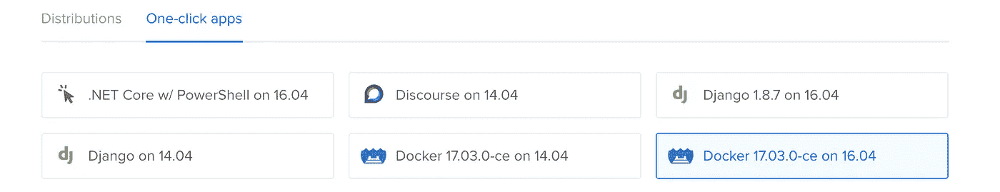

向下滚动并选择标准实例和每小时花费 1.5 便士的服务器。

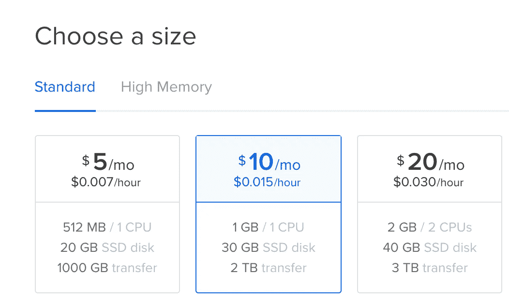

以这个价格，你可以获得 1 GB 的内存、30GB 的固态硬盘和 2 TB 的数据传输。这对我们的任务来说绰绰有余。还值得注意的是，你应该货比三家其他供应商。

> 我更喜欢 Digital Ocean 的易用性和不断增加的功能，但我相信您可能会找到一个能为您的需求提供更好价格的提供商。

就我而言，我在东北，所以我将选择纽约的数据中心。

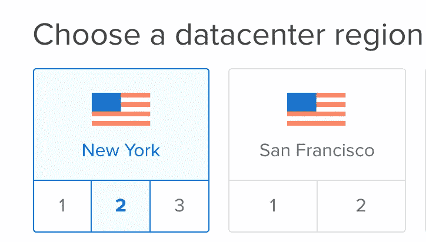

现在不要担心其他的选择。向下滚动到“完成并创建”部分。

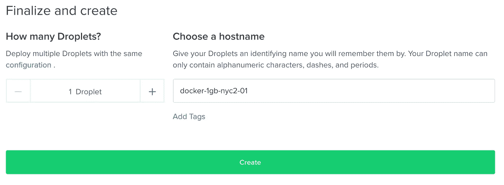

我们只想启动一台服务器，所以将设置保留为 1 droplet，然后单击 **Create。**

您应该会看到一个屏幕，显示您的个人服务器的创建进度。

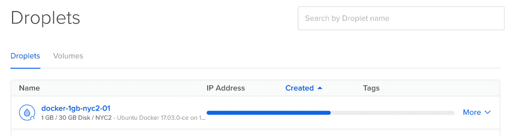

完成后，将鼠标悬停在您的个人数据科学服务器的 IP 地址上，以复制远程机器的 IP 地址。

**最后，**检查您用来设置试用帐户的电子邮件帐户。

数字海洋将向您发送一封电子邮件，告知您服务器的最终详细信息。您应该会看到一封类似以下内容的电子邮件…

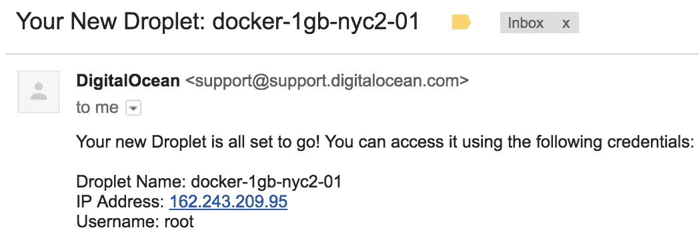

此时，您将在此电子邮件中看到服务器的临时密码。

因为我假设你在 Macbook 或类似的 UNIX 机器上，你可以简单地使用终端`ssh`进入你的个人服务器。

在我的情况下…

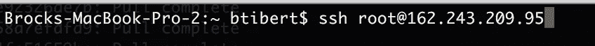

对您将看到的类似屏幕说**是**。

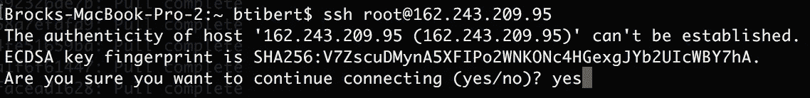

此时，将提示您输入通过电子邮件发送给您的临时密码，之后您将创建一个新的 root 密码。

> 在这一步中设置`root`密码是没有意义的。如果您打算启动机器来分析公开可用的数据，然后立即销毁它们，这通常是可以的。
> 
> **如果您打算在未与您的 IT 和安全团队沟通的情况下将个人或公司数据存储在远程服务器上，请不要使用这种方法。**

完成密码提示后，**您现在已登录到您自己的个人数据科学服务器！**

## 快速回顾一下我们所拥有的

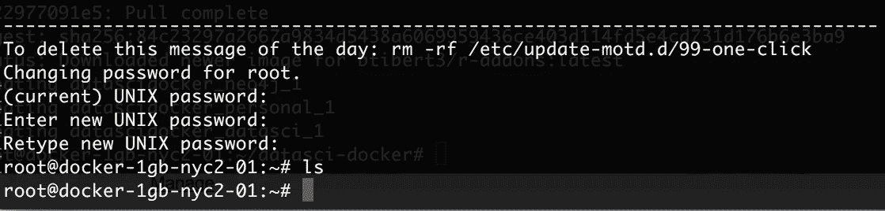

在上面，我键入了`ls`命令，以确保在我的`~`目录中没有文件或目录。

你现在拥有的是一张白纸:

*   具有`root`访问权限的 Linux 服务器使用不受笔记本电脑限制的资源。也就是说，启动一台可以变得相当大的服务器很简单，只需按小时为这些资源付费。
*   我们使用`ssh`远程访问服务器，并直接在那台机器上发出命令。
*   已经预先配置好运行 **Docker** 的 Ubuntu Linux 服务器
*   `git`是预装的，它允许我们使用版本控制来处理项目

在收集我们的工具集之前，我们应该用下面两个命令更新我们的服务器。

```
$ apt-get update
$ apt-get install
```

# 最后，让我们来设置数据科学

首先，通过在远程服务器的终端会话中键入以下命令来克隆我的基本设置。

```
git clone https://github.com/Btibert3/datasci-docker.git
```

您应该会看到类似这样的内容

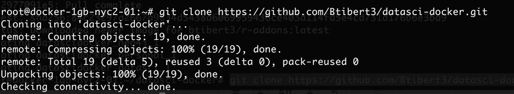

切换到远程服务器上新创建的目录

```
cd datasci-docker/
```

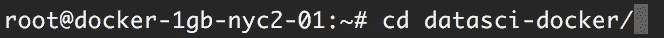

并使用`ls -l` 命令确认您有这样的东西

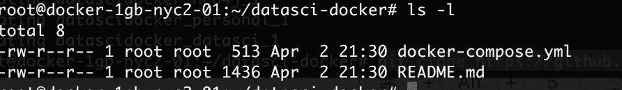

你都准备好了。

**使用以下命令启动您的分析堆栈。**

```
docker-compose up
```

通过运行上面的命令，我们将使用 repo 中的`docker-compose.yml`文件来构建各种容器，这些容器通常用于各种数据科学任务。这些文件将被下载到服务器(第一次运行该命令时),并设置一些配置选项，以确保各种工具可以共享相同的数据。

> 重要！当你完成你的工作后，在你正在使用的终端会话中键入`ctrl+c`，以终止正在运行的设置。键入`exit`终止远程`ssh`会话。在数字海洋网络应用程序中，从感兴趣的液滴的**更多**菜单选项中点击**销毁**，这样您就不会为您的一次性分析堆栈产生额外的每小时费用。
> 
> 在此阶段，我鼓励您探索其他可用的选项，包括远程连接到服务器以及数字海洋提供的大量选项。如果不为别的，设置 SSH 密钥，这样你就可以`ssh root@<machine-ip-here>`认证进入你的机器，避免使用电子邮件步骤来共享密码。

# 快速确认你所有的工具都准备好了

如果您接触过 Jupyter、RStudio Server 或 Neo4j，您就会知道这些工具会暴露给定机器上的各种端口。在本地使用这些工具时，您将使用`localhost`连接到这些工具。

过程与**完全相同，**但是我们只是提供一个 ip 地址，而不是连接到`localhost,`。

让我们运行一些基本命令来确保您的工具集启动并运行。

## 创建新的终端会话

打开第二个终端会话，并再次进入您的远程机器。我们这样做是因为我们的第一个会话允许我们监视正在运行的 docker 会话。

## 登录 RStudio 服务器

在新的终端会话中，只需访问浏览器窗口中的`ip-address:8787`查看登录屏幕，即可登录远程 RStudio 服务器。

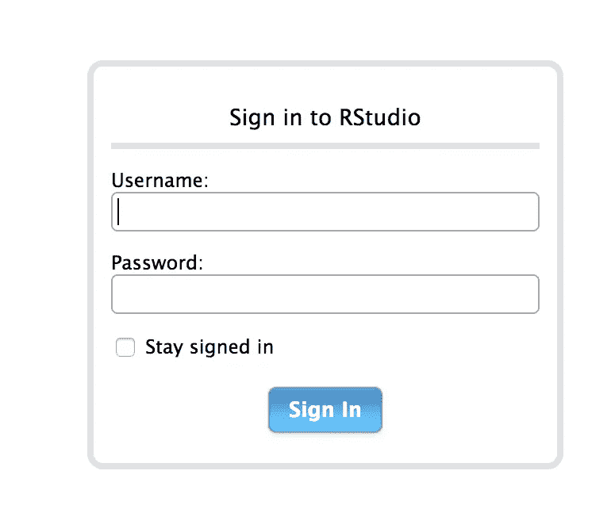

您可以在这两个字段中使用`rstudio`登录您的 R 设置。

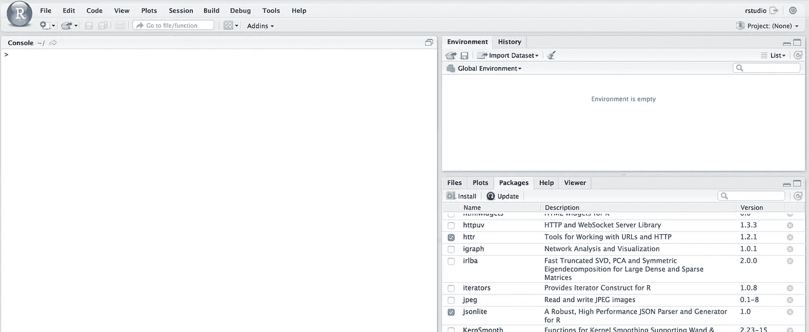

您现在使用的是云中的 RStudio IDE，而不是在笔记本电脑上进行本地开发。

## 点燃一台 Juptyer 笔记本

使用通过`ssh`连接到远程机器的原始会话返回到您的终端。作为输出的一部分，您应该会看到如下所示的部分。

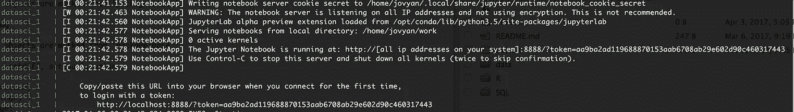

请注意，NotebookApp 为您的会话输出一个令牌。要访问您的笔记本，只需导航至`ip-address:8888?token=<your-token-here>`。

这样做时，您应该会看到一个类似的屏幕，其中突出显示了您可以使用的各种内核，包括 Julia、Python 2/3 和 r。

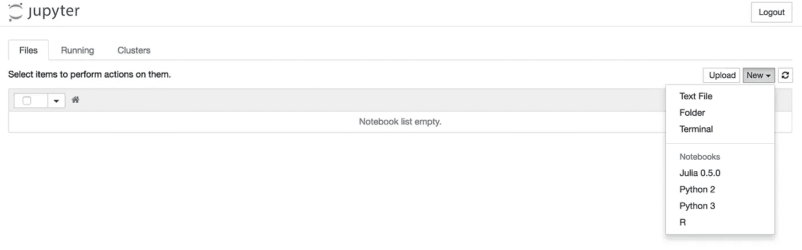

选择 Python 3 试用笔记本。

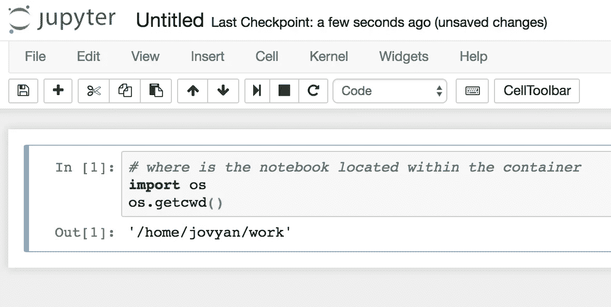

## 访问 Neo4j 浏览器工具

只需在浏览器中转至`ip-address:7474`，您应该会看到以下内容:

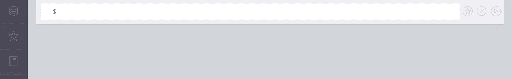

我还没有看到一个工具能为他们的数据库后端提供更好的现成的 web 界面。

通过在 webapp 内的内置终端中输入命令`call apoc.help('apoc')`来确认您已经安装了`apoc`。

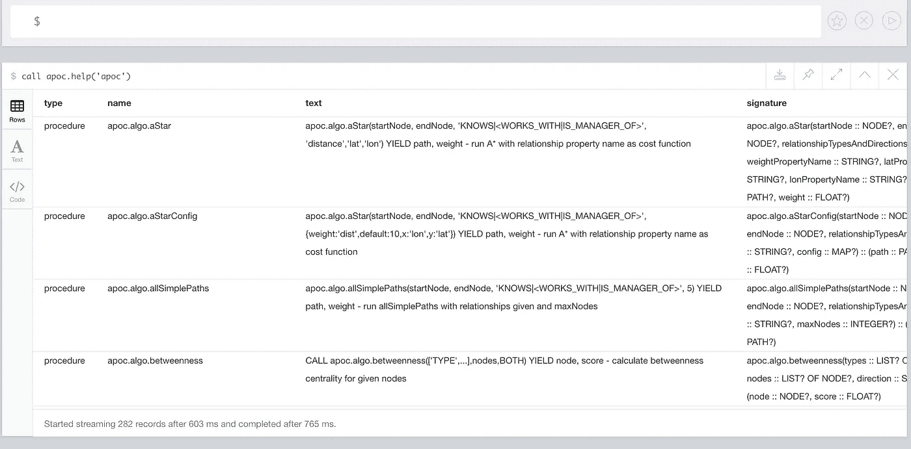

值得注意的是，docker 允许您在启动 neo4j 数据库栈之前设置变量和选项。有关更多信息，请查看以下 url:

 [## 2.5.码头工人-第 2 章。装置

### 本文涵盖了在 Docker 容器中运行 Neo4j。Docker 不能在 OS X 或 Windows 上运行。对于跑步…

neo4j.com](http://neo4j.com/docs/operations-manual/current/installation/docker/) 

在设置过程中，我将 neo4j 的一些卷映射到主机上，特别是 neo4j 的`import`文件夹映射到我们主机的`datasets directory.`

让我们将一个数据集保存到我们的个人分析服务器上的`/datasets`目录中(该服务器现在运行 docker containers ),并确认 neo4j 可以访问它。

```
cd ~/neo4j/import
wget [https://vincentarelbundock.github.io/Rdatasets/csv/datasets/iris.csv](https://vincentarelbundock.github.io/Rdatasets/csv/datasets/iris.csv) 
```

这应该揭示了

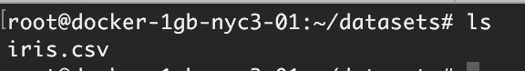

直观证明这是一个数据集

```
cat iris.csv | head -5
```

退一步说，我们所做的是将数据保存到主机上的`~/neo4j/import`路径，但是这个卷也被映射到 docker 容器中，允许我们快速引用文件，如下所示。

```
LOAD CSV WITH HEADERS FROM "file:///iris.csv" as row 
WITH row
LIMIT 1
RETURN row
```

生产

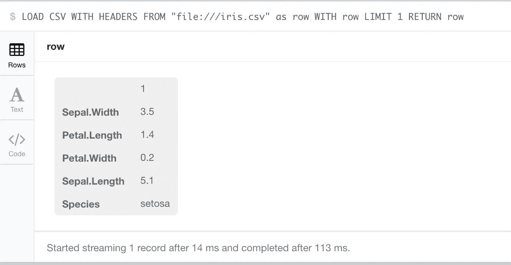

# 摘要

这是一篇相当长的文章，但是使用 Digital Ocean 和 docker 容器让机器启动并运行起来真的很简单。这篇文章的目的是作为一个视觉指南，帮助你旋转我倾向于使用的堆栈。正如开始时提到的，我将在未来包括更多的数据库后端。