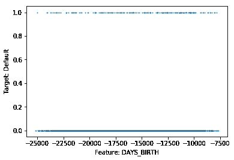
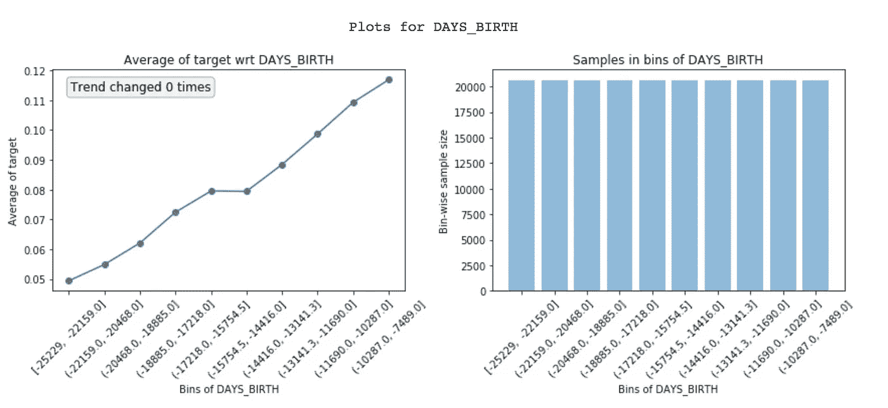
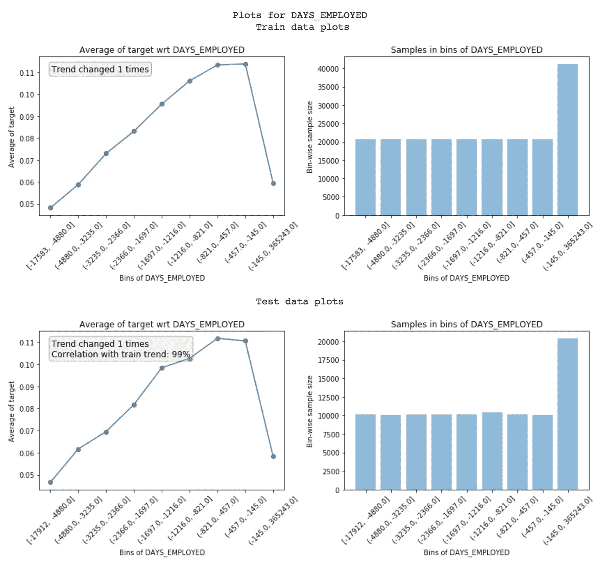
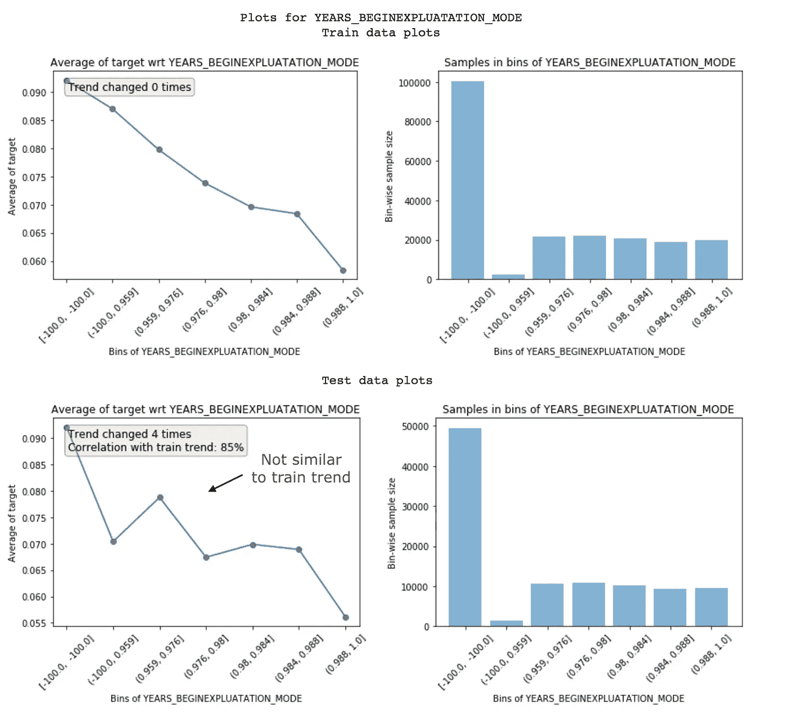
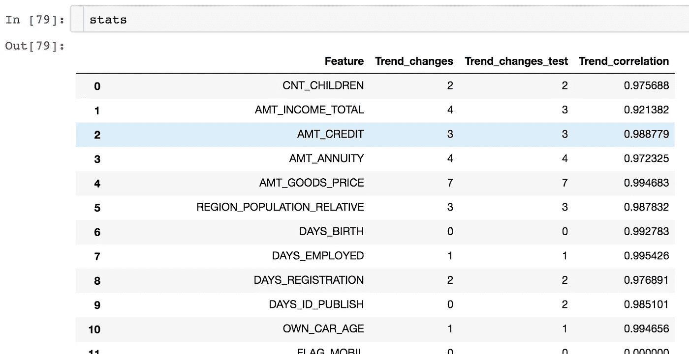
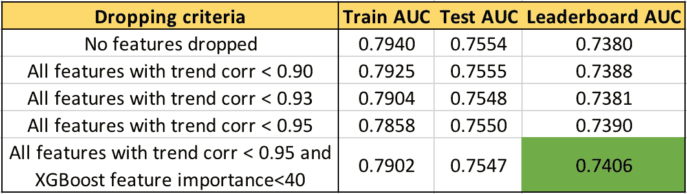
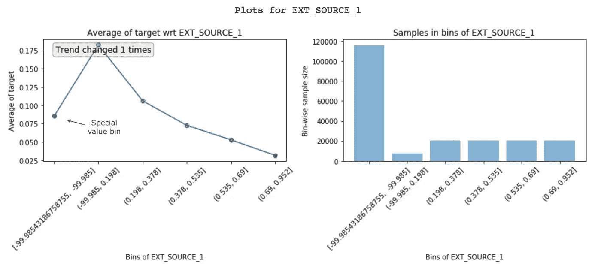
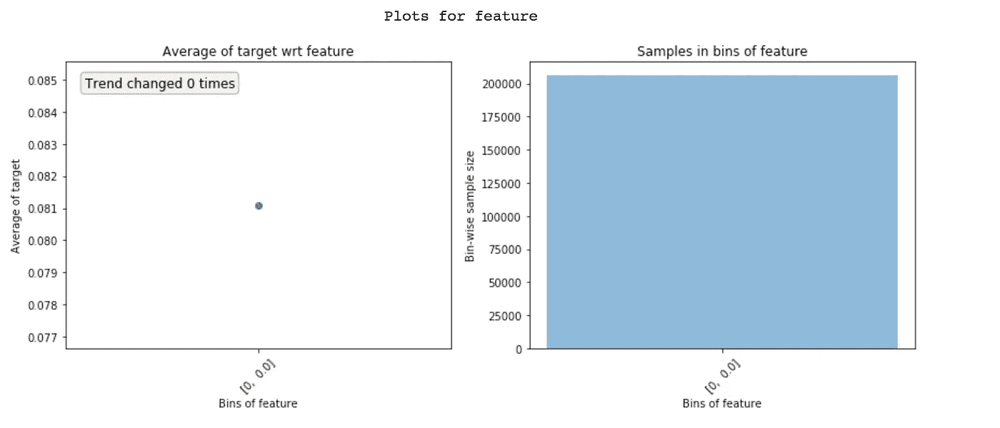
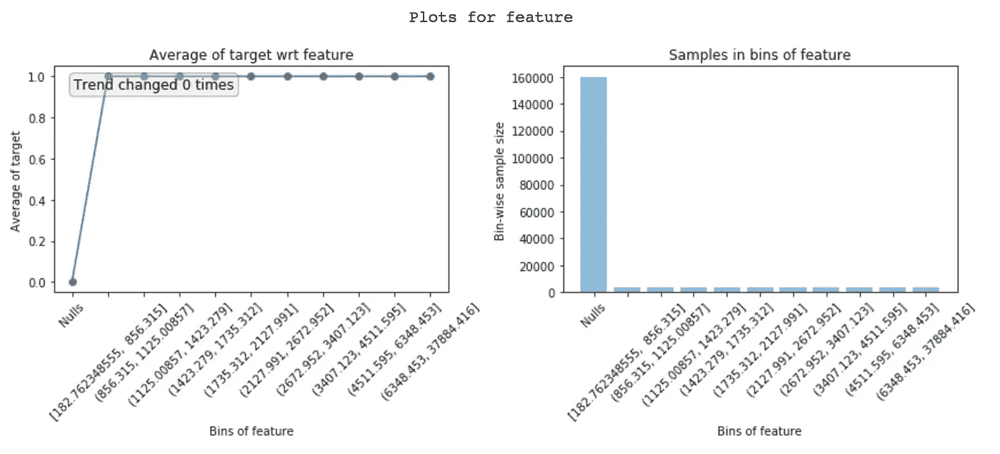

# 我的秘方是在卡格尔比赛中名列前 2%

> 原文：<https://towardsdatascience.com/my-secret-sauce-to-be-in-top-2-of-a-kaggle-competition-57cff0677d3c?source=collection_archive---------1----------------------->

## [实践教程](https://towardsdatascience.com/tagged/hands-on-tutorials)

在 kaggle 比赛中竞争是有趣和令人上瘾的！在过去的几年里，我开发了一些标准的方法来探索功能并建立更好的机器学习模型。这些简单但强大的技术帮助我在 [Instacart 市场篮子分析](https://www.kaggle.com/c/instacart-market-basket-analysis)比赛中获得了前 2%的排名，我也在 kaggle 之外使用它们。所以，让我们开始吧！

在数字数据上构建任何监督学习模型的最重要的一个方面是很好地理解特征。查看模型的部分相关图有助于理解模型的输出如何随任何特征而变化。

[source](http://scikit-learn.org/stable/auto_examples/ensemble/plot_partial_dependence.html)

但是，这些图的问题在于，它们是使用经过训练的模型创建的。如果我们可以直接从训练数据中创建这些图，它可以帮助我们更好地理解基础数据。事实上，它可以帮助你做以下事情:

1.  特征理解
2.  识别嘈杂的特征(**最有趣的部分！**)
3.  特征工程
4.  特征重要性
5.  功能调试
6.  泄漏检测和理解
7.  模型监控

为了使它更容易访问，我决定将这些技术放入 python 包 [featexp](https://github.com/abhayspawar/featexp) 中，在本文中，我们将看到它如何用于特性探索。我们将使用 Kaggle 上[家庭信用违约风险](https://www.kaggle.com/c/home-credit-default-risk/)竞赛的应用数据集。比赛的任务是利用给定的数据预测违约者。

1.  **功能理解**

Scatter plot of feature vs. target doesn’t help

如果因变量(目标)是二进制的，散点图不起作用，因为所有点不是在 0 就是在 1。对于连续目标，太多的数据点使得难以理解目标与特征的趋势。Featexp 创建了更好的图来帮助解决这个问题。我们来试试吧！

Feature vs. target plot of DAYS_BIRTH (age)

Featexp 创建数值要素的相等人口箱(X 轴)。然后，它计算每个箱中目标的平均值，并将其绘制在上面的左侧图中。在我们的例子中，target 的平均值只不过是违约率。该图告诉我们，DAYS_BIRTH 负值高(年龄较大)的客户违约率较低。这是有道理的，因为年轻人通常更有可能违约。这些图有助于我们了解该功能告诉客户什么，以及它将如何影响模型。右边的图显示了每个箱中的客户数量。

**2。识别噪声特征**

噪声特征导致过度拟合，识别它们并不容易。在 featexp 中，您可以通过一个测试集，并在训练/测试中比较特性趋势，以识别有噪声的特性。这个测试集不是实际的测试集。这是您的本地测试集/验证集，您知道目标。

Comparison of feature trends in train and test

Featexp 计算两个指标，显示在这些图上，有助于测量噪声:

1.  **趋势相关性**(在测试图中可见):如果一个特性在训练集和评估集之间不具有相同的趋势 w.r.t .目标，则可能导致过度拟合。发生这种情况是因为模型正在学习一些在测试数据中不适用的东西。趋势相关性有助于了解训练/测试趋势的相似程度，并使用训练&测试中箱的平均目标值进行计算。上述特征具有 99%的相关性。好像不吵！
2.  **趋势变化**:趋势方向的突然和重复变化可能意味着噪音。但是，这种趋势变化也可能发生，因为该仓位在其他特征方面具有非常不同的总体，因此，其违约率实际上不能与其他仓位相比较。

以下特征未保持相同的趋势，因此趋势相关性较低，为 85%。这两个度量可以用来丢弃噪声特征。

Example of noisy feature

当有许多要素并且它们彼此相关时，丢弃低趋势相关性要素效果很好。它导致较少的过拟合，并且其他相关特征避免了信息损失。同样重要的是不要放弃太多重要的特性，因为这可能会导致性能下降。**此外，你不能使用特征重要性来识别这些噪声特征，因为它们可能相当重要，但仍然非常嘈杂！**

使用不同时期的测试数据会更好，因为这样你就可以确定特性趋势是否会随着时间的推移而保持。

featexp 中的***get _ trend _ stats()****函数返回一个数据帧，其中包含每个特征的趋势相关性和变化。*

**

*Dataframe returned by *get_trend_stats()**

*让我们实际尝试删除数据中趋势相关性较低的特征，看看结果如何改善。*

**

*AUC for different feature selections using trend-correlation*

***我们可以看到，下降特征的趋势相关性阈值越高，排行榜(LB) AUC 越高。**不丢弃重要特征进一步将 LB AUC 提高至 0.74。同样有趣和令人担忧的是，测试 AUC 的变化没有 LB AUC 那么大。获得正确的验证策略，使本地测试 AUC 遵循 LB AUC 也很重要。完整的代码可以在 [featexp_demo](https://github.com/abhayspawar/featexp/blob/master/featexp_demo.ipynb) 笔记本中找到。*

***3。特征工程***

*通过查看这些图获得的见解有助于创建更好的功能。仅仅对数据有更好的理解就能带来更好的特性工程。但是，除此之外，它还可以帮助您改进现有的功能。我们来看另一个特性 EXT_SOURCE_1:*

**

*Feature vs. target plot of EXT_SOURCE_1*

*EXT_SOURCE_1 值高的客户违约率低。但是，第一个仓位(约 8%的违约率)并没有跟随特征趋势(先涨后跌)。它只有-99.985 左右的负值，人口众多。这可能意味着这些是特殊值，因此不要遵循特征趋势。幸运的是，非线性模型在学习这种关系时不会有问题。但是，对于像逻辑回归这样的线性模型，此类特殊值和空值(将显示为一个单独的条柱)应使用具有类似违约率的条柱中的值进行估算，而不是简单地使用特征均值进行估算。*

***4。特征重要性***

*Featexp 还可以帮助您评估特性的重要性。DAYS_BIRTH 和 EXT_SOURCE_1 都有不错的走势。但是，EXT_SOURCE_1 的人口集中在特殊值箱中，这意味着大多数客户的特征具有相同的信息，因此不能很好地区分他们。这说明它可能没有 DAYS_BIRTH 重要。基于 XGBoost 模型的特征重要性，DAYS_BIRTH 实际上比 EXT_SOURCE_1 更重要。*

***5。功能调试***

*查看 Featexp 的图有助于您通过做以下两件事来捕获复杂特征工程代码中的错误:*

**

*Zero variation features show only a single bin*

1.  *检查要素的人口分布是否正确。我个人曾无数次因小错误而遇到类似上述的极端情况。*
2.  *在看这些图之前，总是假设特征趋势会是什么样子。特征趋势看起来不像你所期望的，可能暗示着一些问题。**坦白地说，这种假设趋势的过程让构建 ML 模型变得有趣多了！***

***6。泄漏检测***

*从目标到特征的数据泄漏导致过度拟合。泄漏特征具有很高的特征重要性。但是，理解特征中为什么会发生泄漏是困难的。查看 featexp 图可以帮助您解决这个问题。*

*下面的功能在“空值”箱中的默认率为 0%，在所有其他箱中的默认率为 100%。显然，这是一个极端的泄漏案例。只有当客户违约时，此功能才有价值。根据该特性是什么，这可能是因为一个 bug，或者该特性实际上只是为默认者填充的(在这种情况下，应该将其删除)。**了解泄漏特性的问题所在有助于更快地调试。***

**

*Understanding why a feature is leaky*

*为了更精确地检测泄漏，我发布了另一个 python 包‘leak-detect ’,它实现了一个使用 NANs 和复数来完成这项任务的新技巧。看看我在最后链接的另一篇文章。*

*7 .**。模型监控***

*因为 featexp 计算两个数据集之间的趋势相关性，所以它可以很容易地用于模型监控。每次重新训练模型时，可以将新的训练数据与经过充分测试的训练数据(通常是第一次构建模型时的训练数据)进行比较。趋势相关性可以帮助您监控特征及其与目标关系是否发生了变化。*

*做这些简单的事情总是帮助我在现实生活中和 kaggle 上建立更好的模型。使用 featexp 只需 15 分钟就能看到这些图，绝对值得，因为之后你就不会盲目飞行了。*

*您还发现了哪些对探索特性有用的技巧和提示？我总是在寻找反馈。请在评论中告诉我，或者通过 abhayspawar@gmail.com 联系我。如果你想继续收到我的消息，请在推特上关注我(【https://twitter.com/abhayspawar】T2)*

*如果你喜欢这个，你可能会喜欢我关于使用 ML 进行算法交易的系列文章。它讲述了我如何能够获得比基准高出 100%的回报:*

* [## 战胜市场的交易策略的机器学习模型

### 如何看待训练和利用 ML 模型进行算法交易？

abhayspawar.medium.com](https://abhayspawar.medium.com/machine-learning-models-for-market-beating-trading-strategies-c773ba46db66)*