# 我自创的人工智能硕士学位

> 原文：<https://towardsdatascience.com/my-self-created-ai-masters-degree-ddc7aae92d0e?source=collection_archive---------1----------------------->

## 大学之路太贵了，所以我决定自己开一条。

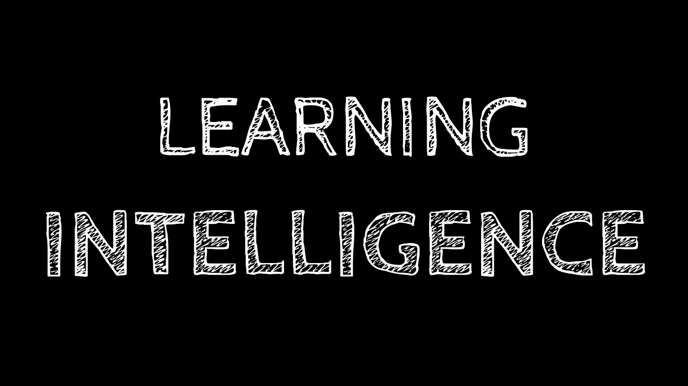

Who’s teaching who?

本文的上半部分是更新。真正的事始于一两卷卷轴。

***注:*** 本文是一项进行中的永久性工作，截至 2019 年 5 月 17 日。

**2019 年更新 2:** 有很多关于机器学习、数据科学和人工智能的伟大资源。我把一些我最喜欢的放在一个容易导航的位置。点击查看[。](http://bit.ly/AIMLresources)

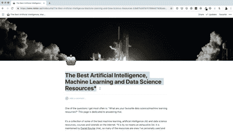

Some of the best machine learning, AI and data science resources in [one neat little package](http://bit.ly/AIMLresources).

**2019 更新:**我增加了一些更多的课程和其他资源(学习如何学习课程[和 100 页的机器学习书籍](http://bit.ly/LHTLarticle))。他们都还在按顺序完成。

**2018 更新:**进入我的课程 9 个月后，我被布里斯班的一家科技公司 [Max Kelsen](http://maxkelsen.com) 聘为机器学习工程师！

# 15 秒后见

我住在澳大利亚的布里斯班。

我是 2015 年毕业的，食品科学与营养学双学位。我花了五年时间读了三年本科。

我以为我想成为一名医生。可能是因为我在追随我朋友的做法，而不是创造自己的道路。

我是一个健身迷。我喜欢食物。将我对食物和健康的热爱与我的学习结合起来是我做过的最好的事情之一。

我在大学五年里学到的最有价值的一课是，如果你真的对你所学的东西感兴趣，学习就不再是一件苦差事。

我学会了如何学习。

如果你在开始上大学之前告诉我这个智慧，我会听，会理解，但不会付诸行动。我仍然认为学习永远是一项痛苦的任务。智慧必须学习而不是教授。

# 为什么要研究人工智能？

人工智能(AI)的整个革命让我着迷。人工智能，加上其他技术，有能力让世界变得更美好。它也有力量把世界变得更糟。我支持好的一面。

人工智能的进步已经发生了几十年。计算能力只是在最近才达到这样一个阶段，它足以让像我这样的人在我的卧室里研究这些技术。

2017 年初，我决定开始了解这种范式转变，而不是袖手旁观，看着它发生而不完全理解它。

# 我的目标

1.  **足够危险，把 AI 作为给世界带来价值的工具。**我不是为了学习而学习这些技术。我要用我所学到的去建造一些史诗般的东西。
2.  **将人工智能与我的健身和营养知识结合起来，帮助世界动起来，吃得更好。**我知道我永远不会成为人工智能、健身或营养这三个单一学科的世界领先专家，但我可以成为这三个学科交叉的领导者。
3.  **激励他人踏上自己的学习之旅。通过写下我的旅程并分享我所学到的东西，我想鼓励其他人选择自己并创造自己的道路。**

# 我的课程

当我开始学习时，我走的是相反的方向。我一头扎进了深水区(真的)，报名参加了一个深度学习课程，却从未写过一行 Python 代码。

我把自己吓得够呛[我给支持部门发了电子邮件](https://medium.com/@mrdbourke/how-im-learning-deep-learning-in-2017-part-1-632f4187ce4c)询问我是否有资格获得退款。幸运的是，我没有接受退款。

在对这个领域有了更多的了解后，我变得成熟了一点，并开始对我想在哪里学习有了一个想法。更多的想法开始进入我花时间的地方。

我不想成为最好的人工智能工程师或最受欢迎的人。我关注的是我可以用来建造东西的知识基础。

我的课程不像它应该的那样强大，相反，它是在飞行中建立的，学习我需要知道的东西以进入下一步。

如果你对我有任何建议，包括我应该看的课程或我应该努力的技能，请随时在评论中告诉我，我的[电子邮件](mailto:daniel@mrdbourke.com)或[推特](http://twitter.com/mrdbourke)。

## **键**

*   ✅ =课程全部完成
*   ✳️ =课程部分完成或正在进行
*   没有数学或书籍的符号

# **基础课程**

*   ✅[uda city python 编程基础](https://www.udacity.com/course/programming-foundations-with-python--ud036)【免费】
*   ✅ [CS50](https://www.edx.org/course/introduction-computer-science-harvardx-cs50x) 【免费】
*   ✅ [树屋巨蟒赛道](https://teamtreehouse.com/tracks/learn-python)[费用]
*   ✅ [Udacity 数据科学简介](https://www.udacity.com/course/intro-to-data-science--ud359)[免费]
*   ✅ [DataCamp 的数据科学课程 Python 简介](http://bit.ly/datacampmrdbourke) [Cost]

[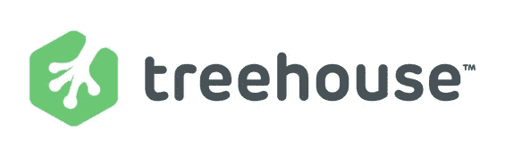](http://teamtreehouse.com)[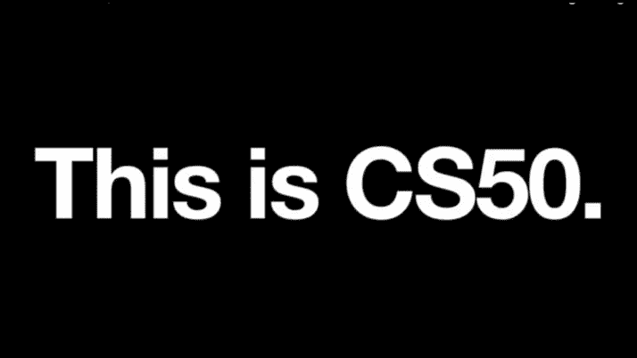](https://www.edx.org/course/introduction-computer-science-harvardx-cs50x)

Two incredible resources for starting to learn Computer Science and programming. Sources: Treehouse, Harvard CS50

## **为什么是这些？**

2017 年初，我对数据科学是什么一无所知，更别说 AI 了。我在二月份写了我的第一行 Python 代码。这些课程将为我提供 Python 编程、计算机科学和数据科学方面的基础。

# 高级课程

*   ✅ [Andrew Ng 在 Coursera 上的机器学习](https://www.coursera.org/learn/machine-learning)[免费]
*   ✅ [Udacity 深度学习纳米学位基础](https://www.udacity.com/course/deep-learning-nanodegree-foundation--nd101)[成本]
*   ✅ [Andrew Ng 在 Coursera 上的 deeplearning.ai 课程](http://bit.ly/dlcoursera) [Cost]
*   ✅ [Udacity 人工智能纳米学位](https://www.udacity.com/ai)[费用]
*   ✅ [Fast.ai](http://www.fast.ai/) 深度学习课程(第一部分)【免费】
*   ✳️ [Fast.ai](http://www.fast.ai/) 深度学习课程(第二部分)【免费】
*   ✳️ [在 coursera【cost】上用 Python](http://bit.ly/courseraDS) 应用数据科学
*   ✳️ [Fast.ai 机器学习课程](http://course18.fast.ai/ml)【免费】

[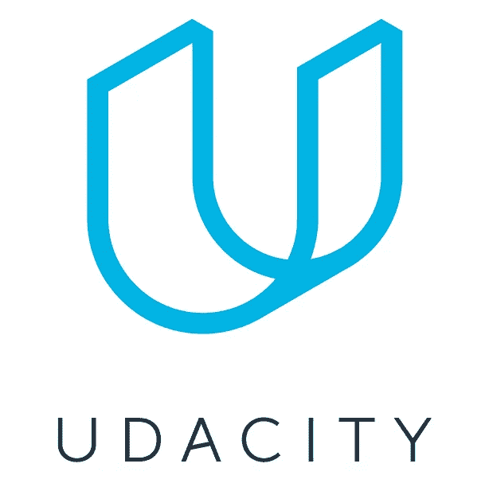](http://udacity.com)[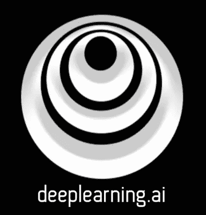](http://deeplearning.ai)[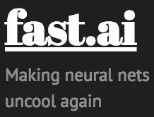](http://fast.ai)

Three of the best resources to learn AI online. Sources: Udacity, deeplearning.ai, fast.ai

## **为什么是这些？**

我偶然发现了 Udacity 的深度学习纳米学位基金会(DLND)，并被 Siraj Raval 争取了过来。我对人工智能和机器学习有点兴趣，但他在 YouTube 上的介绍视频让我着迷。这是我开始学的第一门课程。

从 DLND 开始，我的学习之旅随着关注人工智能和健康的交叉而增长。

# 书

*   [费了九牛二虎之力才学会 Python](https://learnpythonthehardway.org/book/)作者 Zed Shaw [Cost]
*   [赤裸裸的统计](https://amzn.to/2GbFw54)查尔斯·惠兰著【成本】
*   人工智能:一种现代的方法
*   [深度学习用 Python](https://amzn.to/2GddWV0) 作者[弗朗索瓦·乔莱](https://twitter.com/fchollet)【成本】

## 当前正在阅读

*   [使用 Scikit-Learn 和 TensorFlow 进行机器实践学习](https://amzn.to/2GormNb)作者 Aurélien Géron [Cost]
*   安德烈·布尔科夫的《百页机器学习书》

[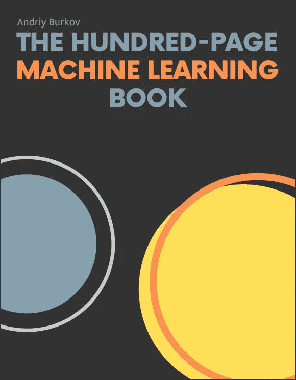](http://bit.ly/100pagemlbook)[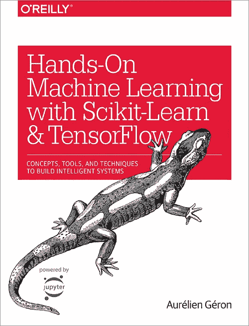](https://amzn.to/2GormNb)

If you’re starting out, put these two books in your library and read them cover to cover.

## 为什么是这些？

有时需要更传统的路线，而不是总是在屏幕前。Zed 关于 Python 的书极大地帮助了 Treehouse Python track。

上一次上统计学课是本科第一学期。我失败了。 [*赤裸裸的统计*](https://amzn.to/2GbFw54) 帮助我开始用更多的统计思维来思考。它的写作方式去掉了术语，给出了复杂统计概念的真实例子。

没有人工智能教科书中的圣杯来学习人工智能——人工智能:一种现代方法——不会真的是学习人工智能。

[*用 Python 进行深度学习*](https://amzn.to/2GddWV0) 也许是迄今为止对 AI、深度学习和 Python 最好的介绍。其作者 Franç ois Chollet 是流行的深度学习框架 Keras 的作者，目前在谷歌从事深度学习工作。

[*动手机器学习*](https://amzn.to/2GormNb) 是另一个不可思议的资源。这本书最符合我作为机器学习工程师的日常工作。

[*这本百页的机器学习书*](http://bit.ly/100pagemlbook) 是 2019 年的新版本。我希望我开始的时候有这本书。一天就能看完。我们正在为办公室准备一个，并打算把它作为一个首选资源。

# 数学

*   [可汗学院矩阵简介](https://www.khanacademy.org/math/precalculus/precalc-matrices)[免费]
*   [可汗学院线性代数](https://www.khanacademy.org/math/linear-algebra)【免费】
*   [可汗学院多变量微积分](https://www.khanacademy.org/math/multivariable-calculus)【免费】
*   [可汗学院统计与概率](https://www.khanacademy.org/math/statistics-probability)【免费】
*   3blue1brown YouTube 频道【免费】
*   [Coursera 上用于机器学习的数学](http://bit.ly/courseraMathForML)【成本】

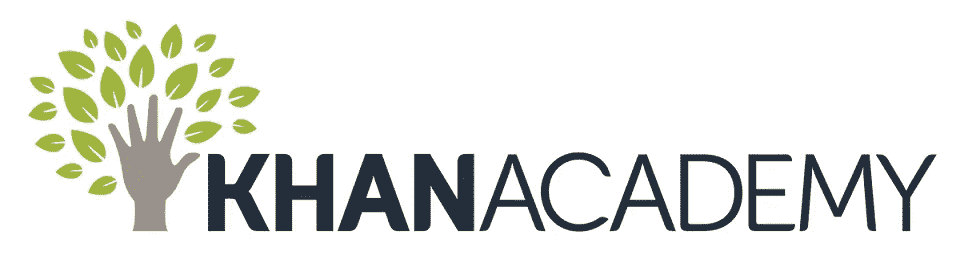

Source: [Khan Academy](https://www.khanacademy.org/)

## **为什么是这些？**

一旦我开始学习机器学习和深度学习，我的高中数学技能需要一些完善。多亏了各种框架和库，许多数学工作都是在幕后完成的。

对这些技术中的数学有一个大致的了解对我有很大的帮助。

# 临时演员

*   [布里斯班 AI Meetup](https://www.meetup.com/en-AU/Brisbane-Artificial-Intelligence/) 【免费】
*   [Siraj Raval 的 YouTube 频道](https://www.youtube.com/channel/UCWN3xxRkmTPmbKwht9FuE5A)【免费】
*   [免费代码营](http://www.freecodecamp.com)【免费】
*   ✅在 Coursera 上学习如何学习课程
*   ✅[coursera 上的谷歌云数据专业专精](http://bit.ly/courseraGoogleDataEng)【成本】

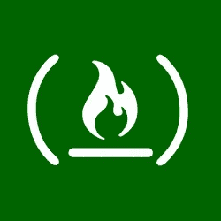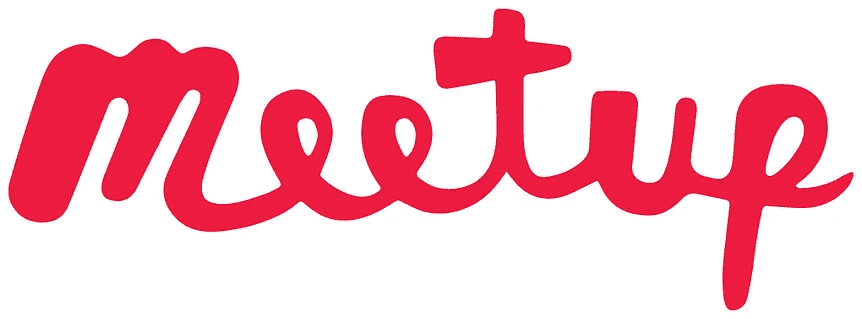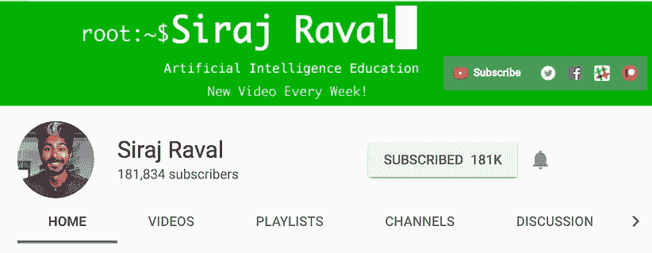

Sources: [freeCodeCamp.com](http://freecodecamp.com), [Meetup.com](http://meetup.com), [Siraj Raval YouTube Channel](https://www.youtube.com/channel/UCWN3xxRkmTPmbKwht9FuE5A)

## **为什么是这些？**

我的性格类型是 [ENFP](https://www.16personalities.com/enfp-personality) 。从本质上来说，我更外向而不是内向(只有一点点)。在电脑屏幕前呆太久，我会变得很奇怪。如前所述，我正在使用 Meetup 寻找和结识对我感兴趣的人。

Siraj Raval 是个巫师。他的 YouTube 频道是我学习人工智能并最终创建自己的人工智能硕士学位的主要灵感。观看他的视频让我在 YouTube 上记录了我的学习历程。如果你想了解更多关于人工智能的知识，我强烈推荐他的频道。

如果我需要温习当前正在学习的 Python 堆栈之外的 web 技术，FreeCodeCamp 是我要去的地方。毕竟，如果你用人工智能建造了什么东西，你将需要一种方式把它交付给世界。他们有我见过的最好的在线社区之一。如果你想从事 web 开发，这是你的起点。

我已经提到过，我在大学五年后学到的最有价值的技能是学会如何学习。但我想出了一个艰难的方法。Coursera 上的[学习如何学习课程应该是每个学生的必修课。学会如何学习是终极技能，因为你可以把它应用到其他任何事情上。](http://bit.ly/LHTLonCoursera)

任何机器学习工程师或数据科学家都需要使用云技术。如果你想让人们使用你制造的东西，你必须分发它们。云计算可以帮助你做到这一点。我已经选择谷歌云作为我目前的云供应商。我利用 Coursera 上的[谷歌云数据工程专业来提升自己的技能。要了解更多，请参见文章](http://bit.ly/courseraGoogleDataEng)[我如何通过谷歌云数据专业认证考试](/passing-the-google-cloud-professional-data-engineer-certification-87da9908b333?source=friends_link&sk=2c405be189a32c0997dc945a34f597b6)。

# 我该如何掌控一切？

我正在使用一个公开的[特雷罗板](https://trello.com/b/tyHAvpcY)跟踪这一切。我发现保持事物的直观性和尽可能简单是我工作的最佳方式。请随时关注我的进展。

[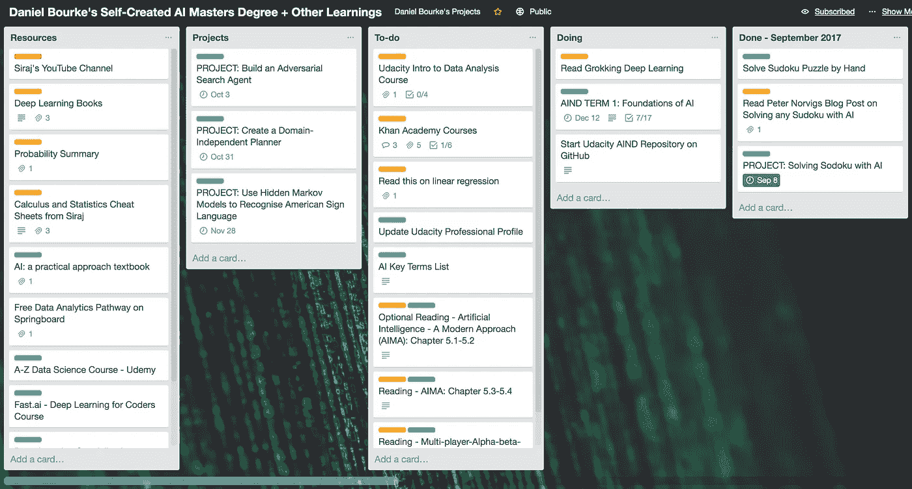](https://trello.com/b/tyHAvpcY)

What my Trello board looks like as of 13 September 2017 (it gets updated as I learn/add more to the curriculum).

# 为什么要创造我自己的道路？

在大学学习期间，我经常问讲师和教授，

> 这个会出现在试卷上吗？

我真正的意思是，

> 除非是期末考试，否则我是不会学这个的。

Seth Godin 的这篇文章一针见血。

这十年来，我在大学里度过了足够多的时间。

然而，当我决定如何学习时，我使用了两个主要标准。

1.  **成本**
2.  **灵活性**

就费用而言，我所在地区大学的计算机科学研究生学位每年在 20，000 澳元到 30，000 澳元之间(至少两年)。为了以后对比，我就用低端的。

根据我以前在大学的经验，它一点也不灵活。严格的截止日期，基本上任何缺席的医疗证明，严格的上课时间，一次性讲座，从我住的地方到我最近的校园往返 70 分钟，等等。这些都不是坏事，但当你把它与在线学习的替代方式相比时，情况就开始有点不同了。

就灵活性而言，在线学习显然是赢家。能够按照自己的进度学习是一大优势。我对我有困难的概念放慢速度，对其他所有事情都很快。因为不可预见的事件，我错过了最后期限？我请客。没有别人。

在线学习并不总是一帆风顺。你在灵活性中获得的东西，会在实际的人际交往中失去。在电脑前学习了一天后，我变成了一个内向的僵尸。我用当地的聚会来弥补这一点。

在线学习也没有大学的声望高。我完成的一些课程不提供*验证证书*。我不担心那个。我的目标是获得足够的知识，将这些技术付诸实践，为世界带来价值。

我将使用我构建的东西作为我能力的证明，而不是证书。

# 支付课程费用

我没有积累更多的学生债务，而是选择用我本打算花两年时间攻读计算机科学硕士学位的钱来资助我自己的学习之旅。

我预先支付所有课程的费用。为了做到这一点，当我开始学习这门课程时，我会在周末开车去优步。在被聘为机器学习工程师后，我仍然会提前支付费用。

# 下一步是什么？

你可以把这篇文章看作是我自创的人工智能硕士学位课程的半成品。随着我学习的课程和从事的项目的进展，我会保持更新。

我正在通过 [YouTube 视频](https://www.youtube.com/channel/UCr8O8l5cCX85Oem1d18EezQ)和[博客帖子](https://www.mrdbourke.com)分享我的旅程。