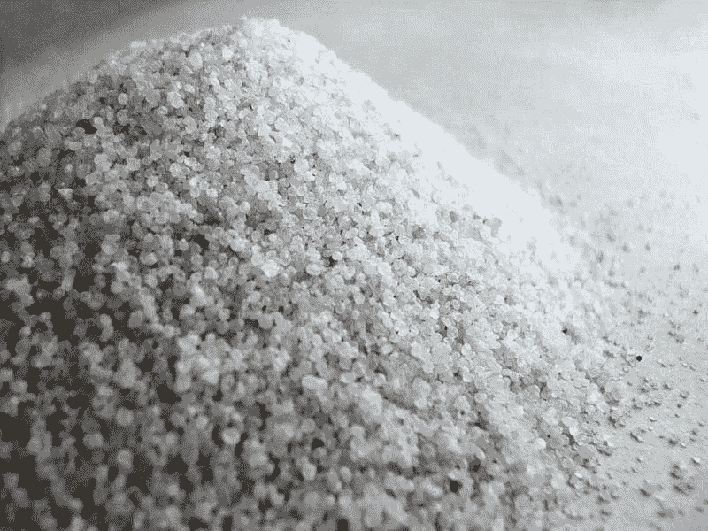

# 我的硅砂数据冒险

> 原文：<https://towardsdatascience.com/my-silica-sand-data-adventure-3b9231e6ba08?source=collection_archive---------5----------------------->

我的两个叔叔经营一家清洁用品公司。他们中的一个给我发电子邮件，问我如何研究香烟烟灰缸砂的总市场，这只是硅砂。尽管所有的沙子都是二氧化硅，但短语“硅砂”通常是指某种商业用途的预处理过的沙子(如烟灰缸)。

总可用市场泛指市场需求的上限。没有多少数据库可以涵盖香烟烟灰缸沙子的市场，所以，我决定继续寻找。

我最近读了[super forecasts](http://amzn.to/2nYaW2T),它让我稍微开阔了一下眼界，让我了解到如何用一种快速、准确的方法将评估分解成子问题。我决定用它来估算美国一年的硅砂总需求。

我是这样把问题分解的:找出吸烟者的总数，然后算出每个吸烟者使用的烟灰缸沙子的数量。

# 吸烟者总数

第一部分(吸烟者的数量)很简单，因为[疾病预防控制中心有数据](https://www.cdc.gov/mmwr/volumes/65/wr/mm6544a2.htm?s_cid=mm6544a2_w):

> 2015 年，每 100 名 18 岁或以上的美国成年人中约有 15 人(15.1%)目前*吸烟。这意味着美国目前估计有 3650 万成年人吸烟。

# 每个吸烟者有多少硅砂？

下一步，计算出一个普通吸烟者使用多少烟灰缸的精确估计，有点困难，因为这是一个如此狭窄的市场。我将这个问题进一步分解为一组 3 个问题。

**1。** **一般烟民用多少支烟？疾控中心称每天 14.2 人=每年 5183 人。(这让我非常惊讶。一包烟通常有 20 支。)**

**2。** **吸烟者在烟灰缸里处理香烟的时间占多大比例？这是我非常非常感兴趣的地方。**

事实证明，香烟垃圾是一个非常非常大的问题，所以在这个问题上有相当多的研究。就我的目的而言，我发现的最有用的研究是关于垃圾的观察研究，但有一个关于吸烟者的特殊部分。研究人员实际上观察了数千名吸烟者，看看他们吸烟后会做什么。在他们的样本中，57%的时间里吸烟者乱扔烟头。他们还注意到，在他们观察的地点中，只有 61%有烟灰缸。

在寻找第二个估计时，我发现了一个说法(这个说法没有根据),大约有 30%的时间香烟最终成为垃圾。我取了观察研究的估计值和 **30%** 的平均值，最终确定了我的估计值，即 **43%** 的吸烟者乱扔烟头的时间。这意味着吸烟者其余的时间使用烟灰缸，或者说 57%的时间使用烟灰缸。

**3。** **平均处理一支香烟要用多少沙子？这是最难的，我不得不使用一些非常粗略的数字。我从网上的供应商那里看到，大多数香烟瓮需要大约 3-5 磅的沙子，可以容纳大约 3000-4000 个烟头。这意味着每 1000 个烟头中大约有 1 磅沙子。**

最后，所有的部分都准备好了，我终于可以做计算了:每年 5183 支香烟* 3650 万吸烟者* 57%被丢弃在烟灰缸里~一年有 1078 亿支香烟被丢弃在烟灰缸里。除以 1000 得到烟灰缸沙的磅数~ **美国每年有 1.078 亿磅烟灰缸沙**。

随着我的深入调查，我发现硅砂也用于泳池过滤器和壁炉，这可能会增加总的可用市场。然而，我上面的估计是保守的。

# 我学到了什么

在我寻找数据的过程中，有一些经验教训可能是通用的。

**1。** **将问题分解成子问题的力量。用这种方法可以解决的问题范围很广。我认为，这对于商人来说是一个强大的洞察力，因为在很多情况下，你没有时间，但需要给出一些具体的数字。通常在这种情况下，没有人有现成的数据库等着你。**

**2。** **在二级数据中发现问题。**商业创新成功的关键在于发现人们愿意花钱解决的重要问题。在为了一个不相关的原因挖掘一项观察性研究时，我发现了一个没有很好解决的大问题:香烟垃圾。也许这个问题会随着无烟香烟而消失，谁知道呢。我的观点不是关于这个特定的案例，而是二手数据可能包含有待解决的未开发的重要问题。

我希望你和我一样喜欢这次冒险。