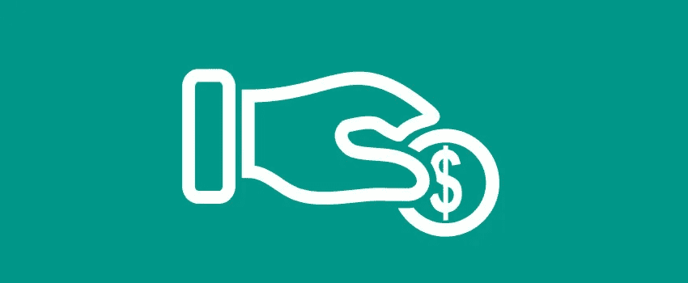

# 我关于深度学习和神经网络的故事——第一部分

> 原文：<https://towardsdatascience.com/my-story-with-deep-learning-and-neural-networks-part-i-a751c7d148c?source=collection_archive---------5----------------------->

*注:最初发表于 2015 年 11 月 25 日的博客上。*

我从 2008 年开始研究深度学习，大概是每年的这个时候。我很幸运有 [Yann LeCun](http://yann.lecun.com/) 作为导师，还有他的一个天才学生: [Clement Farabet](http://www.clement.farabet.net/) 。我们一起着手制作卷积神经网络加速器。就在这个领域被称为**深度学习**之前。但是让我们再放大一点:

从我的博士学位开始，在 1998-2004 年间，我一直在神经形态工程领域工作。我得到了该领域一些顶尖人士的建议: [Andreas Andreou](http://www.ece.jhu.edu/~andreou/andreas/) ，我的超级天才博士顾问，[Ralph-Etienne-Cummings](http://etienne.ece.jhu.edu/etienne/)——也是一位亲密的顾问，[Gert Cauwenberghs](http://jacobsschool.ucsd.edu/faculty/faculty_bios/index.sfe?fmp_recid=282)——第三位亲密的同事，还有[kwa bena bo ahen](https://web.stanford.edu/group/brainsinsilicon/boahen.html)——最著名的“神经形态”之一。我基本上是站在巨人的肩膀上。我欠他们一辈子，利息。你读这本书是因为他们！

无论如何，神经形态工程是从生物学中获得灵感来创建工程系统的领域，该系统可以执行生物学最擅长的所有任务，如理解复杂数据:图像、视频、学习等。

**生物学，或者也许只是“神经网络”。**

再往前追溯，在意大利的里雅斯特大学攻读学士学位期间，我正在研究人类视觉系统的模型。后来，我了解到人类大脑是多么复杂，我开始热衷于将我的生命投入到将人类大脑复制成合成系统的想法。这是一个很好的人生目标，再加上通过复制一些东西，一个人真的必须了解它是如何工作的！在我 1998 年至 2004 年的博士研究期间，理解神经网络成了我的人生目标。当时，我与来自神经形态工程国际研究小组的电气工程、机器人学、神经科学、心理学领域的各种杰出人物建立了联系。这真的拓宽了我的兴趣，能够倾听所有这些看似不相关领域的科学问题。

但是后来我越来越明白，一切都是有联系的。它就像一个巨大的大脑。就像一个巨大的神经网络！关于这一点的更多内容将在后面讨论。

一些神经形态工程的目标是复制人类理解环境的能力。人类主要通过视觉做到这一点，毕竟视觉可以将你的“感知范围”延伸到最远，比触摸或你的身体更远，甚至比你的耳朵可以感知的声音更远。但是我们所有的感官赋予了我们在环境中生存的不可思议的能力。仅仅几千年前，人类生活的世界还远没有现在安全……在 1998 年至 2004 年期间，在我攻读博士学位期间，我研究了许多人造眼睛，或者能够在正确的时间获得正确的视觉信息的特殊图像传感器，可能会压缩大量的视觉数据。

当时我对与这个行业合作很感兴趣，但这一切似乎离我的目标和我正在创造的设备太远了。当时的工业生产和图像传感器研究都是为了推出更好的手机摄像头。不像今天。只考虑增加更多像素和提高速度似乎是渐进的。但是，是的，这是一场革命。我很高兴能与世界上最优秀的图像传感器创新研究人员联系，例如 [Eric Fossum](http://ericfossum.com/) 和 [Gunhee Han](https://scholar.google.com/citations?user=OHKZae4AAAAJ&hl=en) 、 [Jun Ohta](http://mswebs.naist.jp/LABs/pdslab/index-e.html) 等等。

当时，最好的神经形态图像传感器和视觉系统是由我在约翰霍普金斯大学的一些同学和顾问创造的:才华横溢的雅各布·沃格斯泰因、维克多·格鲁夫和最著名的施-刘炽、鸢·德尔吕克。例如，鸢的高动态视觉传感器和硅视网膜是设计最好的传感器之一。

但是大约从 2003 年开始，我对“照片里是什么”越来越感兴趣，而不仅仅是拍出漂亮的照片，即使是用我们花哨的神经形态相机！原因是很难真正将更多的计算能力压缩到图像传感器中。2D 芯片制造的必然性使我们被限制在 2D 的世界里。像我的顾问 Andreas 这样的远见者知道我们需要 3D，这是传感器和存储器的最新趋势！

当时，如果你想在视觉方面做得更多，设计更好的图像传感器真的不是办法。总的来说，我对计算机视觉也没什么印象。我不喜欢也不欣赏试图手工设计所有视觉问题的解决方案，并试图将其分解成几个部分，就像完形心理学和数学导向的计算机科学家在历史上所做的那样。在我看来，这一切都可以概括为 1966 年麻省理工学院论文中的著名目标，即在一个夏季项目中完全复制人类的视觉。这样的目标，到目前为止，已经被证明是一项艰巨的任务！

**我反而被人类大脑解决问题的方式所吸引。**

在我看来，人类的视觉系统是宇宙中最好的视觉系统！至少在我的人类眼中是最好的，因为它能够执行如此多的任务，并以我们大脑的智慧为食。我经常认为我们的大脑如此发达的原因主要是因为我们的视觉系统，或者两者的共同进化。这里！辩论的食物。人类的视觉系统让我们可以轻松地在环境中移动。我真的想复制它，用在机器人和机器上，让计算机看东西的方式和人类看东西的方式相似。

**这是我现在的人生目标。为了做到这一点，我们要深入研究智力、语言和技术进化的问题。所有这些话题现在似乎都融合在一起了。我不知道细节，但一些未来的画面在我脑海中清晰可见。更多将被告知。**

回到 2006 年 7 月，我的研究目标之一是创造一个神经系统，它可以复制我们的视觉识别物体的能力。然后，我真正受到了托马斯·塞尔(Thomas Serre)的工作和论文的启发，他是由著名的托马斯·波吉奥(Tomaso Poggio)领导的。他们在麻省理工学院的作品是一个真正的灵感，我们和陈寿顺一起努力在硬件上复制他们的一些模型。

然后，在 2008 年初的一天，我和我们杰出的同事 [Bernabe Linares-Barranco](http://www2.imse-cnm.csic.es/~bernabe/) 聊天，他不经意地提到了 Yann LeCun 的工作。Yann 刚搬到 NYU，那时我在耶鲁大学，他友好地同意来主持一个研讨会。他是多么令人鼓舞的 T2 啊。他拥有硬件开发人员所要求的**最简单的神经元模型**！以及训练大型系统的方法！它有“**学习**”，这是我博士经历中没有的概念，尽管我的密友和同事 [Roman Genov](http://www.eecg.toronto.edu/~roman/) 和 [Shantanu Chakrabartty](http://www.cse.wustl.edu/~shantanu/) 早在 1998-2005 年就在研究支持向量机和神经网络。我马上就明白了。

**学习，简单神经元模型，可扩展系统，生物启发，人类视觉系统模型！**

自 2008 年以来，我们开始致力于基于可编程逻辑器件(Xilinx FPGA)的**人工硬件**，以在硬件上实现深度神经网络。我们非常幸运地与 Clement Farabet 一起工作，他向我们介绍了 Torch，并使我们的实验室后来成为工具开发人员之一。Torch 使得创建神经网络和在软件中训练它们变得容易。与以前的 CNN 图书馆相比，这是一个很大的进步，以前的图书馆不太容易被黑客攻击和理解。

在接下来的几年里，从 2008 年到 2011 年，我们与 Clement Farabet 合作定制硬件，直到他跳槽到自己的软件公司工作，然后在 2014 年被 Twitter 收购(恭喜！).2011 年，我们的实验室(电子实验室)搬到了普渡大学，我们开始培养新一代的机器学习专家:Jonghoon Jin、Aysegul Dundar、Alfredo Canziani 和更多的硬件专家，如 Vinayak Gokhale。Berin Martini 在过去几年中不断完善硬件系统，直到 Vinayak Gokhale 在 2014-2015 年发明了一种全新的架构。我们的机器学习专家和我本人致力于视觉跟踪，然后是聚类学习和 k-means 聚类技术的无监督学习，以及我们定制硬件机器的编译器。我们为 Torch7 写了很多软件，在 Caffe 和其他工具出现之前，我们维护了演示代码和软件。在 2013 年夏天，所有电子实验室共同努力，将我们的硬件系统移植到 Xilinx Zynq 设备中，这是一种结合了 AMR 内核和 FPGA 结构的真正嵌入式系统。我们在 Linux 设备驱动程序中开发了与设备对话的底层代码，然后实现了一个完整的硬件系统和软件编译器。我们将这一系统称为 nn-X，并在 NIPS 2014 上首次展示，在那里我们的硬件演示受到了媒体的关注和认可。

与此同时，很明显我们是未来一项关键技术的专家，深度学习，我决定资助公司 [Teradeep](http://www.teradeep.com/) ，以便将我们在可编程设备中的硬件设备商业化，并将它们转变为定制的微芯片。宏伟的目标是让所有设备都能够像人类一样看到和感知世界。

**目标是创造一种特殊的微芯片，在电池供电的设备上运行神经网络，比如手机。数据中心服务器和自动驾驶汽车系统。**

在早期，大多数行业都不知道深度学习是什么，对他们来说，这只是“那些算法中的另一种”。这一愿景在我们心中很活跃，但很难被许多公司高管接受。他们错过发令枪会让他们后来感到沮丧。—第一部分结尾—脚注:1:这是我的故事。我希望它能帮助其他人获得视角。如果可能的话，通过别人的经历。

他说:非常感谢海军研究办公室，ONR 和 T4 的托马斯·麦肯纳，他们资助了我们的许多研究活动。

*最初发表于 2015 年 11 月 25 日的 Blogger。更多最新评论见:*[https://medium . com/forward-data-science/can-we-copy-the-brain-9 ddbff 5 E0 DDE](https://medium.com/towards-data-science/can-we-copy-the-brain-9ddbff5e0dde)

# 关于作者

我在硬件和软件方面都有将近 20 年的神经网络经验(一个罕见的组合)。在这里看关于我:[传媒](https://medium.com/@culurciello/)、[网页](https://e-lab.github.io/html/contact-eugenio-culurciello.html)、[学者](https://scholar.google.com/citations?user=SeGmqkIAAAAJ)、 [LinkedIn](https://www.linkedin.com/in/eugenioculurciello/) 等等…

# 捐款

如果你觉得这篇文章有用，请考虑捐赠[来支持更多的教程和博客。任何贡献都能有所作为！](https://www.paypal.com/cgi-bin/webscr?cmd=_s-xclick&hosted_button_id=Q3FHE3BWSC72W)