# 我用 30 个问题来测试一个数据科学家关于自然语言处理和交互式代码的能力—第 1 部分

> 原文：<https://towardsdatascience.com/my-take-on-30-questions-to-test-a-data-scientist-on-natural-language-processing-with-interactive-b8664c53be13?source=collection_archive---------3----------------------->

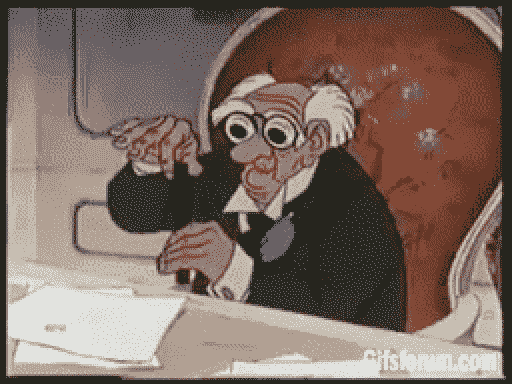

GIF from this [website](https://giphy.com/gifs/HPF6ivflFs7U4)

Shivam Bansal 是一名数据科学家，在自然语言处理和机器学习方面拥有丰富的经验。他有一篇关于自然语言处理的惊人博文。因此，如果有人感兴趣，请检查他的工作，他们是超级有益的。今天，我将试着回答他的 30 个自然语言处理问题中的一些问题[。](https://www.analyticsvidhya.com/blog/2017/07/30-questions-test-data-scientist-natural-language-processing-solution-skilltest-nlp/)

此外，我不会按数字顺序回答问题。对于每一个问题，我会努力找到正确的答案并把它们联系起来。然而， ***我总是乐于学习和成长*** ，所以如果你知道一个更好的解决方案，请在下面评论。

**Q1)以下哪种技术可用于关键字规范化，即将关键字转换为其基本形式的过程？**

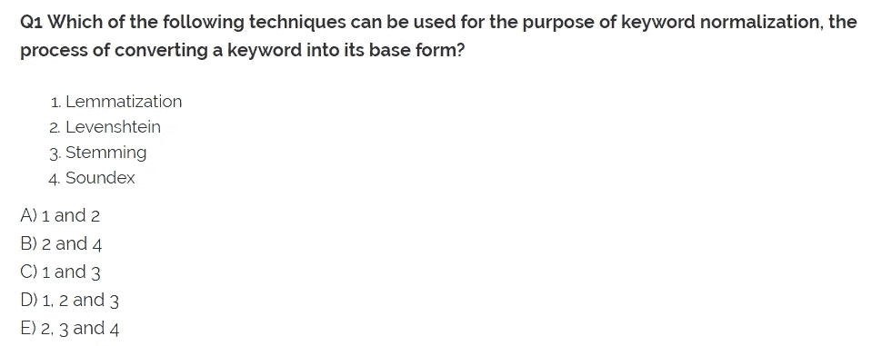

所以关键词规范化就是把一个词(关键词)处理成最基本的形式。这方面的一个例子是，将 sadden、saddest 或 sadly 转换成 sad 这个词。(因为这是最基本的形式)知道了这一点，现在让我们看看我们可以选择的选项。

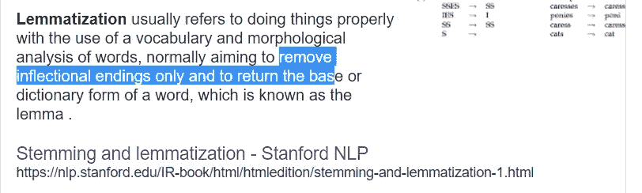

Image from this [website](https://www.google.ca/search?q=lemmatization&rlz=1C1CHBF_enCA771CA771&oq=Lemmatization&aqs=chrome.0.0l6.308j0j7&sourceid=chrome&ie=UTF-8)

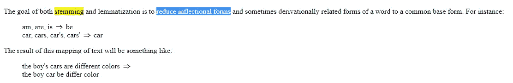

Image from this [website](https://nlp.stanford.edu/IR-book/html/htmledition/stemming-and-lemmatization-1.html)

所以从上图我们可以直接看到词干化和词汇化都是用来将单词转换成最基本形式的技术。(而且他们甚至举了一个汽车的例子，car 的→ car)。最后，让我们看看其他两个选择意味着什么。([这篇文章](https://blog.bitext.com/what-is-the-difference-between-stemming-and-lemmatization/)也很好地解释了词干化和词汇化之间的区别。)

Image from this [website](https://en.wikipedia.org/wiki/Levenshtein_distance)

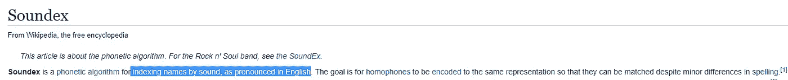

Image from this [website](https://en.wikipedia.org/wiki/Soundex)

如上所述，我们知道 Levenshtein 用于测量不同句子之间的相似性，Soundex 用于根据单词的发音对其进行索引。因此，它们不是用于关键字规范化的合适工具。最后，让我们看看这在 python 中是什么样子的。

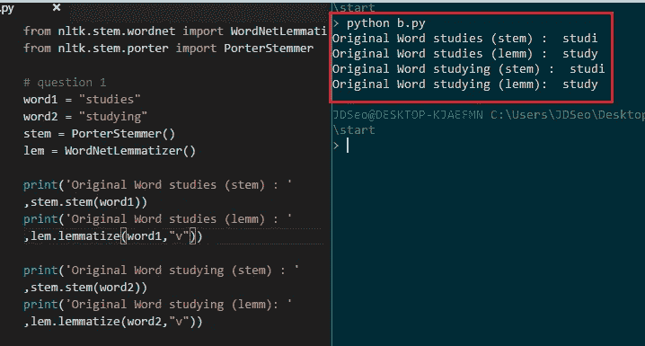

**红框** →原词归一化关键字

如上所述，我们知道单词 studies/学习在词干化/词汇化之后已经变成了 studi 或 study。我们可以确认我们的解决方案是正确的。

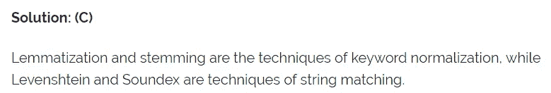

**Q2) N 元文法被定义为 N 个关键字的组合。从给定的句子中可以产生多少个二元语法:**

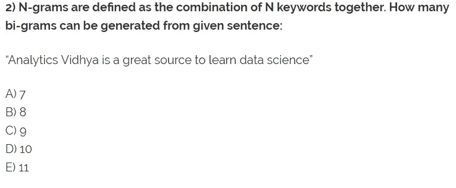

我首先需要回答什么是 N 元文法的问题，我发现一个堆栈溢出问题很好地回答了 N 元文法到底是什么。

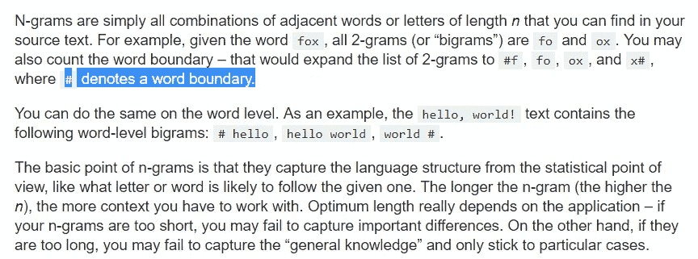

Image from this [website](https://stackoverflow.com/questions/18193253/what-exactly-is-an-n-gram)

因此，假设我们没有使用#(单词边界)，下面是我们可以从句子“Analytics Vidhya 是学习数据科学的一个很好的来源”中生成的所有双字母组合。

【《分析 Vidhya》、《Vidhya 是》、《是一个》、《一个伟大的》、《伟大的来源》、《来源于》、《学习》、《学习数据》、《数据科学》】。意思是一共有 9 个双字母组合。现在让我们看看实现。

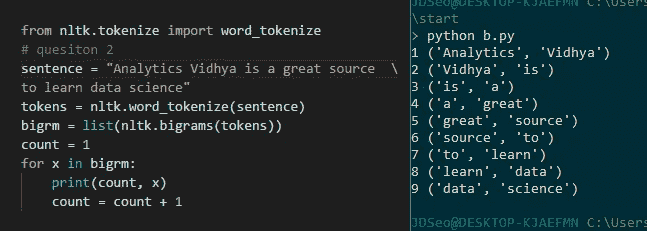

最后，我们可以确认我们的解决方案是正确的。

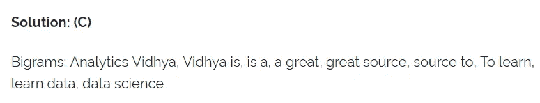

**Q3)在执行下面的文本清理步骤**之后，从下面的句子中可以生成多少个三元组短语

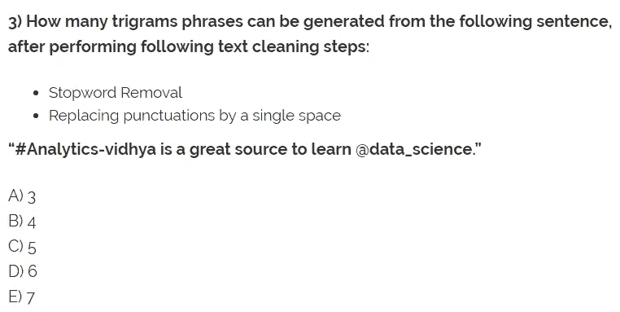

我们已经知道什么是三元组(从问题 2)。现在让我们更深入地看看什么是停用词删除以及取代标点符号。

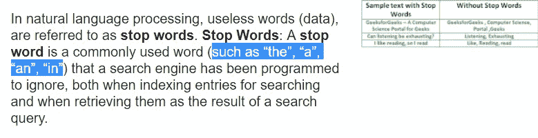

Image from this [website](https://www.google.ca/search?q=stopword+removal&rlz=1C1CHBF_enCA771CA771&oq=stopword+remove&aqs=chrome.1.69i57j0l5.3029j0j7&sourceid=chrome&ie=UTF-8)

从一个简单的谷歌搜索中，我们知道停用词删除是指删除诸如“是”、“一个”和“该”等词的过程。现在，我们需要将每个标点符号替换为单个空格。为此，我们需要知道 python 字符串库中有哪些标点符号。我们可以这样做来得到它，就像…

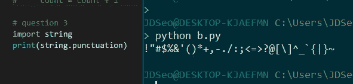

知道了所有这些，我们可以首先从句子中删除所有的停用词……(要查看停用词列表，请[点击此处)](https://www.ranks.nl/stopwords)

**“# Analytics-vid hya great source learn @ data _ science。”**

现在让我们用一个空格代替所有的标点符号，给我们…

**Analytics vidhya 大源码学习数据科学**

最后，让我们创建三元语法，它给出了单词列表["Analytics vidhya great "，" vidhya great source "，" great source learn "，" learn data science"]，长度为 5。(给了我们答案 c)。现在让我们看一下实现。

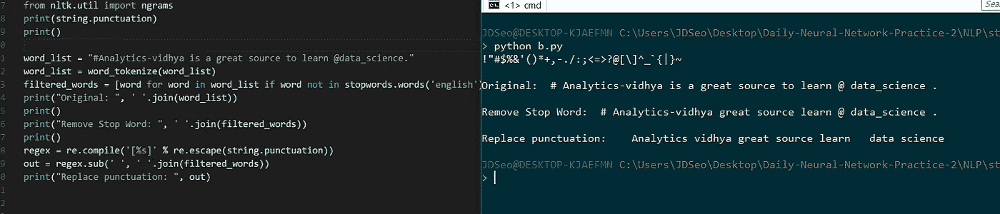

从上面我们可以看到，我们得到了相同的句子"**分析 vidhya 伟大的来源学习数据科学"。**

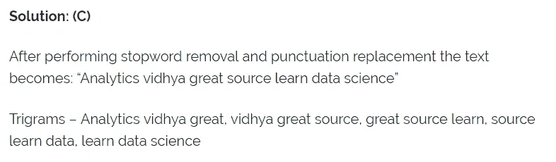

**Q4)以下哪个正则表达式可用于识别文本对象中的日期:**

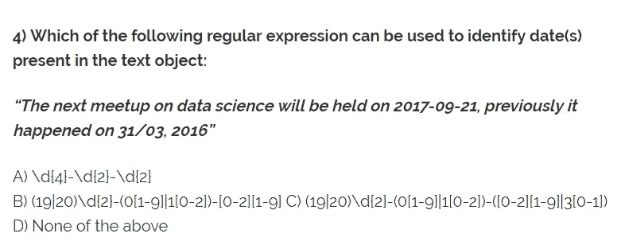

这是一个棘手的问题(至少对我来说)，但是通过简单的实现，我们可以看到没有一个正则表达式匹配日期。

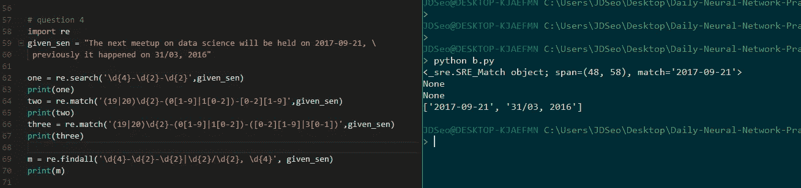

从那里我们知道一个解正则表达式可以是(' \d{4}-\d{2}-\d{2}|\d{2}/\d{2}，\d{4} ')，它不作为一个选项存在，因此答案是 D)

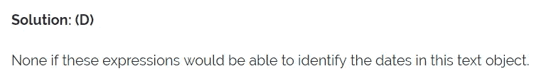

**Q5)以下哪种模型可以根据上述上下文对推文进行分类？**

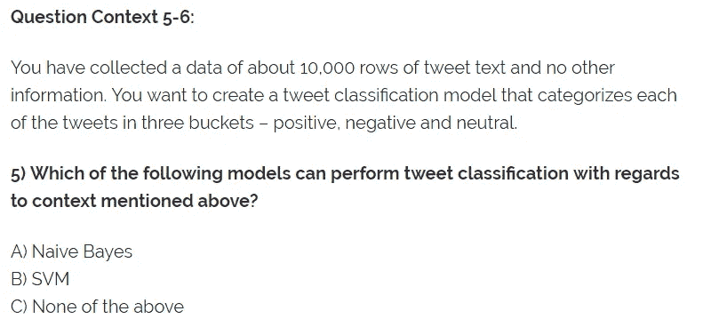

在深入这个问题之前，让我们简单回顾一下什么是 SVM /朴素贝叶斯。

Image from this [website](https://en.wikipedia.org/wiki/Support_vector_machine)

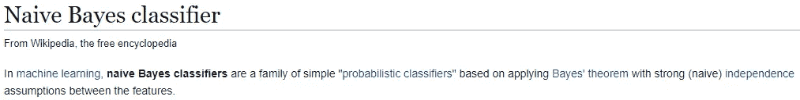

Image from this [website](https://en.wikipedia.org/wiki/Naive_Bayes_classifier)

无需深入每个分类器的细节，我们已经可以看出它们是在监督学习环境中使用的相似算法。然而，我们的问题表明，我们只收集了推文，仅此而已(我会假设这些是标签数据。).因此，没有一个，但如果标签包括在内，我想我们可以两个都用。答案应该是他们两个。

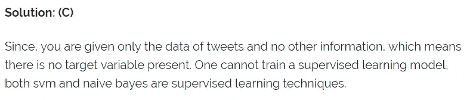

**Q6)您已经创建了数据的文档术语矩阵，将每条推文视为一个文档。关于文档术语矩阵，以下哪一项是正确的？**

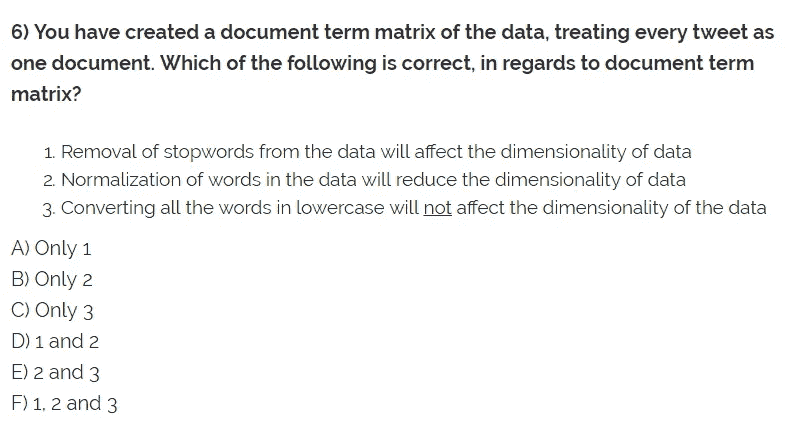

目前，所有这些选项对我来说似乎都是正确的，但是让我们更深入地了解什么是文档术语矩阵。

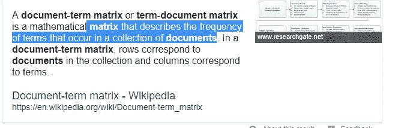

Image from this [website](https://www.google.ca/search?q=document+term+matrix&rlz=1C1CHBF_enCA771CA771&oq=document+term+ma&aqs=chrome.0.0l2j69i57j0l3.2251j0j7&sourceid=chrome&ie=UTF-8)

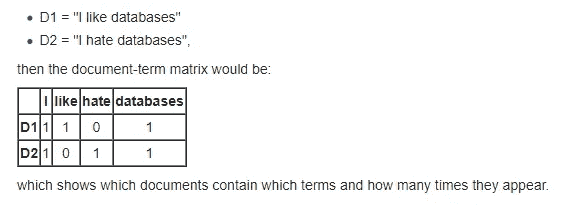

Example from this [website](https://en.wikipedia.org/wiki/Document-term_matrix)

从上面的两张图片中，我们可以了解什么是文档矩阵。我会简单地称它为一种更简单的表示文本或句子的方法。(以向量形式)现在，让我们来看一下选项，删除停用词意味着删除“是”这样的词，因此它将被视为降维。我把规范化理解为关键词规范化，把学习转化为学习等等。因此，如果我们有两个包含单词“学习”和“研究”的句子，它们都将被表示为“学习”,因此是降维。最后，我认为将所有的单词转换成小写仍然是一种降维，因为它减少了我们需要表示所有句子的单词数量。因此，我认为答案是 D)。

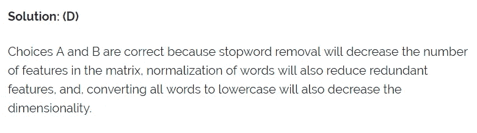

**互动码**

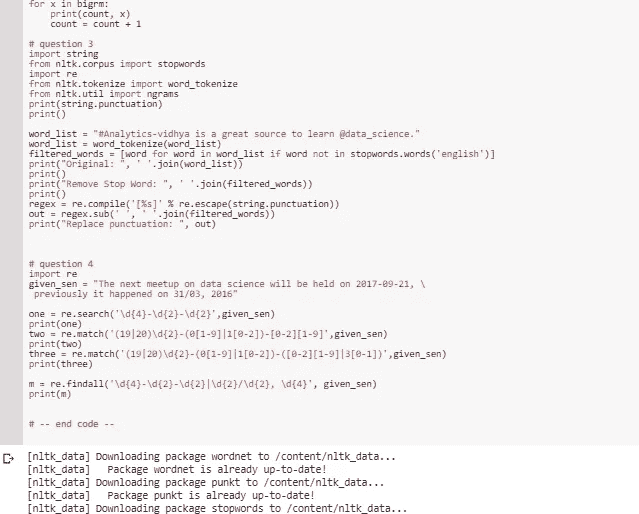

*对于谷歌实验室，你需要一个谷歌帐户来查看代码，你也不能在谷歌实验室运行只读脚本，所以在你的操场上做一个副本。最后，我永远不会请求允许访问你在 Google Drive 上的文件，仅供参考。编码快乐！*

要访问这篇[文章中使用的代码，请点击此处。](https://colab.research.google.com/drive/13aPADr8LXom87tVdybYf-yCbDSIj-b4a)

**遗言**

这些问题确实是开始 NLP 的好地方。我不仅能够实践实施，还获得了一些理论知识。

如果发现任何错误，请发电子邮件到 jae.duk.seo@gmail.com 给我，如果你想看我所有写作的列表，请在这里查看我的网站。

与此同时，请在我的 twitter [这里](https://twitter.com/JaeDukSeo)关注我，并访问[我的网站](https://jaedukseo.me/)或我的 [Youtube 频道](https://www.youtube.com/c/JaeDukSeo)了解更多内容。我还实现了[广残网，请点击这里查看博文 pos](https://medium.com/@SeoJaeDuk/wide-residual-networks-with-interactive-code-5e190f8f25ec) t。

**参考**

1.  NLP]，3。，& NLP]，3。(2017).测试数据科学家自然语言处理的 30 个问题[解决方案:Skilltest — NLP] — Analytics Vidhya。分析 Vidhya。检索于 2018 年 5 月 24 日，来自[https://www . analyticsvidhya . com/blog/2017/07/30-questions-test-data-scientist-natural-language-processing-solution-skilltest-NLP/](https://www.analyticsvidhya.com/blog/2017/07/30-questions-test-data-scientist-natural-language-processing-solution-skilltest-nlp/)
2.  Shivam Bansal，分析 Vidhya 的作者。(2018).分析 Vidhya。检索于 2018 年 5 月 24 日，来自 https://www.analyticsvidhya.com/blog/author/shivam5992/
3.  词汇化——谷歌搜索。(2018).Google.ca .检索 2018 年 5 月 24 日，发自[https://www.google.ca/search?q=lemmatization&rlz = 1c 1 chbf _ enca 771 ca 771&OQ = lemma tization&aqs = chrome . 0.0l 6.308 j0 j 7&sourceid = chrome&ie = UTF-8](https://www.google.ca/search?q=lemmatization&rlz=1C1CHBF_enCA771CA771&oq=Lemmatization&aqs=chrome.0.0l6.308j0j7&sourceid=chrome&ie=UTF-8)
4.  莱文斯坦距离。(2018).En.wikipedia.org。检索于 2018 年 5 月 24 日，来自[https://en.wikipedia.org/wiki/Levenshtein_distance](https://en.wikipedia.org/wiki/Levenshtein_distance)
5.  Soundex。(2018).En.wikipedia.org。检索于 2018 年 5 月 24 日，来自[https://en.wikipedia.org/wiki/Soundex](https://en.wikipedia.org/wiki/Soundex)
6.  克？，W. (2018)。n Gram 到底是什么？。堆栈溢出。检索于 2018 年 5 月 24 日，来自[https://stack overflow . com/questions/18193253/what-exact-is-a-n-gram](https://stackoverflow.com/questions/18193253/what-exactly-is-an-n-gram)
7.  NLTK，G. (2018)。用 NLTK 生成二元模型。堆栈溢出。检索于 2018 年 5 月 24 日，来自[https://stack overflow . com/questions/37651057/generate-bigrams-with-nltk](https://stackoverflow.com/questions/37651057/generate-bigrams-with-nltk)
8.  停用词。(2018).ranks . nl . 2018 年 5 月 25 日检索，来自[https://www.ranks.nl/stopwords](https://www.ranks.nl/stopwords)
9.  j . brown lee(2017 年)。如何用 Python 清理机器学习的文本？机器学习精通。检索于 2018 年 5 月 25 日，来自[https://machine learning mastery . com/clean-text-machine-learning-python/](https://machinelearningmastery.com/clean-text-machine-learning-python/)
10.  python？，h. (2018)。字符串 python 中如何替换标点符号？。堆栈溢出。检索于 2018 年 5 月 25 日，来自[https://stack overflow . com/questions/12437667/how-to-replace-punctuation-in-a-string-python/12437721](https://stackoverflow.com/questions/12437667/how-to-replace-punctuation-in-a-string-python/12437721)
11.  [在线]可在:[https://www . quora . com/How-do-I-remove-stop words-from-a-file-using-python](https://www.quora.com/How-do-I-remove-stopwords-from-a-file-using-python)[2018 年 5 月 25 日访问]。
12.  Python 正则表达式。(2018).【www.tutorialspoint.com】T4。检索于 2018 年 5 月 25 日，来自[https://www . tutorialspoint . com/python/python _ reg _ expressions . htm](https://www.tutorialspoint.com/python/python_reg_expressions.htm)
13.  表情？，P. (2018)。Python/Regex —如何使用正则表达式从文件名中提取日期？。堆栈溢出。检索于 2018 年 5 月 25 日，来自[https://stack overflow . com/questions/7728694/python-regex-how-to-extract-date-from-filename-using-regular-expression](https://stackoverflow.com/questions/7728694/python-regex-how-to-extract-date-from-filename-using-regular-expression)
14.  运营商，P. (2018)。Python 正则表达式匹配或运算符。堆栈溢出。检索于 2018 年 5 月 25 日，来自[https://stack overflow . com/questions/19821487/python-regex-match-or-operator](https://stackoverflow.com/questions/19821487/python-regex-match-or-operator)
15.  支持向量机。(2018).En.wikipedia.org。检索于 2018 年 5 月 25 日，来自[https://en.wikipedia.org/wiki/Support_vector_machine](https://en.wikipedia.org/wiki/Support_vector_machine)
16.  朴素贝叶斯分类器。(2018).En.wikipedia.org。检索于 2018 年 5 月 25 日，来自[https://en.wikipedia.org/wiki/Naive_Bayes_classifier](https://en.wikipedia.org/wiki/Naive_Bayes_classifier)
17.  文档术语矩阵。(2018).En.wikipedia.org。检索于 2018 年 5 月 25 日，来自[https://en.wikipedia.org/wiki/Document-term_matrix](https://en.wikipedia.org/wiki/Document-term_matrix)