# 我对数据科学面试问题的看法[第一部分]

> 原文：<https://towardsdatascience.com/my-take-on-data-scientist-interview-questions-part-1-6df22252b2e8?source=collection_archive---------3----------------------->

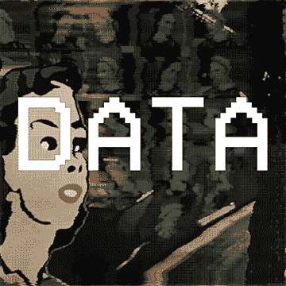

GIF from this [website](https://giphy.com/gifs/animation-ryan-seslow-3osxYc2axjCJNsCXyE)

我的一个朋友为进入数据科学的人编制了一个问题列表。我想回答他们，请注意我不知道这些问题的来源，如果有人知道这些问题来自哪里，请在下面评论。

此外，我会尽力为每个问题提供正确的答案。然而， ***我总是乐于学习和成长*** ，所以如果你知道一个更好的解决方案，请在下面评论。

1.  **什么是特征向量？**

我目前对特征向量的理解非常有限。假设我们正在使用标准卷积神经网络(CNN)和全连接神经网络(FNN)构建一个分类器。其中 CNN 负责从图像中提取高级特征(从边缘和角落开始到面部等)。在从 CNN 到 FNN 的转换中，我们最有可能对图像进行矢量化，这就是我称之为特征向量的地方。

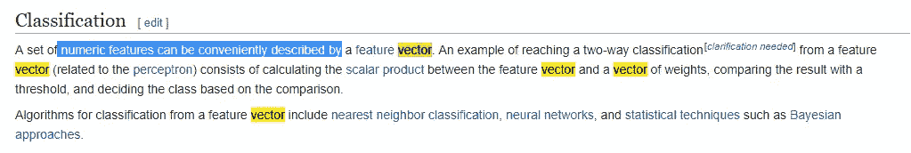

[WiKi def](https://en.wikipedia.org/wiki/Feature_(machine_learning))

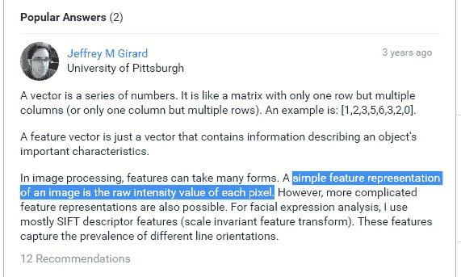

[Research Gate Comment](https://www.researchgate.net/post/in_simple_words_what_do_you_mean_by_feature_vector_in_image_processing)

我很惊讶，甚至原始像素值也可以被认为是一个特征向量。但确实有道理。现在让我们实际做一些编码，让我们使用 MNIST 数据集创建一个猪特征向量。(如果有人对什么是猪的特征感兴趣，请[阅读这个博客](https://www.learnopencv.com/histogram-of-oriented-gradients/)，它是惊人的。)

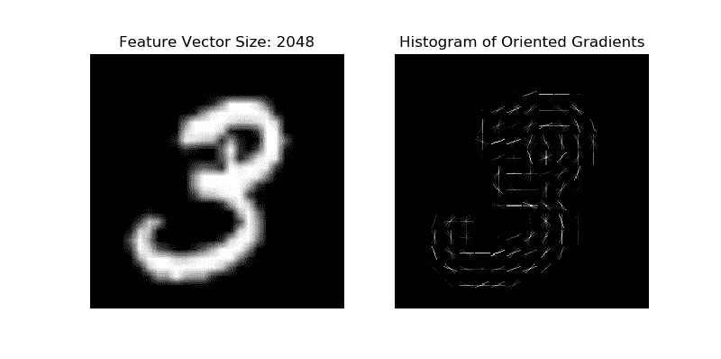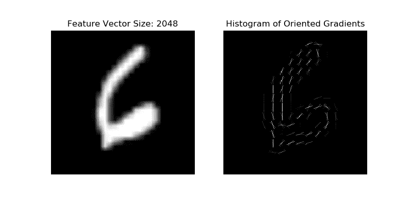

**左图** →图像 3 的可视化 HOG 特征
**右图** →图像 6 的可视化 HOG 特征

正如所看到的，我们可以知道每个图像的 HOG 特征向量长度为 2048，当我们可视化这些向量时，它看起来像右边的东西。

**2。解释制作决策树的步骤**

我最近了解了二叉查找树，但我不知道如何解决这个问题，但我来了。从不同类型的用户那里收集关于许多不同结果的信息，开始绘制他们的二元答案(以树形方式),继续这个过程，直到我们绘制出所有内容？

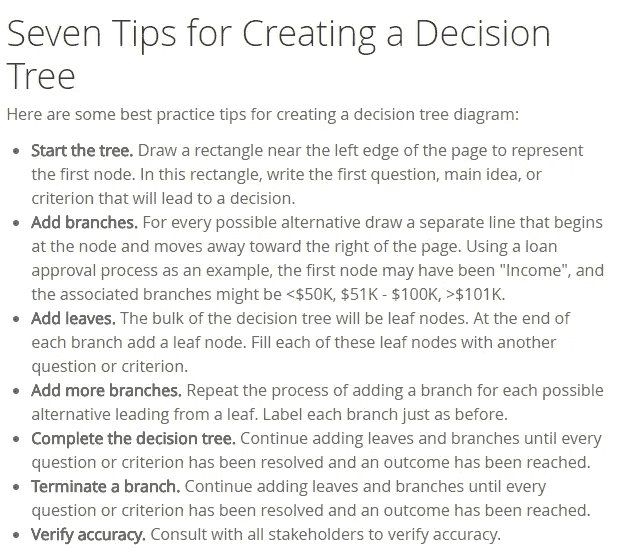

Image from [smartdraw](https://www.smartdraw.com/decision-tree/)

我对我搜索到的答案并不是 100%满意，然而，谢天谢地，YouTube 上有一个关于如何在商业环境中绘制决策树的教程。这是一个老视频，但它确实有帮助。

This video is from [MBAbullshitDotCom](https://www.youtube.com/channel/UCUam9zhEElOl9NXSesyyjtA)

**3。什么是根本原因分析？**

我的英语有限，但我会试试看。根:我认为这是一些基本的东西，当我想指出一些东西的核心时，我会说这个词。所以我认为根本原因分析是找出问题核心原因的过程。

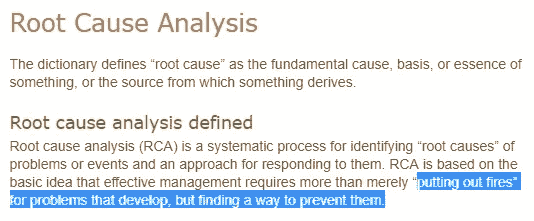

Image from this [website](https://des.wa.gov/services/risk-management/about-risk-management/enterprise-risk-management/root-cause-analysis)

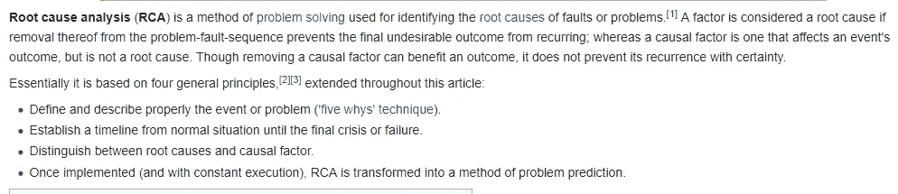

Image [from wiki](https://en.wikipedia.org/wiki/Root_cause_analysis)

看起来我对这个定义是一清二楚，但是我忘了说根本原因分析不仅仅是识别核心原因，它还用于防止类似的问题再次发生。最后，我发现实际上有一篇论文写的是“ [*根本原因分析的技巧*](https://www.ncbi.nlm.nih.gov/pmc/articles/PMC1292997/pdf/bumc0014-0154.pdf) ”如果有人感兴趣请阅读下面。

**4。什么是逻辑回归？**

我对回归这个术语的理解是预测。所以用我的话来说，线性回归就是得到一条最佳的线性线来预测未来的结果，比如房价。对于逻辑，我只能想到逻辑 sigmoid 函数，所以结合这两个术语，我认为逻辑回归是对离散值的预测，而不是对连续值的预测。

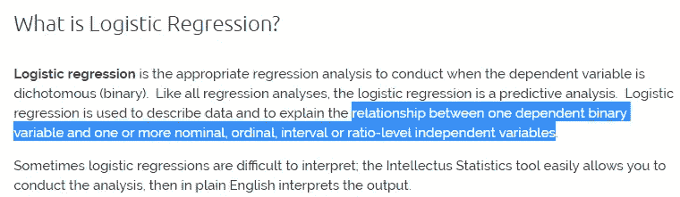

Image from this [website](https://www.statisticssolutions.com/what-is-logistic-regression/)

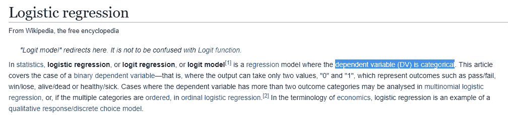

Image from [Wiki](https://en.wikipedia.org/wiki/Logistic_regression)

一般来说，逻辑回归预测分类值。它可以是简单的二进制值，也可以是复杂的多类预测。最后让我们看看指数函数和逻辑函数之间的区别。(如果有人对这个话题更感兴趣，请[点击这里](http://wmueller.com/precalculus/families/1_80.html)。)

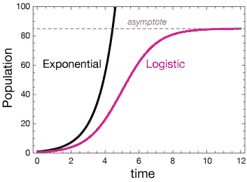

Image from this [website](http://xaktly.com/LogisticFunctions.html)

**5。什么是推荐系统？**

推荐系统的一个很好的例子是 You-tube 的推荐视频部分。这里有一个算法(很多人会称之为 AI)接收用户在过去 2 或 4 周观看的视频列表。并搜索相似内容的视频推荐给用户。因此，在某种程度上，这可以是一种逻辑回归，其中一种算法试图预测用户最有可能观看的下一类视频。

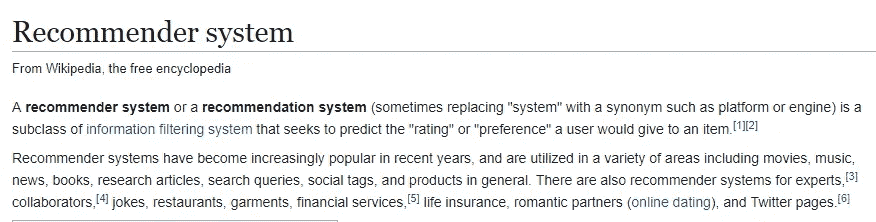

Image from [Wiki](https://en.wikipedia.org/wiki/Recommender_system)

哇，我从来不知道信息过滤系统这个术语的存在，更不知道推荐系统只是这个系统的一部分。现在让我们试着建立一个简单的推荐系统。

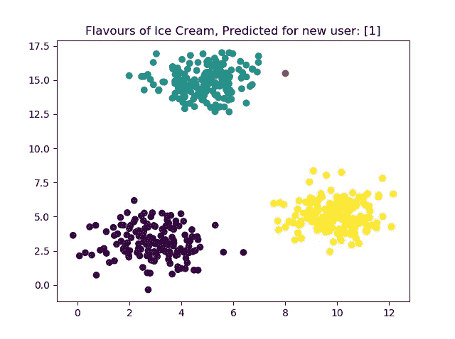

**紫色、绿色、黄色斑点** →三种口味的冰淇淋某些用户喜欢
**红点** →我们之前没有任何信息的新用户

假设我们有一家冰淇淋店，我们的每一位顾客都被表示为 2D 网格中的一个坐标。因此，x 值在[0–6]和 y 值在[0–7.5]范围内的人喜欢紫色冰淇淋等。现在，一个新用户带着坐标[2，7.5]、[8，15.5]和[20，11]进来。我们应该向我们的新顾客推荐什么口味的冰淇淋？我使用的一个简单方法是建立一个 KNN(邻居值为 3 ),让算法为我们预测味道。

**6。梯度下降法总是收敛到同一点吗？**

不，它可以收敛到局部最小点，为了防止这种情况经常发生，激活函数必须是单调的。(我在这篇[博文](/google-deepmind-deep-learning-for-medical-image-segmentation-with-interactive-code-4634b6fd6a3a)中对此做了更多解释。)

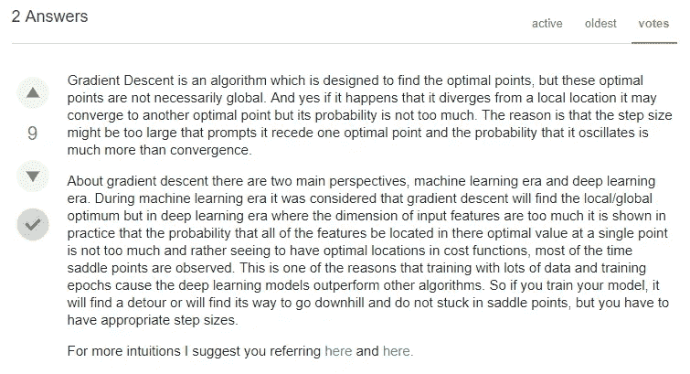

Amazing answer from this [website](https://datascience.stackexchange.com/questions/24534/does-gradient-descent-always-converge-to-an-optimum)

在我看来，上面的图片是这个问题的最佳答案。

**7。A/B 测试的目的是什么？**

每当我试图解决面试问题时，似乎总有一个问题与 A/B 测试有关。我简单地说，A/B 测试的目标是弄清楚当给定环境中有一个差异时，受试者的态度是如何变化的。

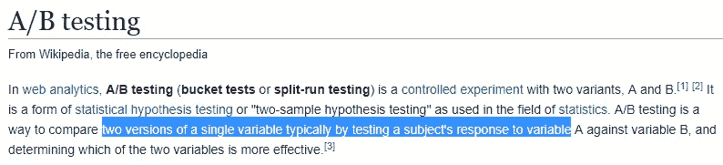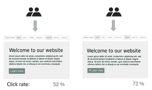

Image from [Wiki](https://en.wikipedia.org/wiki/A/B_testing)

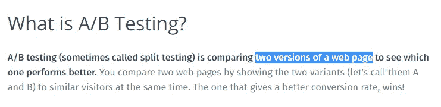

Image from this [website](https://vwo.com/ab-testing/)

上面的图片是网站 A/B 测试的具体定义，但我认为它可以推广到不同的行业，如医药，或物流等…

**8。线性模型的缺点是什么？**

线性模型的一个明显的好处是简单。Y = aX + b，如果我们试着用这个等式建立一个模型，我们已经知道它有多简单了。然而，我认为简单性也是线性模型的一个缺点。由于它的简单性，我们不能用线性模型来模拟复杂的情况。

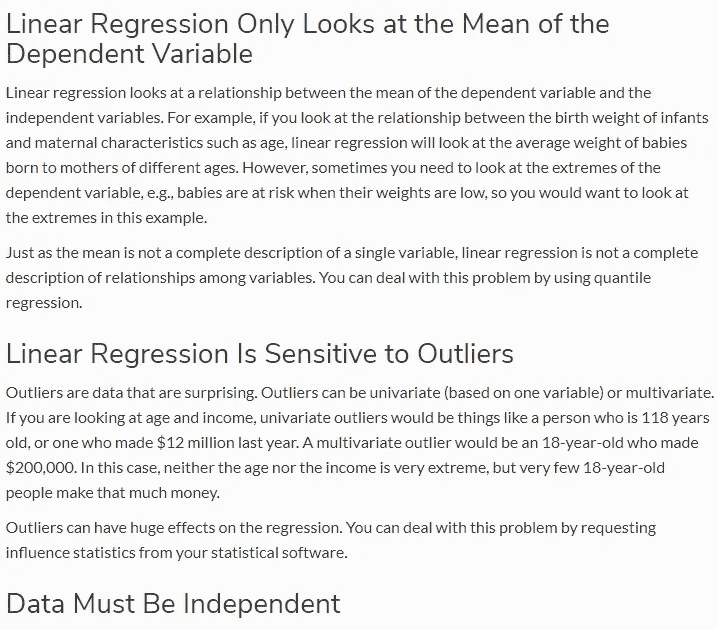

Image from this [website](https://sciencing.com/disadvantages-linear-regression-8562780.html)

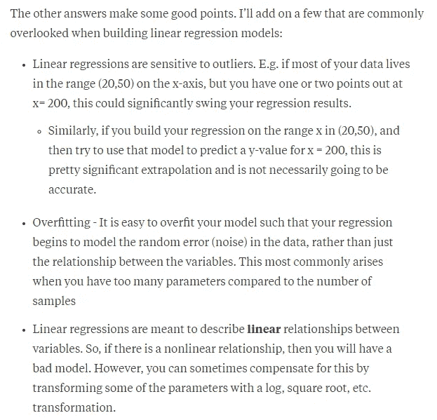

Image from this [website](https://www.quora.com/What-are-the-limitations-of-linear-regression-modeling-in-data-analysis)

我忽略了很多要点，比如它们对异常值很敏感，而且容易过度拟合。此外，我认为我的答案是错误的，因为我们可以使用更高的多元名义回归来预测更复杂的情况，所以这不是线性回归的倒退。

**交互代码**

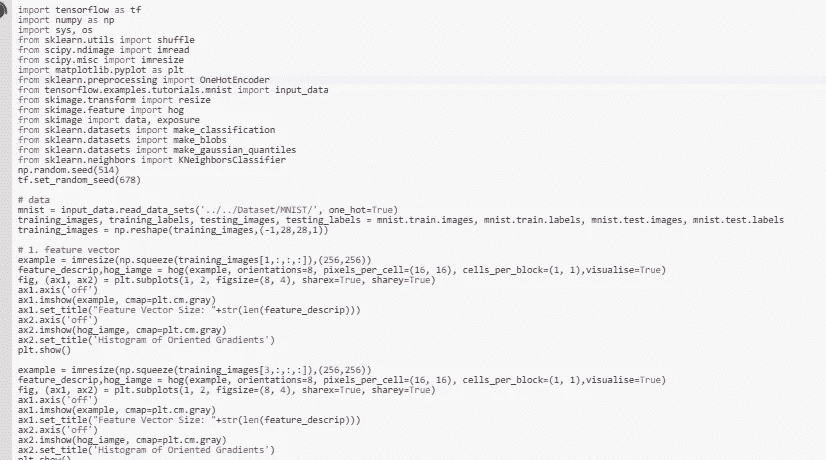

*对于 Google Colab，您需要一个 Google 帐户来查看代码，并且您不能在 Google Colab 中运行只读脚本，因此请在您的操场上创建一个副本。最后，我永远不会请求允许访问你在 Google Drive 上的文件，仅供参考。编码快乐！*

要访问这篇文章[中使用的代码，请点击这里。](https://colab.research.google.com/drive/1edaw7oTrDPhPEEicS8oDxkyJJVL-O1jU)

**遗言**

Unsplash.com by artist :Photo by Štefan Štefančík.

每当我“试图”解决面试问题时，我都会变得更加谦逊。这恰恰说明了我对数据科学的不了解。同时也让我兴奋。

如果发现任何错误，请发电子邮件到 jae.duk.seo@gmail.com 给我，如果你想看我所有写作的列表，请在这里查看我的网站。

同时，在我的 twitter 上关注我[这里](https://twitter.com/JaeDukSeo)，访问[我的网站](https://jaedukseo.me/)，或者我的 [Youtube 频道](https://www.youtube.com/c/JaeDukSeo)了解更多内容。我还实现了[广残网，请点击这里查看博文](https://medium.com/@SeoJaeDuk/wide-residual-networks-with-interactive-code-5e190f8f25ec) t。

**参考**

1.  特征(机器学习)。(2018).En.wikipedia.org。检索于 2018 年 5 月 6 日，来自[https://en . Wikipedia . org/wiki/Feature _(machine _ learning)](https://en.wikipedia.org/wiki/Feature_(machine_learning))
2.  Anon，(2018)。【在线】可在:[https://www . research gate . net/post/in _ simple _ words _ what _ do _ you _ mean _ by _ feature _ vector _ in _ image _ processing](https://www.researchgate.net/post/in_simple_words_what_do_you_mean_by_feature_vector_in_image_processing)【2018 年 5 月 6 日访问】。
3.  '可视化'，h. (2018)。hog()获得了意外的关键字参数“visualize”。堆栈溢出。检索于 2018 年 5 月 6 日，来自[https://stack overflow . com/questions/46516571/hog-got-an-unexpected-keyword-argument-visualize](https://stackoverflow.com/questions/46516571/hog-got-an-unexpected-keyword-argument-visualize)
4.  方向梯度直方图—浏览 0.14 版开发文档。(2018).Scikit-image.org。2018 年 5 月 6 日检索，来自[http://scikit-image . org/docs/dev/auto _ examples/features _ detection/plot _ hog . html](http://scikit-image.org/docs/dev/auto_examples/features_detection/plot_hog.html)
5.  Mallick，S. (2016 年)。方向渐变直方图|学习 OpenCV。Learnopencv.com。检索于 2018 年 5 月 6 日，来自[https://www . learnopencv . com/histogram-of-oriented-gradients/](https://www.learnopencv.com/histogram-of-oriented-gradients/)
6.  威廉姆斯，下午(2001 年 4 月)。根本原因分析技术。贝勒大学医学中心学报(第 14 卷，第 2 期，第 154-157 页)。泰勒&弗朗西斯。
7.  根本原因分析。(2018).En.wikipedia.org。2018 年 5 月 6 日检索，来自[https://en.wikipedia.org/wiki/Root_cause_analysis](https://en.wikipedia.org/wiki/Root_cause_analysis)
8.  根本原因分析。(2016).企业服务部。2018 年 5 月 6 日检索，来自[https://des . wa . gov/services/risk-management/about-risk-management/enterprise-risk-management/root-cause-analysis](https://des.wa.gov/services/risk-management/about-risk-management/enterprise-risk-management/root-cause-analysis)
9.  什么是逻辑回归？—统计解决方案。(2018).统计解决方案。检索于 2018 年 5 月 6 日，来自[https://www . statistics solutions . com/what-is-logistic-regression/](https://www.statisticssolutions.com/what-is-logistic-regression/)
10.  逻辑回归。(2018).En.wikipedia.org。检索于 2018 年 5 月 6 日，来自 https://en.wikipedia.org/wiki/Logistic_regression
11.  后勤职能。(2018).Xaktly.com。检索于 2018 年 5 月 6 日，来自[http://xaktly.com/LogisticFunctions.html](http://xaktly.com/LogisticFunctions.html)
12.  信息过滤系统。(2018).En.wikipedia.org。检索于 2018 年 5 月 6 日，来自[https://en.wikipedia.org/wiki/Information_filtering_system](https://en.wikipedia.org/wiki/Information_filtering_system)
13.  分类器的概率校准-sci kit-学习 0.19.1 文档。(2018).Scikit-learn.org。2018 年 5 月 6 日检索，来自[http://sci kit-learn . org/stable/auto _ examples/calibration/plot _ calibration . html # sphx-glr-auto-examples-calibration-plot-calibration-py](http://scikit-learn.org/stable/auto_examples/calibration/plot_calibration.html#sphx-glr-auto-examples-calibration-plot-calibration-py)
14.  python，G. (2018)。用 python 从列表中获取唯一值。堆栈溢出。2018 年 5 月 6 日检索，来自[https://stack overflow . com/questions/12897374/get-unique-values-from-a-list-in-python](https://stackoverflow.com/questions/12897374/get-unique-values-from-a-list-in-python)
15.  plots，P. (2018 年)。Python matplotlib 叠加散点图。堆栈溢出。检索于 2018 年 5 月 6 日，来自[https://stack overflow . com/questions/11190735/python-matplotlib-supplease-scatter-plots](https://stackoverflow.com/questions/11190735/python-matplotlib-superimpose-scatter-plots)
16.  sk learn . datasets . make _ blobs-sci kit-learn 0 . 19 . 1 文档。(2018).Scikit-learn.org。2018 年 5 月 6 日检索，来自[http://sci kit-learn . org/stable/modules/generated/sk learn . datasets . make _ blobs . html # sk learn . datasets . make _ blobs](http://scikit-learn.org/stable/modules/generated/sklearn.datasets.make_blobs.html#sklearn.datasets.make_blobs)
17.  二叉查找树。(2018).En.wikipedia.org。检索于 2018 年 5 月 6 日，来自 https://en.wikipedia.org/wiki/Binary_search_tree
18.  决策树——了解关于决策树的一切。(2018).Smartdraw.com。检索于 2018 年 5 月 6 日，来自 https://www.smartdraw.com/decision-tree/
19.  7 分钟决策树教程，包含决策树分析和决策树示例(基础)。(2018).YouTube。检索于 2018 年 5 月 6 日，来自[https://www.youtube.com/watch?v=a5yWr1hr6QY](https://www.youtube.com/watch?v=a5yWr1hr6QY)
20.  【Google Deep mind】—利用交互代码进行医学图像分割的深度学习。(2018).走向数据科学。检索于 2018 年 5 月 6 日，来自[https://towards data science . com/Google-deep mind-deep-learning-for-medical-image-segmentation-with-interactive-code-4634 b 6 FD 6a 3a](/google-deepmind-deep-learning-for-medical-image-segmentation-with-interactive-code-4634b6fd6a3a)
21.  A/B 测试。(2018).En.wikipedia.org。检索于 2018 年 5 月 6 日，来自[https://en.wikipedia.org/wiki/A/B_testing](https://en.wikipedia.org/wiki/A/B_testing)
22.  AB 测试-完全指南。(2018).网站。于 2018 年 5 月 6 日检索，来自[https://vwo.com/ab-testing/](https://vwo.com/ab-testing/)
23.  最优？，D. (2018)。梯度下降总是收敛到一个最优值吗？。数据科学堆栈交换。2018 年 5 月 6 日检索，来自[https://data science . stack exchange . com/questions/24534/does-gradient-descent-always-converge-to-a-optimum](https://datascience.stackexchange.com/questions/24534/does-gradient-descent-always-converge-to-an-optimum)
24.  )你的参考书目:Anon，(2018)。[在线]见:[https://www . quora . com/What-is-the-limits-of-linear-regression-modeling-in-data-analysis](https://www.quora.com/What-are-the-limitations-of-linear-regression-modeling-in-data-analysis)【2018 年 5 月 6 日获取】。
25.  (2018).Sciencing.com。检索于 2018 年 5 月 6 日，来自[https://science . com/advantages-linear-regression-8562780 . html](https://sciencing.com/disadvantages-linear-regression-8562780.html)