# 我对谷歌人工智能交互式代码面试问题的看法——第一部分

> 原文：<https://towardsdatascience.com/my-take-on-google-ai-interview-question-with-interactive-code-part-1-db2e33a26f10?source=collection_archive---------3----------------------->

Gif from this [website](https://giphy.com/gifs/oc-logo-google-5NPhdqmyRxn8I/download)

所以我找到了这个了不起的博客作者维马什·卡巴里，他的博客上有一些了不起的东西！所以请看看他，他也是人工智能的创造者。今天，我将尝试从这个[博客回答他的谷歌人工智能采访问题。](https://medium.com/acing-ai/google-ai-interview-questions-acing-the-ai-interview-1791ad7dc3ae)请注意，我的解决方案不会优化。

另外，我不会按数字顺序回答问题。对于每一个问题，我会努力找到正确的答案并把它们联系起来。然而， ***我总是乐于学习和成长*** ，所以如果你知道一个更好的解决方案，请在下面评论。

**1/x 的导数是多少？**

谢天谢地，这个有点简单，它是(- 1 / (x))

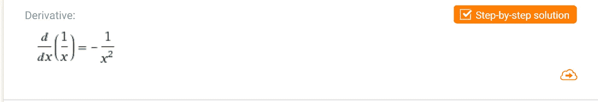

Image from this [website](https://www.wolframalpha.com/input/?i=1%2Fx)

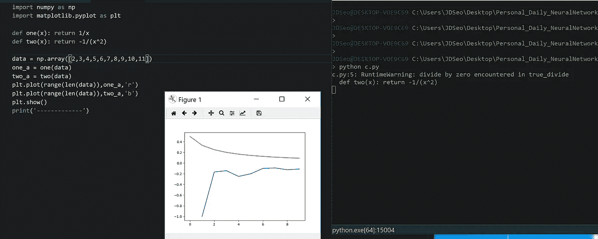

Graphed in Python

**绘制曲线 log(x+10)**

幸运的是这也是可行的，我已经知道 log()函数看起来像一个 L，但水平翻转，所以可以把这个函数想象成它的翻译。

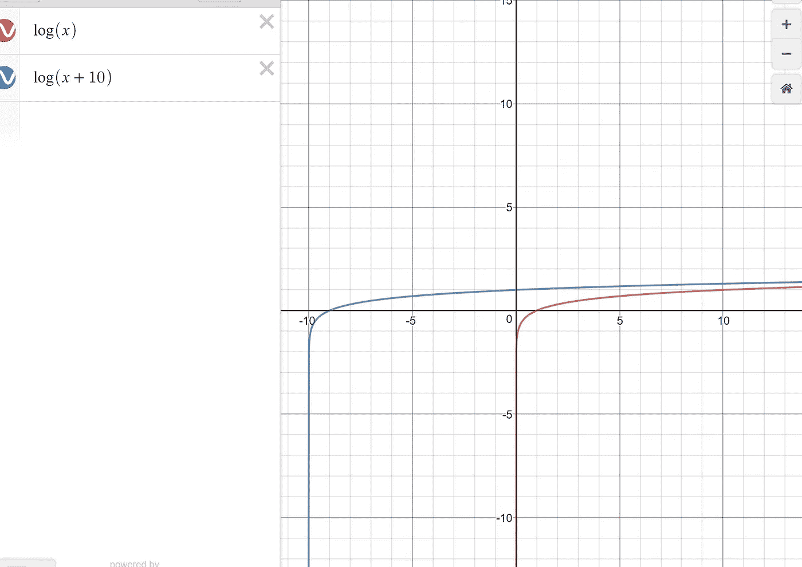

Image from this [website](https://www.desmos.com/calculator)

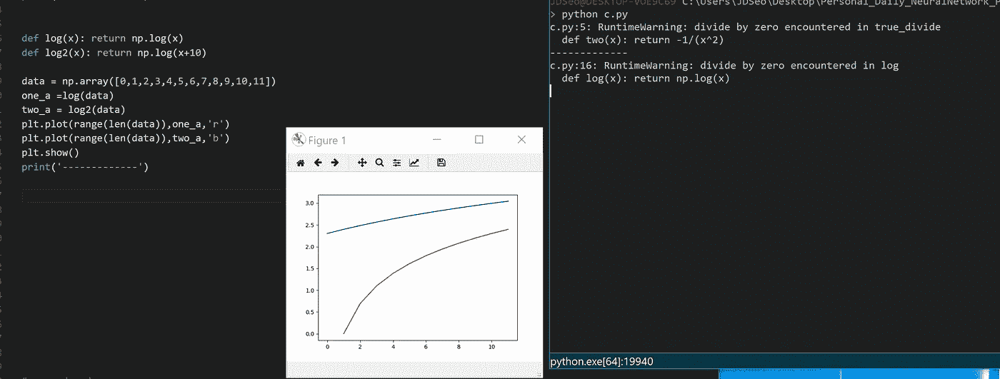

Graphed in Python

**为什么不是 logistic 回归，为什么是 GBM？**

> ****更新**感谢**[**Mikael Huss**](https://medium.com/@mikaelhuss?source=responses---------0----------------)**和**[**Adrien Lucas Ecoffet**](https://medium.com/@AdrienLE)**指出错误。GBM 代表梯度推进机器，而不是几何布朗运动。请注意我的答案是错误的！**

我不知道“GBM”是什么意思，直到我研究了它。我想是指[几何布朗运动](https://en.wikipedia.org/wiki/Geometric_Brownian_motion)下面是维基答案定义。

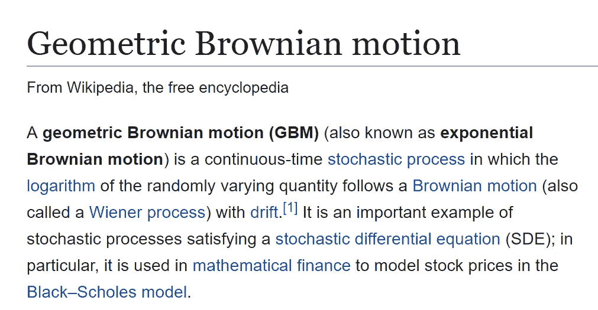

Image from [Wiki](https://en.wikipedia.org/wiki/Geometric_Brownian_motion)

从那以后，我需要思考选择 GBM 比选择逻辑回归更好的情况。(问题是，我甚至不知道 GBM 存在 LOL，但我们还是可以估计一下)。让我们首先看看 GBM 实际使用的情况。

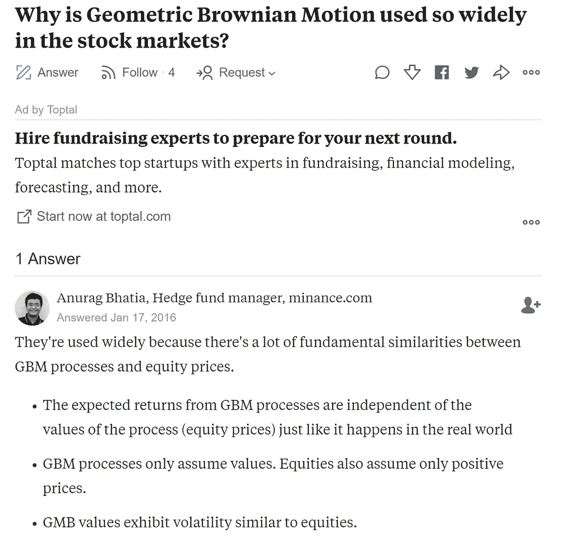

Answer from [quora](https://www.quora.com/Why-is-Geometric-Brownian-Motion-used-so-widely-in-the-stock-markets)

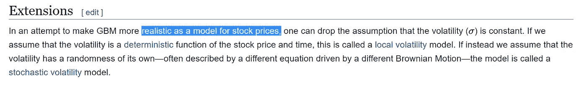

Answer from Wiki, for the link please see above

因此，GBM 似乎被广泛用于股票市场定价。我通常将逻辑回归与一个分类问题的解决方案联系起来，(或者对离散值的回归)然而，这似乎是我们想要预测连续值的情况(我不是 100%确定股市预测是否只能被视为连续回归，如果我错了请纠正我。)所以我想，答案之一可能是，由于逻辑回归不能预测连续值，所以我们最好使用 GBM。(但我真的认为这是一个后续问题，对我来说没有多大意义。)

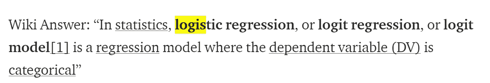

Image from [my blog post](/my-take-on-uber-ai-interview-question-with-interactive-code-part-1-40d6d795a566)

抛硬币十次，结果是八个正面和两个反面。你会如何分析一枚硬币是否公平？p 值是多少？

> ****更新**感谢** [**扬扎瓦日基**](https://medium.com/@janzawadzki?source=responses---------0----------------) **关于 p 值的精彩讲解！要查看它们，请向下滚动到评论区！**

所以正面的概率是 80%，反面的概率是 20%。对于这个问题，我认为取期望值，并与我们得到的值进行比较，可能是一个答案。( ***然而，我不擅长统计学或数学，所以如果任何统计学家或数学家知道答案，请在下面评论。*** )

因此，期望值的等式是 E[x] = n * p(x)，如果我们插入数字，我们可以看到获得正面的期望值是
E[x] = 10 * 0.5 = 5，所以当我们投掷硬币 10 次时，我们可以预期看到 5 次是正面。(尾巴也一样)。但是我们只看到了两个尾巴，所以我想我们可以说这枚硬币偏向正面。对于 p 值，我实际上忘了怎么做了。

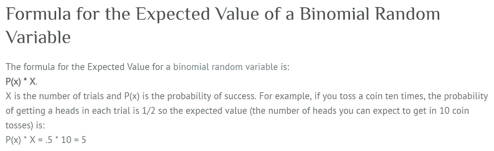

Image from this [website](http://www.statisticshowto.com/probability-and-statistics/expected-value/)

因此，期望值的等式和计算是正确的，对于 p 值，我按照这个 [WikiHow 页面](https://www.wikihow.com/Calculate-P-Value)上的逐步指南，在显著性水平为 0.05 的情况下，我得到了 0.05 到 0.1 之间的 p 值。(如果我说错了，请告诉我。)

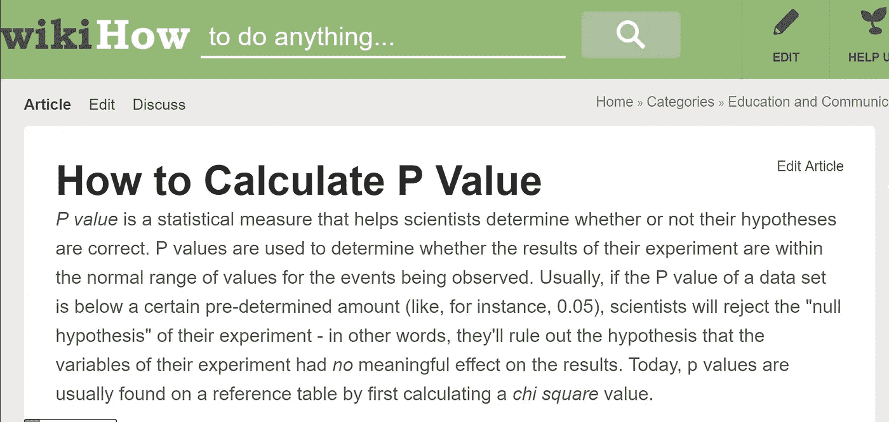

Image from [Wikihow](https://www.wikihow.com/Calculate-P-Value)

**你有一个谷歌应用程序，你做出了改变。如何测试一个指标是否增加了？**

我从我的[前一篇博文](/my-take-on-uber-ai-interview-question-with-interactive-code-part-1-40d6d795a566)中学到了什么是 A/B 测试，所以我认为这是一个完美的用例，A/B 测试可以帮助我们了解指标是否增加了。我会随机将用户重定向到我的应用程序的两个版本，一个有变化，另一个没有变化(假设两个版本之间只有一个不同)，然后观察它们的表现。

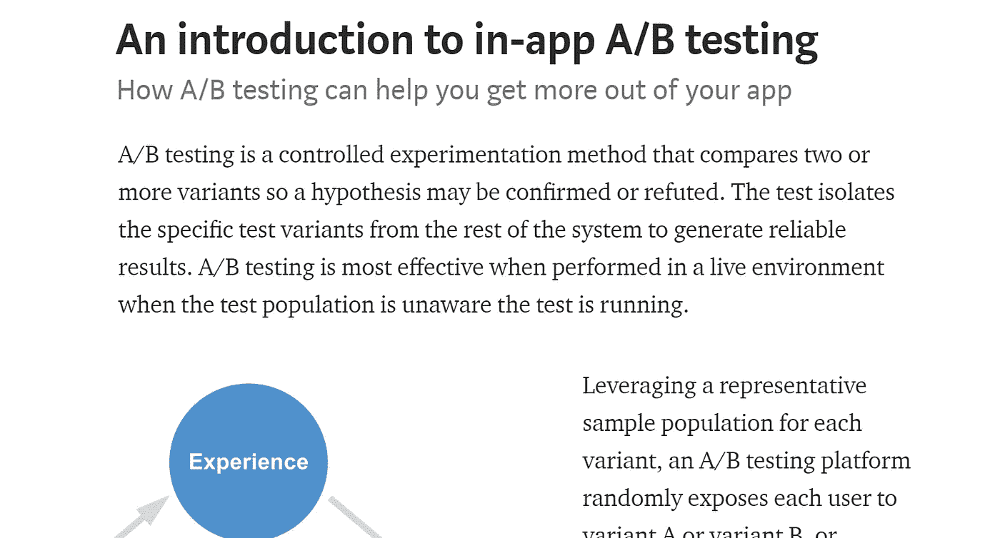

Image from this [website](https://medium.com/googleplaydev/an-introduction-to-in-app-a-b-testing-c5a9a69a3791)

通过简单的谷歌搜索，我找到了上面的帖子，所以从某种意义上来说，A/B 测试是正确的。(希望如此)。

**每年有多少人申请谷歌？**

嗯，很多，但我真的很好奇，一个谷歌搜索做到了这一点。

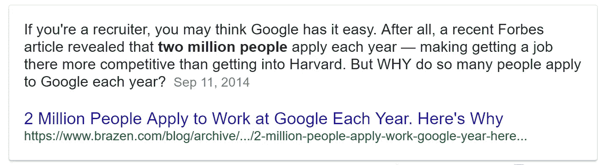

Image from this [website](https://www.google.ca/search?q=How+many+people+apply+to+Google+per+year%3F&rlz=1C1OCLT_enCA772CA772&oq=How+many+people+apply+to+Google+per+year%3F&aqs=chrome..69i57.586j0j7&sourceid=chrome&ie=UTF-8)

**交互代码**

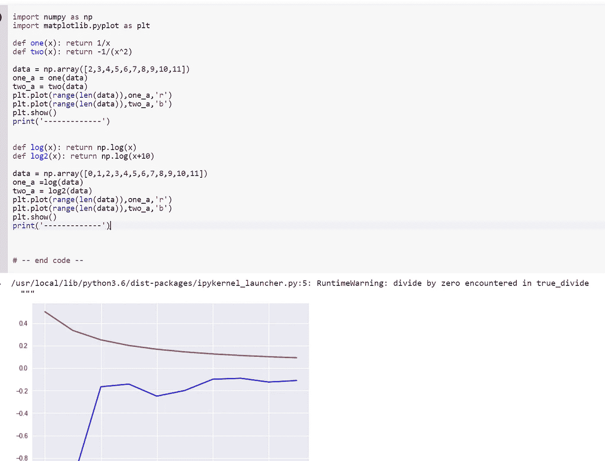

对于 Google Colab，你需要一个 Google 帐户来查看代码，而且你不能在 Google Colab 中运行只读脚本，所以在你的操场上复制一份。最后，我永远不会请求允许访问你在 Google Drive 上的文件，仅供参考。编码快乐！

要访问 Google Colab 上的代码，请点击此处。

**最后的话**

在这篇文章中，当我试图解决这些问题时，我变得更加谦虚，意识到我知道的很少。要成为数据科学专家，我还有很多工作要做。

如果发现任何错误，请发电子邮件到 jae.duk.seo@gmail.com 给我，如果你希望看到我所有写作的列表，请[在这里查看我的网站](https://jaedukseo.me/)。

同时，在我的 twitter [这里](https://twitter.com/JaeDukSeo)关注我，并访问[我的网站](https://jaedukseo.me/)，或我的 [Youtube 频道](https://www.youtube.com/c/JaeDukSeo)了解更多内容。如果你感兴趣的话，我还做了解耦神经网络[的比较。](https://becominghuman.ai/only-numpy-implementing-and-comparing-combination-of-google-brains-decoupled-neural-interfaces-6712e758c1af)

参考

1.  谷歌人工智能面试问题——应对人工智能面试。(2018).中等。检索于 2018 年 4 月 7 日，来自[https://medium . com/acing-ai/Google-interview-questions-acing-the-ai-interview-1791 ad 7 DC 3 AE](https://medium.com/acing-ai/google-ai-interview-questions-acing-the-ai-interview-1791ad7dc3ae)
2.  德斯莫斯图表。(2018).德斯莫斯图形计算器。于 2018 年 4 月 7 日检索，来自[https://www.desmos.com/calculator](https://www.desmos.com/calculator)
3.  几何布朗运动。(2018).En.wikipedia.org。于 2018 年 4 月 7 日检索，来自[https://en.wikipedia.org/wiki/Geometric_Brownian_motion](https://en.wikipedia.org/wiki/Geometric_Brownian_motion)
4.  [2]2018.【在线】。可用:[https://www . quora . com/Why-is-Geometric-Brownian-Motion-used-so-wide-the-stock-markets](https://www.quora.com/Why-is-Geometric-Brownian-Motion-used-so-widely-in-the-stock-markets)。[访问时间:2018 年 4 月 7 日]。
5.  "我对优步人工智能面试问题的互动代码——第一部分."走向数据科学。n . p . 2018。网络。2018 年 4 月 7 日。
6.  每年有多少人申请谷歌？—谷歌搜索。(2018).Google.ca 检索 2018 年 4 月 7 日，来自[https://www.google.ca/search?q = How+many+people+apply+to+Google+每年% 3F&rlz = 1c 1 oclt _ enca 772 ca 772&OQ = How+many+people+apply+to+Google+每年%3F & aqs=chrome..69i 57.586 j0j 7&sourceid = chrome&ie = UTF-8](https://www.google.ca/search?q=How+many+people+apply+to+Google+per+year%3F&rlz=1C1OCLT_enCA772CA772&oq=How+many+people+apply+to+Google+per+year%3F&aqs=chrome..69i57.586j0j7&sourceid=chrome&ie=UTF-8)
7.  统计学中的期望值:定义和计算。(2018).统计学如何？2018 年 4 月 7 日检索，来自[http://www . statistics show to . com/probability-and-statistics/expected-value/](http://www.statisticshowto.com/probability-and-statistics/expected-value/)
8.  如何计算 P 值？(2018).维基百科。检索于 2018 年 4 月 7 日，来自 https://www.wikihow.com/Calculate-P-Value
9.  应用内 A/B 测试介绍——Google Play 应用和游戏——中级。(2017).中等。检索于 2018 年 4 月 7 日，来自[https://medium . com/Google play dev/an-introduction-to-in-app-a-b-testing-C5 a9 a 69 a 3791](https://medium.com/googleplaydev/an-introduction-to-in-app-a-b-testing-c5a9a69a3791)