# 我对微软人工智能交互式代码面试问题的看法——第一部分

> 原文：<https://towardsdatascience.com/my-take-on-microsoft-ai-interview-questions-with-interactive-code-part-1-c271388af633?source=collection_archive---------1----------------------->

Gif from this [website](https://giphy.com/gifs/microsoft-party-time-bill-gates-l3q2zbskZp2j8wniE/download)

所以我找到了这个了不起的博客作者维马什·卡巴里，他的博客上有一些了不起的东西！所以请看看他，他也是人工智能的创造者。今天，我将尝试从这个[博客](https://medium.com/@vimarshk)回答他的微软人工智能采访问题。请注意，我的解决方案不会优化，而且 ***我总是乐于学习和成长*** ，所以如果你知道一个更好的解决方案，请在下面评论。

另外，我不会按数字顺序回答问题。

**合并 k(本例中 k=2)个数组并排序。**

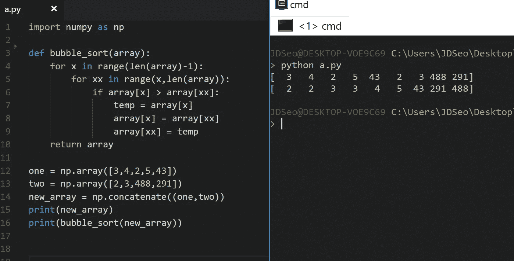

为此我会使用冒泡排序，我知道这不是最有效的排序算法，但它很容易描述和实现。

**L1 和 L2 有哪些不同的成本函数/正则化指标？**

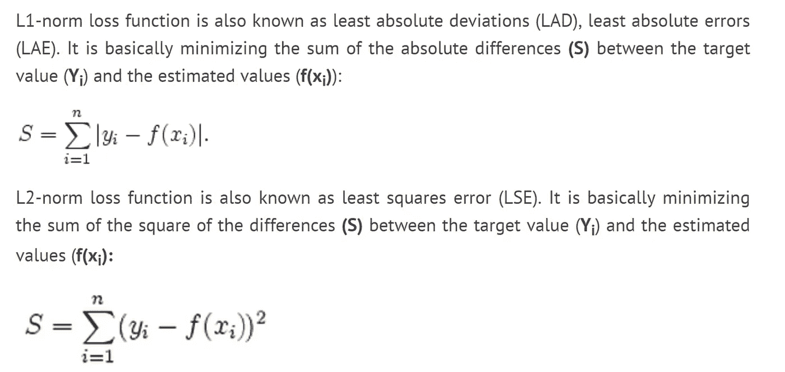

Image from [Chioka’s blog](http://www.chioka.in/differences-between-l1-and-l2-as-loss-function-and-regularization/)

我会说，L1 是预测值和地面真实值之间的绝对差值。对于 L2，我会说是均方差。我在本帖中使用[正则化实现并比较了 L1 和 L2 成本函数的各种组合。此外，L1 正则化是权重的绝对值之和，L2 是所有权重的平方值之和。](/only-numpy-implementing-different-combination-of-l1-norm-l2-norm-l1-regularization-and-14b01a9773b)

Image from [Chioka’s blog](http://www.chioka.in/differences-between-l1-and-l2-as-loss-function-and-regularization/)

**如何找到百分位数？为它写代码。**

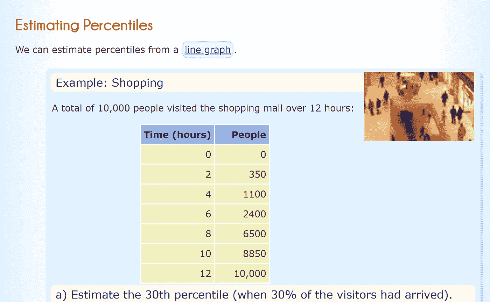

Image from [MathisFun](http://www.mathsisfun.com/data/percentiles.html)

为此，让我们做一个简单的数学有趣的问题。根据上面的表格，让我们得到 30%的人参观商场的时间。

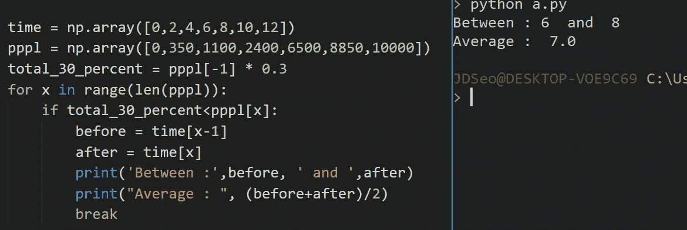

我会先得到 30%的百分比，然后得到平均时间值，显然这不是最准确的答案，如下所示。但是我们可以得到一个大概的感觉。

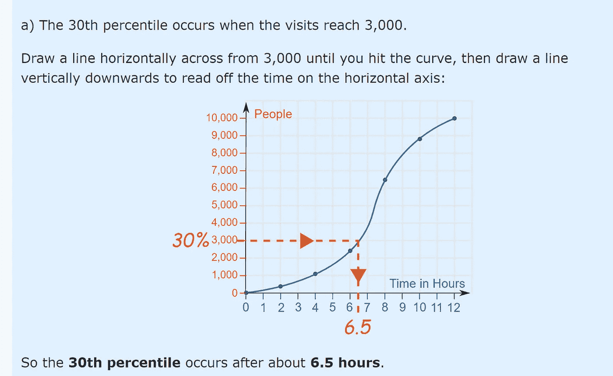

**好的和坏的数据可视化有什么区别？**

好吧，对于这个问题，我们可以有许多不同的答案，我的答案是，当我们没有正确处理异常值并将其可视化时。

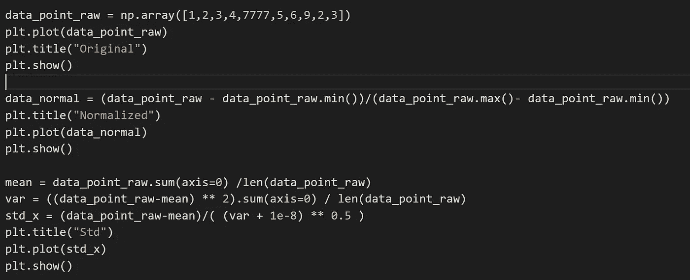

假设我们有一个数字数组，我们可以看到在较小的数字中有一个很大的数字(7777)。当我们一起想象这个数组时，它看起来像下面这样。

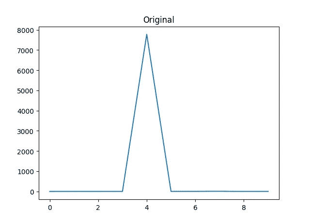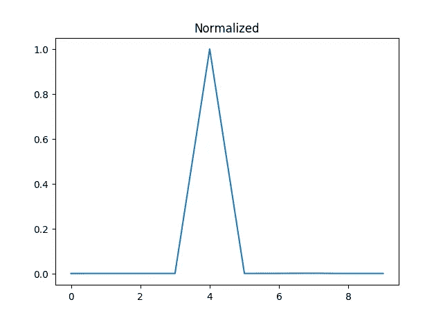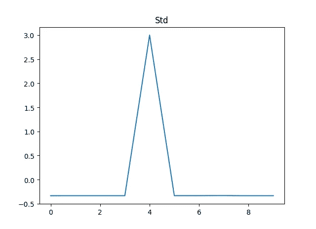

**右图** →原图
**中图** →标准化值
**左图** →标准化值

如上所述，即使我们将这些值标准化或规范化，创建的图也是非常倾斜的。我在这篇文章中谈到了[规范化、标准化和批量规范化。](/understanding-batch-normalization-with-examples-in-numpy-and-tensorflow-with-interactive-code-7f59bb126642)

**如何通过玩弄一些计算技巧来更快地计算逆矩阵？**

我其实不知道确切的答案是什么，但经过研究，我发现了一种叫做[高斯-乔丹法](http://en.wikipedia.org/wiki/Gauss-Jordan_elimination)的方法，然而它非常复杂。(要查看 python [的实现，请点击这里。我设法找到了一个更简单解决方案，如下所示，并实现了这个方法。](https://martin-thoma.com/solving-linear-equations-with-gaussian-elimination/)

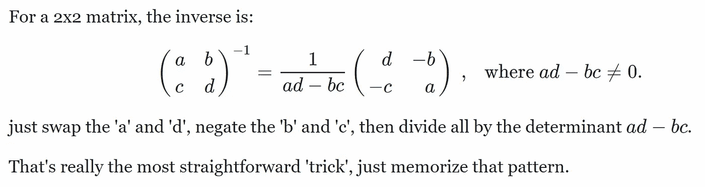

Image from this [website](https://math.stackexchange.com/questions/21533/shortcut-for-finding-a-inverse-of-matrix)

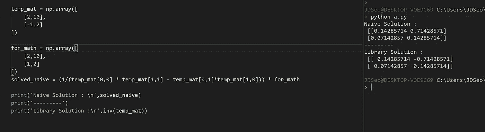

**定义差异**

用我的话来说，我会把方差描述为每个数据点的平方差之和，尊重所有数据的平均值。换句话说，数据是否有很大的变化。实际上，[数学很有趣](http://www.mathsisfun.com/data/standard-deviation.html)有一个惊人的图表来描述这一点。

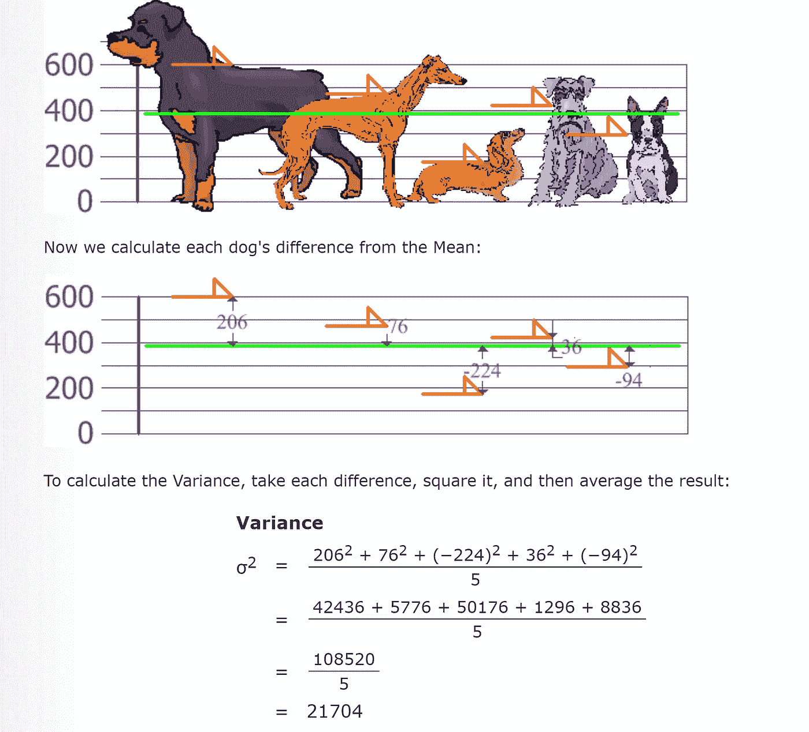

Image from this [website](http://www.mathsisfun.com/data/standard-deviation.html)

**交互代码**

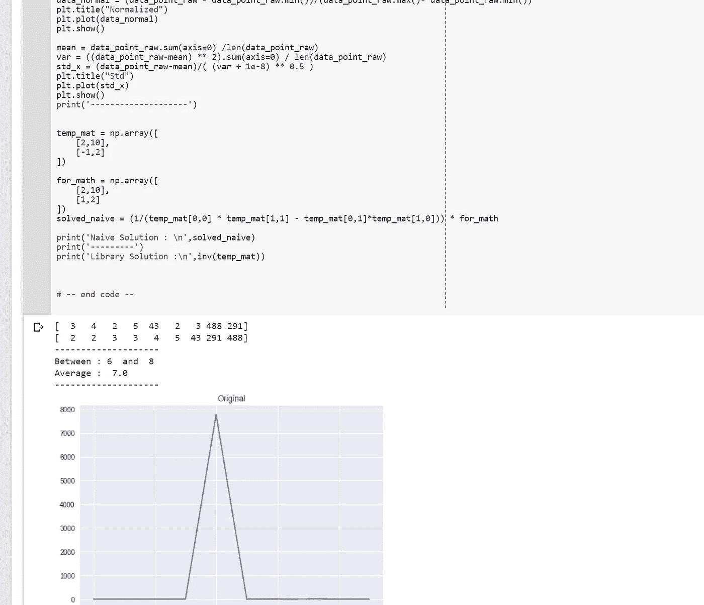

*对于 Google Colab，您需要一个 Google 帐户来查看代码，而且您不能在 Google Colab 中运行只读脚本，因此请在您的操场上创建一个副本。最后，我永远不会请求允许访问你在 Google Drive 上的文件，仅供参考。编码快乐！*

要访问 Google [Colab 上的代码，请点击此处。](https://colab.research.google.com/drive/1DYimC5CEKeXdT15tbptifYL2v5MPkyHj)

**遗言**

我总是乐于接受新的、更好的、更有效的想法和答案，如果你知道它们，请在下面评论！

如果发现任何错误，请发电子邮件到 jae.duk.seo@gmail.com 给我，如果你想看我所有写作的列表，请在这里查看我的网站。

与此同时，在我的 twitter 上关注我[这里](https://twitter.com/JaeDukSeo)，访问[我的网站](https://jaedukseo.me/)，或者我的 [Youtube 频道](https://www.youtube.com/c/JaeDukSeo)了解更多内容。如果你感兴趣，我还在这里做了解耦神经网络[的比较。](https://becominghuman.ai/only-numpy-implementing-and-comparing-combination-of-google-brains-decoupled-neural-interfaces-6712e758c1af)

**参考**

1.  维马什·卡巴里—中等。(2015).Medium.com。2018 年 4 月 5 日检索，来自[https://medium.com/@vimarshk](https://medium.com/@vimarshk)
2.  微软人工智能面试问题——应对人工智能面试。(2018).中等。检索于 2018 年 4 月 5 日，来自[https://medium . com/acing-ai/Microsoft-ai-interview-questions-acing-the-ai-interview-be 6972 f 790 ea](https://medium.com/acing-ai/microsoft-ai-interview-questions-acing-the-ai-interview-be6972f790ea)
3.  https://www.geeksforGeeks.org/bubble-sortBubble 的[排序——极客 forgeeks。(2014).极客之福。检索于 2018 年 4 月 5 日，来自 https://www.geeksforgeeks.org/bubble-sort/](https://www.geeksforgeeks.org/bubble-sortBubble)
4.  Only Numpy:对深度神经网络实施 L1 /L2 范数/正则化的不同组合…(2018).走向数据科学。2018 年 4 月 5 日检索，来自[https://towards data science . com/only-numpy-implementing-different-combination-of-L1-norm-L2-norm-L1-regularity-and-14b 01a 9773 b](/only-numpy-implementing-different-combination-of-l1-norm-l2-norm-l1-regularization-and-14b01a9773b)
5.  L1 和 L2 作为损失函数和正则化的区别。(2018).chioka . in . 2018 年 4 月 5 日检索，来自[http://www . chioka . in/differences-between-L1-and-L2-as-loss-function-and-regulation/](http://www.chioka.in/differences-between-l1-and-l2-as-loss-function-and-regularization/)
6.  通过 Numpy 和 Tensorflow 中的示例和交互式代码理解批处理规范化。(2018).走向数据科学。2018 年 4 月 5 日检索，来自[https://towardsdatascience . com/understanding-batch-normalization-with-examples-in-numpy-and-tensor flow-with-interactive-code-7f 59 bb 126642](/understanding-batch-normalization-with-examples-in-numpy-and-tensorflow-with-interactive-code-7f59bb126642)
7.  正态分布。(2018).Mathsisfun.com。检索于 2018 年 4 月 5 日，来自[https://www . mathsisfun . com/data/standard-normal-distribution . html](https://www.mathsisfun.com/data/standard-normal-distribution.html)
8.  numpy.linalg.inv — NumPy v1.12 手册。(2018).Docs.scipy.org。2018 年 4 月 5 日检索，来自[https://docs . scipy . org/doc/numpy-1 . 12 . 0/reference/generated/numpy . Lina LG . inv . html](https://docs.scipy.org/doc/numpy-1.12.0/reference/generated/numpy.linalg.inv.html)
9.  高斯消去法。(2018).En.wikipedia.org。2018 年 4 月 5 日检索，来自[https://en . Wikipedia . org/wiki/Gaussian _ elimination # Finding _ the _ inverse _ of _ a _ matrix](https://en.wikipedia.org/wiki/Gaussian_elimination#Finding_the_inverse_of_a_matrix)
10.  托马斯，M. (2013 年)。用高斯消元法解线性方程组。马丁·托马斯。检索于 2018 年 4 月 5 日，来自[https://Martin-thoma . com/solving-linear-equations-with-Gaussian-elimination/](https://martin-thoma.com/solving-linear-equations-with-gaussian-elimination/)
11.  matrix，s. (2018)。求矩阵逆矩阵的捷径。Math.stackexchange.com。检索于 2018 年 4 月 5 日，来自[https://math . stack exchange . com/questions/21533/shortcut-for-finding-a-inverse-of-matrix](https://math.stackexchange.com/questions/21533/shortcut-for-finding-a-inverse-of-matrix)
12.  标准差和方差。(2018).Mathsisfun.com。检索于 2018 年 4 月 5 日，来自 http://www.mathsisfun.com/data/standard-deviation.html