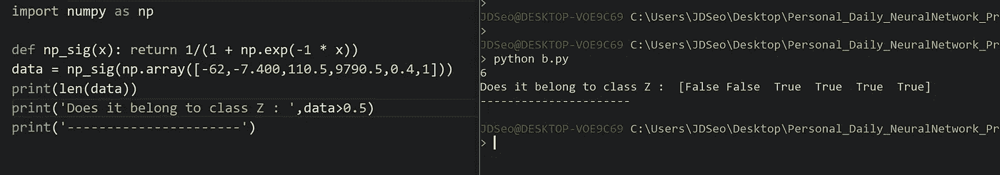
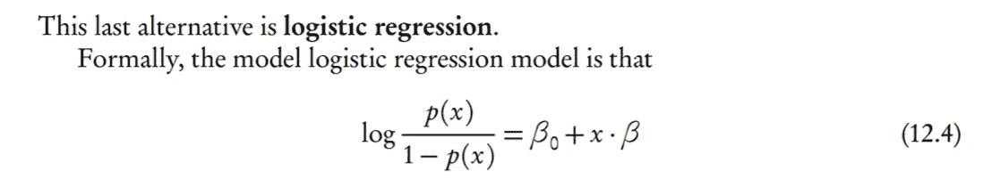
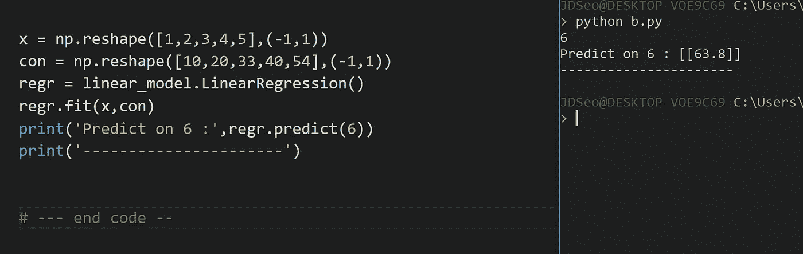
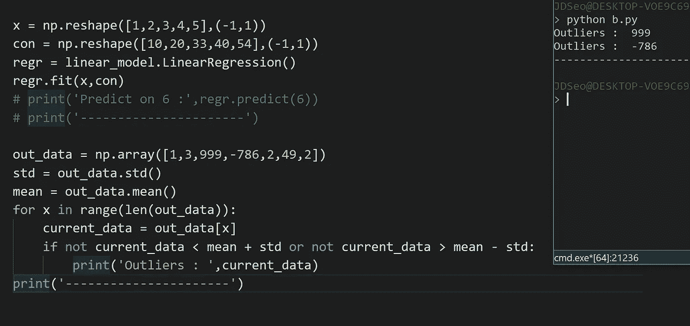
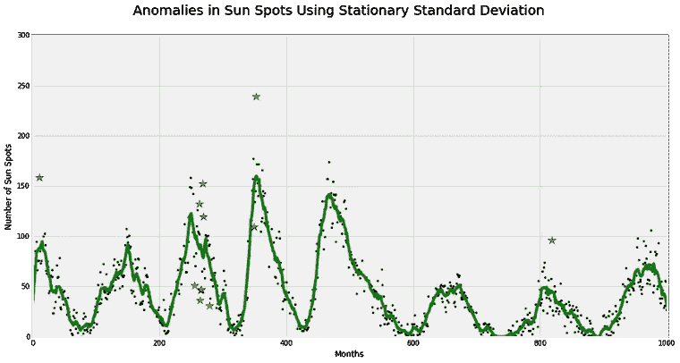
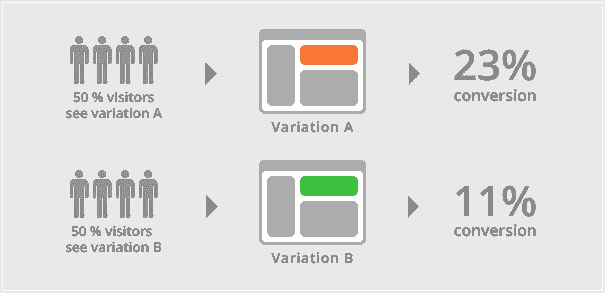
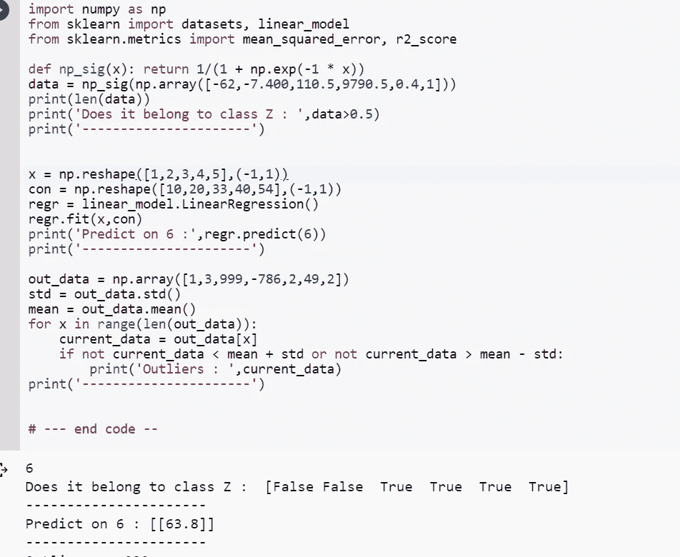

# 我对优步人工智能交互式代码面试问题的看法——第一部分

> 原文：<https://towardsdatascience.com/my-take-on-uber-ai-interview-question-with-interactive-code-part-1-40d6d795a566?source=collection_archive---------5----------------------->

所以我找到了这个了不起的博客作者维马什·卡巴里，他的博客上有一些了不起的东西！所以请看看他，他也是人工智能的创造者。今天，我将尝试从这个[博客](https://medium.com/@vimarshk)回答他的优步人工智能采访问题。请注意，我的解决方案不会优化。

另外，我不会按数字顺序回答问题。对于每一个问题，我会努力找到正确的答案并把它们联系起来。然而， ***我总是乐于学习和成长*** ，所以如果你知道一个更好的解决方案，请在下面评论。

**描述二进制分类**

我将这描述为当我们有两类标记数据时，例如类 Z 和非 Z。我们希望预测给定的数据是否属于某个类。(在本例中为 Z 类)

Wiki 回答:“二元或二项式分类是根据一个分类规则将给定集合的元素分为两组(预测每个元素属于哪个组)的任务。”

**解释逻辑回归、假设和数学方程**

我不知道这个问题解释假设是什么意思。但我会试着做另外两个。对我来说，我会将逻辑回归描述为对离散值的预测(如猫对狗)，而不是对连续值的预测(如房屋定价)。通过数学方程，我认为这个问题是问逻辑回归的方程。

Screen Shot from [CMU Stats](http://www.stat.cmu.edu/~cshalizi/uADA/12/lectures/ch12.pdf)

Example of Linear Regression

Wiki 回答:“在[统计](https://en.wikipedia.org/wiki/Statistics)、**逻辑回归**，或 **logit 回归**，或 **logit 模型**[【1】](https://en.wikipedia.org/wiki/Logistic_regression#cite_note-Freedman09-1)是[回归](https://en.wikipedia.org/wiki/Regression_analysis)模型，其中[因变量(DV)](https://en.wikipedia.org/wiki/Dependent_and_independent_variables) 是[范畴](https://en.wikipedia.org/wiki/Categorical_variable)
关于逻辑回归的假设，请查看本网站[。](http://www.statisticssolutions.com/wp-content/uploads/wp-post-to-pdf-enhanced-cache/1/assumptions-of-logistic-regression.pdf)

**缓存是如何工作的，您如何在数据科学中使用它？**

我对[缓存](https://searchstorage.techtarget.com/definition/cache)的理解是为了更快的访问而临时存储数据。但是，这些数据没有被保留，而是被删除了。我不确定这项技术是如何在引擎盖下工作的，我只知道高层次的观点。对于它如何应用于数据科学，我认为[这篇来自网飞](https://medium.com/netflix-techblog/how-data-science-helps-power-worldwide-delivery-of-netflix-content-bac55800f9a7)的博客可以给出答案。

基本上，在网飞，他们可以预测什么内容会最受欢迎(或最受欢迎)，从而优化流媒体。对优步来说，这可能是对汽车需求最高的地方，以优化客户满意度。

**什么是异常检测方法？**

我认为聚类给定的数据集可以揭示异常值，或者只是简单的方法，采取标准偏差，看看哪些数据点在范围之外也可以工作。

来自网络的回答:[这篇博客](https://www.datascience.com/blog/python-anomaly-detection)在解释这些问题上做得非常出色。

Image from this [website](https://www.datascience.com/blog/python-anomaly-detection).

**你如何使用 A/B 测试？**

我对 A/B 测试的了解非常有限，因为我只能想到医疗环境。其中一组病人服用药物，而另一组不服用。然后我们试图在让他们参与一些活动的时候看到他们之间的一些不同。

Image from this [website](https://vwo.com/ab-testing/)

[Wiki 回答](https://en.wikipedia.org/wiki/A/B_testing):“在 web analytics 中，A/B 测试(bucket tests 或 split-run testing)是一个有 A 和 B 两个变量的受控实验”(不过，我相信 A/B 测试在每个行业都有使用。)

这篇[博文，是对 A/B 测试逐步解释的一个极好的](https://vwo.com/ab-testing/)回答。

**交互代码**

*对于 Google Colab，你需要一个 Google 帐户来查看代码，而且你不能在 Google Colab 中运行只读脚本，所以在你的操场上做一个副本。最后，我永远不会请求允许访问你在 Google Drive 上的文件，仅供参考。编码快乐！*

要访问 Google Colab 上的代码，[请点击此处。](https://colab.research.google.com/drive/1qiKcJUtbNqf5cAhhHoczD25qGmFUaIVL)

**最后的话**

当我做这些问题时，我变得更加谦虚，意识到我知道的很少。要成为数据科学专家，我还有很多工作要做。

如果发现任何错误，请发电子邮件到 jae.duk.seo@gmail.com 给我，如果你想看我所有写作的列表，请点击这里查看我的网站。

同时，在我的推特[这里](https://twitter.com/JaeDukSeo)关注我，访问[我的网站](https://jaedukseo.me/)，或者我的 [Youtube 频道](https://www.youtube.com/c/JaeDukSeo)了解更多内容。如果你感兴趣，我还在这里做了解耦神经网络[的比较。](https://becominghuman.ai/only-numpy-implementing-and-comparing-combination-of-google-brains-decoupled-neural-interfaces-6712e758c1af)

**参考**

1.  二元分类。(2018).En.wikipedia.org。于 2018 年 4 月 6 日检索，来自[https://en.wikipedia.org/wiki/Binary_classification](https://en.wikipedia.org/wiki/Binary_classification)
2.  线性回归示例—sci kit—了解 0.19.1 文档。(2018).Scikit-learn.org。2018 年 4 月 6 日检索，来自[http://sci kit-learn . org/stable/auto _ examples/linear _ model/plot _ ols . html](http://scikit-learn.org/stable/auto_examples/linear_model/plot_ols.html)
3.  逻辑回归。(2018).En.wikipedia.org。于 2018 年 4 月 6 日检索，来自[https://en.wikipedia.org/wiki/Logistic_regression](https://en.wikipedia.org/wiki/Logistic_regression)
4.  (2018).Stat.cmu.edu。于 2018 年 4 月 6 日检索，来自[http://www.stat.cmu.edu/~cshalizi/uADA/12/lectures/ch12.pdf](http://www.stat.cmu.edu/~cshalizi/uADA/12/lectures/ch12.pdf)
5.  (2018).Statisticssolutions.com。2018 年 4 月 6 日检索，来自[http://www . statistics solutions . com/WP-content/uploads/WP-post-to-pdf-enhanced-cache/1/assumptions-of-logistic-regression . pdf](http://www.statisticssolutions.com/wp-content/uploads/wp-post-to-pdf-enhanced-cache/1/assumptions-of-logistic-regression.pdf)
6.  数据科学如何帮助推动网飞内容的全球交付。(2017).中等。2018 年 4 月 6 日检索，来自[https://medium . com/网飞-tech blog/how-data-science-helps-power-world wide-delivery-of-网飞-content-bac55800f9a7](https://medium.com/netflix-techblog/how-data-science-helps-power-worldwide-delivery-of-netflix-content-bac55800f9a7)
7.  什么是缓存(计算)？—来自 WhatIs.com 的定义。(2018).搜索存储。检索于 2018 年 4 月 6 日，来自[https://searchstorage.techtarget.com/definition/cache](https://searchstorage.techtarget.com/definition/cache)
8.  A/B 测试。(2018).En.wikipedia.org。检索于 2018 年 4 月 6 日，来自 https://en.wikipedia.org/wiki/A/B_testing
9.  AB 测试-完全指南。(2018).网站。检索于 2018 年 4 月 6 日，来自 https://vwo.com/ab-testing/