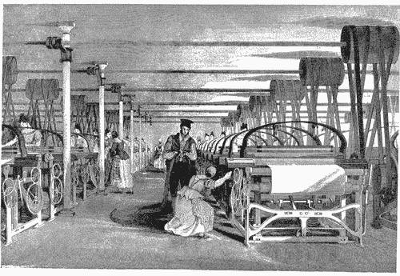
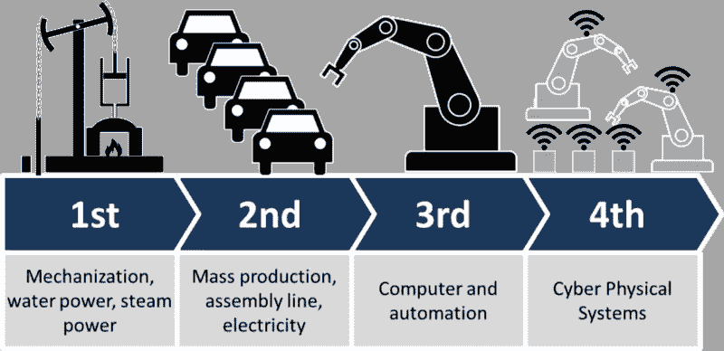
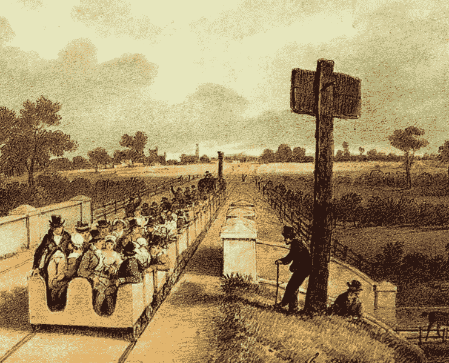

# 加速您数据科学学习的双重方法

> 原文：<https://towardsdatascience.com/my-way-of-learning-mathematics-for-data-science-407a5a7f2f4a?source=collection_archive---------8----------------------->

# 介绍

所以，这篇文章是关于通过我在过去几个月里开发的方法/技术来学习数学。我称之为**双折法**。数学不仅是数据科学的重要组成部分，也是模拟现实世界问题的重要组成部分。我开始学习是因为我无法理解几乎每本关于数据科学的书籍或文章中出现的任何概率分布、统计概念、微积分符号和矩阵。截至 2018 年 11 月，我已经开始理解和舒适地使用数据科学书籍、帖子、文章和期刊，无论它们包含什么水平的数学。是的，就连[深度神经网络](https://en.wikipedia.org/wiki/Deep_learning#Deep_neural_networks)的数学也不再让我害怕。我想是时候分享我的学习方法了。我之前写过关于[我的数据科学之旅](https://medium.com/@ArnuldOnData/my-journey-into-data-science-61b70a164bfe)。

Source: [Wikipedia](https://en.wikipedia.org/wiki/Industrial_Revolution)

# 背景

在我继续讲下去之前，我想重申几件已经确立了我的学习和工作方式的事情。每当我想学习新的东西时，我总是想先学习基础知识，然后在基础知识上再有所发展。死记硬背或忽略某些基本概念和想法是没有意义的，因为这不仅会导致沮丧，而且会浪费大量时间学习，然后因为忽略了基础知识而重新学习 100 遍同样的东西。这是我个人的学习方式，然后是专业方式，受商业方式和生活实用性的影响。从专业角度来说(以前是软件开发，现在是数据科学)，如果我需要学习一些非常新的主题/子主题/概念，我会快速浏览并阅读一些基础知识，然后找到正确和既定的方法来应用这些概念解决问题。Aim 更多的是应用方面的东西。

世界正在高速发展，技术已经震撼了世界，随着这一[第四次工业革命](https://duckduckgo.com/?q=4th+industrial+revilutionb&t=ffab&atb=v1-1&ia=web)已经到来。它模糊了你的职业(工作)和生意之间的界限。现在你可能会问，什么是第四次工业革命。根据[维基百科](https://en.wikipedia.org/wiki/Industry_4.0)，第四次工业革命也称为工业 4.0 包括这些想法:

*   智能制造
*   智能工厂
*   [熄灯制造](https://en.wikipedia.org/wiki/Lights_out_(manufacturing))(全自动工厂，不需要人在现场)
*   [工业物联网](https://en.wikipedia.org/wiki/Industrial_internet_of_things)(制造业[物联网](https://en.wikipedia.org/wiki/Internet_of_things))

Image by Christoph Roser at [http://AllAboutLean.com](https://t.co/7aYU3bKNen)

本质上，在智能工厂中，信息物理系统监控物理过程，创建物理世界的虚拟副本，并做出分散的决策。通过物联网，信息-物理系统在内部以及由[价值链](https://en.wikipedia.org/wiki/Value_chain)的参与者提供和使用的组织服务之间实时地相互通信和合作

这对你的职业生涯有什么影响？你必须尽快给出结果，否则不仅会让你丢掉工作，还会给你的雇主带来巨大的损失，如果你不明白这一点，如果你继续忽视这一点，那么从长远来看，你也会失去你的职业生涯。

# 职业需求

实际上，一个交付的问题解决方案比一个花费 10 倍时间的伟大解决方案更好，也比一个花费一年时间的完美解决方案更好，更有益。以领域为例，它在数据科学中的重要性已经确立。数据科学和领域专业知识密切相关。现在，如果你是一名数据科学家，从来没有学过生物学，但你的雇主有一个客户，主要是一家从事生物学的公司，那么，你要么让它成为一次痛苦的经历，要么成为一次快乐的经历，你必须学会这两种方式。在你认为我在瞎编之前，先看看计算生物学。没有生物学背景，你可以从零开始学习几种方法:

*   买一本厚重的生物学基础/入门书，需要几个月的时间来完成
*   参加为期 6 周多的生物学和数据科学 MOOCs
*   学习第四次工业革命的方式

前两个选项需要 1-2 个月或更长时间(理想情况下是 4 个月)才能开始你的项目工作，而你的雇主却因为你什么都没做而付给你钱。这既不公平又愚蠢，对你的雇主不公平，对你也愚蠢，因为你可以更有效地利用时间。你需要学会区分雇主的直接需求和你生产优秀产品的需求。

Source: Wikipedia

第四次工业革命的方式说你可以在一两周内完成，你不需要马上花两个月。将你的关注点从生物学缩小到你客户的当前需求，学习基本的术语和足够的基础知识，以便开始用 Python 和库来处理生物学中的问题(例如 [PySB](http://pysb.org/) 和 [Biopython](https://en.wikipedia.org/wiki/Biopython) )。如果你想完成有期限的工作，这就是你的态度。即使没有最后期限，我还是会说你走第四次工业革命的道路，因为这不仅会帮助你更快地解决问题，还会让你免于陷入“我学得不够多”的恶性循环。这并不意味着，你创造了一个糟糕的解决方案，因为你不是你学校的生物学生。如果你这样做，那么你解决问题的方法就不系统，这意味着你需要学习很多关于生产力、效率和情商的知识。这也意味着，你无法提供一个真正好的解决方案，这种能力已经超越了你的工作，延伸到了你的个人、财务和职业生活的另一个层面，你需要非常认真地对待这个问题，并立即开始着手解决自己的问题。你的日常常规思维需要改变。你可以看看**吉米·罗恩**教你**如何掌控自己的人生**

[https://youtu.be/DGIjuVbGP_A](https://youtu.be/DGIjuVbGP_A)

# 数学

你可能认为这一切都与数据科学的数学无关。确实如此。数学是一种对世界建模的方法，它是一种在问题中发现模式并使用经过试验和测试的模型来解决它们的方法。这既是一门艺术也是一门科学。数学给了我们解决问题的工具，比我们想象的要快得多，在事情失去控制之前处理混乱也是惊人的准确。这如何适用于我们的情况呢？我一会儿会谈到这一点。

我完成了代数和微积分的学习，参加了几门 MOOCs 课程，阅读了大量自学材料，包括书籍、文章和博客。我现在开始学习概率。概率、统计和线性代数是与数据科学重叠的数学领域。我观察到的是，就像代数和微积分一样，这些主题非常广泛，你可以花将近一年的时间来学习它们的基础知识。那我们该怎么办？我们变得聪明而实际。

# 双重方法

***第一重:*** 使用*第四次工业革命*我上面描述的解决问题的方式，这意味着我记得我的主要工作是数据分析和机器学习，我的目标是获得数据科学所必需的基础数学，这样我就不会盯着空白或看数学术语和公式时精神崩溃，每当我在数据分析和机器学习文章、博客和[库文档中遇到数学时，我都知道基本的公理和理论基础](https://en.wikipedia.org/wiki/Library_(computing))。如果我遇到我不知道的东西，我就能弄清楚，因为我掌握了基本原理。

***第二重* :** 终身学习数学，这与*第一重*相反，每当我有空的时候，我会打开一本书，看几个自定进度 MOOC 的视频(我不再订阅非数据科学工作的基于时间的 MOOC)或解决一些数学问题( [Schaum 的系列](https://www.amazon.com/Schaums-Probability-Variables-Processes-Outlines/dp/0071822984)非常有名，如果你知道什么更好的，请告诉我)。从更广泛的意义上来说，我把数学作为我的爱好，而不是在 YouTube 上看视频。像数学家一样思考问题，花尽可能多的时间找出答案。我从约翰·艾伦·保罗斯的《数学盲及其后果》开始了这段旅程。从狭义上来说，看一个数学公式并找出它被创造的原因，阅读它的历史，它被应用在哪些领域，它的应用范围以及它从一个领域到另一个领域的演变，尽可能详细地阅读它，或者阅读不同数学家和书籍中的一个概念的简介，如果你有编程背景，可以阅读埃文·米勒的[数学黑客](https://www.evanmiller.org/mathematical-hacker.html)。另一篇关于如何正确学习数学的非常好的文章是史蒂夫·耶格写的。如果你只做第一次，那么你的数学知识将会很少，几年后，当你决定用什么模型来解决什么问题时，你将没有足够的信息。如果你只是做第二遍，那么你将永远没有足够的时间来完成任何事情。你必须混合使用这两种方法，这就是为什么我称之为双重方法。事实上，它不仅适用于数学，也适用于几乎任何一种学习。如果你知道任何更好的学习数学的方法，我将非常乐意知道。

# 灵感

由于我的概率、统计和线性代数知识几乎为零，最近我从普渡大学开始了 [one，它也有它的](https://www.edx.org/course/probability-basic-concepts-discrete-random-variables-0)[第二部分](https://www.edx.org/course/probability-distribution-models-continuous-random-variables-0)。最后一件事，我上过的最好的 MOOC 是[在 Coursera](https://www.coursera.org/learn/learning-how-to-learn/) 学习如何学习。是的，这与数学或数据科学无关，但这就是生活，你在任何领域/学科的技能和成就很大程度上取决于你的个人思维，但这完全是另一回事，在另一篇博客文章中讨论。终身学习，无论遇到多大的挫折都不要放弃。

最初发表于[我的博客](https://lispyarnuld.wordpress.com/2018/11/14/the-math-of-data-science-3/)。