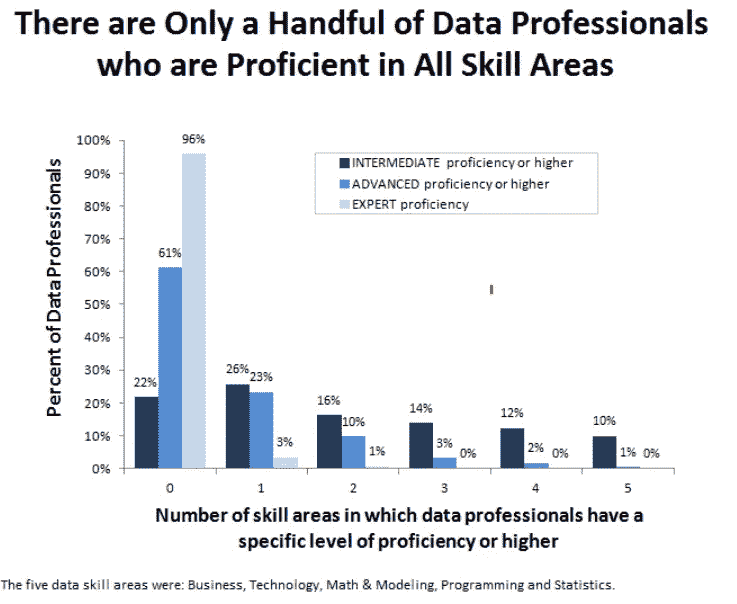
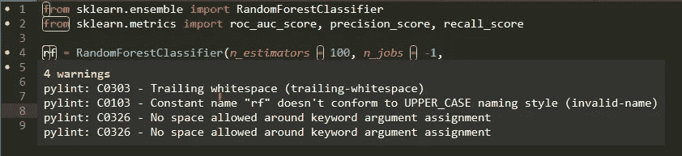
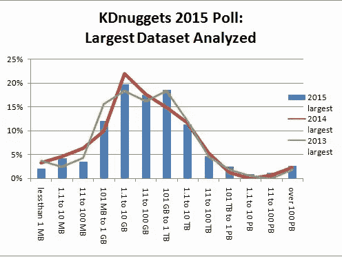
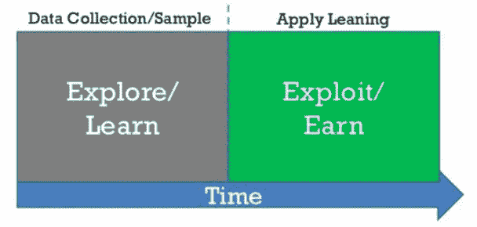
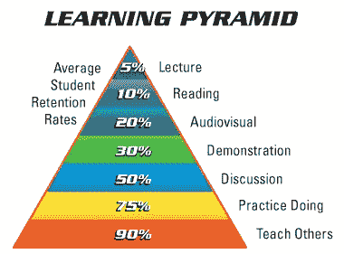

# 我作为数据科学家的弱点

> 原文：<https://towardsdatascience.com/my-weaknesses-as-a-data-scientist-1310dab9f566?source=collection_archive---------2----------------------->

([Source](https://hiveminer.com/Tags/climbing%2Cstairs))

## 不认识到我们的弱点，我们将永远无法克服它们

如果现代求职面试教会了我们什么，那就是“你最大的缺点是什么？”这个问题的正确答案就是“我工作太辛苦了。”显然，*实际上*谈论我们的弱点是可笑的，对吗？为什么我们要提到我们还不能做的事情？虽然工作申请和 LinkedIn 个人资料页面并不鼓励我们披露自己的弱点，[如果我们从不承认自己的不足](https://medium.com/@williamkoehrsen/the-power-of-i-dont-know-590ab40d1995)，那么我们就无法采取措施来解决它们。

努力变得更好的方法很简单:

1.  确定你现在的位置:**找出弱点**
2.  弄清楚你想去哪里:制定一个到达那里的计划
3.  执行计划:一次做一件小事

我们很少走过第一步:特别是在技术领域，我们低着头继续工作，使用我们已经拥有的技能，而不是获得新的技能，使我们的工作更容易或为我们打开新的机会。自我反省——客观地评价自己——可能看起来像一个陌生的概念，但是能够后退一步，找出我们可以做得更好或更有效的地方，对于任何领域的进步都是至关重要的。

考虑到这一点，我试图客观地审视我现在的状况，并确定了 3 个方面来使我成为更好的数据科学家:

*   **软件工程**
*   **缩放数据科学**
*   **深度学习**

我写这篇关于我在数据科学方面的弱点的文章有三个目的。首先，我真的关心变得更好，所以我需要承认我的弱点。通过概述我的不足以及如何解决它们，我的目标是让我自己有动力去完成我的学习目标。

其次，我希望鼓励其他人思考他们可能不知道的技能，以及他们如何努力获得这些技能。你不必写自己的文章来披露你所不知道的，但是花一些时间来考虑这个问题会有回报的，如果你发现了一项需要努力的技能的话。

最后，我想告诉大家，要成为一名成功的数据科学家，你不需要知道所有的事情。数据科学/机器学习主题的数量几乎是无限的，但你实际上可以知道的数量是有限的。不管不切实际的工作申请宣称什么，你不需要完全了解每种算法(或 5-10 年的经验)就能成为一名实践数据科学家。我经常听到初学者被他们认为必须学习的大量主题所淹没，我的建议总是相同的:从[基础](https://www-bcf.usc.edu/~gareth/ISL/)开始，明白你不需要知道所有！

Even this is probably an exaggeration! ([Source](http://businessoverbroadway.com/data-science-skills-and-the-improbable-unicorn))

对于每一个缺点，我都列出了问题和我目前正在努力做的事情。发现自己的弱点很重要，但制定解决它们的计划也很重要。学习一项新技能需要时间，但是计划一系列小而具体的步骤会大大增加你成功的机会。

# 1.软件工程

在学术环境中获得了第一次真正的数据科学经验后，我试图避免染上一些反映数据科学学术方式的坏习惯。其中有*编写只运行一次的代码的倾向，缺乏文档，没有一致风格的代码难以阅读，**[*硬编码*](https://en.wikipedia.org/wiki/Hard_coding) *具体值。*所有这些实践都反映了一个主要目标:开发一个数据科学解决方案，该方案只对特定数据集有效*，以便撰写论文。**

*作为一个典型的例子，我们的项目处理最初以 15 分钟为间隔的建筑能源数据。当我们开始以 5 分钟为增量获取数据时，我们发现我们的管道完全崩溃了，因为有数百个地方的间隔被明确编码为 15 分钟。我们无法进行简单的查找和替换，因为该参数被多个名称引用，如`electricity_interval`、`timeBetweenMeasurements`或`dataFreq`。没有一个研究人员想过让代码*易于阅读*或*灵活地改变输入*。*

*相比之下，从[软件工程的角度来看](https://en.wikipedia.org/wiki/Best_coding_practices#Software_quality)，代码必须用许多不同的输入进行广泛的测试，有良好的文档记录，在现有的框架内工作，并遵守编码标准，以便其他开发人员能够理解。尽管我的初衷是好的，但我仍然偶尔像数据科学家而不是软件工程师一样编写代码。我开始认为，将普通数据科学家与伟大的数据科学家区分开来的是使用[软件工程最佳实践](https://techbeacon.com/5-essential-software-engineering-practices)编写代码——如果你的模型不健壮或不适合某个架构，它就不会被部署——现在我正试图训练自己[像计算机科学家一样思考](http://openbookproject.net/thinkcs/python/english3e/)。*

## *我在做什么*

*像往常一样，没有比实践更好的学习技能的方法了。幸运的是，在我目前的工作中，我能够为我们的内部工具和开源库做出贡献。这迫使我学习了许多实践，包括:*

*   *编写单元测试*
*   *遵循编码[风格指南](https://www.python.org/dev/peps/pep-0008/)*
*   *编写接受变化参数的函数*
*   *彻底记录代码*
*   *让他人审查代码*
*   *[重构代码](https://stackoverflow.com/questions/1025844/what-is-refactoring-and-what-is-only-modifying-code)使其更简单易读*

*即使对于那些还没有进入公司的数据科学家来说，你也可以通过参与合作性的开源项目来获得这方面的经验。找出可靠编码实践的另一个好方法是通读 GitHub 上流行库的源代码( [Scikit-Learn](https://github.com/scikit-learn/scikit-learn) 是我的最爱之一)。获得他人的反馈至关重要，所以找一个社区，向那些比你更有经验的人寻求建议。*

*像软件工程师一样思考需要思维方式的改变，但是如果你能够放慢速度并记住它们，采用这些实践并不困难。例如，每当我发现自己在 Jupyter 笔记本上复制和粘贴代码并更改一些值时，我会尝试停下来，并意识到使用一个从长远来看会使我更高效的函数会更好。虽然我在这些实践上并不完美，但我发现它们不仅让其他人更容易阅读我的代码，也让我更容易构建我的工作。代码被阅读的次数将会比它被编写的次数多，这包括你未来的自己，他会欣赏文档和一致的风格。*

*当我不编写被设计为更大的库的一部分的代码时，我仍然尝试使用这些方法中的一些。对于数据科学家来说，为数据分析编写单元测试可能看起来很奇怪，但是当您实际需要开发测试来确保代码按预期工作时，这是一个很好的实践。此外，有许多[林挺工具](http://flake8.pycqa.org/en/latest/)检查你的代码是否遵循一种编码风格(我仍然纠结于关键字参数周围没有空格)。*

**

*Always things to improve (using [pylint](https://github.com/SublimeLinter/SublimeLinter-pylint) in Sublime Text 3).*

*我还想在计算机科学的许多其他方面努力，比如编写高效的实现而不是暴力方法(比如使用[矢量化而不是循环](https://engineering.upside.com/a-beginners-guide-to-optimizing-pandas-code-for-speed-c09ef2c6a4d6))。然而，同样重要的是要意识到你不能一下子改变所有的事情，这就是为什么我专注于一些实践，并把它们 [*习惯*](https://en.wikipedia.org/wiki/The_Power_of_Habit) 融入我的工作流程。*

> *虽然数据科学现在是它自己的领域，但从业者可以通过采用现有领域(如软件工程)的最佳实践而受益。*

# *2.扩展数据科学*

*虽然你可以自学数据科学中的所有知识，但你可以付诸实践的东西是有一些限制的。一个是难以将分析或预测模型扩展到大型数据集。我们大多数人都没有机会接触到计算集群，也不想花钱购买个人超级计算机。这意味着，当我们学习新方法时，我们倾向于将它们应用于小型的、性能良好的数据集。*

*不幸的是，在现实世界中，[数据集](https://www.quora.com/Where-can-I-find-large-datasets-open-to-the-public#)并不遵循严格的大小或清洁度限制，您将需要不同的方法来解决问题。首先，你可能需要打破个人电脑的安全限制，使用一个远程实例——比如通过[AWS EC2](https://aws.amazon.com/ec2/)——甚至多台机器。这意味着学习如何连接到远程机器和[掌握命令行](https://github.com/jlevy/the-art-of-command-line)——你将无法在 EC2 实例上使用鼠标和 gui。*

*在学习数据科学时，我尝试在 EC2 机器上工作，要么使用免费层，要么使用免费配额(如果您管理所有的电子邮件和密码，您可以创建多个帐户)。这有助于我熟悉命令行，但是，我仍然没有解决第二个问题:大于机器内存的数据集。最近，我意识到这是一个阻碍我前进的限制，是时候学习如何处理更大的数据集了。*

## *我在做什么*

*即使没有在计算资源上花费数千美元，也有可能实践处理不适合内存的数据集的方法。其中一些包括[一次遍历一个数据集的一个块](https://stackoverflow.com/questions/14262433/large-data-work-flows-using-pandas)，[将一个大数据集分成许多小块](http://www.learn.geekinterview.com/data-warehouse/dw-basics/what-is-data-partitioning.html)，或者使用 Dask 等工具为您处理大数据的细节。*

*我目前的方法，无论是在内部项目上还是在[开源数据集](https://medium.com/feature-labs-engineering/scaling-featuretools-with-dask-ce46f9774c7d)上，都是将数据集划分为子集，开发一个可以处理一个分区的管道，然后使用 Dask 或 [Spark 和 PySpark](https://spark.apache.org/docs/latest/api/python/index.html) 通过管道并行运行子集。这种方法不需要超级计算机或集群，您可以使用多个内核在个人计算机上并行化操作。然后，当您可以访问更多资源时，您可以调整相同的工作流以进行扩展。*

*此外，感谢 Kaggle 等[数据仓库，我已经能够找到一些非常大的数据集，](https://www.kaggle.com/datasets?sortBy=hottest&group=public&page=1&pageSize=20&size=large&filetype=fileTypeAll&license=licenseAll)[通读其他数据科学家的方法](https://www.kaggle.com/frankherfert/tips-tricks-for-working-with-large-datasets)来处理它们。我收集了一些[有用的技巧](https://www.dataquest.io/blog/pandas-big-data/)，比如通过改变数据帧中的数据类型来减少内存消耗。这些方法有助于我更有效地处理任何规模的数据集。*

*虽然我还没有处理大规模的 TB 级数据集，但是这些方法已经帮助我学会了处理大数据的基本策略。对于最近的一些项目，我能够应用到目前为止我所学到的技能[来对运行在 AWS](https://medium.com/feature-labs-engineering/featuretools-on-spark-e5aa67eaf807) 上的集群进行分析。在接下来的几个月里，我希望逐渐增加我能轻松分析的数据集的大小。很有可能数据集的大小不会减少，我知道我需要继续提高处理大量数据的技能。*

**

*The US Library of Congress “only” [has about 3 Petabytes](https://blogs.loc.gov/thesignal/2012/04/a-library-of-congress-worth-of-data-its-all-in-how-you-define-it/) of material. ([Image source](https://www.kdnuggets.com/2015/08/largest-dataset-analyzed-more-gigabytes-petabytes.html))*

# *3.深度学习*

*虽然人工智能在过去经历了繁荣和萧条的时期，但最近在计算机视觉、自然语言处理和深度强化学习等领域的成功让我相信，深度学习——使用多层神经网络——并不是又一个短暂的时尚。*

*与软件工程或扩展数据科学不同，我目前的职位不需要任何深度学习:传统的机器学习技术(例如 [Random Forest](https://medium.com/@williamkoehrsen/random-forest-simple-explanation-377895a60d2d) )已经能够解决我们客户的所有问题。然而，我认识到，并不是每个数据集都是整齐的行列结构，神经网络是(目前)处理文本或图像项目的最佳选择。我可以继续[利用](https://conceptually.org/concepts/explore-or-exploit/)我目前的技能解决我已经解决的问题，但是，尤其是在我职业生涯的早期，探索话题是一项具有巨大潜在价值的工作。*

**

*The [Explore/Exploit Tradeoff](https://en.wikipedia.org/wiki/Multi-armed_bandit) applies to reinforcement learning and your life! ([Source](https://www.google.com/url?sa=i&source=images&cd=&cad=rja&uact=8&ved=2ahUKEwjt3ZfW7qTeAhXMna0KHSslD0EQjhx6BAgBEAM&url=https%3A%2F%2Fconversionxl.com%2Fblog%2Fbandit-tests%2F&psig=AOvVaw208AnXDQBZkFjhH-HE1xI9&ust=1540669324867342))*

*深度学习中有许多不同的子领域，很难找出哪些方法或库最终会胜出。尽管如此，我认为对该领域的熟悉和对实现一些技术的信心将允许一个人处理更广泛的问题。鉴于解决问题是驱使我从事数据科学的原因，将深度学习的工具添加到我的工具箱中是一项值得的投资。*

## *我在做什么*

*我研究深度学习的计划与我将自己转变为数据科学家的方法相同:*

1.  ***阅读强调实现的书籍和教程***
2.  *在实际项目中练习这些技术和方法*
3.  ***通过写作分享和解释我的项目***

*当研究一个技术课题时，一个有效的方法是边做边学。对我来说，这意味着不是从潜在的基本理论开始，而是通过找出如何实现解决问题的方法。这种自上而下的方法意味着我非常看重那些有[动手风格](http://shop.oreilly.com/product/0636920052289.do)的书，也就是那些有很多代码示例的书。在我看到技术是如何工作的之后，我会回到理论上来，这样我就可以更有效地使用这些方法。*

*虽然我可能是独自一人，因为我没有机会在工作中从其他人那里学习神经网络，但在数据科学中，由于丰富的资源和广泛的社区，你永远不会真正依靠自己。对于深度学习，我主要依靠三本书:*

*   *[深度学习食谱](http://shop.oreilly.com/product/0636920097471.do)作者 Douwe Osinga*
*   *[用 Python 进行深度学习](https://www.manning.com/books/deep-learning-with-python)Francois Chollet*
*   *伊恩·古德菲勒、约舒阿·本吉奥和亚伦·库维尔的《深度学习》*

*前两者强调用神经网络构建实际的解决方案，而第三个则深入讨论理论。当阅读关于技术主题的内容时，让它成为一种积极的体验:只要有可能，把你的手放在键盘编码和你所阅读的内容上。像前两本书这样提供代码示例的书非常棒:我通常会在 Jupyter 笔记本上一行一行地输入一个示例，以弄清楚它是如何工作的，并在进行过程中写下详细的笔记。*

*此外，我不仅尝试复制代码示例，还尝试对它们进行实验，或者使它们适应我自己的项目。这方面的一个应用是我最近与[合作建立一个图书推荐系统](/building-a-recommendation-system-using-neural-network-embeddings-1ef92e5c80c9)，这个项目改编自深度学习食谱中的一个类似代码练习。试图从头开始自己的项目可能会令人生畏，而且，当你需要激励时，在别人已经做的基础上进行建设也没什么错。*

*最后，学习一个话题的最有效的方法之一是*把它教给别人*。根据经验，我不会完全理解一个概念，直到我试图用简单的术语向别人解释它。对于我在深度学习中涉及的每个新主题，我将继续写作，分享技术实现细节以及概念解释。*

> *教学是最好的学习方式之一，我计划让它成为我研究深度学习的一个组成部分。*

**

*From personal experience, this looks accurate ([Source](https://nikkimantyla.wordpress.com/2011/07/29/the-best-way-to-learn-is-to-teach/))*

# *结论*

*宣扬你的弱点可能感觉有点奇怪。我知道写这篇文章让我不舒服，但我把它放出来，因为它最终会让我成为一名更好的数据科学家。此外，我发现，如果你有自知之明，承认自己的缺点，并讨论如何解决这些问题，那么包括雇主在内的许多人都会对你印象深刻。*

> *缺乏技能并不是缺点——真正的缺点是假装你什么都知道，并且不需要变得更好。*

*通过确定我的数据科学弱点(软件工程、扩展分析/建模、深度学习)，我旨在提高自己，鼓励他人思考他们的弱点，并表明要成为一名成功的数据科学家，你不需要学习所有东西。虽然反思自己的弱点可能是痛苦的，但学习是令人愉快的:最有收获的经历之一是在持续学习一段时间后回顾过去，并意识到自己比开始学习前知道的更多。*

*一如既往，我欢迎反馈和建设性的批评。可以通过推特 [@koehrsen_will](http://twitter.com/@koehrsen_will) 或者通过我的个人网站 [willk.online](https://willk.online) 找到我。*