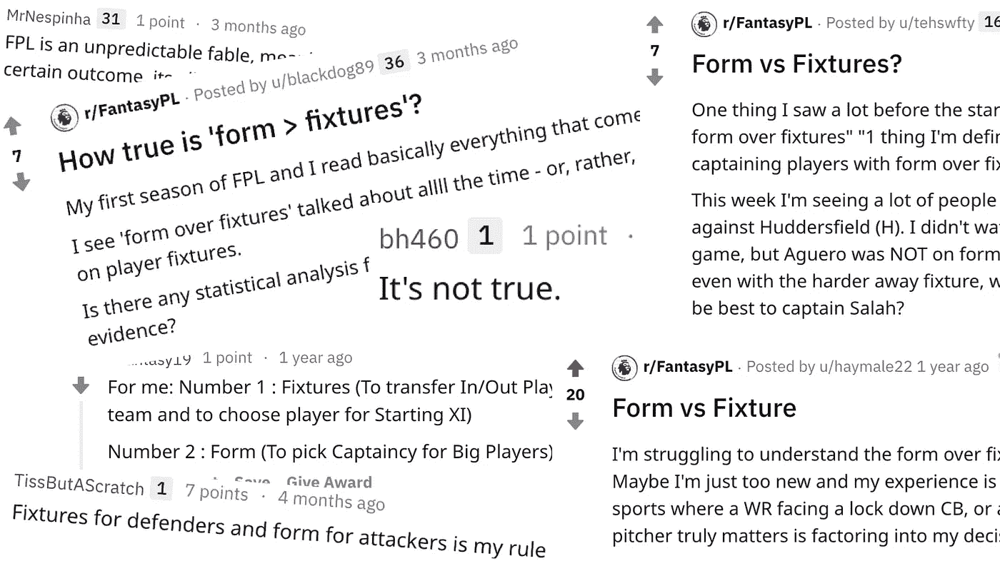
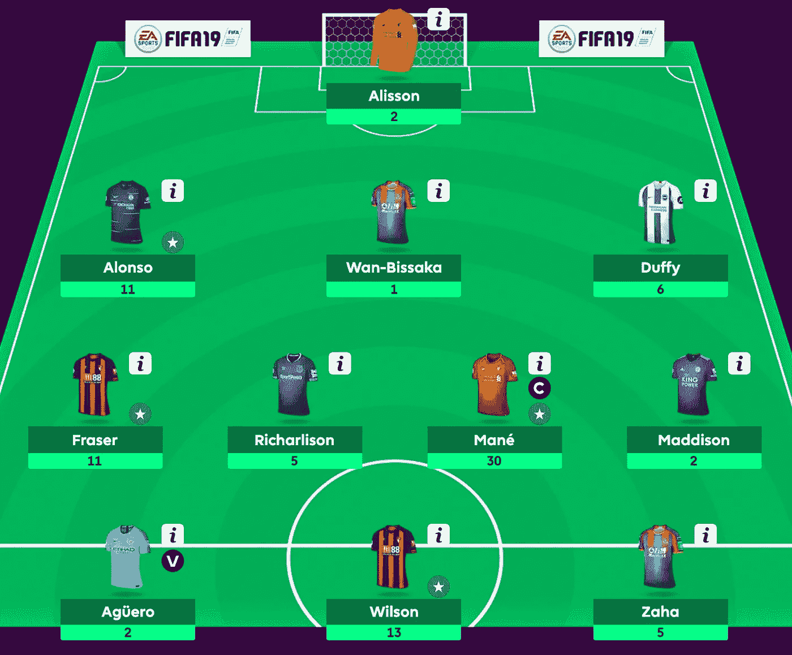
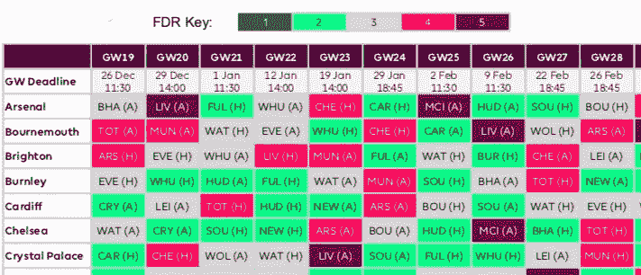
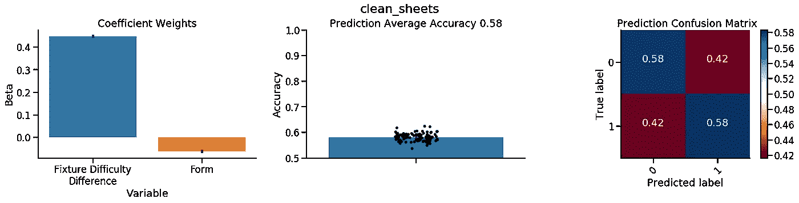
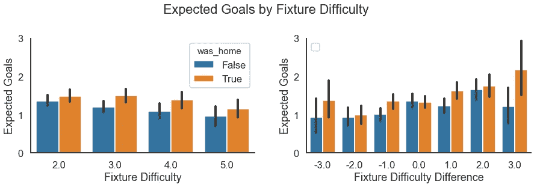
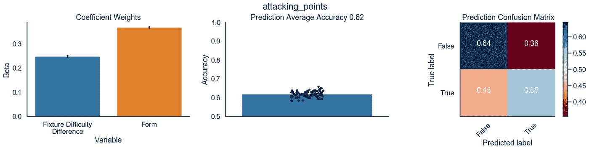

# 打破神话的梦幻英超联赛:形式胜于赛程

> 原文：<https://towardsdatascience.com/mythbusting-fantasy-premier-league-form-over-fixtures-eecf9022e834?source=collection_archive---------19----------------------->

## 数据科学教程

## 使用足球数据和机器学习来测试在预测不失球、进球和助攻方面，形式是否比固定比赛更重要

*Form vs fixtures discussions on Reddit*

超过 600 万人参加了[梦幻超级联赛(FPL)](https://fantasy.premierleague.com/) 的比赛，试图组建最好的 11 名球员阵容，以获得英格兰超级联赛 38 周以来的最高分。每个球员的得分由他们在实际比赛中的表现决定，守门员和后卫在没有失球的情况下完成一场比赛可以获得 4 分，进球得分者根据他们的位置，每个进球或助攻可以获得 3 到 6 分。为了最大限度地提高球队的得分，经理们必须做出明智的决定，选择最有可能保持零失球或每周进球的球员。

经理们经常讨论的两个流行指标是球员的状态和即将到来的比赛难度。根据状态选择球员意味着更喜欢在最近的比赛中得分好或者保持零失球的球员。然而，考虑比赛难度也很重要，因为一名球员在对阵较弱的对手时得分，可能不会在对阵更强的球队时得分。

在决定这两个指标时，我注意到经理们经常在[梦幻英超社区](https://www.reddit.com/r/FantasyP)上称赞“形式胜于固定”，但几乎没有发现在预测不失球或进攻得分(即助攻或进球)方面比较这两个指标的分析。[彼得·布雷克](https://mathematicallysafe.wordpress.com/2018/07/08/fpl-analysis-the-impact-of-fixtures-on-player-performance/)已经分析了固定难度的影响，但它只考虑了固定难度，而没有考虑球员的状态。因此，为了测试形式是否确实比夹具更重要，我使用了 2016 年以来的 FPL 数据来比较他们在预测 FPL 不失球和进攻点方面的贡献。

*Sample screen of Fantasy Premier League*

## 1.查找数据并定义形状和夹具

我能够通过 [FPL 的 API](https://fantasy.premierleague.com/drf/bootstrap-static) 收集到[瓦斯塔夫阿南德](https://github.com/vaastav/Fantasy-Premier-League)过去两个赛季的数据。在获得过去两个赛季(2016-17 和 2017-18)的数据后，我将球员的“状态”定义为他们前 6 周的平均表现，与 FPL 官方网站上的定义一致。比赛难度确定如下:前 2 名球队的比赛难度排名为 5，排名第 3 至第 6 的球队排名为 4，排名第 7 至第 12 的球队排名为 3，排名第 12 至第 20 的球队排名为 2。这并不完全是在官方 [FPL 网站](https://www.premierleague.com/news/783106)上定义的，该网站声称使用了“FPL 专家开发的复杂算法”，但看起来是足够接近的近似值。

*Fixture Difficulty Ranking Chart*

我将跳转到结果，但是所有用于分析的数据和代码都可以在[这里](https://github.com/jcheong0428/jcheong0428.github.io/tree/master/assets/post20181226/FPL_form_v_fixture)获得，笔记本也嵌入在文章的底部。

## 2.估计夹具和模板对清洁板材的贡献

首先，我评估了夹具难度如何影响零失球的概率。在图 1 的左图中，我们可以看到对手的比赛难度降低了球队零失球的概率。大约 15%的球队在对阵比赛难度为 5 的球队时保持不失球(例如，上赛季的曼城和曼联)，而大约 30%的球队在对阵比赛难度为 2 的球队时保持不失球(例如，上赛季的西布罗姆维奇或斯托克城)。我们也看到了主场优势，当球队在主场比赛时，不失球的可能性更大。

*Figure 1\. Fixture difficulty on clean sheet probability. Left panel uses the opponent’s fixture difficulty. Right panel uses the difference between the playing team and the opponent team’s fixture difficulty ranking such that higher difference suggests that a high caliber team is playing a low caliber team. Error bars are 95% confidence intervals*

此外，我们还可以考虑两队之间的比赛难度差异。例如，曼城很难排在第 5 位，这表明他们是一支困难的球队，但如果他们与一支类似的球队比赛，两者之间的差异可以更好地预测不失球的可能性。差值的计算方法是比赛队的比赛难度减去对手的比赛难度，因此数值越高表示优势越大。正如所料，我们可以从图 1 的右图中看到，当一个更强的球队对阵一个更弱的球队时，不失球的可能性更大。

现在，为了测试球员的形式或固定难度是否可以预测不失球，我们可以训练一个以形式和固定为特征的机器学习模型。通过标准化特征，我们可以比较一个特征是否比另一个特征更有助于预测干净的纸张。我在个人玩家身上训练了一个逻辑回归模型，反复进行 K 倍交叉验证。通过这种方式，我们还可以看到不同数据折叠的系数有多稳定。

*Figure 2\. Form vs fixture on clean sheets. Left panel shows average coefficient weights of fixture difficulty difference and form in predicting clean sheets. Middle panel shows average accuracy in predicting clean sheets which was 58%. Right panel shows the confusion matrix in accurately predicting clean sheets (coded as 1). Error bars are 95% confidence intervals*

在这个分析中，我只包括了在比赛中打了 60 分钟以上的后卫和守门员，因为他们是那些如果不失球就会获得零失球分数的人。图 2 的左图清楚地显示了两队之间的比赛难度差异是比球员状态更强的不失球预测因素。虽然该模型的准确性不高，只有 58%,但我们仍然可以得出这样的结论:当选择那些在不失球的情况下获得大部分分数的守门员和后卫时，经理们应该考虑的是固定而不是形式。

> 对于守门员和后卫来说，在预测不失球方面，比赛比球员的状态更重要

# 3.估计固定物和形态对攻击点的贡献

比赛中的进球也会受到比赛难度的影响。在球队层面，我们可以从图 3 左图中看到，与实力更强的球队比赛(即比赛难度为 5)比与更轻松的对手比赛(比赛难度为 2)进球略少。从图 3 的右图中，我们还可以推断出，当排名靠前的球队与排名垫底的球队比赛时，我们可以看到大约两个进球，但在大多数其他比赛中，我们可以看到大约一个进球。

*Figure 3\. Fixture difficulty on attacking expected goals. Left panel uses the opponent’s fixture difficulty. Right panel uses the difference between the playing team and the opponent team’s fixture difficulty ranking such that higher difference suggests that a high ranked team is playing a lower rank team. Error bars are 95% confidence intervals*

然而在 FPL，球员不仅因为进球得分，还因为助攻得分。因此，我决定使用进攻得分作为因变量，进攻得分定义为比赛中的进球或助攻。类似于零失球分析，我只包括了在比赛中出场超过 60 分钟的中场和前锋，因为他们需要获得进攻分。现在，我们再次运行逻辑回归模型来预测球员状态和设备难度差异的攻击点。

*Figure 4\. Form vs fixture on attacking points. Left panel shows average coefficient weights on fixture difficulty difference and form. Middle panel shows average accuracy in predicting clean sheets which was 62%. Right panel shows the confusion matrix in accurately predicting attacking points (coded as True). Error bars are 95% confidence intervals*

在这里，我们发现形式和比赛的差异都有助于球员进球或助攻的概率，但形式比比赛更重要(图 4 的左图)。预测准确度为 62%,并且它比获得攻击点(灵敏度；图 4 右侧面板中的混淆矩阵)。由此我们可以得出结论，*主教练应该考虑中场和前锋的状态而不是赛程。*

> 在预测进攻点时，球员的状态比中场和前锋的固定位置更重要。

# 我们学到了什么

在这里，我们验证了在 FPL 流行的神话，球员的状态比比赛更重要。事实证明，至少对防守者来说，固定比赛比形式更重要。他们更有可能在与较弱的对手比赛时不失球，不管他们的状态如何。相比之下，对于中场和前锋来说，这个神话被证明是真实的，那种形式确实比固定难度更能预测进攻点，尽管它仍然是预测进攻点的一个重要因素。

# 结论

在分析中，有几个重要的假设和警告需要记住。例如，夹具难度差异应该更多地被认为是一个顺序变量，其中差异之间的间距在现实中可能不是线性的。此外，为了简单起见，我使用了逻辑回归，但是泊松分布可能更适合这样的数据。此外，如果模型被置换，预测精度很差，可能接近噪声水平([见我以前关于置换模型的重要性的帖子](/chance-is-not-enough-evaluating-model-significance-with-permutations-e3b17de6ba04))。这就留下了一种可能性，其他变量可能比状态和比赛更好地预测不失球和进攻得分，但这将是另一个问题。感谢您的阅读，并随时留下任何意见或建议。

*原载于 2018 年 12 月 26 日*[*【jinhyuncheong.com*](http://jinhyuncheong.com/jekyll/update/2018/12/26/Form_over_fixture.html)*。*