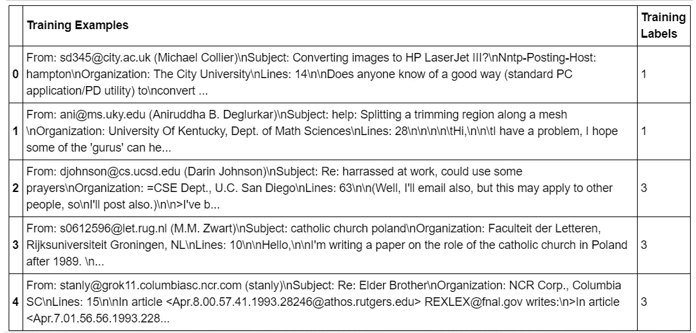
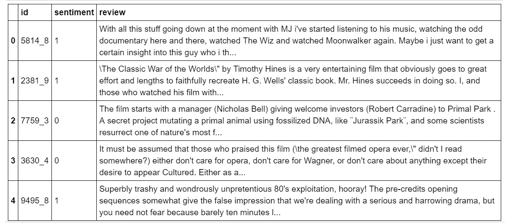
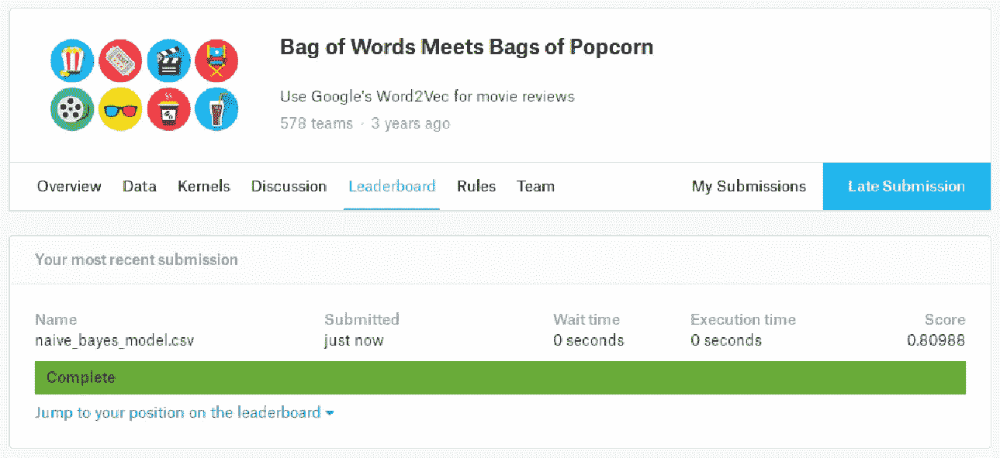

# 仅使用 Python 从零开始的朴素贝叶斯——没有花哨的框架

> 原文：<https://towardsdatascience.com/na%C3%AFve-bayes-from-scratch-using-python-only-no-fancy-frameworks-a1904b37222d?source=collection_archive---------4----------------------->

## 对于 ML 初学者


## 从零开始展开朴素贝叶斯！Take-2🎬

所以在我之前的博文 [**中从头开始展开了朴素贝叶斯！**](/unfolding-naïve-bayes-from-scratch-2e86dcae4b01) 取-1🎬，我试图解码朴素贝叶斯(NB) ML 算法背后的火箭科学，在经历了它的算法见解后，你一定也意识到它是一个相当无痛的算法。在这篇博文中，我们将一步一步地完成 python 的实现(仅使用基本的 python ),并且很明显*从头开始编写 NB 代码是多么容易*并且 NB 在分类方面并不幼稚！

## 目标受众是谁？🗣 🗣 🗣 *ML 初学者*

因为我一直想为绝对的初学者解读 ML，而且据说如果你不能解释它，你可能没有理解它，所以这篇博客也是特别为 ML 初学者写的。

## 本教程的成果——NB 的实际 Pythonic 实现

正如我上面提到的，NB pythonic 实现的完整演示

# 定义路线图…..🚵

**里程碑# 1:** [**数据预处理功能**](#6154)

**里程碑# 2:** [**实现 NaiveBayes 类——定义用于训练的函数&测试**](#fc37)

**里程碑# 3:** [**在训练数据集**](#0287) 上训练 NB 模型

**里程碑# 4:** [**使用经过训练的 NB 模型**](#a15f) 进行测试

**里程碑# 5:** [**证明 NaiveBayes 类的代码是绝对通用的！**](#02f4)

在我们开始用 python 编写朴素贝叶斯的代码之前，我假设您熟悉:

1.  Python 列表
2.  Numpy &只是一点点矢量化代码
3.  字典
4.  正则表达式

> 让我们从 Pythonic 实现开始吧！

# **定义数据预处理功能**

让我们从实现朴素贝叶斯时需要的一些导入开始

**达到里程碑# 1**👍

# **实现 NaiveBayes 类定义函数用于训练&测试**

*:我们将为 NB 分类器编写一个完全通用的代码！不管训练数据集中有多少类，也不管给定了什么文本数据集，它仍然能够训练一个完全工作的模型。*

*NaiveBayes 的代码只是一个*的小扩展—* ，但是我们只需要花费最多 10-15 分钟来掌握它！之后，你会对所有重要的概念有一个很好的理解。*

## *这段代码在做什么？？*

*NaiveBayes 类中总共定义了四个函数:*

```
*1\. **def** addToBow(self,example,dict_index)
2\. **def** train(self,dataset,labels)
3\. **def** getExampleProb(self,test_example)
4\. **def** test(self,test_set)*
```

*代码分为两个主要功能，即训练和测试功能。一旦您理解了这两个函数中定义的语句，您就一定会知道代码实际上在做什么，以及其他两个函数被调用的顺序。*

```
*1**.** Training function that trains NB Model : **def** train(self,dataset,labels)2\. Testing function that is used to predict class labels 
   for the given test examples :
   **def** test(self,test_set)*
```

*另外两个函数被定义来补充这两个主要函数*

```
*1\. BoW function that supplements training function 
   It is called by the train function.
   It simply splits the given example using space as a tokenizer 
   and adds every tokenized word to its corresponding BoW : 
   **def** addToBow(self,example,dict_index)2\. Probability function that supplements test function. 
   It is called by the test function.
   It estimates probability of the given test example so that 
   it can be classified for a class label :
   **def** getExampleProb(self,test_example)*
```

> **您可以在本* [***Jupyter 笔记本***](https://github.com/aishajv/Unfolding-Naive-Bayes-from-Scratch/blob/master/%23%20Unfolding%20Na%C3%AFve%20Bayes%20from%20Scratch!%20Take-2%20%F0%9F%8E%AC.ipynb) *中查看以上代码太**

*如果我们定义一个 NB 类，比使用传统的结构化编程方法更容易组织和重用代码。这就是定义 NB 类及其内部所有相关函数的原因。*

> *我们不只是想写代码，而是想写漂亮、整洁、方便、可重用的代码。是的，没错——我们希望拥有一个优秀的数据科学家可能拥有的所有特征！*

*你猜怎么着？每当我们将要处理一个我们打算用 NB 来解决的文本分类问题时，我们将简单地实例化它的对象，并且通过使用相同的编程接口，我们将能够训练一个 NB 分类器。另外，作为面向对象编程的一般原则，我们只定义与该类中的某个类相关的函数，所以所有与 NB 类无关的函数都将被单独定义*

> ****里程碑# 2 实现*** *👍 👍**

# ***在训练数据集上训练 NB 模型***

*是的，就是这样！只需要四个函数，我们就可以在任何文本数据集和任何数量的类标签上训练我们的 NB 模型了！*

**

*Ready — Set — Go!*

*如果你很想知道训练数据实际上是什么样的…..这是一个新闻组数据集，由 20 个主题的新闻组帖子组成。它有 20 个类别，但目前，我们将只在四个类别上训练我们的 NB 模型——[' alt .无神论'，' comp.graphics '，' sci.med '，' soc.religion.christian']，但代码对于所有 20 个类别的训练都非常有效。*

**

*Training Dataset*

> *您可能想知道为什么“Training Labels”列是数字形式，而不是它们原来的字符串文本形式。只是每个字符串标签都被映射到其唯一的数字整数形式。即使你现在还不清楚这一点，只要考虑已经提供了一个数据集，并且它有数字形式的标签。简单！*

*因此，在我们开始训练 NB 模型之前，让我们加载这个数据集……
我们将从 sklearn ( python 的 ML 框架)加载一个数据集——但我们仍然从头开始编写 NB 代码！*

*让我们开始训练吧！*

*训练完成！！！*

> ****里程碑# 3 达成***👍 👍 👍*

# ***使用经过训练的 NB 模型进行测试***

*既然我们已经训练了我们的 NB 模型，让我们开始测试吧！
加载测试集…..*

*使用我们训练过的 NB 模型对上面加载的测试示例进行测试…*

*哇！相当不错的准确率~ 93% ✌️
看现在你意识到 *NB 不是那么天真*！*

> ****里程碑# 4 实现*** *👍 👍 👍👍**

# ***证明 NaiveBayes 类的代码是绝对通用的！***

*正如我在开头提到的，我们编写的代码是泛型的，所以让我们在不同的数据集上使用相同的代码，并使用不同的类标签来证明它的"*泛型"*！*

*另一个文本数据集由电影评论和他们的观点组成&看起来像下面这样:*

**

*Here is the link to this dataset from [Kaggle](https://www.kaggle.com/c/word2vec-nlp-tutorial)*

## *为此数据集训练一个 NB 模型并测试其准确性…*

> *请注意，看看相同的 NaiveBayes 代码如何在不同的数据集上工作，并且具有相同的编程接口！*

## *让我们在 Kaggle 测试集上测试，并上传我们在 kaggle 上的预测，看看我们的 NB 在 Kaggle 测试集上的表现如何！*

## *kaggle 结果的屏幕截图——相当好的 80%的准确率👌*

**

*Kaggle Prediction Results*

> ****里程碑# 5 实现*** *👍 👍 👍👍👍**

*这就是这篇博文的全部内容，现在你都知道了！*

**

*即将发布的帖子将包括:*

*   *从头开始展开朴素贝叶斯！Take-3🎬使用 scikit-learn 实现朴素贝叶斯( *Python 的机器学习框架*)*

*在此之前，敬请关注📻 📻 📻*

*如果您有任何想法、意见或问题，欢迎在下面评论或联系📞跟我上 [**LinkedIn**](https://www.linkedin.com/in/aisha-javed/)*