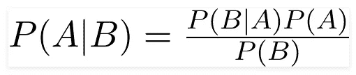
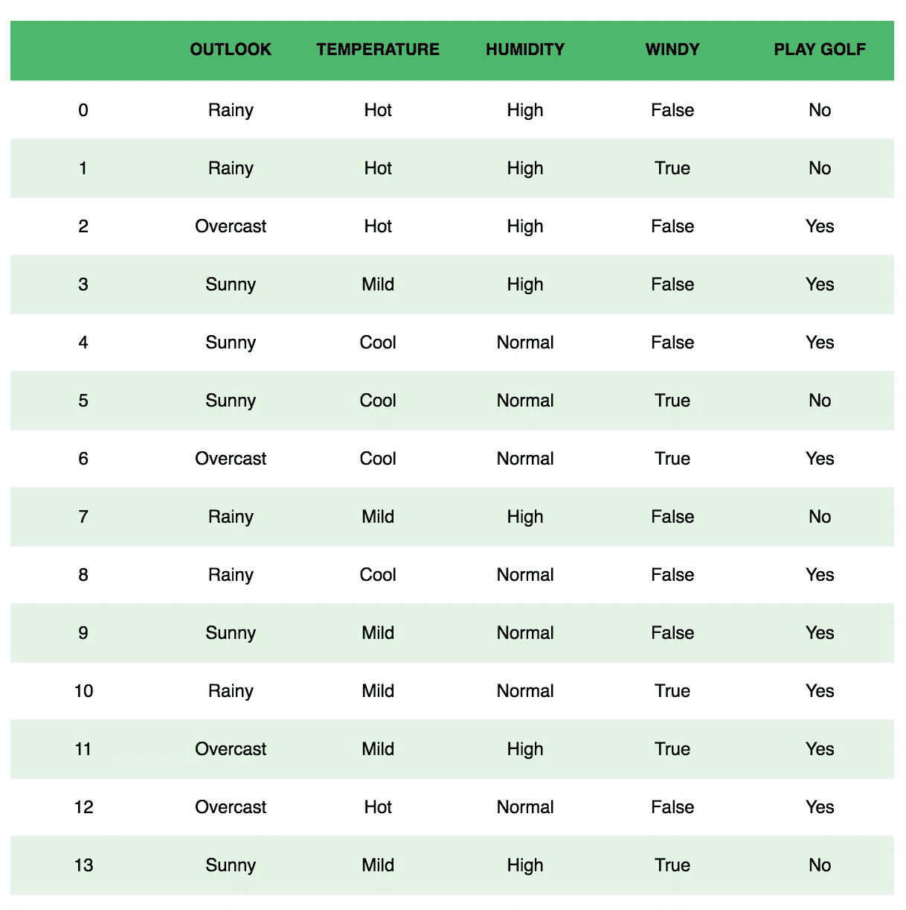
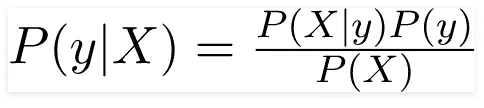
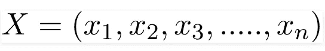
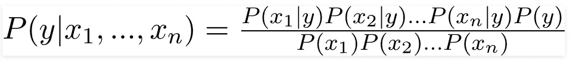
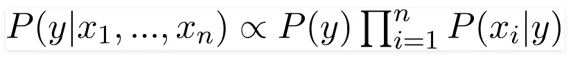
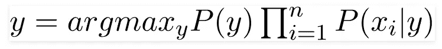
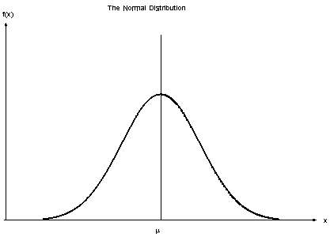
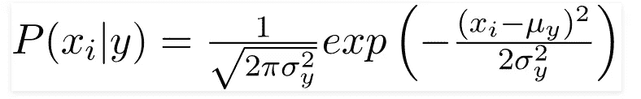

# 朴素贝叶斯分类器

> 原文：<https://towardsdatascience.com/naive-bayes-classifier-81d512f50a7c?source=collection_archive---------0----------------------->

# 什么是量词？

分类器是一种机器学习模型，用于根据某些特征区分不同的对象。

# 朴素贝叶斯分类器的原理:

朴素贝叶斯分类器是一种用于分类任务的概率机器学习模型。分类器的关键是基于贝叶斯定理。

# 贝叶斯定理:

利用贝叶斯定理，我们可以求出 **A** 发生的概率，假设 **B** 已经发生。这里， **B** 是证据， **A** 是假设。这里的假设是预测器/特征是独立的。也就是说，一个特定特征的存在不会影响另一个特征。因此它被称为天真。

# 示例:

让我们举个例子来获得一些更好的直觉。考虑打高尔夫的问题。数据集表示如下。

鉴于当天的特点，我们对当天是否适合打高尔夫球进行分类。列代表这些功能，行代表各个条目。如果我们取数据集的第一行，我们可以观察到，如果天气多雨、温度高、湿度大且没有风，则不适合打高尔夫球。我们在这里做两个假设，一个如上所述，我们认为这些预测是独立的。也就是说，温度热，不一定意味着湿度高。这里做的另一个假设是所有的预测因素对结果有相同的影响。也就是说，刮风的那一天对决定是否打高尔夫球没有更大的重要性。

根据这个例子，贝叶斯定理可以改写为:

变量 **y** 是类变量(play golf)，代表是否适合打高尔夫球，是否给定条件。变量 **X** 代表参数/特征。

**X** 给定为:

这里 x_1，x_2…x_n 代表特征，即它们可以映射到前景、温度、湿度和风力。通过替换 **X** 并用我们得到的链式法则展开，

现在，您可以通过查看数据集获得每个值，并将它们代入等式。对于数据集中的所有条目，分母不变，保持不变。因此，可以去掉分母，引入比例。

在我们的例子中，类变量( **y** )只有两个结果，是或否。可能存在分类是多元的情况。所以我们需要找到概率最大的类 **y** 。

使用上面的函数，我们可以得到类，给定预测。

# 朴素贝叶斯分类器的类型:

## 多项式朴素贝叶斯；

这主要用于文档分类问题，即文档是否属于体育、政治、技术等类别。分类器使用的特征/预测值是文档中出现的单词的频率。

## 伯努利朴素贝叶斯；

这类似于多项式朴素贝叶斯，但预测因子是布尔变量。我们用来预测类变量的参数只取值 yes 或 no，例如一个单词是否出现在文本中。

## 高斯朴素贝叶斯:

当预测值取连续值且不是离散值时，我们假设这些值是从高斯分布中采样的。

Gaussian Distribution(Normal Distribution)

由于数据集中值的显示方式发生了变化，条件概率的公式也发生了变化，

# 结论:

朴素贝叶斯算法主要用于情感分析、垃圾邮件过滤、推荐系统等。它们快速且易于实现，但是它们最大的缺点是要求预测器是独立的。在大多数实际情况下，预测器是相关的，这阻碍了分类器的性能。