# 朴素贝叶斯分类器:朴素贝叶斯的几何分析。第一部分

> 原文：<https://towardsdatascience.com/naive-bayes-classifier-a-geometric-analysis-of-the-naivete-part-1-51f462a858bb?source=collection_archive---------9----------------------->

## 当类被线性和非线性真决策边界分开时，为朴素贝叶斯预测导出封闭形式的解…

[维数灾难](https://en.wikipedia.org/wiki/Curse_of_dimensionality)是所有分类问题的祸根。什么是维度的诅咒？随着特征(维度)数量的线性增长，分类所需的训练数据量也呈指数增长。如果分类是由单个特征确定的，我们需要该特征的一系列值的先验分类数据，因此我们可以预测新数据点的类别。对于具有 100 个可能值的特征 *x* ，所需的训练数据的数量级为 O(100)。但是，如果还需要第二个特征 *y* 来确定类别，并且 *y* 具有 50 个可能值，那么我们将需要 O(5000)阶的训练数据，即在对“ *x，y”*的可能值的网格上。因此，所需数据的度量是特征空间的体积，并且随着更多特征的添加，它呈指数增长。

但这总是这么糟糕吗？我们是否可以做一些简化的假设来减少所需的数据量，同时保留所有的特性？在上面的例子中，我们说我们需要 O(5000)阶的训练度量。但是朴素贝叶斯分类器只需要 O(150)阶的测量值——即只是线性增加，而不是指数增加！这太棒了，但是我们知道没有免费的午餐，朴素贝叶斯分类器应该做一些简化(*朴素*？)假设。这就是这篇文章的目的——检查*天真*在[朴素贝叶斯分类器](https://en.wikipedia.org/wiki/Naive_Bayes_classifier)中的影响，该分类器允许它避开维数灾难。实际上，我们不希望代数分散我们对我们所追求的东西的欣赏，所以我们坚持二维 x，y 和两类 C_1 和 C _ 2 T21。

**决定边界**

决策边界是我们的二维特征空间中的一条曲线，它将两个类别*C1*和*C2*分开。在图 1 中， *y-f(x) > 0* 表示等级*C1*和 *y -f(x) < 0* 表示*C2*的区域。沿着决策边界 *y = f(x)，*并且属于任一类的概率相等。任一类的等概率是获得决策边界的准则。

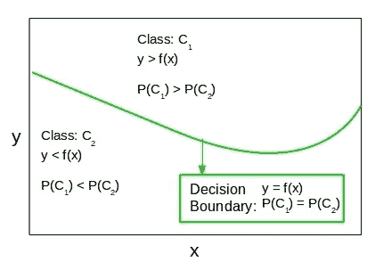

Figure 1\. *The decision boundary separates the two classes C_1 and C_2 in the feature space. For points on the decision boundary, the probability of belonging to either class is the same.*

这篇文章的目的是分析非线性对决策边界的影响，以及由不平衡的班级规模引起的相关问题。这个职位的总体轮廓如下。

1.  选择一个精确的函数形式 *y = f(x)* 作为真正的决策边界。
2.  获得由朴素贝叶斯分类器预测的决策边界的封闭形式的解
3.  分析班级规模对预测的影响
4.  当一个类压倒另一个类时，获得渐近行为
5.  当 *f(x)* 为线性和非线性时，重复 1 至 4。

帖子的内容有些学术性，因为对于真实数据，我们不知道真正的决策边界，必须处理数据噪声，并且不知道哪些特征实际上负责我们所寻求的分类等。但这里的要点是理解在理想化设置中天真假设的影响，以便我们能够更好地应用和解释真实数据的朴素贝叶斯分类器。

# 1.朴素贝叶斯分类

朴素贝叶斯分类基于关联条件概率和边际概率的[贝叶斯规则](https://en.wikipedia.org/wiki/Bayes%27_theorem)。这在文献中有很好的描述，因此我们简单地写下具有 2 个特征 *x，y* 的 2 类(*C1*和*C2*)情况的方程。

(1)

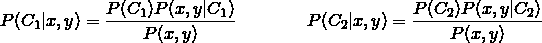

对于任何新的测量值 *x，y* ，我们将根据等式 [1](http://xplordat.com/2018/08/06/naive-bayes-classifier-a-geometric-analysis-of-the-naivete-part-1/#id3793327209) 计算 *P(C_1|x，y)* 和 *P(C_2|x，y)* ，并选择具有较大值的类。因为分母是相同的，所以计算它们的比值更容易，所以我们不需要计算 *P(x，y)* 。

*P(C_i)* 是任何测量值落入 *C_i 类的概率。*作为 *C_i* 样本的相对丰度，它很容易从训练数据中计算出来。正是 P(x，y|C_i) 的计算充满了我们谈到的数据需求的挑战。为了做到这一点，我们需要估计每一类 *C_i* 中 *x，y* 的联合概率分布，这需要在 *x，y* 值的网格上的训练数据。这就是朴素贝叶斯的*朴素*部分缓解维数灾难的地方。

# 1.1 天真的假设

如果特征 *x，y* 是不相关的，给定类别 *C_i* ，那么联合概率分布将简单地是个体概率的乘积。即

(2)

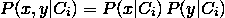

如果我们做这个假设，那么我们只需要分别估计 *P(x|C_i)* 和 *P(y|C_i)* 。并且这只需要在范围 *x* 和范围 *y* 上的训练数据，而不是在 *x，y* 值的网格上。使用方程[1](http://xplordat.com/2018/08/06/naive-bayes-classifier-a-geometric-analysis-of-the-naivete-part-1/#id3477009362)中的方程 [2](http://xplordat.com/2018/08/06/naive-bayes-classifier-a-geometric-analysis-of-the-naivete-part-1/#id3477009362) ，我们得到新的 *x，y* 测量值及其类别分配的类别概率的比率如下

(3)

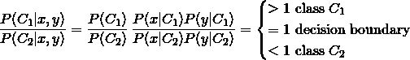

虽然不相关特征的天真假设简化了事情，但它的有效性值得商榷。例如，如果 *xy < 1* 在一个类中，那么当 *y* 较小时，找到大的 *x* 值的概率较高，当 *y* 较大时，找到大的*x*值的概率较低。事实上，在这个类中找到测量值[x=0.9，y=1.1]的概率将是 1，而对于测量值[x=0.9，y=1.2]来说，它将是 0。显然， *x* 和 *y* 的概率分布通常不会相互独立，并且对独立性的天真假设会导致新数据的错误分类。

# 1.2 推导 P(x|C_i)和 P(y|C_i)

如果我们可以获得作为 *x，y* 的函数的 *P(x|C_i)* 和 *P(y|C_i)* ，那么我们可以得到作为 *x，y* 的函数的公式 [3](http://xplordat.com/2018/08/06/naive-bayes-classifier-a-geometric-analysis-of-the-naivete-part-1/#id3874001059) 中的比值。

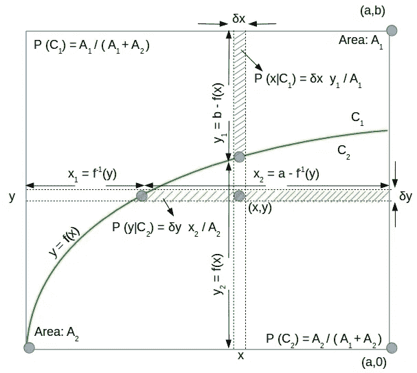

Figure 2\. *Deriving the naive bayes probabilities, given a true decision boundary y = f(x). To keep the algebra simple, the function f(x) is taken to have a simple inverse x = f^-1(y). The fractional areas of the rectangular strips in a class are indicative of the probability.*

考虑图 2，其中真实判定边界*y = f(x)*将特征空间分成两类。为了避免代数问题，我们进一步假设 *f* 是显式可逆的，因此我们可以写成 *x = f^-1(y).*一个类的先验概率与它的整体大小成正比——在这种情况下是面积。

(4)

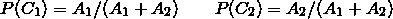

为了计算 *P(x|C_i)，*假设我们将 x 轴离散化，并在 *x* 周围选取一个宽度为δx 的小矩形条，如图 2 所示。类别 *C_i* 中的条带面积除以类别面积 A_i 将是概率 *P (x|C_i)。*同样对于概率 *P (y|C_i)*

(5)

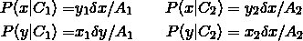

*x1*越长，*P(y | C1)*的概率就越高。同样，更大的 *y_2* 意味着更高的概率用于 *P(x|C_2)* 等等。一旦我们理解了这一点，剩下的就是简单的几何和代数了。将等式 [4](http://xplordat.com/2018/08/06/naive-bayes-classifier-a-geometric-analysis-of-the-naivete-part-1/#id3009263874) 和 [5](http://xplordat.com/2018/08/06/naive-bayes-classifier-a-geometric-analysis-of-the-naivete-part-1/#id2595860965) 与等式 [3](http://xplordat.com/2018/08/06/naive-bayes-classifier-a-geometric-analysis-of-the-naivete-part-1/#id3874001059) 中的朴素贝叶斯分类相结合，我们得到:

(6)

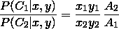

上述比率等于 1 的 *x，y* 的轨迹是朴素贝叶斯分类器预测的决策边界。

(7)

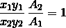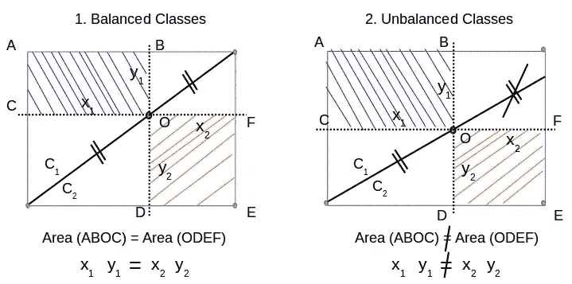

Figure 3\. *For a point on a linear decision boundary, a geometric proof that: (a) x_1 y_1 = x_2 y_2 in case of balanced classes and (b) x_1 y_1 ≠ x_2 y_2 when classes are unbalanced.*

为了直观理解等式 [7](http://xplordat.com/2018/08/06/naive-bayes-classifier-a-geometric-analysis-of-the-naivete-part-1/#id3940497998) ，考虑图 3 中具有相等/不相等班级规模的线性决策边界的情况。如图 3.1 所示，当班级规模相等时，决策边界将是对角线，对于对角线上的每一点，矩形 ABOC 的面积等于矩形 ODEF 的面积。但那不过是关于对角线上任意一点的 *x_1 y_1* 和 *x_2 y_2* 相等的陈述。因此，根据等式 [7](http://xplordat.com/2018/08/06/naive-bayes-classifier-a-geometric-analysis-of-the-naivete-part-1/#id3940497998) ，由朴素贝叶斯预测的决策边界将匹配对角线——真正的决策边界。然而，在图 3.2 中，类的大小是不一样的，并且这两个矩形的面积不必对分离边界上的每一点都相等。因此，即使在线性情况下，当类别大小不同时，我们也不能期望朴素贝叶斯产生真实的决策边界。我们将在下一节通过分析再次验证这一点。

这就完成了我们推导朴素贝叶斯预测的决策边界的一般方法。在这篇文章的剩余部分，我们为真正的决策边界选择不同的函数形式 *f(x)* ，并与我们从朴素贝叶斯得到的进行对比。

# 2.线性决策边界

我们从图 4 中的线性情况开始，其中直线 *y = qx/a* 在矩形特征空间中将两个类分开。当 *q* 等于 *b* 时，我们得到平衡类。

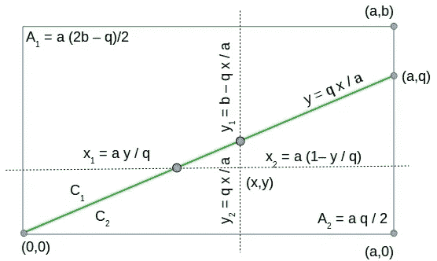

Figure 4\. *Evaluating x_1 , y_1 , x_2 and y_2 for a linear decision boundary y=qx/a*

类面积*a1，a2*和长度*x1，x2，y1，*和*y2*直接从几何图形中得出。在等式 [7](http://xplordat.com/2018/08/06/naive-bayes-classifier-a-geometric-analysis-of-the-naivete-part-1/#id3940497998) 中使用它们并进行简化，我们得到朴素贝叶斯预测的决策边界是一条双曲线。

(8)

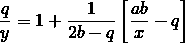

有了预测分离边界的闭合解，我们可以看看当 A_1 类的规模保持增加而 A_2 保持不变时，类规模的影响及其渐近性。这是通过增加 *b* 同时保持 *a* 和 *q* 不变来实现的。

# 2.1 均衡类。A_1 = A_2

当 *b = q* 时，类别大小将相等，并且分离边界减少到:

(9)

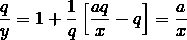

这是真正的决策界限。也就是说，当类由直线分隔并且大小相同时，朴素贝叶斯分类不会有错误。这是对图 3 中相同几何论证的严格证明。

# 2.2 不平衡的阶层。增加 a1 和常数 a2

图 5 显示了当 *b* 增加时的预测决策边界(即，我们拖动特征空间的顶部边界)，从而增加 A_1，同时保持 A_2 不变。在所有情况下，对于较小的 *x* ，朴素贝叶斯预测开始偏向于类别 *C_2* (预测的边界在真实边界之上——意味着将真实 C_1 测量分类为 C_2 的偏好),并且随着 *x* 的增加，切换到偏好类别 *C_1* 。然而，有趣的是，它们都在真实决策边界的同一点上切换。

## 2.2.1 切换点

切换点 *(x*，y*)* 是真实决策边界和预测决策边界的交点。利用方程 [8](http://xplordat.com/2018/08/06/naive-bayes-classifier-a-geometric-analysis-of-the-naivete-part-1/#id218994774) 中的 *y = qx/a* 并简化得到:

(10)

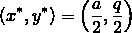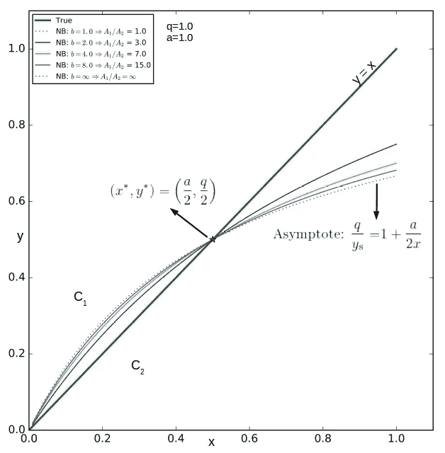

Figure 5\. *Linear decision boundary. Naive bayes classifier predicts a hyperbola as the class boundary. Only when the classes are balanced does the prediction match the prescribed boundary y = x*

该点的坐标独立于 *b，*不同曲线上的唯一变量。因此它们都与真实边界相交于同一点。

## 2.2.2 渐近边界:a1→∞

随着 *b* 增加，比率 *A_1/A_2* 增加。当 *b* 趋于无穷大时，我们得到渐近预测边界 *y_s(x)。*

(11)

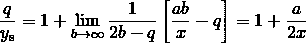

# 3.非线性决策边界

我们现在考虑图 6 中的情况，其中抛物线判决边界 *y=x^2* 将两个类别分开。

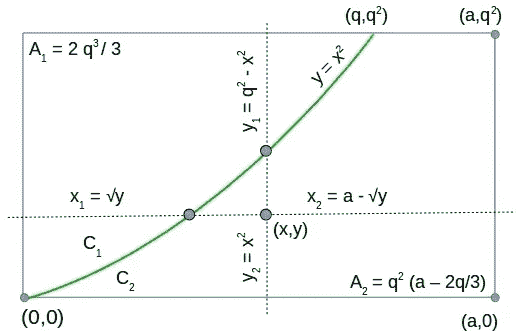

Figure 6\. *Evaluating x_1 , y_1 , x_2 and y_2 for a nonlinear decision boundary y=x²*

再次，x_1，y_1，x_2 和 y_2 作为 x，y 的函数的表达式直接来自几何。应用等式 [7](http://xplordat.com/2018/08/06/naive-bayes-classifier-a-geometric-analysis-of-the-naivete-part-1/#id3940497998) 并进行简化，我们得到 *y* 作为预测决策边界的 *x* 的四阶函数

(12)

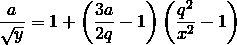

# 3.1 增加 A_2 和常数 A_1 的影响

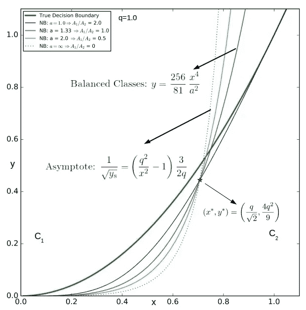

Figure 7\. *Nonlinear decision boundary. The naive bayes prediction does not match the true boundary even in the case of balanced classes.*

图 7 显示了当类大小 A_2 变化而保持 A_1 不变时，预测的决策边界与真实边界的对比。这可以简单地通过拖动特征空间的右边界来完成，即改变*为*。

这里有一些与线性情况相反的快速观察。

*   即使在平衡类的情况下(A_1/A_2 = 1 即 a = 4q/3)，预测的边界也与真实的边界不匹配。这不同于我们前面看到的线性情况。使用等式 [12](http://xplordat.com/2018/08/06/naive-bayes-classifier-a-geometric-analysis-of-the-naivete-part-1/#id1924063270) 中的 q = 3a/4，我们得到:

(13)

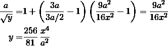

*   对于小的 *x* ，预测倾向于 *C_1* 而不是 *C_2* (在所有情况下，预测边界在真实边界以下开始)，但是对于较大的 *x* 则切换到偏好 *C_2* 。
*   当 a2 较小时，预测边界在 *x* 范围内大部分在真实边界之下。对于较大的 A_2，预测边界变得更陡，越来越早地与真实边界相交。因此，与线性情况不同，它们与真实边界相交于不同的点。
*   即使它们在不同的点上与真实边界相交，有趣的是它们都在一个点上相交。那当然可以证明。不同曲线上的唯一变量是*和*。所以我们要做的就是找到两个预测边界的交点，并证明它独立于 *a* 。考虑 a_ *1* 和 a_2 的两个边界。使用方程 [12](http://xplordat.com/2018/08/06/naive-bayes-classifier-a-geometric-analysis-of-the-naivete-part-1/#id1924063270) 在它们的交点处并简化我们得到，

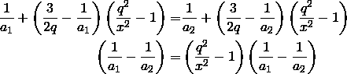

产生独立于 *a* 的交点，从而证明观察结果。

(14)

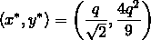

# 3.2 渐近边界:a2→∞

随着 *a* 增加，面积 *A_2* 增加。当 *a* 趋于无穷大时，我们得到渐近预测边界 *y_s(x)。*

(15)

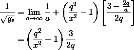

# 4.后续步骤

当真实的决策边界在具有两个特征的两个类之间已知时，我们已经导出了由朴素贝叶斯分类器预测的决策边界的封闭形式的解决方案。我们挑选了简单的线性和非线性边界，并评估了当一个类别压倒另一个类别时，类别大小及其渐近性的影响。接下来的步骤如下。

*   在总规模保持不变的情况下，获得作为班级规模比率的函数的混淆矩阵。例如，当我们在图 4 中将 q 从 0 变到 1 时，比率 *A_1/A_2* 从∞变到 0，而 *A_1 + A_2* 保持恒定在 *ab* 。在这种情况下，通过混淆矩阵测量的朴素贝叶斯分类器的性能是令人感兴趣的。
*   模拟在 [SciKit](http://aussian/%20Naive%20Bayes%20algorithm%20to%20evaluate%20the%20additional%20errors%20introduced%20by%20the%20gaussian%20approximation,) 中实现的高斯朴素贝叶斯算法，以评估高斯近似概率引入的额外误差。
*   评估朴素贝叶斯预测相对于其他竞争分类器，如逻辑回归，神经网络等…

由于这篇文章太长了，所以我将在这个系列的下一篇文章中讨论以上内容。

*原载于 2018 年 8 月 6 日*[*xplordat.com*](http://xplordat.com/2018/08/06/naive-bayes-classifier-a-geometric-analysis-of-the-naivete-part-1/)*。*