# 朴素贝叶斯分类器:第 2 部分。表征和评估

> 原文：<https://towardsdatascience.com/naive-bayes-classifier-part-2-characterization-and-evaluation-96b37f781c7c?source=collection_archive---------15----------------------->

封闭形式的解决方案是甜蜜的。不需要绞手/挥手来表达观点。给定假设，模型预测是精确的，因此我们可以很容易地评估假设的影响。并且，我们获得了评估应用于这些具有精确解的相同极限情况的替代(例如，数值)方法的方法。我们当然是在讨论之前的[文章](http://xplordat.com/2018/08/06/naive-bayes-classifier-a-geometric-analysis-of-the-naivete-part-1/)，其中我们获得了朴素贝叶斯预测决策边界的闭合形式解，而真正的决策边界是已知的线性或非线性形式。由于已经有了很好的基础，我们将认真地开始我们在前一篇文章中概述的“下一步”。如果需要的话，请回顾一下，因为我的文章往往有 2000 多字，几乎没有重复的空间。这个帖子实际上有点长，但主要是因为图表和模拟结果，所以应该不会太差。

# 1.混乱矩阵

对于我们的 2 类(*C1*和“*而不是 C1*或*C2*)和 2 特征([ *x，y】【T9])情况，一个很好的表征任何分类器性能的方法是计算下面图 1 所示的[混淆矩阵](https://en.wikipedia.org/wiki/Confusion_matrix)。真实边界和预测边界相交，并将特征空间分为四个区域。这些区域中的数据点已经被正确地(即*真*)或不正确地(即*假*)识别为属于(即*正*)或不属于*C1*(即*负*)。例如，右上角区域被标记为*假阴性*，因为预测*假阳性*将其归类为'*而非**C1 '*。其他区域的命名也是如此。*

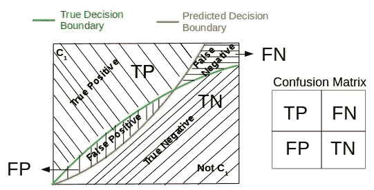

Figure 1\. Evaluating the confusion matrix in the assignment of a class *C_1* to a data point. The areas of intersection *FP* and *FN* are the key variables determining the quality of the classifier

相交面积 *FP* 和 *FN* 以及由此计算的任何度量产生对分类器有效性的重要洞察。例如，用于*C1*的高度*特定的*分类器永远不会将真正的“*not C1”*数据点放置在“*C1”*区域中。同样，如果分类器对*C1*高度敏感，它将永远不会将真正的*C1*放置在“*not C1”*区域中。分类器的整体准确度当然是正确预测的分数。所有这些导致了通常使用的[以下定义](https://en.wikipedia.org/wiki/Confusion_matrix)。

(1)

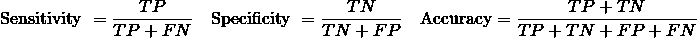

每个分类练习都会为这些指标中的每一个产生一个值。运行一系列这样的练习并从每次运行中收集这些度量，我们可以表征分类器对于该特征空间中的数据有多好。高灵敏度(小 *FN* 区)&高特异性(小 *FP* 区)自然是分类器的理想特征。

# 2.相交的区域

随着初步问题的解决，我们准备量化朴素贝叶斯分类器对于我们在[上一篇文章](http://xplordat.com/2018/08/06/naive-bayes-classifier-a-geometric-analysis-of-the-naivete-part-1/)中考虑的线性和非线性边界的表现。如下图 2 所示， *k* 的每个值在 *A_1* 和 *A_2* 之间分割特征空间，而 *A_1 + A_2* 保持不变。预测边界自然是这个参数 *k* 的函数，并且每个这样的预测边界产生一个值用于 *FN* 和 *FP* 我们感兴趣的相交区域。

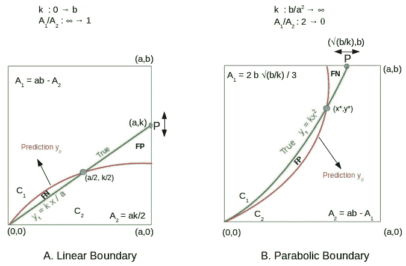

Figure 2\. As the point P moves, the feature space gets split between the classes. *FP* and *FN* are the areas of interest that meet at the intersection point of the true and predicted boundaries. (A) Point P moves vertically from 0 through *b*. The true and predicted boundaries always intersect at (*a/2, k/2*) (B) Point P moves horizontally from 0 through *a* . The intersection point *x** for the true and predicted boundaries is a root of the quadratic given in Equation 6.

在非线性抛物线边界的情况下，我们用 *y = kx^2* 而不是 *y = x^2* 来工作，就像我们在之前的文章中那样。导出更新的决策边界是前面详述的相同几何过程的直接应用。为了便于参考，我们简单地写下线性和抛物线情况下的结果。 *y_p* 代表下面的预测边界，我们用 *y_t* 代表真实边界。

(2)

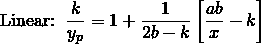

(3)

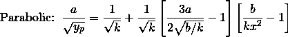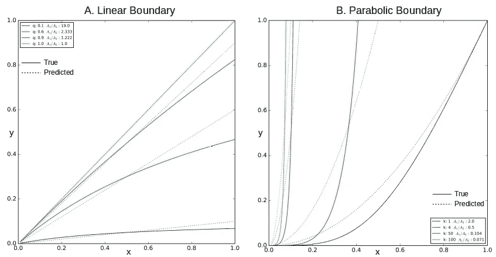

Figure 3\. Varying *k* is a means to change the relative class sizes while holding the total size constant. In all the cases above *a* = *b* = 1.0, so *A_1 + A_2 = 1.0*. When one of the class sizes goes to zero i.e. *A_1/A_2 → ∞* for the linear case, and *A_1/A_2 → 0* for the parabolic case we expect better predictions in either case as indicated by vanishing *FP* and *FN*. (A) For linear case, naive bayes prediction is exact, i.e *FP* = *FN* = 0 for *A_1/A_2 = 1* (B) For the nonlinear case has *FN* = 0, but *FP* is at maximum when *A_1/A_2* = 2.

图 3 说明了 *FP* 和 *FN* 之间的动态相互作用和权衡，因为 *k* 在任一情况下都是变化的。交点 *FP* 和 *FN* 的面积就是我们所追求的，因为我们有 *y_p* 和 *y_t* 的显式方程，所以可以直接积分。

# 2.1 线性情况下的 FP 和 FN

在线性情况下，我们知道真实边界和预测边界相交于点 *(a/2，k/2)* 。

(4)

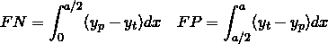

从方程 [2](http://xplordat.com/2018/08/25/naive-bayes-classifier-part-2-characterization-and-evaluation/#id745239542) 中代入 *y_t = kx/a* 和 *y_p* ，积分简化得到:

(5)

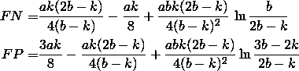

# 抛物线情况下的 2.2 FP 和 FN

这里的交点是方程 *y_p=k x^2* 的解，其中 *y_p* 由方程 [3](http://xplordat.com/2018/08/25/naive-bayes-classifier-part-2-characterization-and-evaluation/#id2342212039) 给出。不幸的是，没有显式的解决方案，但整个事情简化为一个二次，需要解决一个有意义的根。

(6)

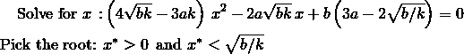

参照图 2B，面积 *FP* 和 *FN* 的计算公式如下

(7)

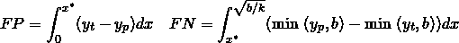

被积函数和极限是确切已知的，因此可以使用如下代码片段对积分进行精确的数值计算:

```
import numpy as np from scipy.integrate
import quaddef integrand (x, k):
   yt = min (k * x * x, b)
   temp = 1.0/k**0.5 + (1.0/k**0.5) * (3*a/(2*(b/k)**0.5) — 1.0) *   (b/(k*x*x) — 1.0)
   yp = min ((a/temp)**2, b)
   return abs(yt — yp)def findIntersectionX (k):
   c2 = 4 * (b*k)**0.5 - 3*a*k
   c1 = -2 * a * (b*k)**0.5
   c0 = b * (3 * a - 2 * (b/k)**0.5) x1 = (-c1 + (c1**2 - 4 * c2 * c0)**0.5) / (2*c2)
   x2 = (-c1 - (c1**2 - 4 * c2 * c0)**0.5) / (2*c2) if ( (x1 >= xmin) and (x1 <= xmax) ):
      return x1
   elif ( (x2 >= xmin) and (x2 <= xmax) ):
      return x2
   else:
      print ("ERROR!") # should not happen!a = 1.0
b = 1.0
k = 10.0
xmin = 0.0
xmax = (b/k)**0.5xIntersection = findIntersectionX (k)
fp_area = quad(integrand, xmin, xIntersection, args=(k),epsabs=1.0e-8)
fn_area = quad(integrand, xIntersection, xmax, args=(k), epsabs=1.0e-8)
```

# 3.特征

有了获取任何 *k* 的 *FP* 和 *FN* 的方法，我们就可以对分类器的灵敏度、特异性等进行评估了……我们在第 1 节中讨论过了。 *TP* 和 *TN* 直接从几何图形中得出。

(8)

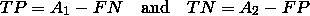

图 4 示出了作为 *A_1/A_2* 的函数的相交面积及其获得的度量。 *FP* 和 *FN* 面积是整体面积的一小部分，精度极好。毫无疑问，这两种情况下的度量都很好，即使线性情况似乎有优势。由于导出解的设计，这些结果中的*a1/a2*的范围在两种情况下都有所限制(抛物线情况下 *0 → 2* ，线性情况下 *1 → ∞* )。

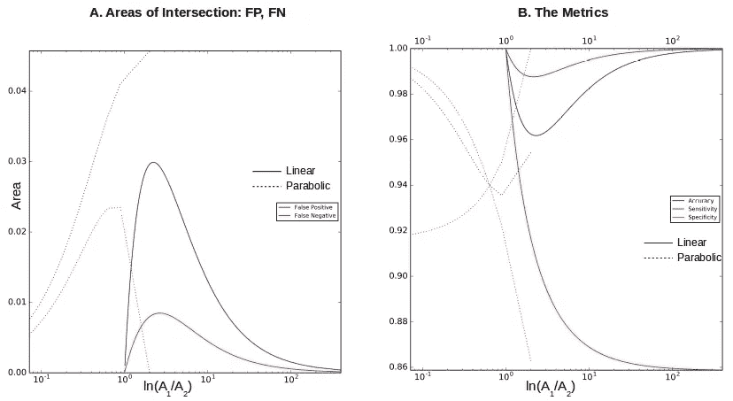

Figure 4\. In all the cases above *a = b = 1.0*, so *A_1 + A_2 = 1.0*. (A) Both the intersection areas *FP, FN* go to zero for the linear case when *A_1/A_2 = 1* and when *A_1/A_2 → ∞* as expected. Only *FN* is zero in the parabolic case when *A_1/A_2 = 2* confirming our assessment from Figure 3\. (B) The naive bayes classifier is more sensitive than specific in either case.

在图 4B 中观察到的敏感性、特异性和准确性通过一个点并不是偶然的。当灵敏度和特异性相等时，

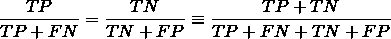

其中最后一个表达式是精度的定义。

# 4.用 SciKit 进行数值模拟

SciKit 拥有优秀的算法实现，包括用于分类的朴素贝叶斯。[高斯朴素贝叶斯](http://scikit-learn.org/stable/modules/naive_bayes.html#gaussian-naive-bayes)从训练数据中逼近高斯分布，以估计新数据点 *x，y* 的 *P(x|C_1)* 和 *P(y|C_1)* 。当这个新的数据点 *x，y* 远离决策边界时，这是好的，但是否则显然会有一些误差。这种误差对分类的影响是什么，这是我们试图通过一些数值模拟来探索的问题。此外，我们应用了两种竞争分类技术，即[逻辑回归](http://scikit-learn.org/stable/modules/generated/sklearn.linear_model.LogisticRegression.html#sklearn.linear_model.LogisticRegression)和[MLP 分类器](http://scikit-learn.org/stable/modules/generated/sklearn.neural_network.MLPClassifier.html#sklearn.neural_network.MLPClassifier)，同样在 SciKit 中实现。对这些技术中的假设进行分析是另一篇文章的主题。在这里我们简单地使用它们——sci kit 使尝试变得非常容易。

生成训练和测试数据轻而易举，因为我们知道确切的决策界限。

```
from sklearn.naive_bayes import GaussianNB
from sklearn.linear_model import LogisticRegression
from sklearn.neural_network import MLPClassifier
from sklearn.metrics import *
import numpy as nptrain = np.array(np.loadtxt(open('./train.csv', "rb"),              delimiter=",",skiprows=1))
trainX = train[:,0:2] # x, y locations
trainY = train[:,2] # Class label 1 (i.e. C1) or 0 (i.e. Not C1)
test = np.array(np.loadtxt(open('./test.csv', "rb"), delimiter=",",skiprows=1))
testX = test[:,0:2]
testY = test[:,2]gnb = GaussianNB()
lr = LogisticRegression()
mlp = MLPClassifier(hidden_layer_sizes=(4,))stats = []
for id, clf, name in [(0,lr, 'lr'),(1,gnb, 'gnb'),(2,mlp, 'mlp')]:
    clf.fit(trainX, trainY)
    predictions = clf.predict (testX) sk_tn, sk_fp, sk_fn, sk_tp = confusion_matrix (testY, predictions).ravel()
    sk_accuracy = accuracy_score(testY, predictions)
    sk_precision = precision_score(testY, predictions)
    sk_sensitivity = recall_score(testY, predictions)
    sk_specificity = sk_tn / (sk_tn + sk_fp)
```

我们对三个分类器的大部分参数使用默认值。默认情况下，MLPClassifier 使用 100 个神经元和一个隐藏层。一个隐藏层很好，但是考虑到我们只有 2 个输入神经元(一个用于 *x* ，另一个用于 *y* ),使用 100 个隐藏神经元是大材小用。我们选了 4 个，我们可能会做得更少。在训练模型之后，我们得到混淆矩阵。当然，所有其他的指标都可以通过计算得出。

# 4.1 sci kit 中高斯近似的误差

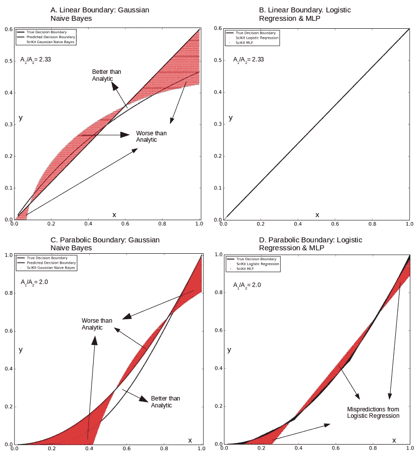

Figure 5\. In all the cases above *a = b = 1.0* so *A_1 + A_2 = 1.0*. MLP uses a single hidden layer with 4 neurons. (A) & ( C ) The mispredictions from gaussian naive bayes overlap and extend beyond the analytic results (B) Both logistic regression and MLP have essentially no mispredictions in the linear case (D) Logistic regression (in red) does worse than MLP for the nonlinear case.

图 5A 和 5C 显示了 SciKit 的高斯朴素贝叶斯模拟对于线性情况的结果，其中 *k = 0.6* (即 *A_1/A_2 = 2.33* )。红色的预测失误区域比用分析朴素贝叶斯预测获得的预测失误区域更大。众所周知，逻辑回归是一种线性分类器，因此预计图 5B 中的预测接近完美。在所有情况下，MLP 当然是最好的，即使在一个隐藏层中只有 4 个神经元。但是我们将在后面看到，这种快乐的情景不适用于具有更严重非线性的边界。

# 4.2 分类指标

图 6 比较了三个分类器在多个仿真中的性能，其中比率 *A_1/A_2* 在保持 *A_1* + *A_2* 为 1 的同时发生变化。这非常类似于图 4，其中我们比较了分析性朴素贝叶斯预测和事实。一些简单的观察如下。

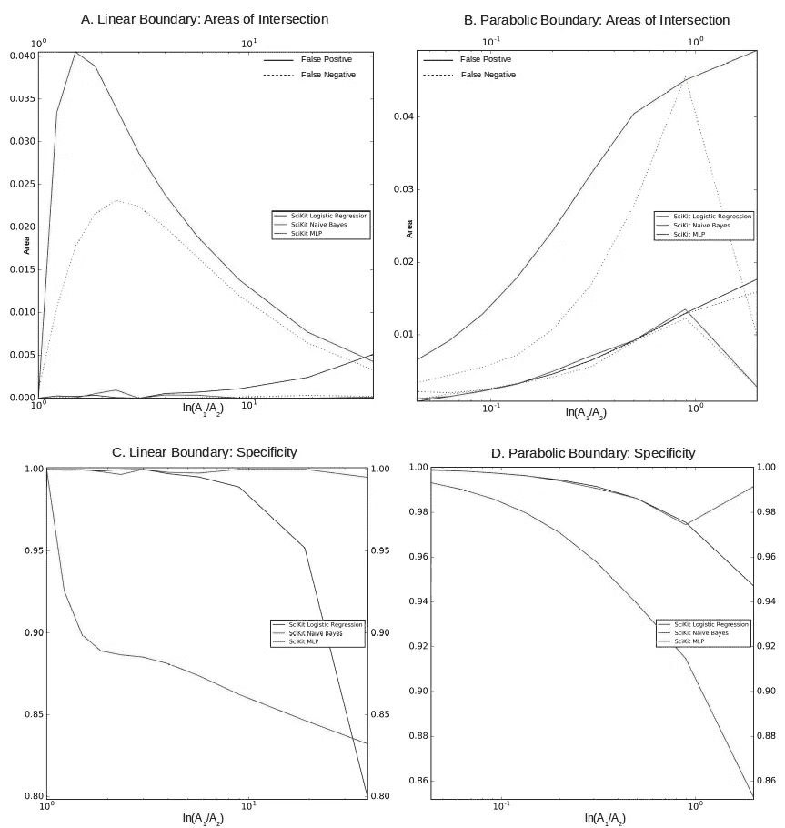

Figure 6\. In all the cases above *a = b = 1.0*, so *A_1 + A_2 = 1.0*. All three classifiers can be considered quite good even while MLP does beat out the rest in general.

*   朴素贝叶斯具有最大的误差区域( *FP* 和 *FN* )。即使在线性情况下，逻辑回归的 FP 也随着*a1/a2*增加。鉴于逻辑回归是一个线性分类器，这将需要一些进一步的分析，为什么。
*   就错误表征的总面积(即 *FP + FN* )而言，我们看到 MLP、逻辑回归和朴素贝叶斯的优秀程度依次递减。
*   根据需求，人们可以选择在该标准方面表现优异的分类器。例如，MLP 在这一点上非常突出。

# 5.神经网络更擅长分类吗？

从第 3 节和第 4 节的结果来看，神经网络似乎更善于对具有线性或非线性分离边界的数据进行分类。但是这样的概括可能是错误的。当我们知道真相时，就像这里的情况一样，我们可以对隐藏层的数量、内部神经元的数量、激活函数等进行调整，以获得与真相更好的匹配。但这一结果可能不具有超出这一具体实践范围的普遍有效性。为了在实践中看到这一点，让我们考虑正弦波作为分离边界的情况，并尝试用同样的三种方案进行分类。

(9)

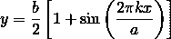

随着 *k* 的增加，特征空间被分割成越来越多的不连续区域，分类变得更加困难。使用 SciKit 获得分类结果的机制与第 4 节中的相同，因此我们直接查看结果。

图 7A 绘制了当不连续区域的数量通过改变 *k* 而变化时，相交区域的大小。很明显，当我们使用单一隐藏层时，MLP 对任何 k 都没有好处。MLP。 *FP* 和 *FP* 加起来大约占总面积的 20-30 %,所以有很多数据会被错误分类。这反映在图 7B 中较小的特异性值中。对于 6 个隐藏层，MLP 对于所有的 *k* 值具有小得多的误差区域，从而具有更好的特异性，如图 7B 所示。

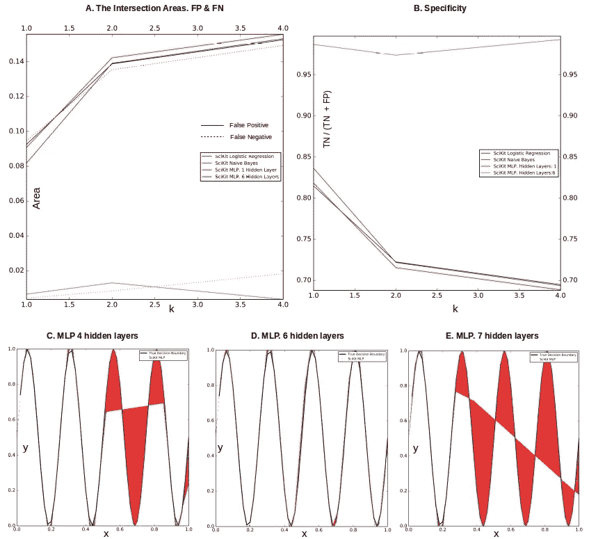

Figure 7\. The upshot from the results here is that MLP can do better but careful experimentation is required before generalizing the applicability of the model. When *k = 4*, in Equation 9, there would be 4 non-contiguous zones for the two classes. (A) MLP with a single hidden layer yields no improvement over naive bayes or logistic regression for any k. Six hidden layers with ten neurons each yields better classification but there could be other combinations that can do equally well or better. (B) Much better specificity with 6 hidden layers for all values of k. (C — E): Increasing the number of layers is not guaranteed to improve performance for MLP. It starts to get better as we add more hidden layers but worsens after 6 layers.

图 7C-7E 显示了当 *k = 4* 时所有情况下获得的误差区域。误差区域随着隐藏层的增加而减少，产生 6 层的最佳分类。但不幸的是，7 层的效果更差，有点出乎意料…所谓的炼金术在起作用。显然，这里还有更多的事情需要更深入的分析。

# 6.后续步骤

至此，我们结束了这篇有点长但简单明了的帖子。对于线性和抛物线分离边界，我们已经表明，这里测试的所有三个分类器都很好，MLP 挤掉了逻辑回归和朴素贝叶斯。MLP 的出色表现很有趣，但目前还不清楚它究竟如何做得更好。对于更严重的非线性，MLP 可能工作得很好，但是可能需要仔细的实验来概括所获得的结果。尽管如此，这里的结果是足够令人鼓舞的，我们希望在未来的帖子中尝试使用神经网络来解决文本分类问题。

*原载于 2018 年 8 月 25 日*[*【xplordat.com】*](http://xplordat.com/2018/08/25/naive-bayes-classifier-part-2-characterization-and-evaluation/)*。*