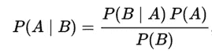
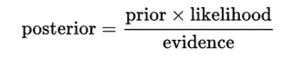
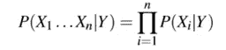

# 机器学习中的朴素贝叶斯

> 原文：<https://towardsdatascience.com/naive-bayes-in-machine-learning-f49cc8f831b4?source=collection_archive---------1----------------------->

贝叶斯定理在概率论和统计学中有许多用途。你有极小的可能从未听说过这个定理。原来这个定理已经找到了进入机器学习世界的方法，形成了一个高度修饰的算法。在本文中，我们将学习所有关于朴素贝叶斯算法的知识，以及它在机器学习中用于不同目的的变体。

你可能已经猜到了，这需要我们从概率的角度来看待事物。就像在机器学习中，我们有属性、反应变量和预测或分类。使用该算法，我们将处理数据集中变量的概率分布，并在给定新实例的属性的情况下，预测响应变量属于特定值的概率。让我们从回顾贝叶斯定理开始。

## 贝叶斯定理

这使我们能够根据与前一事件相关的任何事件的先验知识来检查事件的概率。因此，举例来说，如果我们知道房子周围的设施，与不知道房子的位置相比，我们可以更好地评估房子价格高的可能性。贝叶斯定理就是这么做的。

Image taken from Wikipedia

上面的等式给出了贝叶斯定理的基本表示。这里 A 和 B 是两个事件,

***P(A|B):假设 B 已经发生，事件 A 发生的条件概率。这也被称为后验概率。***

***P(A)和 P(B):A 和 B 互不考虑的概率。***

***P(B|A):假设 A 已经发生，事件 B 发生的条件概率。***

现在，让我们看看这如何很好地适应机器学习的目的。

以一个简单的机器学习问题为例，我们需要从一组给定的属性(在训练示例中)中学习我们的模型，然后形成一个假设或与一个响应变量的关系。然后，给定新实例的属性，我们使用这个关系来预测响应。*使用贝叶斯定理，在给定一组新属性的情况下，可以构建一个预测响应变量属于某类的概率的学习器。*

再次考虑前面的等式。现在，假设 A 是响应变量，B 是输入属性。所以根据等式，我们有

**P(A|B)** :给定输入属性，响应变量属于特定值的条件概率。**这也被称为后验概率。**

**P(A)** : **响应变量的先验概率。**

P(B):训练数据或证据的概率。

P(B|A):这就是训练数据的似然性。

因此，上述等式可以改写为

Image taken from Wikipedia

让我们来看一个问题，其中属性的数量等于 n，响应是一个布尔值，即它可以是两个类中的一个。此外，属性是分类的(我们的例子中有两个类别)。现在，为了训练分类器，我们需要为实例和响应空间中的所有值计算 P(B|A)。 ***这意味着，我们将需要计算 2*(2^n -1)，用于学习这个模型的参数。在大多数实际的学习领域，这显然是不现实的。例如，如果有 30 个布尔属性，那么我们将需要估计超过 30 亿个参数。***

## 朴素贝叶斯算法

为了实用，需要降低上述贝叶斯分类器的复杂性。 ***朴素贝叶斯算法通过对训练数据集做出条件独立性的假设来做到这一点。这大大降低了上述问题的复杂性，只有 2n。***

***条件独立性假设说明，给定随机变量 X，Y，Z，我们说 X 是条件独立于 Y 给定 Z 的，当且仅当支配 X 的概率分布独立于 Y 给定 Z 的值***

换句话说，给定 *Z* ，X 和 Y 是有条件独立的当且仅当，给定 *Z* 发生的知识，关于 *X* 是否发生的知识不提供关于 *Y* 发生的可能性的信息，并且关于 *Y* 是否发生的知识不提供关于 *X* 发生的可能性的信息。

> 这种假设使得贝叶斯算法显得幼稚。

给定 n 个不同的属性值，可能性现在可以写成

这里，X 代表属性或特征，Y 是响应变量。现在，P(X|Y)等于给定 Y 的每个属性 X 的概率分布的乘积。

## 最大化后验概率

我们感兴趣的是找到后验概率或 P(Y|X)。现在，对于 Y 的多个值，我们需要计算每个值的表达式。

给定一个新的实例 Xnew，我们需要计算 Y 取任何给定值的概率，给定 Xnew 的观察属性值，给定从训练数据估计的分布 P(Y)和 P(X|Y)。

那么，我们如何预测响应变量的类别，基于我们得到的 P(Y|X)的不同值。我们简单地取这些值中最可能的或最大的。因此，这个过程也被称为最大化后验概率。

## 最大化可能性

***如果我们假设响应变量是均匀分布的*** ，也就是说它同样有可能得到任何响应，那么我们可以进一步简化算法。在这种假设下，先验或 P(Y)变成一个常数值，即 1/响应的类别。

***由于，先验和证据现在都独立于响应变量，这些可以从方程中去掉。因此，最大化后验概率就归结为最大化似然问题。***

## 特征分布

如上所述，我们需要从训练集中估计响应变量的分布，或者假设均匀分布。类似地， ***为了估计特征分布的参数，必须假设分布或从训练集*** 生成特征的非参数模型。这种假设被称为事件模型。这些假设的变化产生了用于不同目的的不同算法。**对于连续分布，高斯朴素贝叶斯是首选算法。** **为离散特征，多项式和伯努利分布为流行**。对这些变化的详细讨论超出了本文的范围。

朴素贝叶斯分类器在复杂的情况下工作得非常好，尽管有简化的假设和天真。 ***这些分类器的优点在于，它们需要少量的训练数据来估计分类所需的参数。*** ***这是文本分类的算法选择。*** 这是朴素贝叶斯分类器背后的基本思想，你需要开始实验算法。

如果你喜欢这篇文章，一定要为下面的这篇文章鼓掌以示支持，如果你有任何问题，请留言，我会尽力回答。

为了更加了解机器学习的世界，**跟我来**。这是最好的办法，等我多写点这样的文章就知道了。

也可以在 [**Twitter**](https://twitter.com/Prashant_1722) ， [**直接发邮件给我**](mailto:pr.span24@gmail.com) 或者 [**在 linkedin**](https://www.linkedin.com/in/prashantgupta17/) 上找我。我很乐意收到你的来信。

乡亲们，祝你们有美好的一天:)