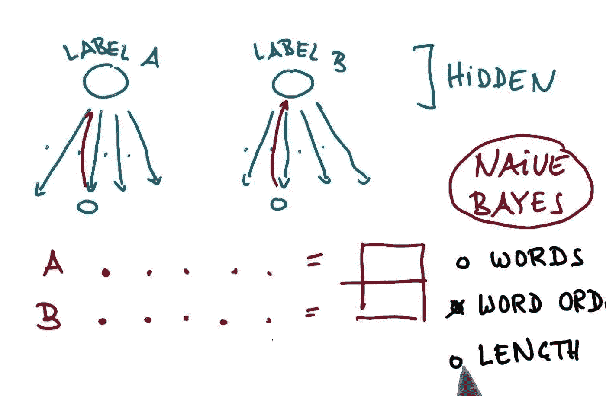
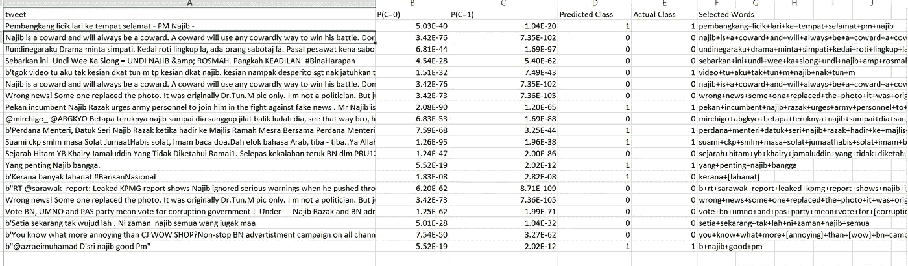

# 朴素贝叶斯推文极性预测马来西亚第 14 届大选

> 原文：<https://towardsdatascience.com/naive-bayes-tweet-polarity-predictor-on-malaysias-14th-general-election-3a3679094b5e?source=collection_archive---------12----------------------->

## 马来西亚最具标志性选举的初级数据科学任务

当我第一次在 Udacity 上了解朴素贝叶斯分类器时，我想到了这个迷你项目。NB 上有很多在线教程，但我不知道他们为什么主要做垃圾邮件分类(比如，10 个博客中有 9 个都在写 NB 垃圾邮件过滤)。

那时，我的祖国马来西亚正在迎来她历史上最重要的选举，所以我想出了这个主意，说——我们为什么不在选举前做一个推特分析，使用 NB 作为极性预测器？

由于其简单性，NB 在文本分类和情感分析中是众所周知的算法，但是对于 NLP 上下文中的 NB 来说，最大的缺点是它只对单词的出现感兴趣，而忽略了单词之间的相关性(因此得名“naive”)。因此，通过使用 NB，我们只能从“词汇袋”的角度来看待我们的上下文，考虑*发生*超过*相关性*。

# NB 在做什么？

简单来说，我想把 NB 解释为一个“向前-向后”的过程。

1.  “向前”的过程——**给定这句话在 *C1* 类中，一个单词 *w1* 出现的次数是多少？**
2.  “逆向”过程— **给定一个单词 *w1* 包含在句子中，这个句子在 *C1* 类中的概率是多少？**

Naive-Bayes tutorial on Udacity’s course.

这就是为什么出现在 NB 中很重要——某个类中某个单词出现的次数越多，它在我们进行预测时的影响就越大。

Udacity 的[本课程](https://www.udacity.com/course/intro-to-machine-learning--ud120)中的 NB 教程给出了关于 NB 的简短、简明、清晰的解释。

# 收集推文

首先，我们需要准备我们的原材料——在这种情况下，我们自己收集 tweets。所以我有一个用于抓取推文的 [twitter_scraper.py](https://github.com/gudgud96/polarity-prediction-msia-ge14/blob/master/twitter_scraper.py) 脚本。

我使用 [tweepy](http://www.tweepy.org/) 进行抓取部分，所以需要一个 API 密匙进行授权和设置。在这个项目中，我只是收集了与我最亲爱的总理(哦，对不起，现在是前总理)相关的推文，所以极性分析主要针对我们亲爱的前总理。

你还需要一个听众来倾听收集到的推文流，并决定你想要如何处理它们。在我的例子中，我获取 tweet 并将其传递给 [TextBlob](http://textblob.readthedocs.io/en/dev/) 进行极性和主观性评分，并将其写入一个. csv 文件。

最后，把你的听众连接到信息流上，让它为你抓取推文！一旦你收集了足够多的推文，简单地停止这个过程(我只收集了 300 条推文，哈哈)。

经验教训:推文主要是马来语，极性得分只是做得不好。所以最后我决定自己在训练和测试数据上手动标注每条推文的类别——这就是为什么我只收集了 300 条推文。

# 构建 NB 模型

在进入测试部分之前，我构建了一些东西:

1.  字典——在抓取的推文中出现的所有单词。我只是使用 TextBlob 来标记我的每条 tweet，并收集它们。
2.  频率表——统计每个单词在给定类别中的出现次数，w *i* 。用每个类别中出现的次数除以单词 w *i* 的总出现次数，我们得到**先验概率**——给定一个单词，它在某个类别中出现的概率。或者，P(C|w *i* )。

我们在数据集中进行了预计算，我们知道:

> *P(C=0) = 182/300 = 0.6067*
> 
> *P(C=1) = 118/300 = 0.3933*

对于 tweet 中的每个单词，从表中检索其频率，并在列表中附加每个类别中每个单词的先验概率:

取所有先验概率的乘积(numpy 在这里通过 *prod()* 方法做得很好)。你得到两个概率， *p0* 和 *p1* 。

将 *pk* 乘以 P(C=k)就得到**后验概率**。比较它们，较高的概率决定了推文的类别。

对每条推文重复这个过程，你就可以使用 NB 分类器预测推文的极性了！

# 调查的结果

Results for my test set

我隔离了 20 条推文作为测试集，NB 分类器达到了 **90%的准确率** (18/20 正确)。

让我们看看分类器犯了哪两条推文的错误。

> *tgok video tu aku tak kesian dkat tun m TP kesian dkat Najib。kesian nampak desperito Sgt nak jatuhkan tun m .*

看着视频，我不同情敦·马哈蒂尔，但我同情纳吉布，看到他如此不顾一切地想扳倒敦·马哈蒂尔。

对于理解上下文的我们来说，这条推文很明显属于 0 类，即反纳吉布类，但我们的分类器却相反。

让我们看看哪些词决定了这条推文在分类器中的类别:

> *视频+ tu + aku + tak + tun + m +纳吉+ nak + tun + m*

显然，术语“Tun M”应该组合在一起而不是分开，因为分开它可能传达不同的结果。此外，tweet 中决定的最重要的词应该是“kesian”(怜悯)，我们在决定词中没有看到这个词。

对于我们失败的另一条推文:

> *国民阵线*

对我们来说，这应该属于支持纳吉布的阶层，因为纳吉布的政党国民阵线的标签。然而，在我们的实现中，hashtags 是被清理的，所以在这里要学习的另一课是选择哪些内容要清理，哪些不要清理。

单词“lahanat”(诅咒的一个粗鲁的单词)是我们的分类器将此归类为反纳吉类的主要原因。然而，我将得出结论，这条推文很难分类，因为我们只有两个有意义的词，每个代表一个类别，我们没有任何额外的信息。

# 结论

总的来说，我应该说 NB 分类器仍然做得相当好，前提是我们只有 300 条人工注释的训练推文。

当然，还有很大的改进空间——首先是**增加训练集**的大小，但是我现在想不出这个领域有任何其他方法可以自动化注释过程。

令人震惊的是，在选举前，大多数推文都是反纳吉布的。毫无疑问，我们一直认为马来社群仍然会支持纳吉和国阵，但事实证明，推特上的马来网民告诉我们一个不同的故事。

我要说的是，这是我工作和学习的一个有趣而简单的迷你项目，它与我和我的祖国非常相关。此外，写这篇文章有助于澄清我所学到的 NB 的概念，并迫使我用简单的语言来表达它们，就像[费曼技巧](https://mattyford.com/blog/2014/1/23/the-feynman-technique-model)中建议的那样。所以，让我们期待更多的到来！

对代码感兴趣？通过我的 [GitHub 回购](https://github.com/gudgud96/polarity-prediction-msia-ge14/)结账。