# 使用具有交互式代码的标量投影的朴素分类

> 原文：<https://towardsdatascience.com/naive-classification-using-scalar-projection-with-interactive-code-298279afb11f?source=collection_archive---------8----------------------->

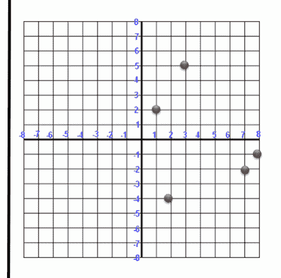

GIF from this [website](https://giphy.com/gifs/vertical-ScGvGz8atuXgk)

今天，我想用线性代数中的一个简单概念来进行非常简单的分类。

> **请注意，这篇帖子是在对线性代数有更深入了解的同时，给我自己的。**

**点积**

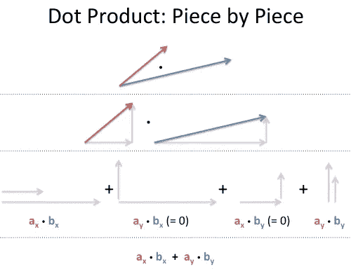

Image from this [website](https://betterexplained.com/articles/vector-calculus-understanding-the-dot-product/)

[这个网站](https://betterexplained.com/articles/vector-calculus-understanding-the-dot-product/)做得非常好，详细描述了什么是点积。如上所述，我把它理解为向量之间每个分量的乘积的总和，相对于它们的方向。因此，如果向量彼此垂直(正交)。乘法是零，数学上的理解应该是余弦法则，但我简单的理解为不同的方向。

**标量/矢量投影**

Video from [calculuscoaches](https://www.youtube.com/channel/UCd2SfkpYdCcZb4BKTpMz-CQ)

现在，如果点积测量的是每个矢量分量的大小相乘值的总和。我们可以用这个值除以我们想要投影的向量的长度。这个词可以叫做标量投影，我知道我在解释这个东西时做得很糟糕，所以这是另一个视频。

Video from [george soilis](https://www.youtube.com/channel/UC6ZtR6ukKMKXV91GiU9L3OA)

**对生成数据的分类**

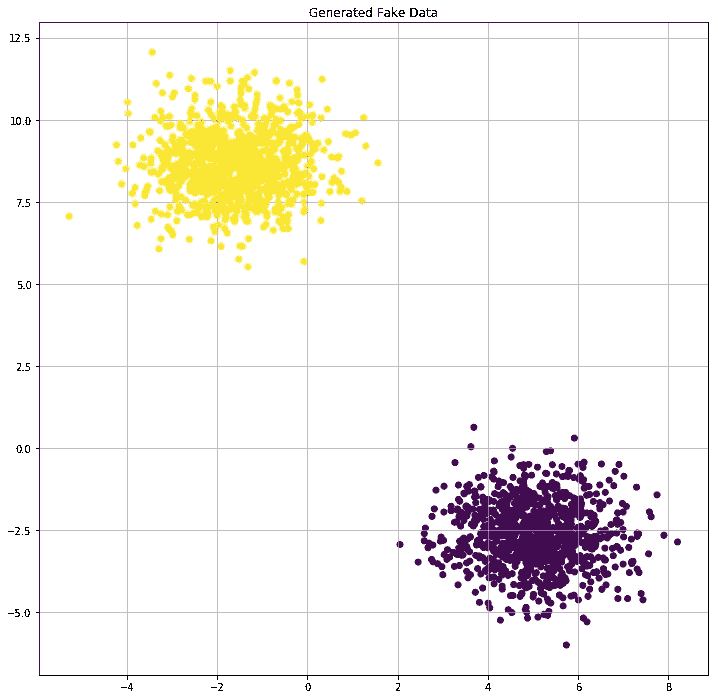

现在让我们把它带到现场，如上所示，让我们想象我们有两个数据点。第一个在左上角，第二个在右下角。现在让我们插入一个新的向量(显示为数据点)到平面中。

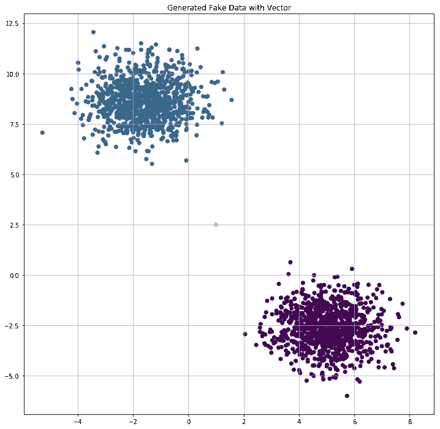

现在我们可以观察到两件事情，1)在平面的中心有一个新的数据点，2)左上角的斑点改变了颜色。我们接下来要做的事情非常简单。我们将使用我们拥有的每个数据点对中间的黄色点执行标量投影，根据得到的标量，我们将把数据分成两组。

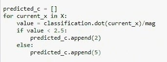

如上所示，我们设置的阈值是 2.5

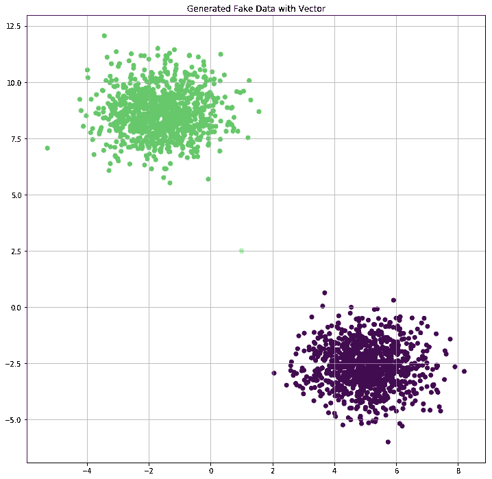

有了清晰分离的数据点，我们可以看到，即使“仔细”选择数据点，我们也可以达到很高的精度。但是让我们看看更多的东西，让我们看看我们在哪里划定了界限。

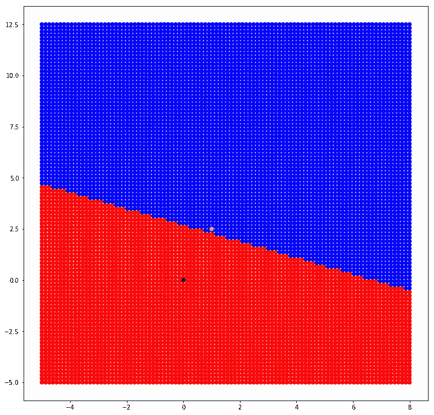

**黄点** →选择的分类向量
**黑点** →坐标(0，0)的基向量

如上所述，我们可以看到通过给定平面的线性线切割，现在让我们看看当我们设置阈值为 0 时的结果。

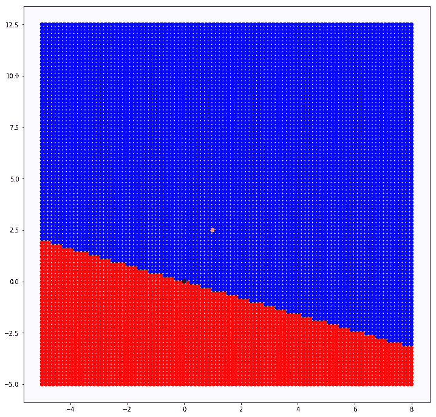

当我们将阈值设置为零时，我们可以观察到类似的模式。

**真实数据分类**

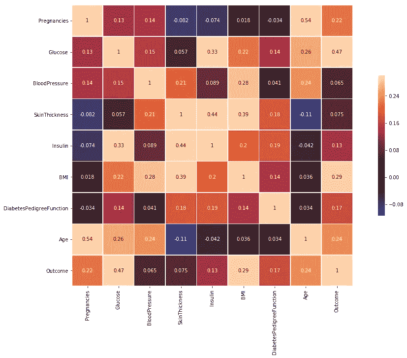

现在让我们使用[皮马印第安人糖尿病数据库](https://www.kaggle.com/uciml/pima-indians-diabetes-database)的数据，当我们绘制属性之间的相关矩阵时。我们可以观察如上所述创建的矩阵。我们将使用两个最高的属性，即葡萄糖和身体质量指数。

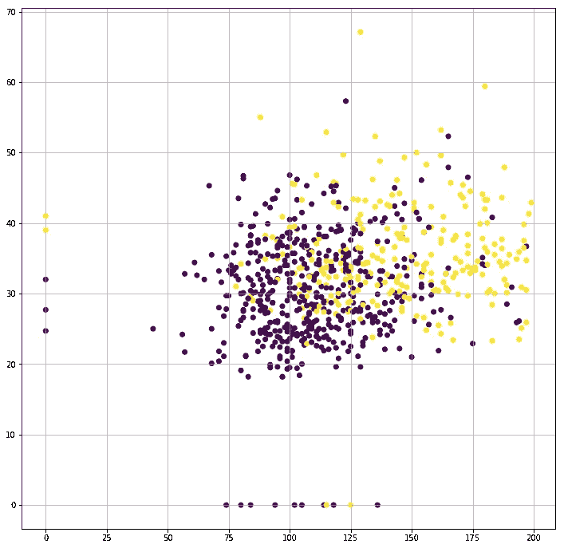

当绘制在 2D 平面上时，我们可以观察到类似上面的东西。现在让我们插入分类向量。

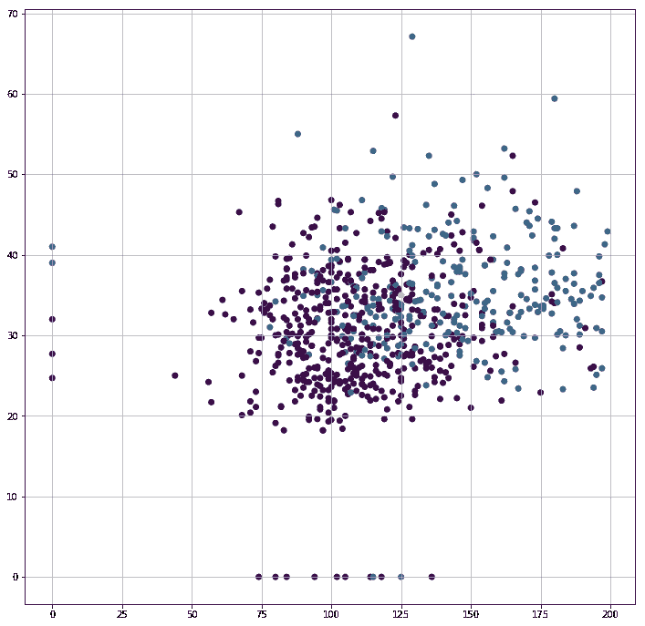

同样，我们可以观察到其中一个斑点的颜色变化以及插入的黄点。

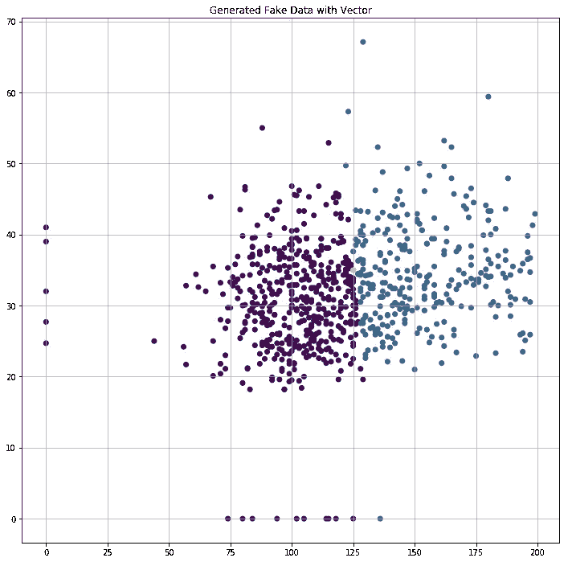

最后，对我们的标量阈值进行较小的调整，我们可以得到如上所示的结果。我们已经知道，对每个数据点进行分类是一项非常可怕的工作。

**互动码**

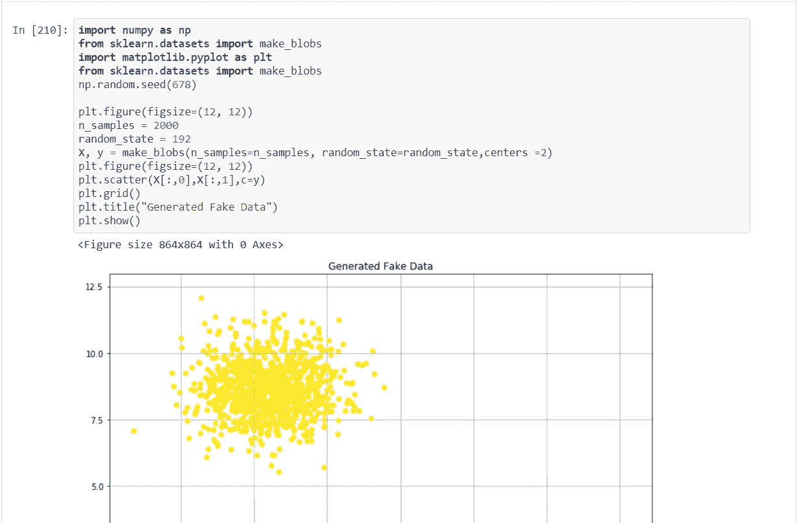

要获取这篇文章的代码，[请点击这里。](https://github.com/JaeDukSeo/Daily-Neural-Network-Practice-2/blob/master/Understanding_Concepts/vector_projection/vector_basic.ipynb)

**最后的话**

直到现在，我从未真正体会到点积的力量和全部潜力。

如果发现任何错误，请发电子邮件到 jae.duk.seo@gmail.com 给我，如果你想看我所有写作的列表，请在这里查看我的网站。

同时，在我的 twitter [这里](https://twitter.com/JaeDukSeo)关注我，并访问[我的网站](https://jaedukseo.me/)，或我的 [Youtube 频道](https://www.youtube.com/c/JaeDukSeo)了解更多内容。我还实现了[广残网，请点击这里查看博文 pos](https://medium.com/@SeoJaeDuk/wide-residual-networks-with-interactive-code-5e190f8f25ec) t。

**参考**

1.  笔记本，P. (2018)。Python & Matplotlib:在 Jupyter Notebook 中进行 3D 绘图交互。堆栈溢出。检索于 2018 年 7 月 4 日，来自[https://stack overflow . com/questions/38364435/python-matplotlib-make-3d-plot-interactive-in-jupyter-notebook](https://stackoverflow.com/questions/38364435/python-matplotlib-make-3d-plot-interactive-in-jupyter-notebook)
2.  mplot3d 教程— Matplotlib 2.0.2 文档。(2018).Matplotlib.org。检索于 2018 年 7 月 4 日，来自[https://matplotlib.org/mpl_toolkits/mplot3d/tutorial.html](https://matplotlib.org/mpl_toolkits/mplot3d/tutorial.html)
3.  matplotlib，p. (2018 年)。使用 matplotlib 为不同的分类级别绘制不同的颜色。堆栈溢出。检索于 2018 年 7 月 4 日，来自[https://stack overflow . com/questions/26139423/plot-different-color-for-different-category-levels-using-matplotlib](https://stackoverflow.com/questions/26139423/plot-different-color-for-different-categorical-levels-using-matplotlib)
4.  dataframe，S. (2018)。在熊猫数据框架中选择列。堆栈溢出。检索于 2018 年 7 月 4 日，来自[https://stack overflow . com/questions/11285613/selecting-columns-in-a-pandas-data frame](https://stackoverflow.com/questions/11285613/selecting-columns-in-a-pandas-dataframe)
5.  matplotlib？，H. (2018)。如何改变用 matplotlib 绘制的图形的大小？。堆栈溢出。检索于 2018 年 7 月 4 日，来自[https://stack overflow . com/questions/332289/how-do-you-change-the-size-of-figures-drawn-with-matplotlib](https://stackoverflow.com/questions/332289/how-do-you-change-the-size-of-figures-drawn-with-matplotlib)
6.  绘制对角线相关矩阵——seaborn 0 . 8 . 1 文档。(2018).Seaborn.pydata.org。检索于 2018 年 7 月 4 日，来自[https://seaborn . pydata . org/examples/many _ pairwise _ correlations . html](https://seaborn.pydata.org/examples/many_pairwise_correlations.html)
7.  sk learn . datasets . make _ blobs-sci kit-learn 0 . 19 . 1 文档。(2018).Scikit-learn.org。2018 年 7 月 4 日检索，来自[http://sci kit-learn . org/stable/modules/generated/sk learn . datasets . make _ blobs . html # sk learn . datasets . make _ blobs](http://scikit-learn.org/stable/modules/generated/sklearn.datasets.make_blobs.html#sklearn.datasets.make_blobs)
8.  [已关闭]，H. (2018)。如何用 Python 在一个地块上画一个网格？。堆栈溢出。检索于 2018 年 7 月 4 日，来自[https://stack overflow . com/questions/8209568/how-do-I-draw-a-grid-on-a-plot-in-python](https://stackoverflow.com/questions/8209568/how-do-i-draw-a-grid-onto-a-plot-in-python)
9.  NumPy . expand _ dims—NumPy 1.14 版手册。(2018).Docs.scipy.org。2018 年 7 月 4 日检索，来自[https://docs . scipy . org/doc/numpy/reference/generated/numpy . expand _ dims . html](https://docs.scipy.org/doc/numpy/reference/generated/numpy.expand_dims.html)
10.  NumPy . insert—NumPy 1.14 版手册。(2018).Docs.scipy.org。检索于 2018 年 7 月 4 日，来自[https://docs . scipy . org/doc/numpy/reference/generated/numpy . insert . html](https://docs.scipy.org/doc/numpy/reference/generated/numpy.insert.html)
11.  Numpy？，H. (2018)。如何在 Numpy 中得到向量的大小？。堆栈溢出。检索于 2018 年 7 月 4 日，来自[https://stack overflow . com/questions/9171158/how-do-you-get-the-magnitude-of-a-vector-in-numpy](https://stackoverflow.com/questions/9171158/how-do-you-get-the-magnitude-of-a-vector-in-numpy)
12.  NumPy . mesh grid—NumPy 1.14 版手册。(2018).Docs.scipy.org。检索于 2018 年 7 月 4 日，来自[https://docs . scipy . org/doc/numpy/reference/generated/numpy . mesh grid . html](https://docs.scipy.org/doc/numpy/reference/generated/numpy.meshgrid.html)
13.  Python？，W. (2018)。Python 中 meshgrid 的用途是什么？。堆栈溢出。检索于 2018 年 7 月 4 日，来自[https://stack overflow . com/questions/36013063/what-of-purpose-of-mesh grid-in-python](https://stackoverflow.com/questions/36013063/what-is-purpose-of-meshgrid-in-python)
14.  皮马印第安人糖尿病数据库。(2018).Kaggle.com。检索于 2018 年 7 月 4 日，来自[https://www.kaggle.com/uciml/pima-indians-diabetes-database](https://www.kaggle.com/uciml/pima-indians-diabetes-database)
15.  calculuscoaches.com:理解标量投影的概念。(2018).YouTube。检索于 2018 年 7 月 4 日，来自[https://www.youtube.com/watch?v=ziPGBFRSijk](https://www.youtube.com/watch?v=ziPGBFRSijk)
16.  向量微积分:理解点积-更好的解释。(2018).Betterexplained.com。检索于 2018 年 7 月 4 日，来自[https://better explained . com/articles/vector-calculus-understanding-the-dot-product/](https://betterexplained.com/articles/vector-calculus-understanding-the-dot-product/)
17.  9 投影。(2018).YouTube。2018 年 7 月 4 日检索，来自[https://www.youtube.com/watch?v=0bS5_k86id8&list = plznyisit 9am 7 aclo abca 1 stjz 41 ffwam&index = 9](https://www.youtube.com/watch?v=0bS5_k86id8&list=PLZnyIsit9AM7acLo1abCA1STjZ41ffwaM&index=9)