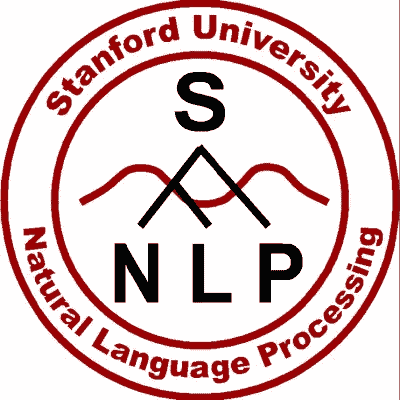

# 命名实体识别对自然语言处理中的信息抽取有什么帮助？

> 原文：<https://towardsdatascience.com/named-entity-recognition-3fad3f53c91e?source=collection_archive---------4----------------------->


Source: [https://hackernoon.com/named-entity-recognition-applications-and-use-cases-c2ef0904e9fe](https://hackernoon.com/named-entity-recognition-applications-and-use-cases-c2ef0904e9fe)

在阅读这个故事和比较几个著名的图书馆之后，你可以学习如何得到位置和组织。

在自然语言处理中，命名实体识别是提取相关信息的重要方法。对于特定领域的实体，我们必须花费大量的时间进行标注，以便能够识别这些实体。对于一般实体，如名称、位置和组织，我们可以使用预先训练的库，如斯坦福 NER、spaCy 和 NLTK NE_Chunk 来处理它。

使用以下两个脚本进行测试:

*   从[维基百科](https://en.wikipedia.org/wiki/Stanford_University)中截取了斯坦福大学的部分描述

```
article = "The university was founded in 1885 by Leland and Jane Stanford in memory of \
their only child, Leland Stanford Jr., who had died of typhoid fever at age 15 the previous \
year. Stanford was a former Governor of California and U.S. Senator; he made his fortune as a railroad tycoon. \
The school admitted its first students on October 1, 1891,[2][3] as a coeducational and non-denominational institution."
```

*   自建语句检查提取位置实体的行为

```
article2 = "New York, New York , NY N.Y. new york"
```



Source : [https://nlp.stanford.edu/software/CRF-NER.shtml](https://nlp.stanford.edu/software/CRF-NER.shtml)

# 斯坦福 NER

斯坦福 NER 是用 Java 实现的。幸运的是，我们可以使用 python 接口来实现我们所需要的。

步骤 1:环境设置

*   安装 NLTK 库(使用 3.2.5)

```
pip install nltk==3.2.5
```

*   下载斯坦福 NER 图书馆

去 https://nlp.stanford.edu/software/CRF-NER.html[下载最新版本或者这里](https://nlp.stanford.edu/software/CRF-NER.html)[下载](https://nlp.stanford.edu/software/stanford-ner-2018-02-27.zip)(版本:3.9.1)

解压缩下载的 zip 文件，并获得“stanford-ner-3.9.1.jar”(或“stanford-ner.jar”)和分类器文件夹

放到一个特定的目录中(我使用 ner_dir 进行演示)

步骤 2:导入库

```
import nltkprint('NTLK Version: %s' % nltk.__version__)from nltk.tag import StanfordNERTaggerstanford_ner_tagger = StanfordNERTagger(
    ner_dir + 'classifiers/english.all.3class.distsim.crf.ser.gz',
    ner_dir + 'stanford-ner-3.9.1.jar'
)
```

第三步:第一次测试

```
results = stanford_ner_tagger.tag(article.split())print('Original Sentence: %s' % (article))
for result in results:
    tag_value = result[0]
    tag_type = result[1]
    if tag_type != 'O':
        print('Type: %s, Value: %s' % (tag_type, tag_value))
```

结果:

```
Original Sentence: The university was founded in 1885 by Leland and Jane Stanford in memory of their only child, Leland Stanford Jr., who had died of typhoid fever at age 15 the previous year. Stanford was a former Governor of California and U.S. Senator; he made his fortune as a railroad tycoon. The school admitted its first students on October 1, 1891,[2][3] as a coeducational and non-denominational institution.Type: PERSON, Value: Leland
Type: PERSON, Value: Jane
Type: PERSON, Value: Stanford
Type: PERSON, Value: Leland
Type: PERSON, Value: Stanford
Type: PERSON, Value: Jr.,
Type: ORGANIZATION, Value: Stanford
Type: LOCATION, Value: California
Type: LOCATION, Value: U.S.
```

第四步:第二次测试

```
results = stanford_ner_tagger.tag(article2.split())print('Original Sentence: %s' % (article2))
for result in results:
    tag_value = result[0]
    tag_type = result[1]
    if tag_type != 'O':
        print('Type: %s, Value: %s' % (tag_type, tag_value))
```

结果:

```
Original Sentence: New York, New York , NY N.Y. new york
Type: LOCATION, Value: New
Type: LOCATION, Value: York
Type: LOCATION, Value: NY
Type: LOCATION, Value: N.Y.
```

*   “纽约”无法标记为位置，因为“，”
*   第二个“纽约”可以被标记。
*   “纽约”分别标记为“新”和“纽约”。我们需要自己合并它。
*   “纽约”不能被标记为位置，因为它是小写字母。


Source: [https://spacy.io/](https://spacy.io/)

# 宽大的

第二个图书馆是空间。这是一个非常强大的图书馆，有一个很大的社区。它还支持 GPU 和深度学习实现。

步骤 1:环境设置

安装空间(2.0.11)

```
pip install spacy==2.0.11
```

步骤 2:导入库

```
spacy_nlp = spacy.load('en')
```

第三步:第一次测试

```
document = spacy_nlp(article)print('Original Sentence: %s' % (article))
for element in document.ents:
    print('Type: %s, Value: %s' % (element.label_, element))
```

结果:

```
Original Sentence: The university was founded in 1885 by Leland and Jane Stanford in memory of their only child, Leland Stanford Jr., who had died of typhoid fever at age 15 the previous year. Stanford was a former Governor of California and U.S. Senator; he made his fortune as a railroad tycoon. The school admitted its first students on October 1, 1891,[2][3] as a coeducational and non-denominational institution.Type: DATE, Value: 1885
Type: GPE, Value: Leland
Type: PERSON, Value: Jane Stanford
Type: PERSON, Value: Leland Stanford Jr.
Type: DATE, Value: age 15 the previous year
Type: ORG, Value: Stanford
Type: GPE, Value: California
Type: GPE, Value: U.S.
Type: ORDINAL, Value: first
Type: DATE, Value: October 1, 1891,[2][3
```

第四步:第二次测试

```
document = spacy_nlp(article2)print('Original Sentence: %s' % (article2))
print()
for element in document.ents:
    print('Type: %s, Value: %s' % (element.label_, element))
```

结果

```
Original Sentence: New York, New York , NY N.Y. new york

Type: GPE, Value: New York
Type: GPE, Value: New York
Type: GPE, Value: NY N.Y.
```

*   既能认出“纽约”
*   将“纽约”标记为单一位置
*   无法标记“纽约”


Source: [https://geonaut.co.uk/projects/programming/](https://geonaut.co.uk/projects/programming/)

# NLTK 东北 _ 块

NLTK 是另一个著名的 NLP 库。我使用这个库来处理我的第一个 NLP 相关的项目。它包括了许多与自然语言处理相关的方法，如词性标注、句子分词等。

步骤 1:环境设置

```
pip install nltk=3.2.5
```

步骤 2:导入库

加载相应的包

```
import nltkprint('NTLK version: %s' % (nltk.__version__))from nltk import word_tokenize, pos_tag, ne_chunknltk.download('words')
nltk.download('averaged_perceptron_tagger')
nltk.download('punkt')
nltk.download('maxent_ne_chunker')
```

第三步:第一次测试

NLTK 将单词标记化、词性(POS)标注和命名实体识别分开。因此，我们需要为命名实体识别执行三个函数。

```
results = ne_chunk(pos_tag(word_tokenize(article)))print('Original Sentence: %s' % (article))
print()
for x in str(results).split('\n'):
    if '/NNP' in x:
        print(x)
```

结果:

```
(GPE Leland/NNP)
  (PERSON Jane/NNP Stanford/NNP)
  (GPE Leland/NNP)
  Stanford/NNP
  Jr./NNP
  (PERSON Stanford/NNP)
  Governor/NNP
  (GPE California/NNP)
  (GPE U.S/NNP)
  Senator/NNP
  October/NNP
  ]/NNP
```

第四步:第二次测试

```
results = ne_chunk(pos_tag(word_tokenize(article2)))print('Original Sentence: %s' % (article2))
print()
for x in str(results).split('\n'):
    if '/NNP' in x:
        print(x)
```

结果:

```
Original Sentence: New York, New York , NY N.Y. new york

  (GPE New/NNP York/NNP)
  (GPE New/NNP York/NNP)
  (ORGANIZATION NY/NNP)
  N.Y./NNP
```

# 结论

演示可以在 [Jupyter 笔记本](https://github.com/makcedward/nlp/blob/master/sample/nlp-named_entity_recognition.ipynb)中找到。

斯坦福 NER 需要额外的实现来获得实体，如果它包括一个以上的单词。另外，与其他两个库相比，标记的性能是最慢的。

spaCy 似乎是更容易获得实体的库，并且不需要额外的设置。除了 NER，它还支持 GPU 和深度学习方法

NLTK NE_Chunk 需要更多的设置(下载预训练文件)，但这只是一次性的。通过比较其他两个库，结果似乎并不好。

**TL；博士**

*斯坦福 NER*

我们在前面的演示中加载了“English . all . 3 class . dist sim . CRF . ser . gz”分类器。可以替换为“English . con ll . 4 class . dist sim . CRF . ser . gz”或“English . muc . 7 class . dist sim . CRF . ser . gz”。如果使用“English . muc . 7 class . dist sim . CRF . ser . gz”，也可以标记日期和时间。

*   English . all . 3 class . dist sim . CRF . ser . gz:地点、人员和组织
*   English . con ll . 4 class . dist sim . CRF . ser . gz:地点、人员、组织和杂项
*   English . muc . 7 class . dist sim . CRF . ser . gz:地点、人员、组织、资金、百分比、日期、时间

*空间*

如果机器没有 GPU 但安装了 cupy。会抛出错误，提交 [bug](https://github.com/explosion/spaCy/issues/2343) (spaCy 版本为(2.0.11)。如果计算机没有 GPU，当前的解决方法是卸载 cupy

*NLTK NE 组块*

通过与斯坦福 NER 和 spaCy 的比较，性能和代码效率不如这些库。

# 关于我

我是湾区的数据科学家。专注于数据科学、人工智能，尤其是 NLP 和平台相关领域的最新发展。你可以通过[媒体博客](http://medium.com/@makcedward/)、 [LinkedIn](https://www.linkedin.com/in/edwardma1026) 或 [Github](https://github.com/makcedward) 联系我。