# 用 Scikit-Learn 进行命名实体识别和分类

> 原文：<https://towardsdatascience.com/named-entity-recognition-and-classification-with-scikit-learn-f05372f07ba2?source=collection_archive---------0----------------------->


## 如何使用 Scikit-Learn 的库为 NER 训练机器学习模型

[命名实体识别和分类](https://en.wikipedia.org/wiki/Named-entity_recognition) (NERC)是一个从非结构化文本中识别信息单元的过程，如名称，包括人、组织和位置名称，以及数字表达式，包括时间、日期、金钱和百分比表达式。目标是开发实用的和独立于领域的技术，以自动检测高精度的命名实体。

上周，我们给[介绍了 NLTK 和 SpaCy](/named-entity-recognition-with-nltk-and-spacy-8c4a7d88e7da) 中的命名实体识别(NER)。今天，我们更进一步——使用 Scikit-Learn 的一些库为 NER 训练机器学习模型。我们开始吧！

# 数据

这些数据是特征工程语料库，标注有 [IOB](https://en.wikipedia.org/wiki/Inside%E2%80%93outside%E2%80%93beginning_(tagging)) 和 [POS](https://en.wikipedia.org/wiki/Part-of-speech_tagging) 标签，可以在 [Kaggle](https://www.kaggle.com/abhinavwalia95/how-to-loading-and-fitting-dataset-to-scikit/data) 找到。我们可以快速浏览一下前几行数据。

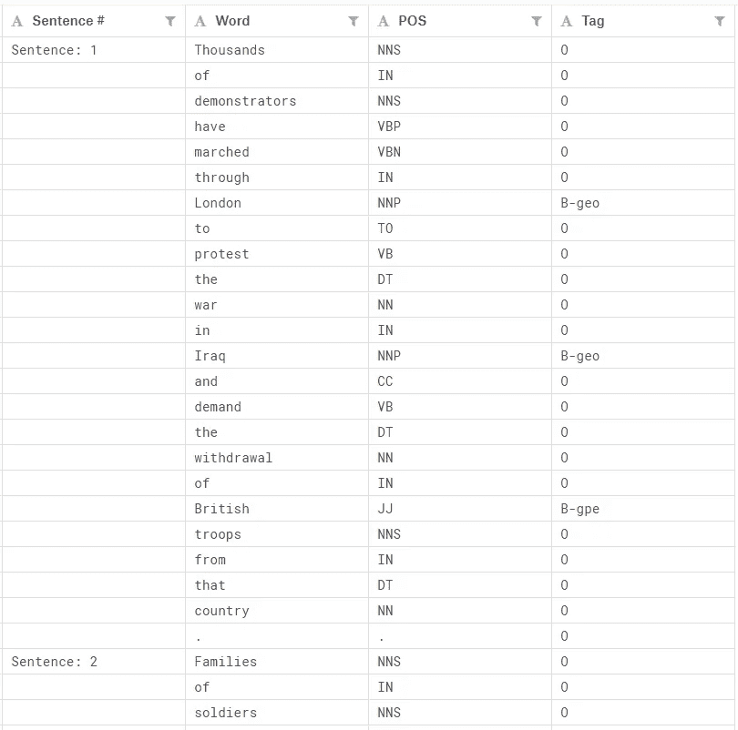

Figure 1

**实体基本信息**:

*   地理=地理实体
*   org =组织
*   per =人
*   地缘政治实体
*   tim =时间指示器
*   艺术=艺术品
*   eve =事件
*   自然现象

**内部-外部-开始(标记)**

[**IOB**](https://en.wikipedia.org/wiki/Inside%E2%80%93outside%E2%80%93beginning_(tagging))**(内、外、始的简称)是标记令牌的常用标记格式。**

*   **标签前的 I 前缀表示标签在块中。**
*   **标签前的 b 前缀表示标签是块的开始。**
*   **O 标记表示令牌不属于任何块(外部)。**

```
import pandas as pd
import numpy as np
from sklearn.feature_extraction import DictVectorizer
from sklearn.feature_extraction.text import HashingVectorizer
from sklearn.linear_model import Perceptron
from sklearn.model_selection import train_test_split
from sklearn.linear_model import SGDClassifier
from sklearn.linear_model import PassiveAggressiveClassifier
from sklearn.naive_bayes import MultinomialNB
from sklearn.metrics import classification_report
```

**单个计算机的内存无法容纳整个数据集，因此我们选择前 100，000 条记录，并使用[核外学习算法](https://en.wikipedia.org/wiki/External_memory_algorithm)来有效地获取和处理数据。**

```
df = pd.read_csv('ner_dataset.csv', encoding = "ISO-8859-1")
df = df[:100000]
df.head()
```

**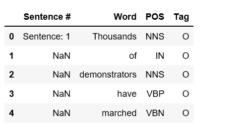**

**Figure 2**

```
df.isnull().sum()
```

**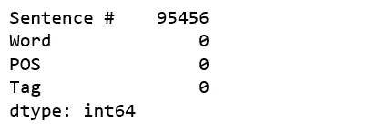**

**Figure 3**

# **数据预处理**

**我们注意到在“句子#”列中有许多 NaN 值，我们用前面的值填充 NaN。**

```
df = df.fillna(method='ffill')df['Sentence #'].nunique(), df.Word.nunique(), df.Tag.nunique()
```

*****(4544，10922，17)*****

**我们有 4544 个句子，包含 10922 个独特的单词，由 17 个标签标记。**

**标签分布不均匀。**

```
df.groupby('Tag').size().reset_index(name='counts')
```

**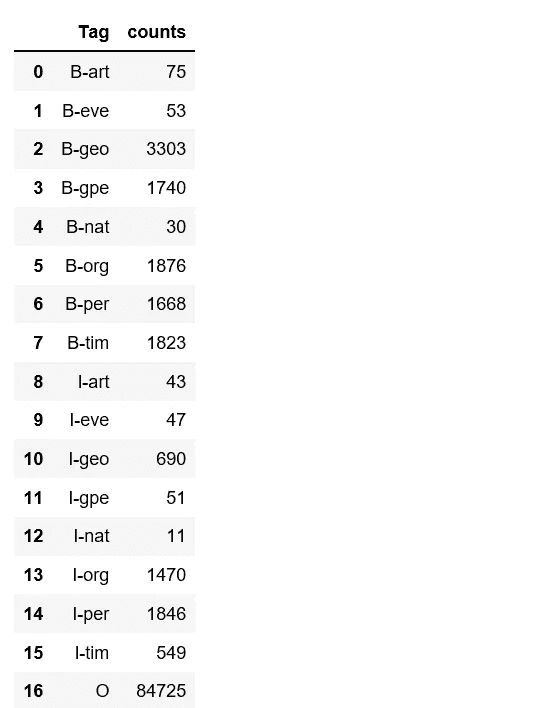**

**Figure 4**

**以下代码使用`[**DictVectorizer**](http://scikit-learn.org/stable/modules/generated/sklearn.feature_extraction.DictVectorizer.html#sklearn.feature_extraction.DictVectorizer)` 将文本日期转换为向量，然后拆分为训练集和测试集。**

```
X = df.drop('Tag', axis=1)
v = DictVectorizer(sparse=False)
X = v.fit_transform(X.to_dict('records'))
y = df.Tag.valuesclasses = np.unique(y)
classes = classes.tolist()X_train, X_test, y_train, y_test = train_test_split(X, y, test_size = 0.33, random_state=0)
X_train.shape, y_train.shape
```

*****((67000，15507)，(67000)，)*****

# **核外算法**

**我们将尝试一些核外算法，这些算法旨在处理太大而无法放入支持`**partial_fit**` 方法的单个计算机内存中的数据。**

## **感知器**

```
per = Perceptron(verbose=10, n_jobs=-1, max_iter=5)
per.partial_fit(X_train, y_train, classes)
```

**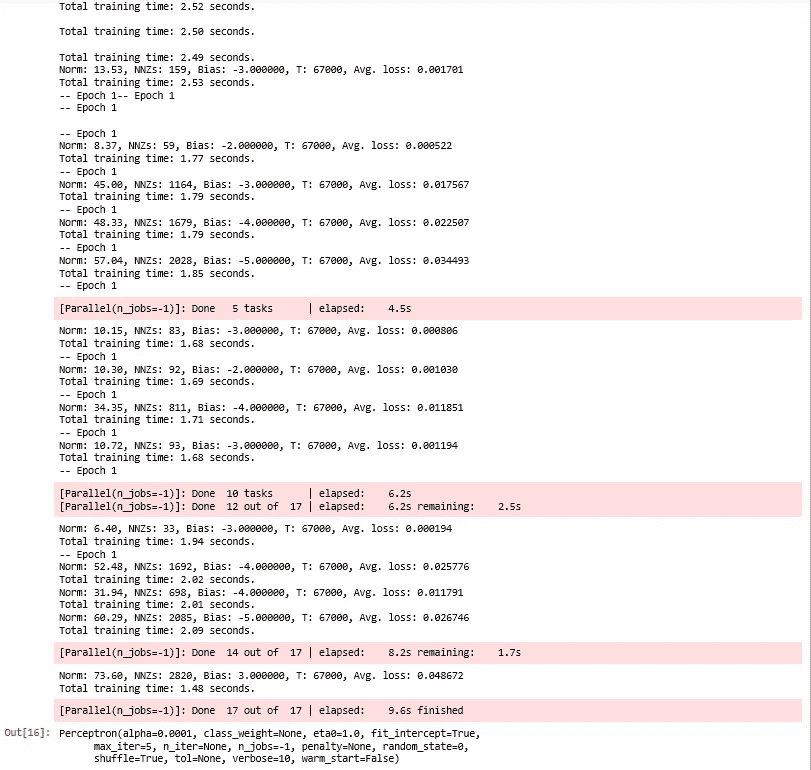**

**Figure 5**

**因为标签“O”(外部)是最常见的标签，它会使我们的结果看起来比实际好得多。因此，在评估分类指标时，我们删除了标签“O”。**

```
new_classes = classes.copy()
new_classes.pop()
new_classes
```

**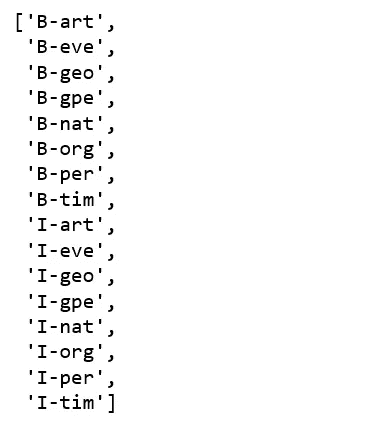**

**Figure 6**

```
print(classification_report(y_pred=per.predict(X_test), y_true=y_test, labels=new_classes))
```

**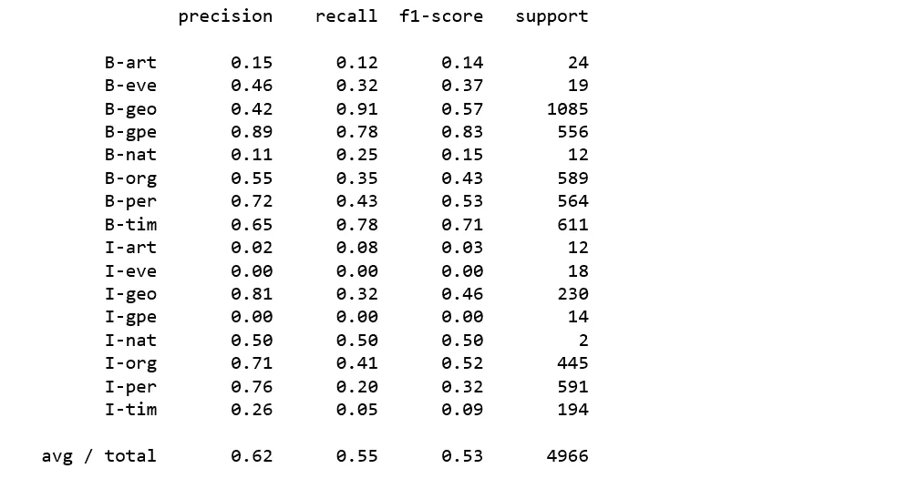**

**Figure 7**

****带 SGD 训练的线性分类器****

```
sgd = SGDClassifier()
sgd.partial_fit(X_train, y_train, classes)
```

**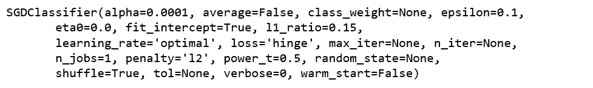**

**Figure 8**

```
print(classification_report(y_pred=sgd.predict(X_test), y_true=y_test, labels=new_classes))
```

**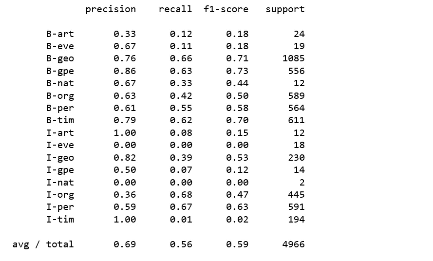**

**Figure 9**

****多项式模型的朴素贝叶斯分类器****

```
nb = MultinomialNB(alpha=0.01)
nb.partial_fit(X_train, y_train, classes)
```

**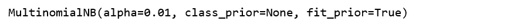**

**Figure 10**

```
print(classification_report(y_pred=nb.predict(X_test), y_true=y_test, labels = new_classes))
```

**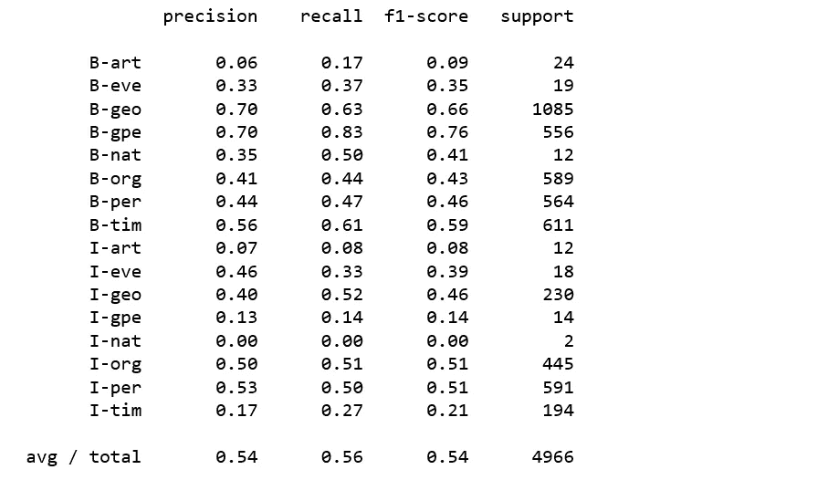**

**Figure 11**

****被动攻击分类器****

```
pa =PassiveAggressiveClassifier()
pa.partial_fit(X_train, y_train, classes)
```

**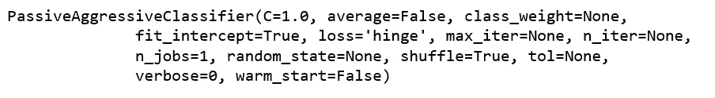**

**Figure 12**

```
print(classification_report(y_pred=pa.predict(X_test), y_true=y_test, labels=new_classes))
```

**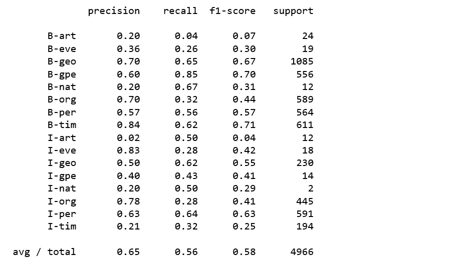**

**Figure 13**

**上述分类器都没有产生令人满意的结果。很明显，使用常规分类器对命名实体进行分类并不容易。**

# ****条件随机字段****

**[CRFs](https://en.wikipedia.org/wiki/Conditional_random_field) 通常用于标记或解析序列数据，例如自然语言处理和 CRFs 在词性标记、命名实体识别等方面的应用。**

## **sklearn-crfsuite**

**我们将在数据集上使用 sklearn-crfsuite 训练一个用于命名实体识别的 CRF 模型。**

```
import sklearn_crfsuite
from sklearn_crfsuite import scorers
from sklearn_crfsuite import metrics
from collections import Counter
```

**下面的代码将检索带有词性和标签的句子。感谢[托拜厄斯](https://www.depends-on-the-definition.com/named-entity-recognition-conditional-random-fields-python/)的提示。**

```
class SentenceGetter(object):

    def __init__(self, data):
        self.n_sent = 1
        self.data = data
        self.empty = False
        agg_func = lambda s: [(w, p, t) for w, p, t in zip(s['Word'].values.tolist(), 
                                                           s['POS'].values.tolist(), 
                                                           s['Tag'].values.tolist())]
        self.grouped = self.data.groupby('Sentence #').apply(agg_func)
        self.sentences = [s for s in self.grouped]

    def get_next(self):
        try: 
            s = self.grouped['Sentence: {}'.format(self.n_sent)]
            self.n_sent += 1
            return s 
        except:
            return Nonegetter = SentenceGetter(df)
sentences = getter.sentences
```

****特征提取****

**接下来，我们提取更多的特征(单词部分、简化的 POS 标签、下方/标题/上方标志、附近单词的特征)，并将其转换为`**sklearn-crfsuite**`格式——每个句子都应转换为一个字典列表。以下代码摘自 [sklearn-crfsuites 官方网站](https://sklearn-crfsuite.readthedocs.io/en/latest/tutorial.html)。**

```
def word2features(sent, i):
    word = sent[i][0]
    postag = sent[i][1]

    features = {
        'bias': 1.0, 
        'word.lower()': word.lower(), 
        'word[-3:]': word[-3:],
        'word[-2:]': word[-2:],
        'word.isupper()': word.isupper(),
        'word.istitle()': word.istitle(),
        'word.isdigit()': word.isdigit(),
        'postag': postag,
        'postag[:2]': postag[:2],
    }
    if i > 0:
        word1 = sent[i-1][0]
        postag1 = sent[i-1][1]
        features.update({
            '-1:word.lower()': word1.lower(),
            '-1:word.istitle()': word1.istitle(),
            '-1:word.isupper()': word1.isupper(),
            '-1:postag': postag1,
            '-1:postag[:2]': postag1[:2],
        })
    else:
        features['BOS'] = True
    if i < len(sent)-1:
        word1 = sent[i+1][0]
        postag1 = sent[i+1][1]
        features.update({
            '+1:word.lower()': word1.lower(),
            '+1:word.istitle()': word1.istitle(),
            '+1:word.isupper()': word1.isupper(),
            '+1:postag': postag1,
            '+1:postag[:2]': postag1[:2],
        })
    else:
        features['EOS'] = Truereturn featuresdef sent2features(sent):
    return [word2features(sent, i) for i in range(len(sent))]def sent2labels(sent):
    return [label for token, postag, label in sent]def sent2tokens(sent):
    return [token for token, postag, label in sent]
```

****拆分训练和测试集****

```
X = [sent2features(s) for s in sentences]
y = [sent2labels(s) for s in sentences]
X_train, X_test, y_train, y_test = train_test_split(X, y, test_size=0.33, random_state=0)
```

****训练一个 CRF 模型****

```
crf = sklearn_crfsuite.CRF(
    algorithm='lbfgs',
    c1=0.1,
    c2=0.1,
    max_iterations=100,
    all_possible_transitions=True
)
crf.fit(X_train, y_train)
```

**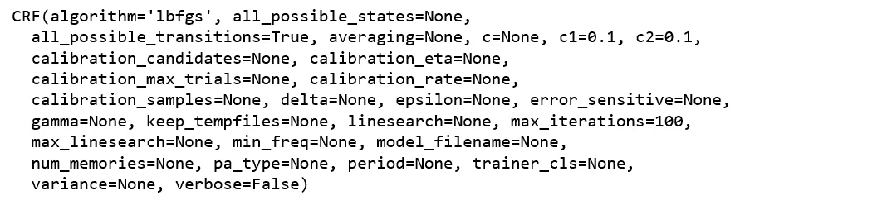**

**Figure 14**

****评估****

```
y_pred = crf.predict(X_test)
print(metrics.flat_classification_report(y_test, y_pred, labels = new_classes))
```

**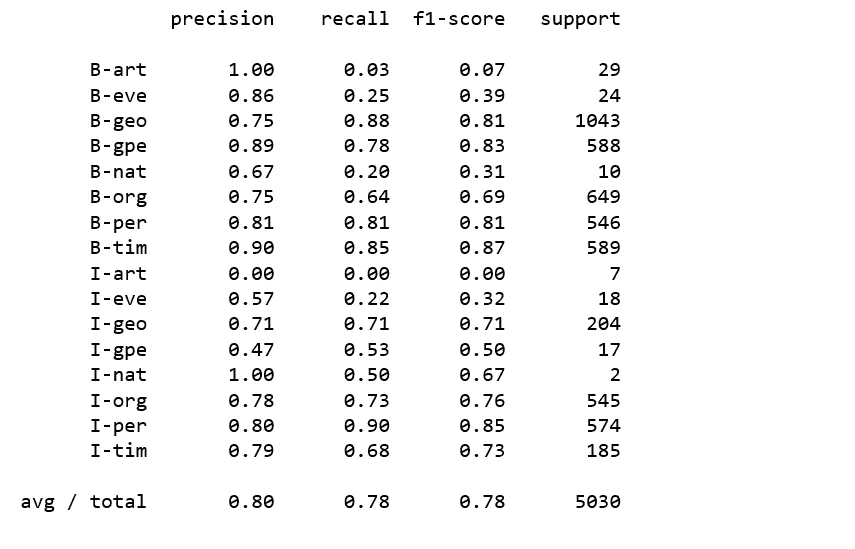**

**Figure 15**

**好多了。我们会坚持 sklearn-crfsuite，探索更多！**

****我们的分类器学到了什么？****

```
def print_transitions(trans_features):
    for (label_from, label_to), weight in trans_features:
        print("%-6s -> %-7s %0.6f" % (label_from, label_to, weight))print("Top likely transitions:")
print_transitions(Counter(crf.transition_features_).most_common(20))print("\nTop unlikely transitions:")
print_transitions(Counter(crf.transition_features_).most_common()[-20:])
```

**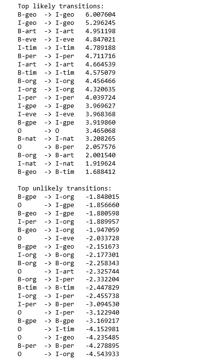**

**Figure 16**

****解释**:地理实体(B-geo)的开头很可能会跟随着地理实体(I-geo)内部的令牌，但是从带有其他标签的令牌过渡到组织名称(I-org)内部会受到巨大的惩罚。**

****检查状态特性****

```
def print_state_features(state_features):
    for (attr, label), weight in state_features:
        print("%0.6f %-8s %s" % (weight, label, attr))print("Top positive:")
print_state_features(Counter(crf.state_features_).most_common(30))print("\nTop negative:")
print_state_features(Counter(crf.state_features_).most_common()[-30:])
```

**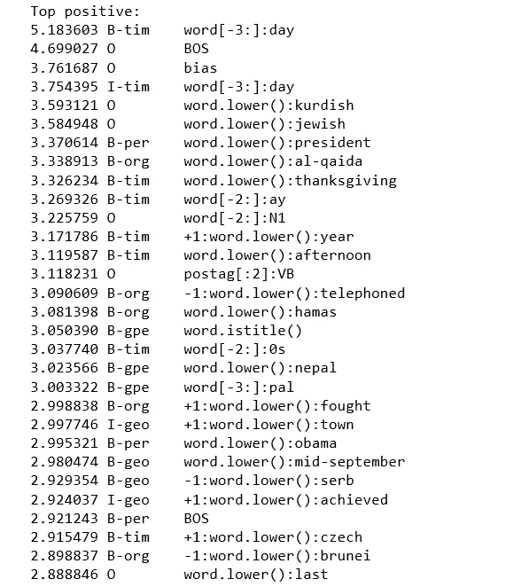******

**Figure 17**

****观察结果**:**

**1).该模型了解到，如果附近的单词是“day ”,那么该令牌很可能是时间指示符的一部分。**

**2).`**3.370614 B-per word.lower():president**`模型了解到令牌“president”可能在人名的开头。**

**3).`**-3.521244 O postag:NNP**`该模型了解到专有名词通常是实体。**

**4).`**-3.087828 O word.isdigit()**`数字可能是实体。**

**5).`**-3.233526 O word.istitle()**`带标题的单词可能是实体。**

## **ELI5**

**[ELI5](https://eli5.readthedocs.io/en/latest/index.html) 是一个 Python 包，允许检查 sklearn_crfsuite 的重量。CRF 模型。**

****检查模型重量****

```
import eli5
eli5.show_weights(crf, top=10)
```

******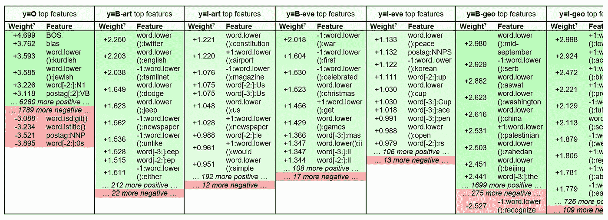**

**Figure 18**

****观察结果**:**

1.  **I-entity 必须跟随 B-entity 确实有道理，比如 I-geo 跟随 B-geo，I-org 跟随 B-org，I-per 跟随 B-per，等等。**
2.  **我们还可以看到，在这个数据集中，一个组织名称后面紧跟着一个人的情况并不常见(B-org -> I-per 具有很大的负权重)。**
3.  **该模型学习了像 O -> I-geo、O -> I-org 和 O -> I-tim 等不可能转换的大的负权重。**

**为了便于阅读，我们只能检查标签的子集。**

```
eli5.show_weights(crf, top=10, targets=['O', 'B-org', 'I-per'])
```

**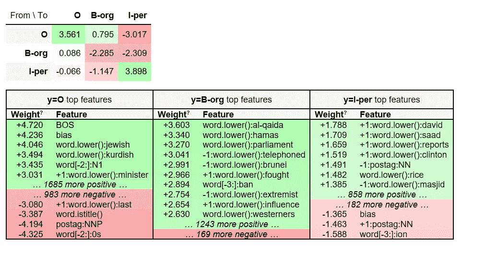**

**Figure 19**

**或者只检查所有标签的一些特征。**

```
eli5.show_weights(crf, top=10, feature_re='^word\.is',
                  horizontal_layout=False, show=['targets'])
```

**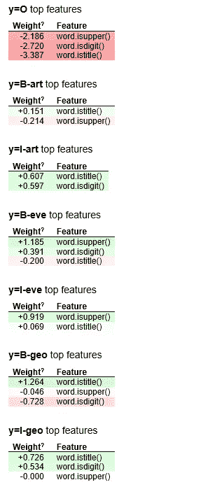****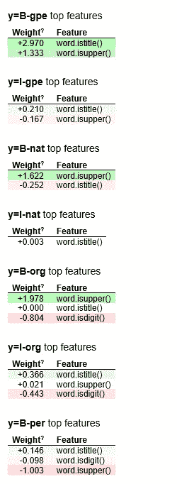****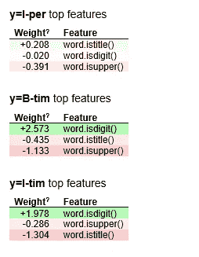**

**Figure 20**

**暂时就这样了。我喜欢在 sklearn-crfsuite 和 ELI5 上动手动脚，希望你也是。源代码可以在 [Github](https://github.com/susanli2016/NLP-with-Python/blob/master/NER_sklearn.ipynb) 找到。祝你一周愉快！**

**参考资料:**

**[sklearn-crfsuite](https://sklearn-crfsuite.readthedocs.io/en/latest/index.html)**

**[ELI5](https://eli5.readthedocs.io/en/latest/index.html)**