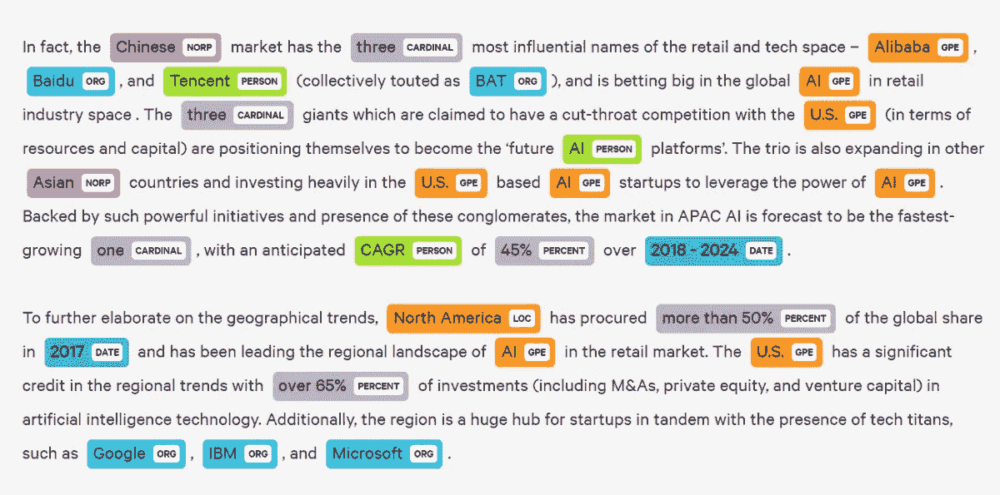
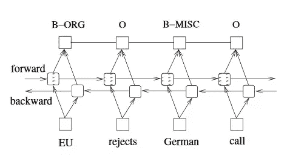
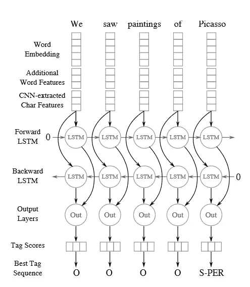
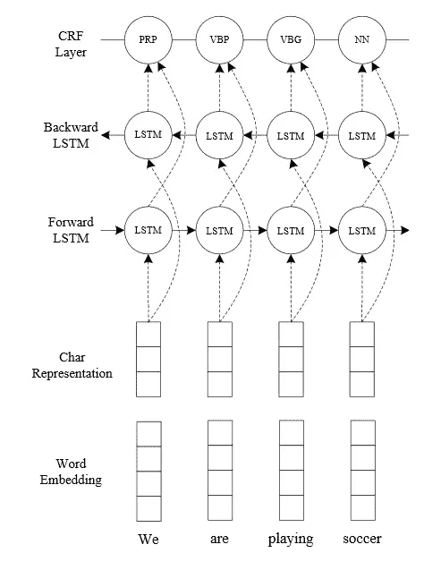
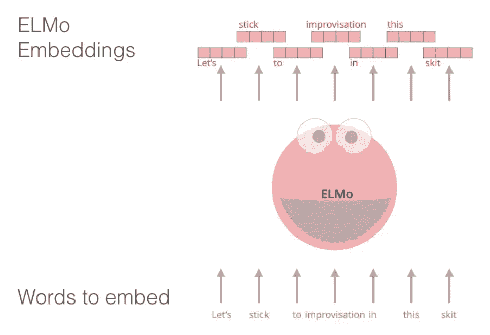
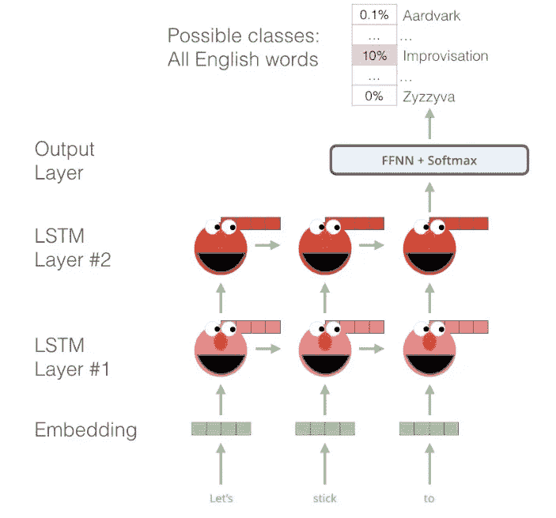
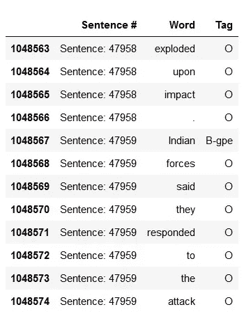
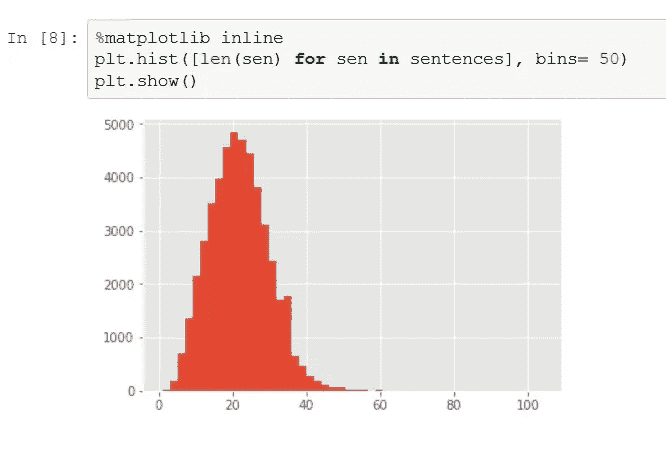

# 基于 keras 和 tensorflow 的命名实体识别(NER)

> 原文：<https://towardsdatascience.com/named-entity-recognition-ner-meeting-industrys-requirement-by-applying-state-of-the-art-deep-698d2b3b4ede?source=collection_archive---------1----------------------->

## 通过应用最先进的深度学习方法满足行业需求


photo credit: pexels

几年前，当我在一家初创公司做软件工程实习生时，我在一个招聘网站上看到了一个新功能。该应用程序能够识别和解析简历中的重要信息，如电子邮件地址、电话号码、学位头衔等。我开始和我们的团队讨论可能的方法，我们决定用 python 建立一个基于规则的解析器来解析简历的不同部分。在花了一些时间开发解析器之后，我们意识到答案可能不是基于规则的工具。我们开始在谷歌上搜索这是如何做到的，我们遇到了术语**自然语言处理(NLP)** 以及更具体的与**机器学习相关的**命名实体识别(NER)** 。**



photo credit: meenavyas

NER 是一种信息提取技术，用于识别和分类文本中的命名实体。这些实体可以是预定义的和通用的，如地点名称、组织、时间等，也可以是非常具体的，如简历中的例子。 NER 在业务中有各种各样的使用案例。我认为 gmail 应用了 NER，当你写邮件时，如果你在邮件中提到时间或附上文件，gmail 会设置日历通知或提醒你附上文件，以防你发送没有附件的邮件。NER 的其他应用包括:从**法律、金融和医疗文档中提取重要的命名实体，**为**新闻提供者分类内容，**改进**搜索算法**等等。在本文的其余部分，我们将简短介绍解决 NER 问题的不同方法，然后我们将开始编写最先进的方法。下面是苏沃洛对 NER 更详细的介绍。


photo credit: pexels

# **接近 NER**

*   **经典方法**:大多基于规则。这里有一个链接，链接到 Sentdex 的一个很短很棒的[视频](https://www.youtube.com/watch?v=LFXsG7fueyk)，它在 python 中为 NER 使用了 NLTK 包。
*   **机器学习方法**:这一类主要有两种方法: **A-** 把问题当做多类分类，其中命名实体就是我们的标签，这样我们就可以应用不同的分类算法。这里的问题是**识别和标注命名实体需要彻底理解句子的上下文和其中单词标签的序列，而这种方法忽略了这一点。 **B-** 这一类的另一种方法是**条件随机场(CRF)模型。它是一个概率图形模型，可用于模拟顺序数据，如句子中单词的标签。**关于 CRF 在 python 中的更多细节和完整实现，请参见 [**Tobias 的**](https://www.depends-on-the-definition.com/named-entity-recognition-conditional-random-fields-python/) 文章。CRF 模型能够捕获序列中当前和先前标签的特征，但是它不能理解前向标签的上下文；这个缺点加上与训练 CRF 模型相关的额外的特征工程，使得它不太适合于工业应用。**


photo credit: abajournal

*   **深度学习方法:**

在讨论 NER 的深度学习方法(最先进的)的细节之前，我们需要分析适当和清晰的指标来评估我们模型的性能。在不同迭代(时期)中训练神经网络时，通常使用准确度作为评估度量。但是，在 NER 案例中，我们可能会处理重要的金融、医疗或法律文档，准确识别这些文档中的命名实体决定了模型的成功与否。换句话说，**在 NER 任务中，误报和漏报都有商业成本。**因此，我们评估模型的主要指标将是 F1 分数，因为我们需要在精确度和召回率之间取得平衡。

建立高性能深度学习方法的另一个重要策略是，考虑到文本是一种序列数据格式，了解哪种类型的神经网络最适合处理 NER 问题。是的，你猜对了…长短期记忆(LSTM)。此[链接](http://colah.github.io/posts/2015-08-Understanding-LSTMs/)中关于 LSTMs 的更多详情。但不是任何类型的 LSTM，我们需要使用双向 LSTM，因为使用标准 LSTM 进行预测只会考虑文本序列中的“过去”信息。对 NER 来说，由于上下文在序列中涵盖了过去和未来的标签，我们需要将过去和未来的信息都考虑在内。**双向 LSTM 是两个 lstm 的组合——一个从“右到左”向前运行，一个从“左到右”向后运行。**


我们将通过参考实际的研究论文来快速浏览四种不同的最新方法的架构，然后我们将继续实施精度最高的方法。

1.  [双向 LSTM-CRFT7**:**](https://arxiv.org/pdf/1508.01991v1.pdf)

更多细节和 keras 中的[实现](https://www.depends-on-the-definition.com/sequence-tagging-lstm-crf/)。



from the paper(Bidirectional LSTM-CRF Models for Sequence Tagging)

[2。**双向 LSTM-CNN**](https://arxiv.org/pdf/1511.08308.pdf)**:**

更多细节和 keras 中的[实现](https://www.depends-on-the-definition.com/lstm-with-char-embeddings-for-ner/)。



from the paper( Named Entity Recognition with Bidirectional LSTM-CNNs)

[**3。双向 LSTM-CNN-CRF:**](https://arxiv.org/pdf/1603.01354.pdf)



from the paper (End-to-end Sequence Labeling via Bi-directional LSTM-CNNs-CRF)

4.ELMo(从语言模型嵌入):



[Jay Alamma](https://jalammar.github.io/illustrated-bert/)r



[Jay Alammar](https://jalammar.github.io/illustrated-bert/)

最近的一篇[论文](https://arxiv.org/pdf/1802.05365.pdf)(深度语境化单词表示)介绍了一种新类型的深度语境化单词表示，它模拟了单词使用的复杂特征(例如，句法和语义)，以及这些使用如何在语言语境中变化(例如，模拟一词多义)。新方法(ELMo)有三个重要的代表:

1.*上下文*:每个单词的表示取决于使用它的整个上下文。

*2。深度*:单词表示结合了深度预训练神经网络的所有层。

*3。基于字符的* : ELMo 表示完全基于字符，允许网络使用形态学线索为训练中看不到的词汇外标记形成健壮的表示。

[ELMo](https://allennlp.org/elmo) 对语言有很好的理解，因为它是在大规模数据集上训练的，ELMo 嵌入是在 10 亿词[基准](https://tfhub.dev/google/elmo/2)上训练的。这种训练被称为双向语言模型(biLM)，它可以从过去学习，并预测像句子一样的单词序列中的下一个单词。让我们看看如何实现这种方法。我们将使用来自 kaggle 的数据集。

```
import pandas as pd
import numpy as np
import matplotlib.pyplot as plt
plt.style.use("ggplot")data = pd.read_csv("ner_dataset.csv", encoding="latin1")
data = data.drop(['POS'], axis =1)
data = data.fillna(method="ffill")
data.tail(12)words = set(list(data['Word'].values))
words.add('PADword')
n_words = len(words)
n_words**35179**tags = list(set(data["Tag"].values))
n_tags = len(tags)
n_tags**17**
```



我们的数据集中有 47958 个句子，35179 个不同的单词和 17 个不同的命名实体(标签)。

让我们来看看句子长度在数据集中的分布:

```
class SentenceGetter(object):

    def __init__(self, data):
        self.n_sent = 1
        self.data = data
        self.empty = False
        agg_func = lambda s: [(w, t) for w, t in zip(s["Word"].values.tolist(),s["Tag"].values.tolist())]
        self.grouped = self.data.groupby("Sentence #").apply(agg_func)
        self.sentences = [s for s in self.grouped]

    def get_next(self):
        try:
            s = self.grouped["Sentence: {}".format(self.n_sent)]
            self.n_sent += 1
            return s
        except:
            return None
```

这个类负责将每个带有命名实体(标签)的句子转换成一个元组列表[(单词，命名实体)，…]

```
getter = SentenceGetter(data)
sent = getter.get_next()
print(sent)**[('Thousands', 'O'), ('of', 'O'), ('demonstrators', 'O'), ('have', 'O'), ('marched', 'O'), ('through', 'O'), ('London', 'B-geo'), ('to', 'O'), ('protest', 'O'), ('the', 'O'), ('war', 'O'), ('in', 'O'), ('Iraq', 'B-geo'), ('and', 'O'), ('demand', 'O'), ('the', 'O'), ('withdrawal', 'O'), ('of', 'O'), ('British', 'B-gpe'), ('troops', 'O'), ('from', 'O'), ('that', 'O'), ('country', 'O'), ('.', 'O')]**sentences = getter.sentences
print(len(sentences))**47959**largest_sen = max(len(sen) for sen in sentences)
print('biggest sentence has {} words'.format(largest_sen))**biggest sentence has 104 words**
```



所以最长的句子有 140 个单词，我们可以看到几乎所有的句子都少于 60 个单词。

这种方法最大的好处之一是我们不需要任何特征工程；我们所需要的是句子和它的标记词，剩下的工作由 ELMo embeddeds 继续进行。为了将我们的句子输入到 LSTM 网络中，它们都需要一样大。看分布图，我们可以把所有句子的长度设置为 **50** 并为空格添加一个通用词；这个过程叫做**填充**。(50 是个好数字的另一个原因是我的笔记本电脑无法处理更长的句子)。

```
max_len = 50
X = [[w[0]for w in s] for s in sentences]
new_X = []
for seq in X:
    new_seq = []
    for i in range(max_len):
        try:
            new_seq.append(seq[i])
        except:
            new_seq.append("PADword")
    new_X.append(new_seq)
new_X[15]**['Israeli','officials','say','Prime','Minister','Ariel',
 'Sharon', 'will','undergo','a', 'medical','procedure','Thursday',
 'to','close','a','tiny','hole','in','his','heart','discovered',
 'during','treatment', 'for','a', 'minor', 'stroke', 'suffered', 'last', 'month', '.', 'PADword', 'PADword', 'PADword', 'PADword', 'PADword', 'PADword', 'PADword', 'PADword', 'PADword', 'PADword',
 'PADword', 'PADword', 'PADword', 'PADword', 'PADword', 'PADword',
 'PADword', 'PADword']**
```

这同样适用于命名实体，但我们这次需要将标签映射到数字:

```
from keras.preprocessing.sequence import pad_sequencestags2index = {t:i for i,t in enumerate(tags)}
y = [[tags2index[w[1]] for w in s] for s in sentences]
y = pad_sequences(maxlen=max_len, sequences=y, padding="post", value=tags2index["O"])
y[15]**array([4, 7, 7, 0, 1, 1, 1, 7, 7, 7, 7, 7, 9, 7, 7, 7, 7, 7, 7, 7, 7, 7,7, 7, 7, 7, 7, 7, 7, 7, 7, 7, 7, 7, 7, 7, 7, 7, 7, 7, 7, 7, 7, 7,7, 7, 7, 7, 7, 7])**
```

接下来，我们将数据分为训练集和测试集，然后导入 tensorflow Hub(一个用于发布、发现和消费机器学习模型的可重用部分的库)来加载 ELMo 嵌入功能和 keras，以开始构建我们的网络。

```
from sklearn.model_selection import train_test_split
import tensorflow as tf
import tensorflow_hub as hub
from keras import backend as KX_tr, X_te, y_tr, y_te = train_test_split(new_X, y, test_size=0.1, random_state=2018)sess = tf.Session()
K.set_session(sess)
elmo_model = hub.Module("[https://tfhub.dev/google/elmo/2](https://tfhub.dev/google/elmo/2)", trainable=True)
sess.run(tf.global_variables_initializer())
sess.run(tf.tables_initializer())
```

第一次在代码块上运行需要一些时间，因为 ELMo 差不多有 400 MB。接下来，我们使用一个函数将我们的句子转换为 ELMo 嵌入:

```
batch_size = 32
def ElmoEmbedding(x):
    return elmo_model(inputs={"tokens": tf.squeeze(tf.cast(x,    tf.string)),"sequence_len": tf.constant(batch_size*[max_len])
                     },
                      signature="tokens",
                      as_dict=True)["elmo"]
```

现在让我们建立我们的神经网络:

```
from keras.models import Model, Input
from keras.layers.merge import add
from keras.layers import LSTM, Embedding, Dense, TimeDistributed, Dropout, Bidirectional, Lambdainput_text = Input(shape=(max_len,), dtype=tf.string)
embedding = Lambda(ElmoEmbedding, output_shape=(max_len, 1024))(input_text)
x = Bidirectional(LSTM(units=512, return_sequences=True,
                       recurrent_dropout=0.2, dropout=0.2))(embedding)
x_rnn = Bidirectional(LSTM(units=512, return_sequences=True,
                           recurrent_dropout=0.2, dropout=0.2))(x)
x = add([x, x_rnn])  # residual connection to the first biLSTM
out = TimeDistributed(Dense(n_tags, activation="softmax"))(x)model = Model(input_text, out)
model.compile(optimizer="adam", loss="sparse_categorical_crossentropy", metrics=["accuracy"])
```

由于我们的批处理大小为 32，因此必须以 32 的倍数为单位向网络提供数据:

```
X_tr, X_val = X_tr[:1213*batch_size], X_tr[-135*batch_size:]
y_tr, y_val = y_tr[:1213*batch_size], y_tr[-135*batch_size:]
y_tr = y_tr.reshape(y_tr.shape[0], y_tr.shape[1], 1)
y_val = y_val.reshape(y_val.shape[0], y_val.shape[1], 1)history = model.fit(np.array(X_tr), y_tr, validation_data=(np.array(X_val), y_val),batch_size=batch_size, epochs=3, verbose=1)**Train on 38816 samples, validate on 4320 samples
Epoch 1/3
38816/38816 [==============================] - 834s 21ms/step - loss: 0.0625 - acc: 0.9818 - val_loss: 0.0449 - val_acc: 0.9861
Epoch 2/3
38816/38816 [==============================] - 833s 21ms/step - loss: 0.0405 - acc: 0.9869 - val_loss: 0.0417 - val_acc: 0.9868
Epoch 3/3
38816/38816 [==============================] - 831s 21ms/step - loss: 0.0336 - acc: 0.9886 - val_loss: 0.0406 - val_acc: 0.9873**
```

最初的目标是调整参数以实现更高的精度，但我的笔记本电脑无法处理超过 3 个时期和大于 32 的批量或增加测试规模。我在 Geforce GTX 1060 上运行 keras，花了将近 45 分钟来训练这 3 个纪元，如果你有更好的 GPU，可以通过改变一些参数来尝试一下。

0.9873 的验证准确性是一个很好的分数，但是我们没有兴趣用准确性指标来评估我们的模型。让我们看看如何获得精确度、召回率和 F1 分数:

```
from seqeval.metrics import precision_score, recall_score, f1_score, classification_reportX_te = X_te[:149*batch_size]
test_pred = model.predict(np.array(X_te), verbose=1)**4768/4768 [==============================] - 64s 13ms/step**idx2tag = {i: w for w, i in tags2index.items()}def pred2label(pred):
    out = []
    for pred_i in pred:
        out_i = []
        for p in pred_i:
            p_i = np.argmax(p)
            out_i.append(idx2tag[p_i].replace("PADword", "O"))
        out.append(out_i)
    return outdef test2label(pred):
    out = []
    for pred_i in pred:
        out_i = []
        for p in pred_i:
            out_i.append(idx2tag[p].replace("PADword", "O"))
        out.append(out_i)
    return out

pred_labels = pred2label(test_pred)
test_labels = test2label(y_te[:149*32])print(classification_report(test_labels, pred_labels)) **precision   recall  f1-score   support

        org       0.69      0.66      0.68      2061
        tim       0.88      0.84      0.86      2148
        gpe       0.95      0.93      0.94      1591
        per       0.75      0.80      0.77      1677
        geo       0.85      0.89      0.87      3720
        art       0.23      0.14      0.18        49
        eve       0.33      0.33      0.33        33
        nat       0.47      0.36      0.41        22

avg / total       0.82      0.82      0.82     11301**
```

0.82 的 F1 成绩是一个很突出的成绩。它击败了本节开始时提到的所有其他三种深度学习方法，并且它可以很容易地被业界采用。

最后，让我们看看我们的预测是什么样的:

```
i = 390
p = model.predict(np.array(X_te[i:i+batch_size]))[0]
p = np.argmax(p, axis=-1)
print("{:15} {:5}: ({})".format("Word", "Pred", "True"))
print("="*30)
for w, true, pred in zip(X_te[i], y_te[i], p):
    if w != "__PAD__":
        print("{:15}:{:5} ({})".format(w, tags[pred], tags[true]))**Word            Pred : (True)
==============================
Citing         :O     (O)
a              :O     (O)
draft          :O     (O)
report         :O     (O)
from           :O     (O)
the            :O     (O)
U.S.           :B-org (B-org)
Government     :I-org (I-org)
Accountability :I-org (O)
office         :O     (O)
,              :O     (O)
The            :B-org (B-org)
New            :I-org (I-org)
York           :I-org (I-org)
Times          :I-org (I-org)
said           :O     (O)
Saturday       :B-tim (B-tim)
the            :O     (O)
losses         :O     (O)
amount         :O     (O)
to             :O     (O)
between        :O     (O)
1,00,000       :O     (O)
and            :O     (O)
3,00,000       :O     (O)
barrels        :O     (O)
a              :O     (O)
day            :O     (O)
of             :O     (O)
Iraq           :B-geo (B-geo)
's             :O     (O)
declared       :O     (O)
oil            :O     (O)
production     :O     (O)
over           :O     (O)
the            :O     (O)
past           :B-tim (B-tim)
four           :I-tim (I-tim)
years          :O     (O)
.              :O     (O)
PADword        :O     (O)
PADword        :O     (O)
PADword        :O     (O)
PADword        :O     (O)
PADword        :O     (O)
PADword        :O     (O)
PADword        :O     (O)
PADword        :O     (O)
PADword        :O     (O)
PADword        :O     (O)**
```

像往常一样，代码和 jupyter 笔记本在我的 [**Github**](https://github.com/nxs5899/Named-Entity-Recognition_DeepLearning-keras) 上可用。

非常感谢您的提问和评论。

参考资料:

1.  [https://www . depends-on-the-definition . com/named-entity-recognition-with-residual-lstm-and-elmo/](https://www.depends-on-the-definition.com/named-entity-recognition-with-residual-lstm-and-elmo/)
2.  [http://www . wild ml . com/2016/08/rnns-in-tensor flow-a-practical-guide-and-documentated-features/](http://www.wildml.com/2016/08/rnns-in-tensorflow-a-practical-guide-and-undocumented-features/)
3.  [https://allennlp.org/elmo](https://allennlp.org/elmo)
4.  [https://jalammar.github.io/illustrated-bert/](https://jalammar.github.io/illustrated-bert/)