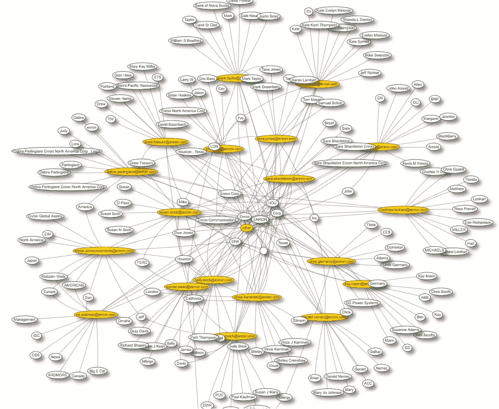
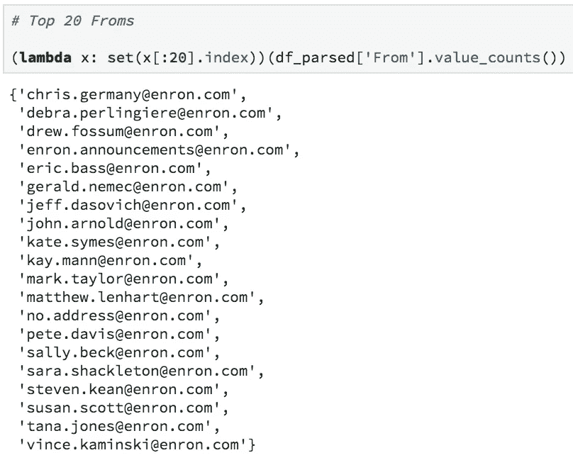
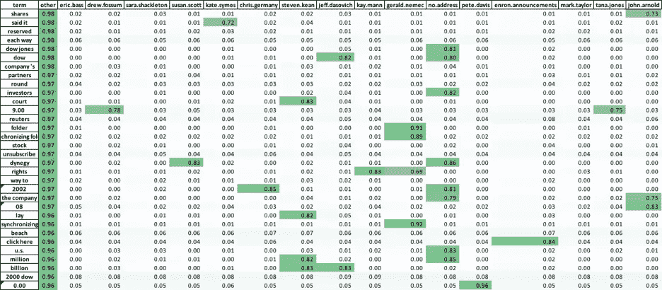
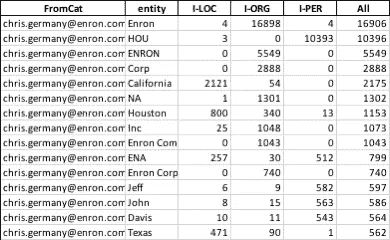
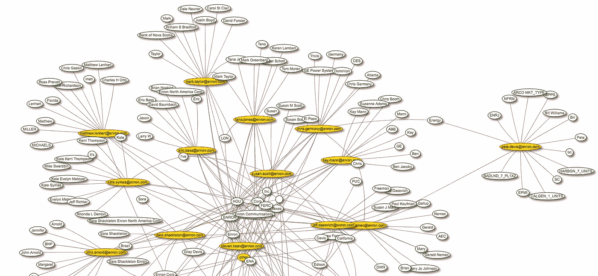

# 使用 Python 中的 Enron 电子邮件数据集识别命名实体:第 2 部分

> 原文：<https://towardsdatascience.com/named-entity-recognition-using-the-enron-email-dataset-in-python-part-2-fb7ce69bc473?source=collection_archive---------13----------------------->



上一次，我们从安然电子邮件数据集中选出了前 20 个最多发邮件的人。



他们是谁？在这份 20 人名单中，至少有两人(约翰·阿诺德和埃里克巴斯)曾经或已经成为对冲基金经理。对于一家破产公司的校友来说，这并不坏，因为有一篇关于这家公司的文章。我个人也曾和安然的前雇员一起工作过，我只和他们有过顶级的经历。

别管历史，让我们进入数据科学。

# 分散文本

https://github.com/JasonKessler/scattertext

分散文本最初是通过将一个类别与另一个类别进行比较(如共和党人与民主党人)，来找到“非常常见”的单词。相反，我在自己的案例中使用它来比较每个电子邮件发件人与所有其他发件人；一个对所有，而不是一个对一个。


This is from the github readme, that gives just one example of the visualization power of this tool.

为此，我选择不使用可视化工具，而只使用 Pythonic API，它公开了每个类别(在我们的例子中是电子邮件发件人)的 F 分数的计算。



F-scores for each email sender, sorted by top F-scores from “other” category

代码如下:

```
nlp = spacy.load('en')corpus = st.CorpusFromPandas(df_parsed.sample(10000), 
                              category_col='FromCat', 
                              text_col='Body',
                              nlp=nlp).build()scaled_f_scores_vs_background = corpus.get_scaled_f_scores_vs_background()term_freq_df = corpus.get_term_freq_df()for c in term_freq_df:
    f = c[:c.find(' freq')]
    term_freq_df[f+' fscore'] = corpus.get_scaled_f_scores(f)columns = pd.Series([x[:x.find(' ')] for x in term_freq_df.columns]).drop_duplicates()term_freq_df.columns = pd.MultiIndex.from_product([['freq','fscore'],columns])term_freq_df.loc[:,'fscore'].sort_values('other',ascending=False).iloc[:200].to_excel('fscores.xlsx')
```

嗯，你可以*种*开始看到人们之间的关系，通过他们的“不寻常的共同”的话，但它不是那么漂亮或有用。因此，我们将尝试通过从每封电子邮件中提取命名实体来总结电子邮件，然后使用网络图将顶级实体链接在一起。

# 命名实体识别

至少有三个流行的 python 库具有 NER 功能:1)s[paCy](https://spacy.io/)2)[polyglot](http://polyglot.readthedocs.io/en/latest/NamedEntityRecognition.html)和 3) [Stanford 的 CoreNLP](https://stanfordnlp.github.io/CoreNLP/tutorials.html) 。

我在这个项目中尝试使用 spaCy 和 polyglot，但最终选择了 polyglot，因为它的结果更直观。Polyglot 只将实体分为 I-LOC、I-ORG 和 I-PER，而 spaCy 有更多的类别，如数字、日期等。

该代码使用 dask 进行多重处理，在数据帧中添加了一个新的“实体”列。

最后，我们按照前 20 名电子邮件发件人(FromCat)进行分组，并找到他们最常见的实体。下面是一个输出示例:



# 网络图可视化

好吧。我们真的很亲密。网络图需要节点和边。我们有一个流行实体表，按前 20 名电子邮件发件人分组。因此，在我们的例子中，节点(或者图上的气泡)将是**和**实体*以及*电子邮件发送者。为了区分它们，我们将发件人涂成黄色。边将是从每个发送者到他们各自实体的连接。比如上面的克里斯德国，像安然、加州、杰夫、德州等词。会和他联系在一起。

Nodes.json 示例

```
[{"id":0,"label":"[chris.germany@enron.com](mailto:chris.germany@enron.com)","group":"person"},{"id":1,"label":"[debra.perlingiere@enron.com](mailto:debra.perlingiere@enron.com)","group":"person"},{"id":2,"label":"[drew.fossum@enron.com](mailto:drew.fossum@enron.com)","group":"person"},{"id":3,"label":"[enron.announcements@enron.com](mailto:enron.announcements@enron.com)","group":"person"},{"id":4,"label":"[eric.bass@enron.com](mailto:eric.bass@enron.com)","group":"person"},{"id":5,"label":"[gerald.nemec@enron.com](mailto:gerald.nemec@enron.com)","group":"person"},...]
```

Edges.json 示例

```
[{"from":0,"to":21},{"from":1,"to":21},{"from":2,"to":21},{"from":4,"to":21},{"from":5,"to":21},{"from":6,"to":21},{"from":7,"to":21},{"from":8,"to":21},{"from":9,"to":21},{"from":10,"to":21},{"from":11,"to":21},{"from":13,"to":21},{"from":15,"to":21},{"from":16,"to":21},{"from":17,"to":21},{"from":18,"to":21},{"from":19,"to":21},{"from":20,"to":21},...]
```

# [Visjs](http://visjs.org/network_examples.html)

对于网络图可视化，我们使用了构建在 d3 之上的名为 Visjs 的 javascript 库。它实际上有一个 python 包装器，但是我无法在笔记本中找到或让它工作，所以我只是处理了样本 javascript 代码，并嵌入了来自 pandas 节点和边的数据帧的 json 输出。

现在，如果我们打开静态 html 文件，将会出现如下所示的交互式可视化效果:



由于 Visjs 使用了 d3 物理学，最终发生的情况是最常见的单词(有许多联系的单词)聚集在中间，而“非常常见”的单词成为外围。

例如，Pete Davis 似乎是一名加州电力调度人员，他在电子邮件中使用特定于其调度工作的术语。

通过浏览实体网络，你可以真正开始注意到谁在做什么。马特·伦哈特负责佛罗里达州的业务，而约翰·阿诺德和萨拉·沙克尔顿则谈论涉及巴西的潜在交易。几乎每个人都在谈论 FERC(联邦能源监管委员会)，它负责监管州际贸易。等等，等等…

我们可以利用安然电子邮件数据集做更多的事情，例如训练单词嵌入、对电子邮件进行分类、欺诈交易的异常检测等。然而，在这篇文章中，我想向你展示一个简单的实体网络图在总结一个大的文本语料库时是多么的有用。

你可以在这里找到这个项目的 Github 库:[https://github.com/raymondmyu/enron-email-dataset](https://github.com/raymondmyu/enron-email-dataset)

想看更多请留下评论鼓掌！